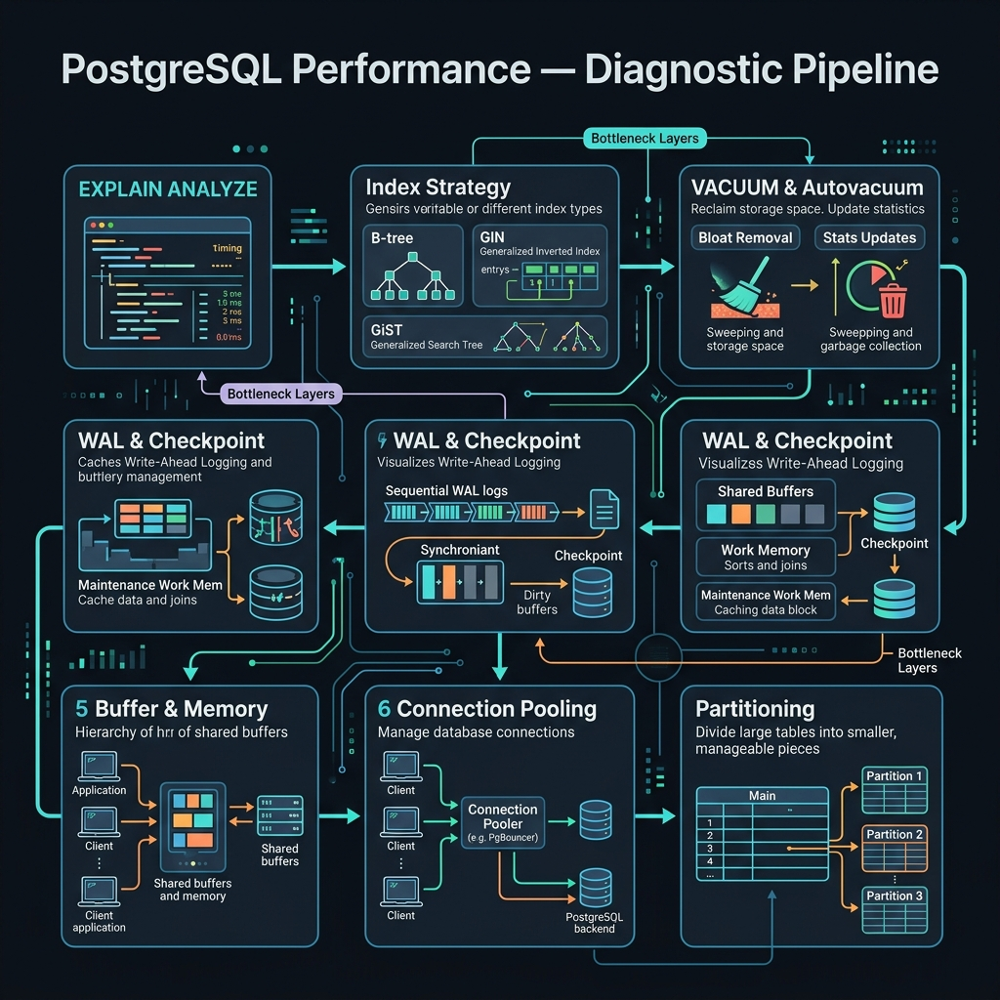

<!-- tags: sql, postgresql, database, performance, overview -->
# ⚡ PostgreSQL Performance

> Track này dành cho lúc semantics đã đúng nhưng production vẫn đau: slow query, deadlock, offset pagination, bloat, checkpoint pressure.

| Aspect | Detail |
| --- | --- |
| **Concept** | Query performance và production tuning |
| **Audience** | Backend engineer, DBA, reviewer |
| **Primary style** | Concept-First hub cho planner/cost thinking |
| **Entry point** | `01-index-deep-dive.md`, `02-deadlock-locking.md`, `04-query-analysis-workflow.md` |

📅 Ngày tạo: 2026-03-19 · 🔄 Cập nhật: 2026-04-04 · ⏱️ 4 phút đọc

---

## 1. DEFINE

EXPLAIN ANALYZE trả về Index Scan — nhưng latency vẫn 800ms. Deadlock detector kill transaction lúc 3 AM. OFFSET pagination page 5000 mất 3 giây. Ba bài toán khác nhau, cùng label "database chậm".

5 bài performance — từ index internals đến VACUUM/WAL tuning. Track này dành cho engineer đang debug production: query chậm, deadlock, pagination degradation, hoặc autovacuum pressure. Mỗi bài bắt đầu từ một incident thực tế — không có bài nào dạy syntax.

| Variant | Mô tả |
| --- | --- |
| Access Path Tuning | Indexes, scans, join access patterns |
| Concurrency Tuning | Deadlocks, locks, contention |
| Pagination & Query Shape | Offset vs keyset, deferred join, rewrite |
| Maintenance Pressure | VACUUM, WAL, checkpoint, query analysis workflow |

| Approach | Time | Space | Khi chọn |
| --- | --- | --- | --- |
| Index first, then plan | Phụ thuộc query | O(1) | Dùng khi query chậm và suspect access path. |
| Lock analysis | Phụ thuộc contention | O(1) | Dùng khi latency spike gắn với concurrency. |
| Workflow-based tuning | Phụ thuộc workload | O(1) | Dùng khi không biết bottleneck nằm ở đâu trong full stack query path. |

Core insight:

> Performance track không dạy “mẹo nhanh”. Nó dạy cách nhìn query qua plan, locks và maintenance cost cùng một lúc.

### Coverage

| File | Chủ đề |
| --- | --- |
| [01-index-deep-dive.md](./01-index-deep-dive.md) | Index types, strategies, maintenance |
| [02-deadlock-locking.md](./02-deadlock-locking.md) | Locks, deadlocks, advisory locks |
| [03-pagination-techniques.md](./03-pagination-techniques.md) | Offset vs keyset vs cursor |
| [04-query-analysis-workflow.md](./04-query-analysis-workflow.md) | pg_stat_statements, auto_explain, EXPLAIN workflow |
| [05-vacuum-wal-checkpoint.md](./05-vacuum-wal-checkpoint.md) | Maintenance, bloat, WAL, checkpoint |

---

## 2. VISUAL

Với PostgreSQL Performance, vocabulary thôi không cứu được bạn. Bottleneck chỉ lộ mặt khi plan, timeline hoặc đường đi của bộ nhớ và I/O được đặt lên bàn cùng lúc.



### Level 1

```text
Query slow
   |
   +--> plan wrong? --------> 01 / 04
   +--> lock wait? ---------> 02
   +--> pagination shape? --> 03
   +--> maintenance pressure? 05
```

*Hình: Level 1 route performance symptom sang đúng file thay vì tune lung tung.*

### Level 2

```text
Evidence                           File
---------------------------------  ----------------------------
bad index / wrong scan             01-index-deep-dive
waiting on locks / deadlocks       02-deadlock-locking
page N gets slower and slower      03-pagination-techniques
need full diagnostic workflow      04-query-analysis-workflow
bloat / WAL / checkpoints          05-vacuum-wal-checkpoint
```

*Hình: Level 2 map symptom trực tiếp vào bài cần mở đầu tiên.*

---
## 3. CODE

Khi tín hiệu trực quan của PostgreSQL Performance đã rõ, ta chuyển sang truy vấn, lệnh chẩn đoán và playbook có thể chạy thật. Bắt đầu từ baseline đơn giản rồi tăng dần áp lực workload.

### Problem 1: Basic — Chọn bài đầu tiên từ symptom performance

> **Mục tiêu**: Route đúng bài khi production chậm.
> **Approach**: Map symptom sang performance subtopic.
> **Ví dụ**: Đầu vào là complaint vận hành; đầu ra là file nên mở trước.
> **Độ phức tạp**: Basic — symptom routing.

```sql
SELECT *
FROM (VALUES
  ('seq scan on large table', '01-index-deep-dive.md'),
  ('deadlock detected', '02-deadlock-locking.md'),
  ('slow offset pagination', '03-pagination-techniques.md'),
  ('need end-to-end diagnostic', '04-query-analysis-workflow.md'),
  ('autovacuum lag or checkpoint pressure', '05-vacuum-wal-checkpoint.md')
) AS routes(symptom, first_file);
```

**Tại sao?** Performance bugs thường bị gọi chung là “database chậm”, nhưng mỗi symptom lại thuộc một lớp hoàn toàn khác nhau. Router này giữ cho learner không áp sai remedy.

**Kết luận**: Performance README có vai trò định tuyến theo symptom trước khi đi sâu vào kỹ thuật cụ thể.

### Problem 2: Intermediate — Chuẩn hóa evidence pack trước khi tune

> **Mục tiêu**: Không sửa query/index khi chưa đủ evidence.
> **Approach**: Gom plan + locks + maintenance signals.
> **Ví dụ**: Đầu vào là complaint “API chậm”; đầu ra là evidence pack đủ để chọn bài tiếp theo.
> **Độ phức tạp**: Intermediate — phối hợp nhiều metrics.

```sql
EXPLAIN (ANALYZE, BUFFERS) SELECT * FROM orders WHERE status = 'pending';

SELECT pid, wait_event_type, wait_event, query
FROM pg_stat_activity
WHERE state <> 'idle';

SELECT relname, n_dead_tup
FROM pg_stat_user_tables
ORDER BY n_dead_tup DESC
LIMIT 5;
```

**Tại sao?** Một symptom “chậm” có thể do plan, locks hoặc maintenance. Nếu không có evidence pack, mọi tune tiếp theo đều thiếu context.

**Kết luận**: Evidence pack là prerequisite thực tế cho toàn bộ performance track.

### Problem 3: Advanced — Chốt thời điểm sang quiz performance

> **Mục tiêu**: Định nghĩa khi nào learner đủ điều kiện sang quiz performance.
> **Approach**: Dùng checklist reasoning thay vì “đọc xong là đủ”.
> **Ví dụ**: Đầu vào là learner vừa đọc track; đầu ra là exit criteria.
> **Độ phức tạp**: Advanced — self-evaluation với production mindset.

```text
Ready for module quiz 02 when you can:
  - đọc EXPLAIN và chỉ ra access path sai
  - giải thích composite index order
  - phân biệt lock wait với planner slowness
  - chọn keyset thay vì offset ở page sâu
  - mô tả bloat / WAL / checkpoint pressure từ symptom
```

**Tại sao?** Performance knowledge chỉ có giá trị khi chuyển được thành phán đoán. Exit criteria này giúp learner biết mình đã đủ nền để làm module quiz 02 chưa.

**Kết luận**: Học xong performance track nên dẫn thẳng tới quiz, không nên dừng ở việc “đọc hết file”.

---
## 4. PITFALLS

PostgreSQL Performance rất dễ bị dùng theo phản xạ: thấy chậm là thêm index, thấy lag là tăng tài nguyên. Phần dưới đây gom những lỗi tối ưu tưởng đúng nhưng lại làm latency, lock hoặc chi phí vận hành tệ hơn.

| # | Severity | Lỗi | Hậu quả | Fix |
| --- | --- | --- | --- | --- |
| 1 | 🔴 Fatal | Tune index khi semantics còn sai | Query nhanh hơn nhưng vẫn sai kết quả | Quay lại `../fundamental/README.md` nếu logic chưa chắc. |
| 2 | 🟡 Common | Chỉ xem mỗi EXPLAIN, bỏ locks và maintenance | Chẩn đoán thiếu context | Dùng evidence pack đa lớp trước khi kết luận. |
| 3 | 🟡 Common | Áp keyset / index / vacuum như công thức | Giải pháp lệch symptom thật | Route bằng symptom trước. |
| 4 | 🔵 Minor | Không làm quiz sau track | Không biết mental model performance đã chắc chưa | Làm `../../quiz/module/02-query-plans-performance-and-maintenance.md`. |

---
## 5. REF

| Resource | Loại | Link | Ghi chú |
| --- | --- | --- | --- |
| Use The Index, Luke | Guide | https://use-the-index-luke.com/ | Indexing và pagination patterns. |
| explain.dalibo.com | Tool | https://explain.dalibo.com/ | Visualize EXPLAIN plans. |
| PostgreSQL Using EXPLAIN | Official docs | https://www.postgresql.org/docs/current/using-explain.html | Canonical reference cho plan reading. |

---

## 6. RECOMMEND

Khi các bẫy thường gặp của PostgreSQL Performance đã lộ mặt, bạn có thể nối bài này sang maintenance, replication hoặc triage workflow để quyết định tuning không bị cô lập.

| Mở rộng | Khi nào | Lý do | File/Link |
| --- | --- | --- | --- |
| Optimizer Hub | Khi cần diagnostic + operational router rộng hơn | Kết nối track performance với full optimizer toolbox | [../../optimizer/README.md](../../optimizer/README.md) |
| Performance Quiz | Khi cần verify mental model | Chuyển performance knowledge thành reasoning | [../../quiz/module/02-query-plans-performance-and-maintenance.md](../../quiz/module/02-query-plans-performance-and-maintenance.md) |

---

## 7. QUICK REF

| Nếu gặp | Mở file |
| --- | --- |
| Wrong scan / index issue | `01` |
| Lock / deadlock / wait | `02` |
| Slow page N | `03` |
| Need full diagnostic pipeline | `04` |
| Bloat / WAL / checkpoint | `05` |