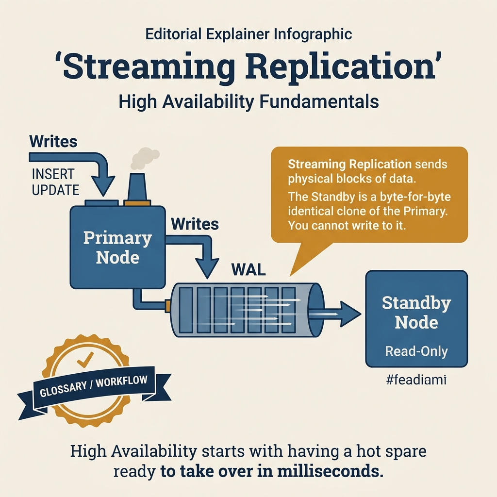
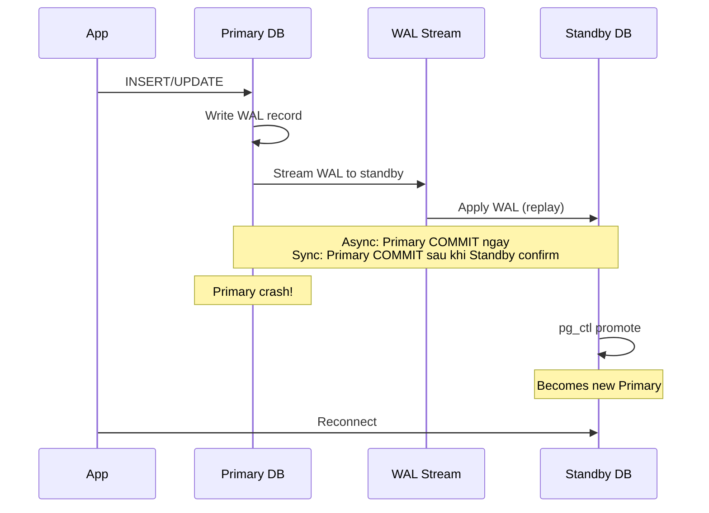

<!-- tags: sql, postgresql, database, replication -->
# 🔄 Streaming Replication, Failover & HA Basics

> Bài overview cho physical streaming replication trong PostgreSQL: primary/standby, sync vs async, replication slots, read replicas và failover basics.

| Aspect           | Detail                                              |
| ---------------- | --------------------------------------------------- |
| **Concept**      | WAL streaming, standby replay, replication slots, failover basics |
| **Use case**     | High availability, read replicas, disaster recovery |
| **Go relevance** | Read/write splitting, connection pooling            |
| **CLI**          | `pg_basebackup`, `pg_stat_replication`              |

---

📅 Ngày tạo: 2026-03-20 · 🔄 Cập nhật: 2026-04-04 · ⏱️ 16 phút đọc

---

## 1. DEFINE

2:30 AM. Primary database crash — hardware failure. Grafana trống. App error rate 100%. Bạn SSH vào standby server, chạy `pg_ctl promote`. 47 giây sau, standby thành primary mới. App reconnect. Nhưng: 12 giây WAL chưa được replay — 12 giây transactions **mất vĩnh viễn**.

Lần sau, team setup synchronous replication: `synchronous_commit = on`, `synchronous_standby_names = 'standby1'`. Zero data loss. Nhưng: mỗi COMMIT phải chờ standby xác nhận — write latency tăng 3x. Flash sale → throughput giảm 40%.

Streaming replication là foundation của PostgreSQL HA. Trade-off trung tâm: **async = fast nhưng có thể mất data** vs **sync = safe nhưng chậm**. Bài này cover setup, monitoring, failover procedure, và cách chọn đúng sync mode.


| Variant | Mô tả |
| --- | --- |
| Streaming | WAL stream real-time · HA, read replicas |
| Logical | Publish/subscribe per table · Selective replication, migration |
| Physical backup | pg_basebackup · Disaster recovery |

| Approach | Time | Space | Khi chọn |
| --- | --- | --- | --- |
| Streaming Replication Setup | Phụ thuộc cardinality | Phụ thuộc row width | Dùng để nắm baseline semantics trước khi tune planner hoặc index. |
| Patroni HA (Docker Compose) | Phụ thuộc plan | Phụ thuộc memory operator | Dùng khi query đã chạm index, cardinality hoặc join strategy. |


### Replication Types

| Type                | Mô tả                       | Use case                         |
| ------------------- | --------------------------- | -------------------------------- |
| **Streaming**       | WAL stream real-time        | HA, read replicas                |
| **Logical**         | Publish/subscribe per table | Selective replication, migration |
| **Physical backup** | `pg_basebackup`             | Disaster recovery                |

### Streaming Modes

| Mode      | Durability               | Latency | Data loss   |
| --------- | ------------------------ | ------- | ----------- |
| **Async** | Commit → ACK → replicate | Low     | ⚠️ Possible |
| **Sync**  | Commit → replicate → ACK | Higher  | ✅ None     |

### HA Tools

| Tool          | Mô tả                    | Use case             |
| ------------- | ------------------------ | -------------------- |
| **Patroni**   | Auto-failover, DCS-based | Production HA        |
| **repmgr**    | Replication manager      | Simpler HA           |
| **PgBouncer** | Connection pooler        | Reduce connections, not failover orchestration |
| **HAProxy**   | Load balancer            | Read/write splitting |

---

Các failure mode trên nghe quen. Nhưng có trap: synchronous replication commit delay = write latency spike, và failover không tự động = downtime kéo dài. Trap đó sẽ xuất hiện ở PITFALLS.

## 2. VISUAL

Với Streaming Replication, Failover & HA Basics, tên cơ chế nghe rõ trên giấy nhưng rủi ro thật chỉ hiện ra khi nhìn đường đi của WAL, lag và vai trò của từng node trong cụm.




*Hình: Streaming replication flow — WAL Generation (primary) → WAL Shipping (TCP stream) → Standby Apply (replay) → Failover (promote). Synchronous = zero data loss at latency cost.*

### Level 1

> 📖 Xem 3. CODE bên dưới để xem ví dụ minh họa chi tiết.

*Hình: Level 1 cho 🔄 Streaming Replication, Failover & HA Basics — nhìn vào happy path hoặc baseline heuristic trước khi đi sâu vào planner và trade-off.*

### Level 2

```text
Decision Lens                 Dấu hiệu cần nhìn                 Hướng xử lý
---------------------------  --------------------------------  -------------------------------------------
Semantics trước               Kết quả có đúng intent không?    1. Streaming Replication Setup
Planner / index signal        Cardinality, cost, buffers ra sao? 2. Patroni HA (Docker Compose)
Production pressure           Lock, WAL, lag, rollback nào đau? 1. Streaming Replication Setup
```

*Hình: Level 2 biến 🔄 Streaming Replication, Failover & HA Basics thành checklist quyết định — từ semantics, sang plan signal, rồi đến áp lực production.*


### Architecture — Streaming Replication Flow



*Hình: WAL stream từ Primary → Standby. Async = commit nhanh nhưng có thể mất data. Sync = zero data loss nhưng commit chậm. Failover = promote standby thành primary.*

---
## 3. CODE

Sau khi flow của Streaming Replication, Failover & HA Basics đã rõ trên sơ đồ, ta chuyển sang cấu hình, truy vấn kiểm tra và quy trình rehearsal có thể dùng ngoài đời thật. Ta đi từ baseline an toàn nhất rồi mới tăng dần độ phức tạp của topology.

### Problem 1: Basic — Streaming Replication Setup

> **Mục tiêu**: Minh họa cách áp dụng **🔄 Streaming Replication, Failover & HA Basics** qua ví dụ `Streaming Replication Setup` trong đúng ngữ cảnh schema, query hoặc vận hành.


```bash
# ═══════════════════════════════════════════
# PRIMARY SERVER
# ═══════════════════════════════════════════

# ✅ postgresql.conf
wal_level = replica
max_wal_senders = 10
max_replication_slots = 10
wal_keep_size = 1GB              # safety buffer only; not a replacement for slots
synchronous_standby_names = ''    # async (default)

# ✅ pg_hba.conf — allow replication connections
# TYPE  DATABASE   USER        ADDRESS        METHOD
host    replication replicator  10.0.0.0/8     scram-sha-256

# ✅ Create replication user
psql -c "CREATE ROLE replicator WITH REPLICATION LOGIN PASSWORD 'secret';"
```

```bash
# ═══════════════════════════════════════════
# STANDBY SERVER
# ═══════════════════════════════════════════

# ✅ Base backup from primary using a physical replication slot
pg_basebackup -h primary -U replicator -D /var/lib/postgresql/data \
  -Fp -Xs -P -R -C -S standby_1

# -R creates standby.signal + primary_conninfo in postgresql.auto.conf
# -C -S creates and uses a physical replication slot named standby_1
# Standby automatically starts streaming WAL from primary

# ✅ Start standby
pg_ctl start -D /var/lib/postgresql/data
```

```sql
-- ✅ Monitor replication (on primary)
SELECT
    application_name,
    client_addr,
    state,
    sync_state,
    sent_lsn,
    write_lsn,
    replay_lsn,
    pg_size_pretty(pg_wal_lsn_diff(sent_lsn, replay_lsn)) AS sender_to_replay_lag,
    pg_size_pretty(pg_wal_lsn_diff(pg_current_wal_lsn(), replay_lsn)) AS primary_to_replay_lag
FROM pg_stat_replication;

-- ✅ Monitor replay lag directly on standby
SELECT
    pg_is_in_recovery() AS is_standby,
    now() - pg_last_xact_replay_timestamp() AS replay_delay;
```


Streaming basics đã cover. Nhưng HA failover cần orchestration — hãy automate.

### Problem 2: Intermediate — Patroni HA (Docker Compose)

> **Mục tiêu**: Minh họa cách áp dụng **🔄 Streaming Replication, Failover & HA Basics** qua ví dụ `Patroni HA (Docker Compose)` trong đúng ngữ cảnh schema, query hoặc vận hành.


```yaml
# docker-compose-patroni.yaml
services:
    etcd:
        image: quay.io/coreos/etcd:v3.5.11
        environment:
            ETCD_LISTEN_PEER_URLS: http://0.0.0.0:2380
            ETCD_LISTEN_CLIENT_URLS: http://0.0.0.0:2379
            ETCD_ADVERTISE_CLIENT_URLS: http://etcd:2379

    pg1:
        image: patroni/patroni:latest
        environment:
            PATRONI_NAME: pg1
            PATRONI_SCOPE: mycluster
            PATRONI_ETCD3_HOST: etcd:2379
            PATRONI_POSTGRESQL_CONNECT_ADDRESS: pg1:5432
            PATRONI_RESTAPI_CONNECT_ADDRESS: pg1:8008
            PATRONI_SUPERUSER_PASSWORD: postgres
            PATRONI_REPLICATION_PASSWORD: replicator
        ports: ['5432:5432', '8008:8008']

    pg2:
        image: patroni/patroni:latest
        environment:
            PATRONI_NAME: pg2
            PATRONI_SCOPE: mycluster
            PATRONI_ETCD3_HOST: etcd:2379
            PATRONI_POSTGRESQL_CONNECT_ADDRESS: pg2:5432
            PATRONI_RESTAPI_CONNECT_ADDRESS: pg2:8008
            PATRONI_SUPERUSER_PASSWORD: postgres
            PATRONI_REPLICATION_PASSWORD: replicator
        ports: ['5433:5432', '8009:8008']

    haproxy:
        image: haproxy:2.9-alpine
        ports:
            - '5000:5000' # Primary (read-write)
            - '5001:5001' # Replica (read-only)
        volumes:
            - ./haproxy.cfg:/usr/local/etc/haproxy/haproxy.cfg:ro
```

```go
// ✅ Go read/write splitting
package db

import (
    "context"
    "github.com/jackc/pgx/v5/pgxpool"
)

type DBPool struct {
    writer *pgxpool.Pool  // Primary (read-write)
    reader *pgxpool.Pool  // Replica (read-only)
}

func NewDBPool(ctx context.Context, writerDSN, readerDSN string) (*DBPool, error) {
    writer, err := pgxpool.New(ctx, writerDSN)
    if err != nil {
        return nil, err
    }
    reader, err := pgxpool.New(ctx, readerDSN)
    if err != nil {
        return nil, err
    }
    return &DBPool{writer: writer, reader: reader}, nil
}

func (p *DBPool) Writer() *pgxpool.Pool { return p.writer }
func (p *DBPool) Reader() *pgxpool.Pool { return p.reader }
```

**Tại sao?** Ở mức Intermediate của Streaming Replication, Failover & HA Basics, phần khó không phải bật cho replication chạy được mà là nhận ra tín hiệu nào báo topology đang rời khỏi trạng thái an toàn. Problem 2: Intermediate — Patroni HA (Docker Compose) đặt bạn vào chỗ phải đọc đúng lag, slot hoặc sync boundary.


> **✅ Đạt được**: Bức tranh nền cho streaming replication, lag monitoring, HA topology và read/write split.
> **⚠️ Lưu ý**: `wal_keep_size` chỉ là buffer; production standby lag nên dùng replication slot + monitoring để tránh missing WAL.

---
Bạn đã đi qua streaming và HA failover. Bây giờ đến phần nguy hiểm: sync commit delay và manual failover — trap đã được setup từ đầu bài.

## 4. PITFALLS

Streaming Replication, Failover & HA Basics không hỏng vì thiếu tính năng, mà hỏng vì giả định quá lạc quan về lag, failover hoặc recovery path. Phần dưới đây gom những chỗ dễ trả giá nhất.

| # | Severity | Lỗi | Hậu quả | Fix |
| --- | --- | --- | --- | --- |
| 1 | 🔴 Fatal | Failover khi replication lag > 0 bytes | Data loss = transactions committed trên primary chưa tới standby | Check `pg_stat_replication.replay_lsn` = `sent_lsn` trước khi promote |
| 2 | 🔴 Fatal | Synchronous replication standby down → primary hang | Mọi COMMIT block chờ standby — database freeze | `synchronous_standby_names = 'FIRST 1 (s1, s2)'` — multiple standbys |
| 3 | 🟡 Common | Không monitor replication lag | Lag tích lũy 30 phút mà không ai biết → failover mất 30 phút data | Alert khi lag > 10 giây: `pg_stat_replication.replay_lag` |
| 4 | 🟡 Common | Promote rồi mới cấu hình standby mới | Primary mới chạy single-node: crash = data loss, no HA | Rebuild standby ngay sau promote: `pg_basebackup` + streaming setup |
| 5 | 🔵 Minor | `hot_standby_feedback = off` trên standby | Standby queries conflict với vacuum trên primary → cancelled | Enable `hot_standby_feedback` nếu standby serve read queries |

---
Bạn đã đi qua Streaming & HA và cạm bẫy. Các resources dưới đây giúp đi sâu hơn.

## 5. REF

| Resource              | Link                                                                                                       |
| --------------------- | ---------------------------------------------------------------------------------------------------------- |
| Streaming Replication | [postgresql.org/docs/current/warm-standby.html](https://www.postgresql.org/docs/current/warm-standby.html) |
| Patroni               | [github.com/patroni/patroni](https://github.com/patroni/patroni)                                           |
| PgBouncer             | [pgbouncer.github.io](https://www.pgbouncer.org/)                                                          |

---

## 6. RECOMMEND

Khi các failure mode chính của Streaming Replication, Failover & HA Basics đã lộ mặt, bước tiếp theo là nối nó với backup, pooling hoặc incident drill để topology không chỉ đúng trên sơ đồ.

| Mở rộng                    | Khi nào                   | Lý do                            |
| -------------------------- | ------------------------- | -----------------------------
> **Callback** — Quay lại 12 giây data loss sau failover: async replication gap. Synchronous replication fix data loss nhưng tăng write latency 3x. Production sweet spot: `synchronous_commit = remote_apply` cho critical tables, `off` cho logging/audit. Không phải all-or-nothing.

--- |
| Logical Replication | Selective replication, online migrations | Không phải workload nào cũng hợp physical streaming |
| Backup & PITR drills | Disaster recovery | Replica không thay thế backup |
| Patroni / HA control plane | Production failover | Làm rõ role assignment và fencing |
| PgBouncer | High connection count | Ổn định pool behavior khi failover |

**Liên kết**: [← README](./README.md) · [→ SQL Replication Quiz](../../quiz/module/03-replication-and-ha.md)

---

## 7. QUICK REF

| Signal | Kiểm tra | Action |
| --- | --- | --- |
| Primary crash | `pg_stat_replication` lag | Promote nếu lag = 0, PITR nếu lag > 0 |
| Write latency tăng bất thường | `synchronous_commit` setting | Async cho non-critical, sync cho financial |
| Standby query cancelled | `max_standby_streaming_delay` | Tăng delay hoặc enable `hot_standby_feedback` |
| Replication lag tăng dần | Network / disk I/O trên standby | Check standby I/O, WAL receiver process |
