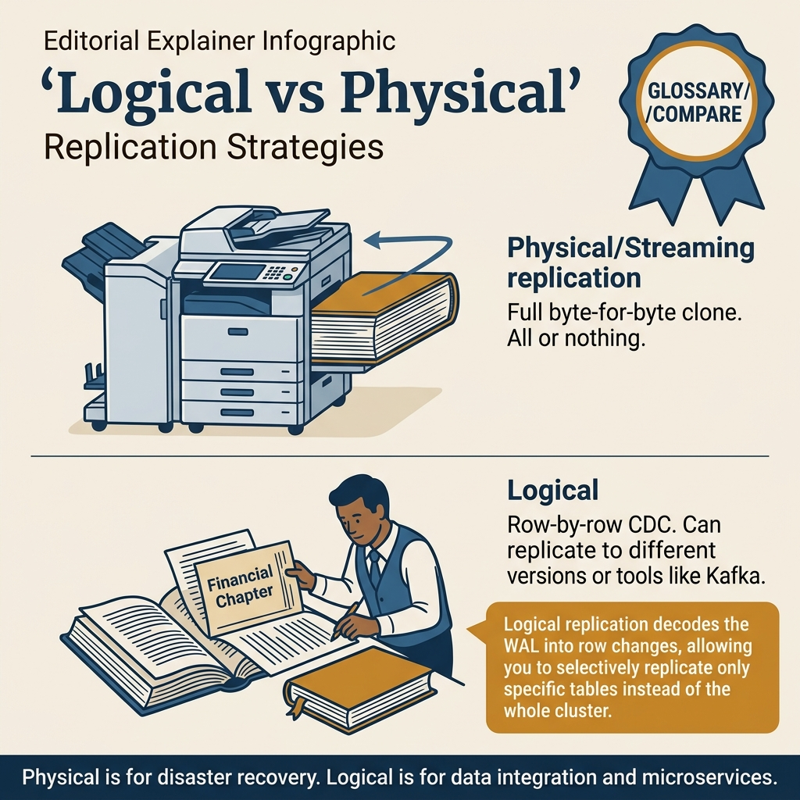
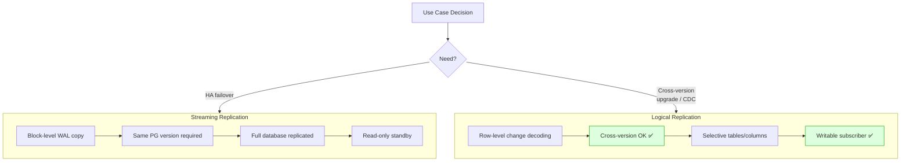

<!-- tags: sql, postgresql, database, replication -->
# 🔁 Logical Replication — Publication, Subscription & Zero-Downtime Changes

> Khi cần replicate chọn lọc theo bảng hoặc phục vụ migration/CDC, logical replication là công cụ phù hợp hơn physical streaming.

| Aspect | Detail |
| --- | --- |
| **Concept** | publication, subscription, replication identity, initial copy |
| **Use case** | selective replication, online migration, CDC fan-out |
| **CLI** | `CREATE PUBLICATION`, `CREATE SUBSCRIPTION`, `pg_replication_slots` |

📅 Ngày tạo: 2026-03-28 · 🔄 Cập nhật: 2026-04-04 · ⏱️ 14 phút đọc

---

## 1. DEFINE

PostgreSQL 14 → 16 upgrade. Streaming replication yêu cầu cùng major version — không dùng được. pg_dump/restore bảng 500GB mất 4 giờ downtime — business không chấp nhận.

Logical replication: tạo subscription từ PG 16 đến PG 14, replicate data real-time. Khi lag = 0, cutover: point app sang PG 16, drop subscription. Downtime: **dưới 30 giây**.

Nhưng logical replication không replicate DDL, sequences, hay large objects tự động. Team quên sync sequence values → PG 16 nhận ID trùng với PG 14 data → unique constraint violations post-cutover.

Logical replication giải các bài mà streaming replication không giải được: cross-version upgrade, selective table replication, CDC (Change Data Capture). Bài này cover publication/subscription setup, limitations checklist, và zero-downtime migration playbook.


| Variant | Mô tả |
| --- | --- |
| Granularity | cả cluster/WAL stream · theo table/publication |
| Target version | thường cùng major version · hỗ trợ upgrade/migration linh hoạt hơn |
| Read replica | ✅ · không phải mục tiêu chính |
| Selective tables | ❌ · ✅ |

| Approach | Time | Space | Khi chọn |
| --- | --- | --- | --- |
| Publication + Subscription | Phụ thuộc cardinality | Phụ thuộc row width | Dùng để nắm baseline semantics trước khi tune planner hoặc index. |
| Replica Identity cho bảng không có PK | Phụ thuộc plan | Phụ thuộc memory operator | Dùng khi query đã chạm index, cardinality hoặc join strategy. |
| Monitoring lag and slot pressure | Phụ thuộc workload | Phụ thuộc buffer/WAL | Dùng khi workload production cần cân bằng correctness, lock và rollout. |


### Logical vs Physical Replication

| Feature | Physical Streaming | Logical Replication |
| --- | --- | --- |
| Granularity | cả cluster/WAL stream | theo table/publication |
| Target version | thường cùng major version | hỗ trợ upgrade/migration linh hoạt hơn |
| Read replica | ✅ | không phải mục tiêu chính |
| Selective tables | ❌ | ✅ |
| Schema changes | không replicate DDL tự động theo nghĩa logical | cũng không replicate DDL tự động; phải quản lý riêng |

### Core Concepts

| Term | Ý nghĩa |
| --- | --- |
| **Publication** | tập bảng + loại thao tác được publish |
| **Subscription** | consumer side nhận stream từ publication |
| **Replication slot** | giữ lại WAL cần thiết cho logical consumer |
| **Replication identity** | dữ liệu PostgreSQL dùng để xác định row cho `UPDATE/DELETE` |

### Failure Modes

| Lỗi | Nguyên nhân | Fix |
| --- | --- | --- |
| UPDATE/DELETE fail to replicate | thiếu replica identity phù hợp | thêm PK hoặc `REPLICA IDENTITY USING INDEX` |
| Slot backlog tăng vô hạn | subscriber lag/ngừng | monitor `pg_replication_slots`, xử lý lag sớm |
| DDL drift | schema hai bên lệch | version hóa DDL, rollout riêng |

---

Các failure mode trên nghe rõ. Nhưng có trap: logical replication thiếu DDL sync = schema drift, và conflict resolution missing = data diverge. Trap đó sẽ xuất hiện ở PITFALLS.

## 2. VISUAL

Với Logical Replication — Publication, Subscription & Zero-Downtime Changes, tên cơ chế nghe rõ trên giấy nhưng rủi ro thật chỉ hiện ra khi nhìn đường đi của WAL, lag và vai trò của từng node trong cụm.




*Hình: Physical (byte-level, entire cluster, same version) vs Logical (row-level, selective tables, cross-version). Physical cho HA, Logical cho migration/CDC.*

### Level 1

```text
Primary DB
  │
  ├── Publication: customers, orders
  │
  ├── WAL changes
  │
  ▼
Logical replication slot
  │
  ▼
Subscriber DB
  │
  ├── Initial table copy
  └── Apply INSERT / UPDATE / DELETE stream
```

*Hình: Level 1 cho 🔁 Logical Replication — Publication, Subscription & Zero-Downtime Changes — nhìn vào happy path hoặc baseline heuristic trước khi đi sâu vào planner và trade-off.*

### Level 2

```text
Decision Lens                 Dấu hiệu cần nhìn                 Hướng xử lý
---------------------------  --------------------------------  -------------------------------------------
Semantics trước               Kết quả có đúng intent không?    1. Publication + Subscription
Planner / index signal        Cardinality, cost, buffers ra sao? 2. Replica Identity cho bảng không có PK
Production pressure           Lock, WAL, lag, rollback nào đau? 3. Monitoring lag and slot pressure
```

*Hình: Level 2 biến 🔁 Logical Replication — Publication, Subscription & Zero-Downtime Changes thành checklist quyết định — từ semantics, sang plan signal, rồi đến áp lực production.*


### Architecture — Logical Replication vs Streaming



*Hình: Streaming = block-level, same version, full DB, read-only. Logical = row-level, cross-version, selective, writable. Streaming cho HA, Logical cho migration/CDC.*

---
## 3. CODE

Sau khi flow của Logical Replication — Publication, Subscription & Zero-Downtime Changes đã rõ trên sơ đồ, ta chuyển sang cấu hình, truy vấn kiểm tra và quy trình rehearsal có thể dùng ngoài đời thật. Ta đi từ baseline an toàn nhất rồi mới tăng dần độ phức tạp của topology.

### Problem 1: Basic — Publication + Subscription

> **Mục tiêu**: Minh họa cách áp dụng **🔁 Logical Replication — Publication, Subscription & Zero-Downtime Changes** qua ví dụ `Publication + Subscription` trong đúng ngữ cảnh schema, query hoặc vận hành.


```sql
-- PRIMARY
CREATE TABLE customers (
    customer_id bigint PRIMARY KEY,
    email text NOT NULL,
    status text NOT NULL
);

CREATE TABLE orders (
    order_id bigint PRIMARY KEY,
    customer_id bigint NOT NULL,
    total_amount numeric(12,2) NOT NULL,
    status text NOT NULL
);

CREATE PUBLICATION app_pub
    FOR TABLE customers, orders
    WITH (publish = 'insert, update, delete');
```

```sql
-- SUBSCRIBER
CREATE TABLE customers (
    customer_id bigint PRIMARY KEY,
    email text NOT NULL,
    status text NOT NULL
);

CREATE TABLE orders (
    order_id bigint PRIMARY KEY,
    customer_id bigint NOT NULL,
    total_amount numeric(12,2) NOT NULL,
    status text NOT NULL
);

CREATE SUBSCRIPTION app_sub
CONNECTION 'host=primary dbname=app user=replicator password=secret'
PUBLICATION app_pub
WITH (
    copy_data = true,
    create_slot = true,
    slot_name = app_sub_slot,
    enabled = true
);
```


Logical replication basics đã cover. Nhưng selective publication cần filtering — hãy configure.

### Problem 2: Intermediate — Replica Identity cho bảng không có PK

> **Mục tiêu**: Minh họa cách áp dụng **🔁 Logical Replication — Publication, Subscription & Zero-Downtime Changes** qua ví dụ `Replica Identity cho bảng không có PK` trong đúng ngữ cảnh schema, query hoặc vận hành.


```sql
CREATE TABLE audit_events (
    tenant_id text NOT NULL,
    event_id uuid NOT NULL,
    payload jsonb NOT NULL,
    created_at timestamptz NOT NULL DEFAULT now()
);

CREATE UNIQUE INDEX ux_audit_events_tenant_event
    ON audit_events(tenant_id, event_id);

ALTER TABLE audit_events
    REPLICA IDENTITY USING INDEX ux_audit_events_tenant_event;
```

**Tại sao?** Ở mức Intermediate của Logical Replication — Publication, Subscription & Zero-Downtime Changes, phần khó không phải bật cho replication chạy được mà là nhận ra tín hiệu nào báo topology đang rời khỏi trạng thái an toàn. Problem 2: Intermediate — Replica Identity cho bảng không có PK đặt bạn vào chỗ phải đọc đúng lag, slot hoặc sync boundary.


Publication đã cover. Nhưng conflict handling cần strategy — hãy resolve.

### Problem 3: Advanced — Monitoring lag and slot pressure

> **Mục tiêu**: Minh họa cách áp dụng **🔁 Logical Replication — Publication, Subscription & Zero-Downtime Changes** qua ví dụ `Monitoring lag and slot pressure` trong đúng ngữ cảnh schema, query hoặc vận hành.


```sql
SELECT
    slot_name,
    slot_type,
    active,
    pg_size_pretty(pg_wal_lsn_diff(pg_current_wal_lsn(), restart_lsn)) AS retained_wal
FROM pg_replication_slots
ORDER BY pg_wal_lsn_diff(pg_current_wal_lsn(), restart_lsn) DESC;

SELECT
    subname,
    pid,
    received_lsn,
    latest_end_lsn,
    now() - latest_end_time AS apply_delay
FROM pg_stat_subscription;
```

**Tại sao?** Logical Replication — Publication, Subscription & Zero-Downtime Changes ở mức Advanced luôn kéo theo câu hỏi về failover cost, WAL pressure và recovery path. Problem 3: Advanced — Monitoring lag and slot pressure quan trọng vì nó cho thấy một cấu hình tưởng ổn có thể trở nên đắt đỏ thế nào khi sự cố thật xảy ra.

## 4. PITFALLS

Logical Replication — Publication, Subscription & Zero-Downtime Changes không hỏng vì thiếu tính năng, mà hỏng vì giả định quá lạc quan về lag, failover hoặc recovery path. Phần dưới đây gom những chỗ dễ trả giá nhất.

| # | Lỗi | Fix |
| --- | --- | --- |
| 1 | Nghĩ logical replication sẽ tự replicate schema | rollout DDL riêng, có migration contract rõ ràng |
| 2 | Không monitor replication slot | alert theo retained WAL và apply delay |
| 3 | Bảng không có PK nhưng vẫn replicate update/delete | cấu hình `REPLICA IDENTITY` đúng |
| 4 | Dùng logical replication như read replica full-cluster | dùng đúng mục tiêu: CDC/migration/selective tables |

---

Bạn đã đi qua logical replication và conflict handling. Bây giờ đến phần nguy hiểm: schema drift và unresolved conflicts — trap đã được setup từ đầu bài.

## 4. PITFALLS

Sau phần code và mental model, chỗ dễ trượt nhất không nằm ở cú pháp mà ở cách áp kỹ thuật vào production khi giả định còn mơ hồ. Những pitfall dưới đây là các cú vấp dễ trả giá nhất.

| # | Severity | Lỗi | Hậu quả | Fix |
| --- | --- | --- | --- | --- |
| 1 | 🟡 Common | Đọc symptom nhưng không nhìn workload | Chọn sai fix, tốn thời gian benchmark lại | Khóa lại giả định cardinality, concurrency và cost trước khi sửa. |
| 2 | 🔴 Fatal | Tối ưu trên production mà không có rollback path | Có thể gây lock dài, lag replica hoặc mất cửa sổ khôi phục | Chuẩn bị `EXPLAIN`, lock budget và rollback plan trước khi chạy thay đổi. |
| 3 | 🔵 Minor | Ghi nhớ mẹo rời rạc thay vì mental model | Áp sai pattern khi bài toán đổi shape | Luôn map symptom → invariant → kỹ thuật tương ứng. |

---
Bạn đã đi qua Logical Replication và cạm bẫy. Các resources dưới đây giúp đi sâu hơn.

## 5. REF

| Resource | Link |
| --- | --- |
| Official Logical Replication | https://www.postgresql.org/docs/current/logical-replication.html |
| CREATE PUBLICATION | https://www.postgresql.org/docs/current/sql-createpublication.html |
| CREATE SUBSCRIPTION | https://www.postgresql.org/docs/current/sql-createsubscription.html |

---

## 6. RECOMMEND

Khi các failure mode chính của Logical Replication — Publication, Subscription & Zero-Downtime Changes đã lộ mặt, bước tiếp theo là nối nó với backup, pooling hoặc incident drill để topology không chỉ đúng trên sơ đồ.

| Mở rộng | Khi nào | Lý do |
| --- | --- | 
> **Callback** — Quay lại PG 14→16 upgrade 30 giây downtime: logical replication + cutover. Nhưng sequences không sync tự động — team quên → ID collision post-cutover. Checklist: replicate data, sync sequences, verify constraints, cutover. Miss bất kỳ bước nào = incident.

--- |
| pgoutput / Debezium | CDC into Kafka | chuẩn hóa downstream event pipeline |
| replication lag alerts | production subscription | chặn slot backlog và WAL growth |
| dry-run migration | major upgrade / cutover | giảm rủi ro logical drift |

**Liên kết**: [← Streaming HA Basics](./01-streaming-ha.md) · [→ Patroni & HA Orchestration](./03-patroni-ha-orchestration.md)

---

## 7. QUICK REF

| Nếu gặp | Nghĩ ngay |
| --- | --- |
| Publication + Subscription | Dùng pattern này khi gặp signal tương ứng trong production workload. |
| Replica Identity cho bảng không có PK | Dùng pattern này khi gặp signal tương ứng trong production workload. |
| Monitoring lag and slot pressure | Dùng pattern này khi gặp signal tương ứng trong production workload. |
