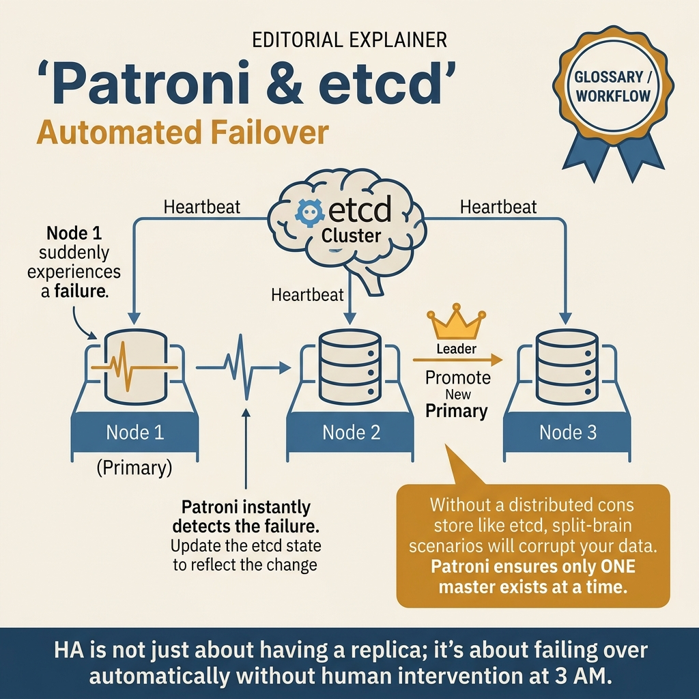
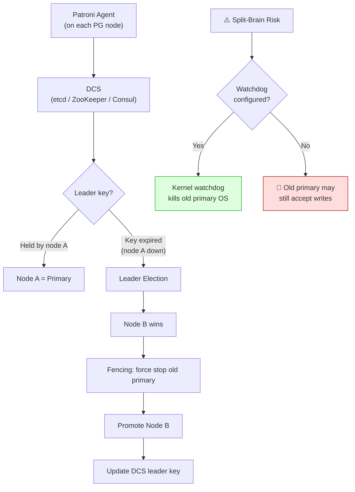

<!-- tags: sql, postgresql, database, replication -->
# 👑 Patroni & HA Orchestration — Leader Election, Fencing & Failover Discipline

> Patroni không chỉ “tự failover”, mà còn là control plane để tránh split-brain và biến failover thành quy trình có thể vận hành được.

| Aspect | Detail |
| --- | --- |
| **Concept** | DCS, leader lease, switchover, failover, fencing |
| **Use case** | production HA cho PostgreSQL |
| **CLI** | `patronictl list`, `patronictl switchover`, REST API |

📅 Ngày tạo: 2026-03-28 · 🔄 Cập nhật: 2026-04-04 · ⏱️ 14 phút đọc

---

## 1. DEFINE

Network partition: primary database mất kết nối với etcd cluster 15 giây. Patroni demote primary thành replica. Đồng thời, old primary vẫn accept writes vì app connection pool chưa timeout. Khi network phục hồi: **hai nodes đều có data mà node kia không có** — split-brain.

Patroni giải quyết bằng fencing: khi demote, force PostgreSQL `pg_ctl stop -m immediate` trước khi promote standby. Nhưng nếu watchdog chưa cấu hình, old primary có thể restart và accept writes trước khi fencing hoàn tất.

Patroni không phải "auto-failover tool". Nó là **HA orchestration framework** — leader election (via etcd/ZooKeeper/Consul), fencing protocol, timeline management, replica bootstrap. Bài này cover: Patroni architecture, fencing strategies, configuration for zero data loss, và runbook cho common failure scenarios.


| Variant | Mô tả |
| --- | --- |
| Patroni agent | quản lý local PostgreSQL instance |
| DCS | etcd/Consul/ZooKeeper lưu leader state và leases |
| Leader lock | đảm bảo chỉ có một primary hợp lệ tại một thời điểm |
| Proxy layer | route app tới primary hoặc replicas |

| Approach | Time | Space | Khi chọn |
| --- | --- | --- | --- |
| Minimal Patroni cluster config | Phụ thuộc cardinality | Phụ thuộc row width | Dùng để nắm baseline semantics trước khi tune planner hoặc index. |
| Operational commands | Phụ thuộc plan | Phụ thuộc memory operator | Dùng khi query đã chạm index, cardinality hoặc join strategy. |
| SQL checks before and after switchover | Phụ thuộc workload | Phụ thuộc buffer/WAL | Dùng khi workload production cần cân bằng correctness, lock và rollout. |
| HAProxy idea for write routing | Phụ thuộc incident path | Phụ thuộc replication/cache | Dùng khi cần operational playbook, incident response hoặc phối hợp nhiều kỹ thuật. |


### Patroni Mental Model

| Thành phần | Vai trò |
| --- | --- |
| **Patroni agent** | quản lý local PostgreSQL instance |
| **DCS** | etcd/Consul/ZooKeeper lưu leader state và leases |
| **Leader lock** | đảm bảo chỉ có một primary hợp lệ tại một thời điểm |
| **Proxy layer** | route app tới primary hoặc replicas |

### Switchover vs Failover

| Operation | Có planned? | Khi dùng |
| --- | --- | --- |
| **Switchover** | ✅ | maintenance, patching, role rotation |
| **Failover** | ❌ | primary mất hoặc không còn healthy |

### Failure Modes

| Lỗi | Nguyên nhân | Fix |
| --- | --- | --- |
| Split-brain | fencing yếu, manual promote ngoài control plane | chỉ promote qua Patroni, có STONITH/fencing strategy |
| Failover nhưng app vẫn ghi nhầm node cũ | proxy/DNS routing stale | route qua HAProxy/pgBouncer/service VIP có health-aware target |
| Cascade lag quá lớn | candidate replica không đủ fresh | chọn failover candidate theo lag/SLA rõ ràng |

---

Các failure mode trên nghe dễ tránh. Nhưng có trap: DCS (etcd) failure = Patroni cannot elect leader = cluster stuck, và fencing sai = split brain. Trap đó sẽ xuất hiện ở PITFALLS.

## 2. VISUAL

Với Patroni & HA Orchestration — Leader Election, Fencing & Failover Discipline, tên cơ chế nghe rõ trên giấy nhưng rủi ro thật chỉ hiện ra khi nhìn đường đi của WAL, lag và vai trò của từng node trong cụm.




*Hình: Patroni flow — Health Check (agent+DCS) → Leader Election (consensus) → Failover (promote best replica) → Switchover (planned, controlled). Never run production PG without automated HA.*

### Level 1

```text
      ┌───────────── DCS (etcd/Consul) ─────────────┐
      │ leader lock = pg1                           │
      └──────────────────────┬──────────────────────┘
                             │
           ┌─────────────────┼─────────────────┐
           ▼                 ▼                 ▼
      pg1 Patroni       pg2 Patroni       pg3 Patroni
      role=leader       role=replica      role=replica
           │
           ▼
      HAProxy / Service VIP
           │
           ▼
         Applications
```

*Hình: Level 1 cho 👑 Patroni & HA Orchestration — Leader Election, Fencing & Failover Discipline — nhìn vào happy path hoặc baseline heuristic trước khi đi sâu vào planner và trade-off.*

### Level 2

```text
Decision Lens                 Dấu hiệu cần nhìn                 Hướng xử lý
---------------------------  --------------------------------  -------------------------------------------
Semantics trước               Kết quả có đúng intent không?    1. Minimal Patroni cluster config
Planner / index signal        Cardinality, cost, buffers ra sao? 2. Operational commands
Production pressure           Lock, WAL, lag, rollback nào đau? 3. SQL checks before and after switchover
```

*Hình: Level 2 biến 👑 Patroni & HA Orchestration — Leader Election, Fencing & Failover Discipline thành checklist quyết định — từ semantics, sang plan signal, rồi đến áp lực production.*


### Architecture — Patroni HA Flow



*Hình: Patroni dùng DCS cho leader election. Khi leader key expire, election chạy, fencing kill old primary trước khi promote mới. Không có watchdog = split-brain risk.*

---
## 3. CODE

Sau khi flow của Patroni & HA Orchestration — Leader Election, Fencing & Failover Discipline đã rõ trên sơ đồ, ta chuyển sang cấu hình, truy vấn kiểm tra và quy trình rehearsal có thể dùng ngoài đời thật. Ta đi từ baseline an toàn nhất rồi mới tăng dần độ phức tạp của topology.

### Problem 1: Basic — Minimal Patroni cluster config

> **Mục tiêu**: Minh họa cách áp dụng **👑 Patroni & HA Orchestration — Leader Election, Fencing & Failover Discipline** qua ví dụ `Minimal Patroni cluster config` trong đúng ngữ cảnh schema, query hoặc vận hành.


```yaml
scope: app-cluster
name: pg1

restapi:
  listen: 0.0.0.0:8008
  connect_address: pg1:8008

etcd3:
  hosts: etcd:2379

bootstrap:
  dcs:
    ttl: 30
    loop_wait: 10
    retry_timeout: 10
    maximum_lag_on_failover: 1048576
    postgresql:
      use_pg_rewind: true
      parameters:
        wal_level: replica
        hot_standby: 'on'
        max_wal_senders: 10
        max_replication_slots: 10
  initdb:
    - encoding: UTF8
    - data-checksums

postgresql:
  listen: 0.0.0.0:5432
  connect_address: pg1:5432
  data_dir: /var/lib/postgresql/data
  authentication:
    superuser:
      username: postgres
      password: postgres
    replication:
      username: replicator
      password: secret
```


Patroni basics đã cover. Nhưng DCS configuration cần etcd/consul — hãy setup.

### Problem 2: Intermediate — Operational commands

> **Mục tiêu**: Minh họa cách áp dụng **👑 Patroni & HA Orchestration — Leader Election, Fencing & Failover Discipline** qua ví dụ `Operational commands` trong đúng ngữ cảnh schema, query hoặc vận hành.


```bash
# Xem topology
patronictl -c /etc/patroni.yml list

# Planned switchover sang replica cụ thể
patronictl -c /etc/patroni.yml switchover --candidate pg2

# Emergency failover
patronictl -c /etc/patroni.yml failover --candidate pg3

# Kiểm tra health qua REST
curl -s http://pg1:8008/health
curl -s http://pg2:8008/replica
```

**Tại sao?** Ở mức Intermediate của Patroni & HA Orchestration — Leader Election, Fencing & Failover Discipline, phần khó không phải bật cho replication chạy được mà là nhận ra tín hiệu nào báo topology đang rời khỏi trạng thái an toàn. Problem 2: Intermediate — Operational commands đặt bạn vào chỗ phải đọc đúng lag, slot hoặc sync boundary.


DCS đã cover. Nhưng fencing strategy cần watchdog — hãy protect.

### Problem 3: Advanced — SQL checks before and after switchover

> **Mục tiêu**: Minh họa cách áp dụng **👑 Patroni & HA Orchestration — Leader Election, Fencing & Failover Discipline** qua ví dụ `SQL checks before and after switchover` trong đúng ngữ cảnh schema, query hoặc vận hành.


```sql
-- Run on the node you believe is primary
SELECT
    pg_is_in_recovery() AS is_standby,
    current_setting('transaction_read_only') AS tx_read_only;

-- Inspect replication health on the leader
SELECT
    application_name,
    state,
    sync_state,
    pg_size_pretty(pg_wal_lsn_diff(pg_current_wal_lsn(), replay_lsn)) AS lag_to_replay
FROM pg_stat_replication;
```

**Tại sao?** Patroni & HA Orchestration — Leader Election, Fencing & Failover Discipline ở mức Advanced luôn kéo theo câu hỏi về failover cost, WAL pressure và recovery path. Problem 3: Advanced — SQL checks before and after switchover quan trọng vì nó cho thấy một cấu hình tưởng ổn có thể trở nên đắt đỏ thế nào khi sự cố thật xảy ra.


### Problem 4: Expert — HAProxy idea for write routing

> **Mục tiêu**: Minh họa cách áp dụng **👑 Patroni & HA Orchestration — Leader Election, Fencing & Failover Discipline** qua ví dụ `HAProxy idea for write routing` trong đúng ngữ cảnh schema, query hoặc vận hành.


```haproxy
frontend postgres_primary
    bind *:5000
    default_backend patroni_primary

backend patroni_primary
    option httpchk GET /primary
    http-check expect status 200
    server pg1 pg1:5432 check port 8008
    server pg2 pg2:5432 check port 8008
    server pg3 pg3:5432 check port 8008
```

**Tại sao?** Expert path của Patroni & HA Orchestration — Leader Election, Fencing & Failover Discipline buộc bạn nghĩ như người chịu trách nhiệm cho cả dữ liệu lẫn thời gian hồi phục. Problem 4: Expert — HAProxy idea for write routing ở đây để luyện khả năng cân bằng giữa correctness, availability và thao tác an toàn.

## 4. PITFALLS

Patroni & HA Orchestration — Leader Election, Fencing & Failover Discipline không hỏng vì thiếu tính năng, mà hỏng vì giả định quá lạc quan về lag, failover hoặc recovery path. Phần dưới đây gom những chỗ dễ trả giá nhất.

| # | Lỗi | Fix |
| --- | --- | --- |
| 1 | Promote node bằng tay ngoài Patroni | luôn đi qua control plane để giữ DCS state đúng |
| 2 | Không rehearse switchover | drill định kỳ để runbook không chỉ nằm trên giấy |
| 3 | Không có fencing | bắt buộc có cơ chế ngăn old primary nhận ghi sau network split |
| 4 | Dùng failover candidate lag cao | đặt threshold `maximum_lag_on_failover` và monitor replay lag |

---

Bạn đã đi qua Patroni, DCS, và fencing. Bây giờ đến phần nguy hiểm: DCS failure và split brain — trap đã được setup từ đầu bài.

## 4. PITFALLS

Sau phần code và mental model, chỗ dễ trượt nhất không nằm ở cú pháp mà ở cách áp kỹ thuật vào production khi giả định còn mơ hồ. Những pitfall dưới đây là các cú vấp dễ trả giá nhất.

| # | Severity | Lỗi | Hậu quả | Fix |
| --- | --- | --- | --- | --- |
| 1 | 🟡 Common | Đọc symptom nhưng không nhìn workload | Chọn sai fix, tốn thời gian benchmark lại | Khóa lại giả định cardinality, concurrency và cost trước khi sửa. |
| 2 | 🔴 Fatal | Tối ưu trên production mà không có rollback path | Có thể gây lock dài, lag replica hoặc mất cửa sổ khôi phục | Chuẩn bị `EXPLAIN`, lock budget và rollback plan trước khi chạy thay đổi. |
| 3 | 🔵 Minor | Ghi nhớ mẹo rời rạc thay vì mental model | Áp sai pattern khi bài toán đổi shape | Luôn map symptom → invariant → kỹ thuật tương ứng. |

---
Bạn đã đi qua Patroni HA và cạm bẫy. Các resources dưới đây giúp đi sâu hơn.

## 5. REF

| Resource | Link |
| --- | --- |
| Patroni docs | https://patroni.readthedocs.io/ |
| patronictl | https://patroni.readthedocs.io/en/latest/patronictl.html |
| HAProxy health checks | https://www.haproxy.com/documentation/ |

---

## 6. RECOMMEND

Khi các failure mode chính của Patroni & HA Orchestration — Leader Election, Fencing & Failover Discipline đã lộ mặt, bước tiếp theo là nối nó với backup, pooling hoặc incident drill để topology không chỉ đúng trên sơ đồ.

| Mở rộng | Khi nào | Lý do |
| --- | --- | 
> **Callback** — Quay lại split-brain sau network partition: old primary accept writes 15 giây vì watchdog chưa cấu hình. Watchdog kill OS-level trước khi promote mới = zero split-brain window. Patroni mạnh bằng fencing strategy — không có fencing, HA chỉ là promise.

--- |
| failover drills | trước khi go-live | xác thực runbook thật |
| PgBouncer in front | connection storms | giảm reconnect spike sau role changes |
| backup/PITR | mọi cluster HA | HA không thay backup |

**Liên kết**: [← Logical Replication](./02-logical-replication.md) · [→ PgBouncer Transaction Pooling](./04-pgbouncer-transaction-pooling.md)

---

## 7. QUICK REF

| Nếu gặp | Nghĩ ngay |
| --- | --- |
| Minimal Patroni cluster config | Dùng pattern này khi gặp signal tương ứng trong production workload. |
| Operational commands | Dùng pattern này khi gặp signal tương ứng trong production workload. |
| SQL checks before and after switchover | Dùng pattern này khi gặp signal tương ứng trong production workload. |
| HAProxy idea for write routing | Dùng pattern này khi gặp signal tương ứng trong production workload. |
