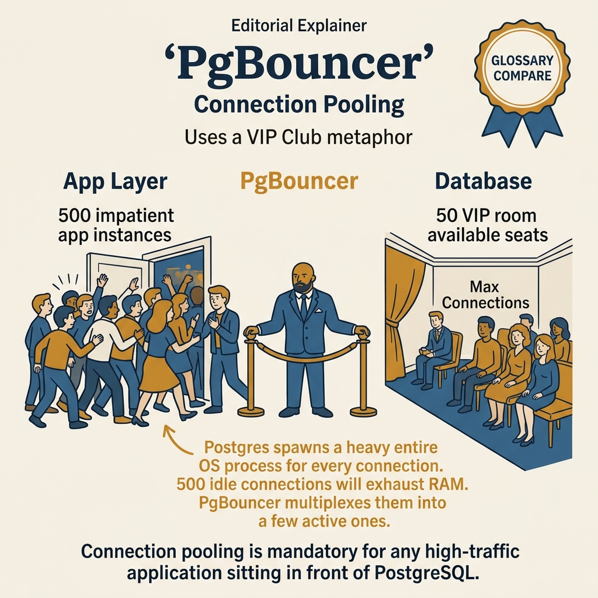
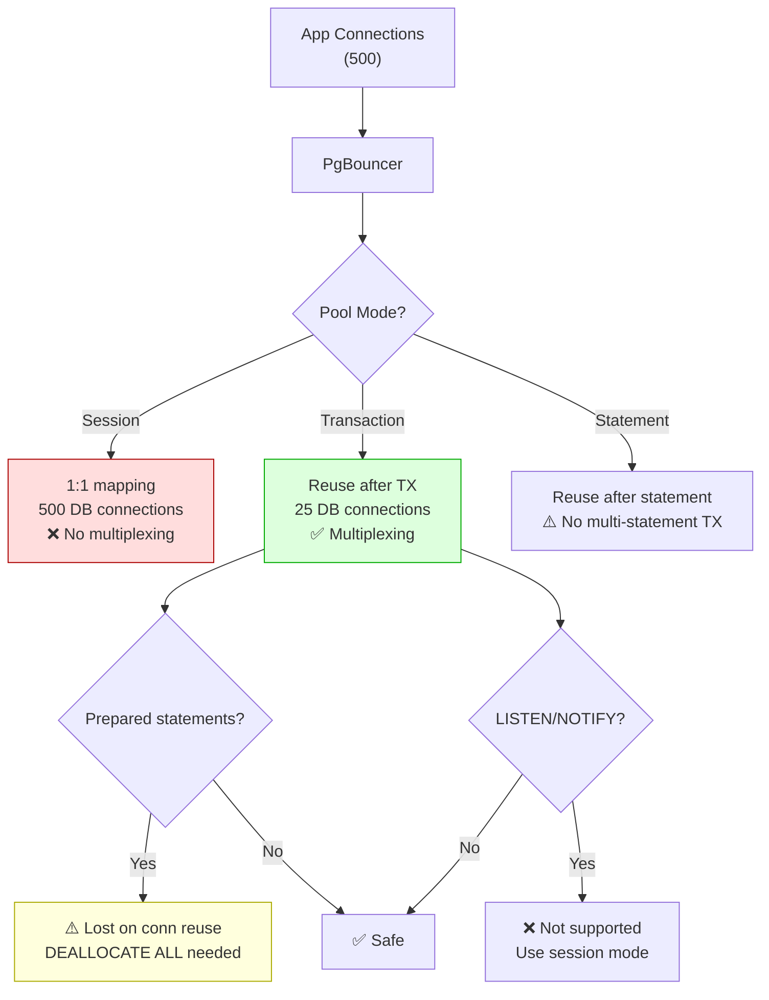

<!-- tags: sql, postgresql, database, replication -->
# 🧵 PgBouncer Transaction Pooling — Connection Pressure, Failover Behavior & Safe Defaults

> PgBouncer là lớp bảo vệ PostgreSQL khỏi connection storm, nhưng cần hiểu rõ transaction pooling, prepared statements và cách nó tương tác với failover.

| Aspect | Detail |
| --- | --- |
| **Concept** | session vs transaction pooling, server reuse, failover behavior |
| **Use case** | high-concurrency apps, short-lived connections, serverless-ish traffic |
| **CLI** | `SHOW POOLS`, `SHOW STATS`, `SHOW SERVERS` |

📅 Ngày tạo: 2026-03-28 · 🔄 Cập nhật: 2026-04-04 · ⏱️ 13 phút đọc

---

## 1. DEFINE

Patroni failover xong. New primary healthy. Nhưng app vẫn báo lỗi: `prepared statement "stmtcache_xxx" does not exist`. PgBouncer transaction pooling reuse connections giữa clients — nhưng prepared statements gắn với connection cụ thể. Sau failover, connection pool reset, prepared statements biến mất.

Team switch sang `pool_mode = session` để giữ prepared statements. Kết quả: 500 app connections = 500 real DB connections. RAM tăng 5GB, context switching giết throughput. Bài toán quay lại điểm xuất phát.

PgBouncer transaction pooling là **production essential** cho PostgreSQL — nhưng nó có behavioral quirks mà không ai document rõ: prepared statement lifecycle, SET statement leaking, LISTEN/NOTIFY incompatibility. Bài này cover: pooling modes deep-dive, failover behavior, safe defaults, và connection math.


| Variant | Mô tả |
| --- | --- |
| session | cuối session · legacy apps cần session state ổn định |
| transaction | sau commit/rollback · default production choice cho đa số app |
| statement | sau mỗi statement · niche workloads, rất hạn chế |

| Approach | Time | Space | Khi chọn |
| --- | --- | --- | --- |
| Safe — ish transaction pooling baseline | Phụ thuộc cardinality | Phụ thuộc row width | Dùng để nắm baseline semantics trước khi tune planner hoặc index. |
| Operational introspection | Phụ thuộc plan | Phụ thuộc memory operator | Dùng khi query đã chạm index, cardinality hoặc join strategy. |
| App — side guidance | Phụ thuộc workload | Phụ thuộc buffer/WAL | Dùng khi workload production cần cân bằng correctness, lock và rollout. |


### Pool Modes

| Mode | Khi nào release server connection | Hợp với |
| --- | --- | --- |
| **session** | cuối session | legacy apps cần session state ổn định |
| **transaction** | sau commit/rollback | default production choice cho đa số app |
| **statement** | sau mỗi statement | niche workloads, rất hạn chế |

### What PgBouncer Is Not

| Không phải | Vì sao |
| --- | --- |
| failover orchestrator | không bầu leader, không fence primary |
| backup tool | không liên quan backup/PITR |
| query optimizer | chỉ xử lý connection multiplexing |

### Failure Modes

| Lỗi | Nguyên nhân | Fix |
| --- | --- | --- |
| prepared statement/session state lỗi | transaction pooling + app giữ session assumptions | chuyển sang session mode hoặc stateless transaction pattern |
| reconnect storm sau failover | app pool size quá lớn, retry đồng loạt | sane pool sizing + jitter + upstream HA router |
| idle in transaction làm pool nghẽn | app giữ transaction quá lâu | set timeouts, shorten TX |

---

Các failure mode trên nghe cơ bản. Nhưng có trap: session pooling mode = no connection reuse benefit, và transaction mode + prepared statements = protocol error. Trap đó sẽ xuất hiện ở PITFALLS.

## 2. VISUAL

Với PgBouncer Transaction Pooling — Connection Pressure, Failover Behavior & Safe Defaults, tên cơ chế nghe rõ trên giấy nhưng rủi ro thật chỉ hiện ra khi nhìn đường đi của WAL, lag và vai trò của từng node trong cụm.




*Hình: Session mode (1:1, full compat) vs Transaction mode (shared, best balance). Transaction mode cho web apps, Session chỉ khi cần LISTEN/NOTIFY.*

### Level 1

```text
Clients: 1000
   │
   ▼
PgBouncer
   │  transaction pooling
   ├── 25 server connections to primary
   └── 10 server connections to replica
          │
          ▼
      PostgreSQL nodes
```

*Hình: Level 1 cho 🧵 PgBouncer Transaction Pooling — Connection Pressure, Failover Behavior & Safe Defaults — nhìn vào happy path hoặc baseline heuristic trước khi đi sâu vào planner và trade-off.*

### Level 2

```text
Decision Lens                 Dấu hiệu cần nhìn                 Hướng xử lý
---------------------------  --------------------------------  -------------------------------------------
Semantics trước               Kết quả có đúng intent không?    1. Safe — ish transaction pooling baseline
Planner / index signal        Cardinality, cost, buffers ra sao? 2. Operational introspection
Production pressure           Lock, WAL, lag, rollback nào đau? 3. App — side guidance
```

*Hình: Level 2 biến 🧵 PgBouncer Transaction Pooling — Connection Pressure, Failover Behavior & Safe Defaults thành checklist quyết định — từ semantics, sang plan signal, rồi đến áp lực production.*


### Architecture — PgBouncer Pooling Modes



*Hình: Transaction pooling là sweet spot — multiplexing tốt nhưng cần handle prepared statements và LISTEN/NOTIFY limitation. Session mode an toàn nhưng không pool.*

---
## 3. CODE

Sau khi flow của PgBouncer Transaction Pooling — Connection Pressure, Failover Behavior & Safe Defaults đã rõ trên sơ đồ, ta chuyển sang cấu hình, truy vấn kiểm tra và quy trình rehearsal có thể dùng ngoài đời thật. Ta đi từ baseline an toàn nhất rồi mới tăng dần độ phức tạp của topology.

### Problem 1: Basic — Safe-ish transaction pooling baseline

> **Mục tiêu**: Minh họa cách áp dụng **🧵 PgBouncer Transaction Pooling — Connection Pressure, Failover Behavior & Safe Defaults** qua ví dụ `Safe-ish transaction pooling baseline` trong đúng ngữ cảnh schema, query hoặc vận hành.


```ini
[databases]
app = host=postgres-rw port=5432 dbname=app

[pgbouncer]
listen_addr = 0.0.0.0
listen_port = 6432
pool_mode = transaction

max_client_conn = 1000
default_pool_size = 25
min_pool_size = 5
reserve_pool_size = 5
reserve_pool_timeout = 3

server_idle_timeout = 300
query_timeout = 60
idle_transaction_timeout = 30

auth_type = scram-sha-256
auth_file = /etc/pgbouncer/userlist.txt

admin_users = pgbouncer_admin
stats_period = 60
```


PgBouncer basics đã cover. Nhưng pool modes cần transaction vs session — hãy chọn.

### Problem 2: Intermediate — Operational introspection

> **Mục tiêu**: Minh họa cách áp dụng **🧵 PgBouncer Transaction Pooling — Connection Pressure, Failover Behavior & Safe Defaults** qua ví dụ `Operational introspection` trong đúng ngữ cảnh schema, query hoặc vận hành.


```sql
SHOW POOLS;
SHOW STATS;
SHOW SERVERS;
SHOW CLIENTS;
```

**Tại sao?** Ở mức Intermediate của PgBouncer Transaction Pooling — Connection Pressure, Failover Behavior & Safe Defaults, phần khó không phải bật cho replication chạy được mà là nhận ra tín hiệu nào báo topology đang rời khỏi trạng thái an toàn. Problem 2: Intermediate — Operational introspection đặt bạn vào chỗ phải đọc đúng lag, slot hoặc sync boundary.


Pool modes đã cover. Nhưng monitoring cần SHOW STATS — hãy observe.

### Problem 3: Advanced — App-side guidance

> **Mục tiêu**: Minh họa cách áp dụng **🧵 PgBouncer Transaction Pooling — Connection Pressure, Failover Behavior & Safe Defaults** qua ví dụ `App-side guidance` trong đúng ngữ cảnh schema, query hoặc vận hành.


```sql
-- Good fit for transaction pooling:
BEGIN;
SELECT * FROM orders WHERE order_id = 42;
UPDATE orders SET status = 'paid' WHERE order_id = 42;
COMMIT;

-- Bad fit:
-- assume a server-side prepared statement or session-local temp/session state
-- survives across unrelated transactions on the same client connection.
```

**Tại sao?** PgBouncer Transaction Pooling — Connection Pressure, Failover Behavior & Safe Defaults ở mức Advanced luôn kéo theo câu hỏi về failover cost, WAL pressure và recovery path. Problem 3: Advanced — App-side guidance quan trọng vì nó cho thấy một cấu hình tưởng ổn có thể trở nên đắt đỏ thế nào khi sự cố thật xảy ra.

## 4. PITFALLS

PgBouncer Transaction Pooling — Connection Pressure, Failover Behavior & Safe Defaults không hỏng vì thiếu tính năng, mà hỏng vì giả định quá lạc quan về lag, failover hoặc recovery path. Phần dưới đây gom những chỗ dễ trả giá nhất.

| # | Lỗi | Fix |
| --- | --- | --- |
| 1 | Dùng transaction pooling nhưng phụ thuộc session state | giữ app stateless theo transaction hoặc đổi mode |
| 2 | Pool quá to ở cả app lẫn PgBouncer | align pool sizes theo capacity của PostgreSQL |
| 3 | Không có timeout cho idle transaction | đặt `idle_transaction_timeout` |
| 4 | Nghĩ PgBouncer tự failover thông minh | đặt nó sau/đi cùng HA router phù hợp |

---

Bạn đã đi qua PgBouncer, pool modes, và monitoring. Bây giờ đến phần nguy hiểm: wrong pool mode và prepared statement failures — trap đã được setup từ đầu bài.

## 4. PITFALLS

Sau phần code và mental model, chỗ dễ trượt nhất không nằm ở cú pháp mà ở cách áp kỹ thuật vào production khi giả định còn mơ hồ. Những pitfall dưới đây là các cú vấp dễ trả giá nhất.

| # | Severity | Lỗi | Hậu quả | Fix |
| --- | --- | --- | --- | --- |
| 1 | 🟡 Common | Đọc symptom nhưng không nhìn workload | Chọn sai fix, tốn thời gian benchmark lại | Khóa lại giả định cardinality, concurrency và cost trước khi sửa. |
| 2 | 🔴 Fatal | Tối ưu trên production mà không có rollback path | Có thể gây lock dài, lag replica hoặc mất cửa sổ khôi phục | Chuẩn bị `EXPLAIN`, lock budget và rollback plan trước khi chạy thay đổi. |
| 3 | 🔵 Minor | Ghi nhớ mẹo rời rạc thay vì mental model | Áp sai pattern khi bài toán đổi shape | Luôn map symptom → invariant → kỹ thuật tương ứng. |

---
Bạn đã đi qua PgBouncer Transaction Pooling và cạm bẫy. Các resources dưới đây giúp đi sâu hơn.

## 5. REF

| Resource | Link |
| --- | --- |
| PgBouncer docs | https://www.pgbouncer.org/config.html |
| SHOW commands | https://www.pgbouncer.org/usage.html |

---

## 6. RECOMMEND

Khi các failure mode chính của PgBouncer Transaction Pooling — Connection Pressure, Failover Behavior & Safe Defaults đã lộ mặt, bước tiếp theo là nối nó với backup, pooling hoặc incident drill để topology không chỉ đúng trên sơ đồ.

| Mở rộng | Khi nào | Lý do |
| --- | --- | 
> **Callback** — Quay lại `prepared statement does not exist` sau failover: transaction pooling reuse connection, prepared statements mất. Fix: `DEALLOCATE ALL` ở application khi detect reconnect, hoặc dùng extended query protocol. PgBouncer transaction pooling + biết trước limitations = production stable.

--- |
| pair with Patroni/HAProxy | cluster HA | để routing theo leader state |
| app-level pool audit | pgx / ORM pools | tránh double-pooling sai kích thước |
| failover drills through PgBouncer | production launch | đo reconnect storm và timeout behavior |

**Liên kết**: [← Patroni & HA Orchestration](./03-patroni-ha-orchestration.md) · [→ Backup & PITR Drills](./05-backup-and-pitr.md)

---

## 7. QUICK REF

| Nếu gặp | Nghĩ ngay |
| --- | --- |
| Safe — ish transaction pooling baseline | Dùng pattern này khi gặp signal tương ứng trong production workload. |
| Operational introspection | Dùng pattern này khi gặp signal tương ứng trong production workload. |
| App — side guidance | Dùng pattern này khi gặp signal tương ứng trong production workload. |
