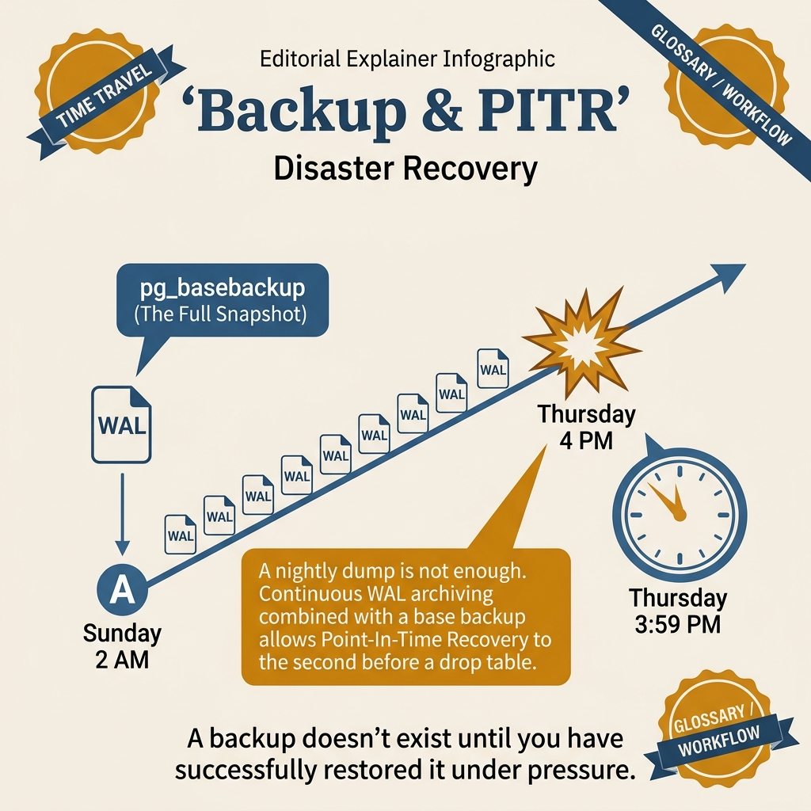
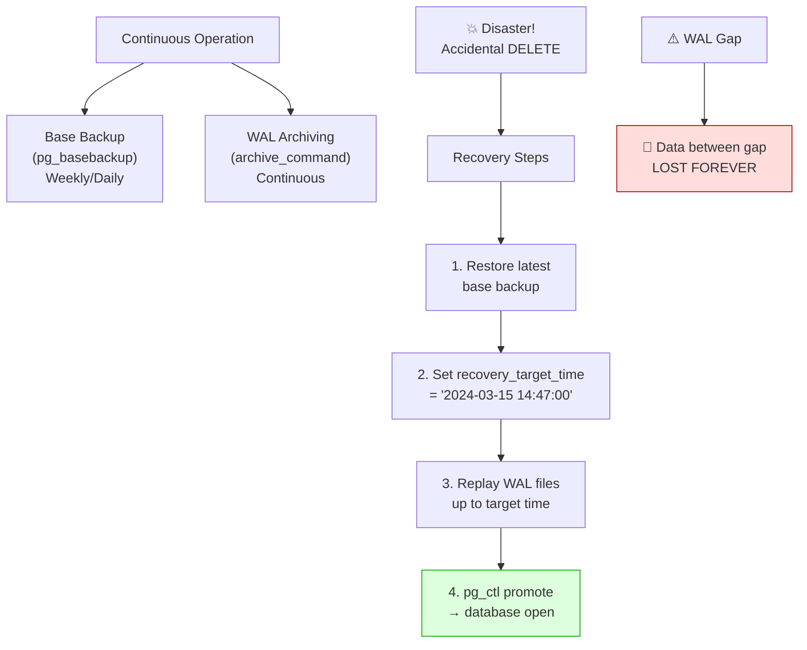

<!-- tags: sql, postgresql, database, replication -->
# 🧯 Backup & PITR — Base Backups, WAL Archiving & Recovery Drills

> Replica không phải backup. Nếu cần phục hồi sau lỗi logic, xoá nhầm dữ liệu hoặc ransomware, bạn cần backup + WAL archiving + PITR drill.

| Aspect | Detail |
| --- | --- |
| **Concept** | base backup, WAL archiving, restore target, recovery timeline |
| **Use case** | disaster recovery, accidental delete, restore-before-bad-deploy |
| **CLI** | `pg_basebackup`, `restore_command`, recovery targets |

📅 Ngày tạo: 2026-03-28 · 🔄 Cập nhật: 2026-04-04 · ⏱️ 15 phút đọc

---

## 1. DEFINE

Developer chạy `DELETE FROM orders WHERE status = 'pending'` — quên WHERE clause timezone filter. 2.3 triệu orders bị xóa. Team cần restore **đến đúng 2:47 PM hôm qua** — 1 phút trước khi DELETE chạy. `pg_basebackup` mới nhất là 4 giờ trước. WAL files từ 4 giờ trước đến 2:47 PM — nhưng `archive_command` fail im lặng từ 2 giờ trước. WAL gap: dữ liệu mất vĩnh viễn.

Lần sau, team setup: continuous archiving với monitoring, WAL archive verification mỗi giờ, `barman` để manage base backups + WAL. Recovery drill mỗi tháng — phát hiện restore mất 2 giờ cho 500GB database, team negotiate RPO và RTO với business.

Backup không khó. **Restore đúng lúc, đúng thời điểm, đúng cách** mới khó. Bài này cover: base backup strategies, WAL archiving pipeline, PITR recovery steps, và recovery drill checklist.


| Variant | Mô tả |
| --- | --- |
| copy gần real-time của current state | snapshot + WAL để quay về một thời điểm |
| replicate cả lỗi logic/xóa nhầm | dùng để phục hồi trước thời điểm lỗi |
| phục vụ HA/read scale | phục vụ disaster recovery |

| Approach | Time | Space | Khi chọn |
| --- | --- | --- | --- |
| WAL archiving baseline | Phụ thuộc cardinality | Phụ thuộc row width | Dùng để nắm baseline semantics trước khi tune planner hoặc index. |
| Base backup | Phụ thuộc plan | Phụ thuộc memory operator | Dùng khi query đã chạm index, cardinality hoặc join strategy. |
| PITR restore sketch | Phụ thuộc workload | Phụ thuộc buffer/WAL | Dùng khi workload production cần cân bằng correctness, lock và rollout. |


### Why Replica != Backup

| Replica | Backup/PITR |
| --- | --- |
| copy gần real-time của current state | snapshot + WAL để quay về một thời điểm |
| replicate cả lỗi logic/xóa nhầm | dùng để phục hồi trước thời điểm lỗi |
| phục vụ HA/read scale | phục vụ disaster recovery |

### PITR Building Blocks

| Thành phần | Vai trò |
| --- | --- |
| **Base backup** | ảnh chụp data directory hợp lệ |
| **WAL archive** | chuỗi thay đổi sau base backup |
| **restore command** | lấy WAL cần thiết khi recover |
| **recovery target** | thời điểm/LSN/xid muốn dừng restore |

### Failure Modes

| Lỗi | Nguyên nhân | Fix |
| --- | --- | --- |
| Archive silently failing | `archive_command` luôn exit 0 | command phải fail loudly và có alert |
| Backup có nhưng restore chưa từng drill | false sense of safety | drill định kỳ trên môi trường riêng |
| Restore đè nhầm current cluster | quy trình restore mơ hồ | restore vào cluster mới, validate trước cutover |

---

Các failure mode trên nghe quen. Nhưng có trap: pg_dump on large DB = lock contention + hours, và WAL archive gap = PITR recovery impossible. Trap đó sẽ xuất hiện ở PITFALLS.

## 2. VISUAL

Với Backup & PITR — Base Backups, WAL Archiving & Recovery Drills, tên cơ chế nghe rõ trên giấy nhưng rủi ro thật chỉ hiện ra khi nhìn đường đi của WAL, lag và vai trò của từng node trong cụm.




*Hình: Recovery pipeline — Base Backup (pg_basebackup) → WAL Archive (continuous) → Point-in-Time Restore (target timestamp) → Verify (test restore). Backup without tested restore = no backup.*

### Level 1

```text
Base backup @ T0
      │
      ├── WAL 0001
      ├── WAL 0002
      ├── WAL 0003  <-- bad deployment at T3
      └── WAL 0004

PITR target = just before T3
      │
      ▼
Restore base backup + replay WAL until target
```

*Hình: Level 1 cho 🧯 Backup & PITR — Base Backups, WAL Archiving & Recovery Drills — nhìn vào happy path hoặc baseline heuristic trước khi đi sâu vào planner và trade-off.*

### Level 2

```text
Decision Lens                 Dấu hiệu cần nhìn                 Hướng xử lý
---------------------------  --------------------------------  -------------------------------------------
Semantics trước               Kết quả có đúng intent không?    1. WAL archiving baseline
Planner / index signal        Cardinality, cost, buffers ra sao? 2. Base backup
Production pressure           Lock, WAL, lag, rollback nào đau? 3. PITR restore sketch
```

*Hình: Level 2 biến 🧯 Backup & PITR — Base Backups, WAL Archiving & Recovery Drills thành checklist quyết định — từ semantics, sang plan signal, rồi đến áp lực production.*


### Architecture — Backup & PITR Recovery Flow



*Hình: PITR = base backup + WAL replay until target time. WAL gap = data loss không recoverable. Monitor archive_command status là critical.*

---
## 3. CODE

Sau khi flow của Backup & PITR — Base Backups, WAL Archiving & Recovery Drills đã rõ trên sơ đồ, ta chuyển sang cấu hình, truy vấn kiểm tra và quy trình rehearsal có thể dùng ngoài đời thật. Ta đi từ baseline an toàn nhất rồi mới tăng dần độ phức tạp của topology.

### Problem 1: Basic — WAL archiving baseline

> **Mục tiêu**: Minh họa cách áp dụng **🧯 Backup & PITR — Base Backups, WAL Archiving & Recovery Drills** qua ví dụ `WAL archiving baseline` trong đúng ngữ cảnh schema, query hoặc vận hành.


```sql
ALTER SYSTEM SET wal_level = 'replica';
ALTER SYSTEM SET archive_mode = on;
ALTER SYSTEM SET archive_command = 'test ! -f /backup/wal/%f && cp %p /backup/wal/%f';
SELECT pg_reload_conf();
```

```sql
SELECT
    archived_count,
    failed_count,
    last_archived_wal,
    last_archived_time,
    last_failed_wal,
    last_failed_time
FROM pg_stat_archiver;
```


Backup basics đã cover. Nhưng PITR cần WAL archiving — hãy configure.

### Problem 2: Intermediate — Base backup

> **Mục tiêu**: Minh họa cách áp dụng **🧯 Backup & PITR — Base Backups, WAL Archiving & Recovery Drills** qua ví dụ `Base backup` trong đúng ngữ cảnh schema, query hoặc vận hành.


```bash
pg_basebackup \
  -h primary \
  -U replicator \
  -D /backups/base/2026-03-28 \
  -Fp -Xs -P
```

**Tại sao?** Ở mức Intermediate của Backup & PITR — Base Backups, WAL Archiving & Recovery Drills, phần khó không phải bật cho replication chạy được mà là nhận ra tín hiệu nào báo topology đang rời khỏi trạng thái an toàn. Problem 2: Intermediate — Base backup đặt bạn vào chỗ phải đọc đúng lag, slot hoặc sync boundary.


PITR đã cover. Nhưng pgBackRest cần parallel backup — hãy automate.

### Problem 3: Advanced — PITR restore sketch

> **Mục tiêu**: Minh họa cách áp dụng **🧯 Backup & PITR — Base Backups, WAL Archiving & Recovery Drills** qua ví dụ `PITR restore sketch` trong đúng ngữ cảnh schema, query hoặc vận hành.


```conf
# postgresql.auto.conf or recovery config on restore target
restore_command = 'cp /backup/wal/%f %p'
recovery_target_time = '2026-03-28 10:14:00+07'
recovery_target_action = 'promote'
```

```bash
# start restored cluster, PostgreSQL replays WAL until target then promotes
pg_ctl -D /restore/data start
```

**Tại sao?** Backup & PITR — Base Backups, WAL Archiving & Recovery Drills ở mức Advanced luôn kéo theo câu hỏi về failover cost, WAL pressure và recovery path. Problem 3: Advanced — PITR restore sketch quan trọng vì nó cho thấy một cấu hình tưởng ổn có thể trở nên đắt đỏ thế nào khi sự cố thật xảy ra.

## 4. PITFALLS

Backup & PITR — Base Backups, WAL Archiving & Recovery Drills không hỏng vì thiếu tính năng, mà hỏng vì giả định quá lạc quan về lag, failover hoặc recovery path. Phần dưới đây gom những chỗ dễ trả giá nhất.

| # | Lỗi | Fix |
| --- | --- | --- |
| 1 | Có replica nên bỏ qua backup | replica không cứu được lỗi logic hoặc ransomware |
| 2 | `archive_command` không được giám sát | alert theo `pg_stat_archiver.failed_count` |
| 3 | Không test restore | lịch drill định kỳ là bắt buộc |
| 4 | Không định nghĩa RPO/RTO | chốt mục tiêu DR trước khi chọn topology |

---

Bạn đã đi qua backup, PITR, và pgBackRest. Bây giờ đến phần nguy hiểm: lock contention và WAL gap — trap đã được setup từ đầu bài.

## 4. PITFALLS

Sau phần code và mental model, chỗ dễ trượt nhất không nằm ở cú pháp mà ở cách áp kỹ thuật vào production khi giả định còn mơ hồ. Những pitfall dưới đây là các cú vấp dễ trả giá nhất.

| # | Severity | Lỗi | Hậu quả | Fix |
| --- | --- | --- | --- | --- |
| 1 | 🟡 Common | Đọc symptom nhưng không nhìn workload | Chọn sai fix, tốn thời gian benchmark lại | Khóa lại giả định cardinality, concurrency và cost trước khi sửa. |
| 2 | 🔴 Fatal | Tối ưu trên production mà không có rollback path | Có thể gây lock dài, lag replica hoặc mất cửa sổ khôi phục | Chuẩn bị `EXPLAIN`, lock budget và rollback plan trước khi chạy thay đổi. |
| 3 | 🔵 Minor | Ghi nhớ mẹo rời rạc thay vì mental model | Áp sai pattern khi bài toán đổi shape | Luôn map symptom → invariant → kỹ thuật tương ứng. |

---
Bạn đã đi qua Backup & PITR và cạm bẫy. Các resources dưới đây giúp đi sâu hơn.

## 5. REF

| Resource | Link |
| --- | --- |
| Backup and restore | https://www.postgresql.org/docs/current/backup.html |
| Continuous archiving and PITR | https://www.postgresql.org/docs/current/continuous-archiving.html |
| pg_basebackup | https://www.postgresql.org/docs/current/app-pgbasebackup.html |

---

## 6. RECOMMEND

Khi các failure mode chính của Backup & PITR — Base Backups, WAL Archiving & Recovery Drills đã lộ mặt, bước tiếp theo là nối nó với backup, pooling hoặc incident drill để topology không chỉ đúng trên sơ đồ.

| Mở rộng | Khi nào | Lý do |
| --- | --- | 
> **Callback** — Quay lại DELETE 2.3 triệu orders + WAL gap: archive_command fail im lặng 2 giờ = data mất vĩnh viễn. Monitor `last_archived_wal` mỗi giờ, recovery drill mỗi tháng, verify backup khôi phục được. Backup không có verification = false sense of security.

--- |
| restore validation checklist | mọi đội production | tránh “backup exists but restore fails” |
| object storage archive | WAL retention dài | tách compute khỏi archive durability |
| combine with Patroni runbook | HA + DR | làm rõ failover khác restore như thế nào |

**Liên kết**: [← PgBouncer Transaction Pooling](./04-pgbouncer-transaction-pooling.md) · [→ Replication Quiz](../../quiz/module/03-replication-and-ha.md)

---

## 7. QUICK REF

| Nếu gặp | Nghĩ ngay |
| --- | --- |
| WAL archiving baseline | Dùng pattern này khi gặp signal tương ứng trong production workload. |
| Base backup | Dùng pattern này khi gặp signal tương ứng trong production workload. |
| PITR restore sketch | Dùng pattern này khi gặp signal tương ứng trong production workload. |
