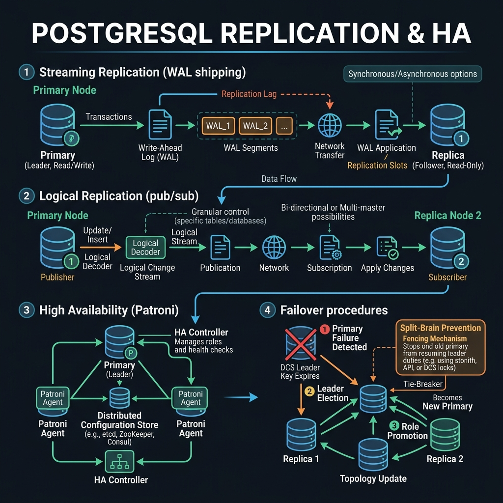

<!-- tags: sql, postgresql, database, replication, overview -->
# 🔄 PostgreSQL Replication & HA

> Một query tối ưu trên primary vẫn có thể làm hỏng replica lag, failover timing hoặc PITR window. Track này dạy cách nghĩ theo topology thật thay vì theo single-node mindset.

| Aspect | Detail |
| --- | --- |
| **Concept** | Streaming replication, logical replication, Patroni, PgBouncer, backup/PITR |
| **Audience** | Senior backend engineer, DBA, SRE, on-call engineer |
| **Primary style** | Concept-First hub cho HA và recovery |
| **Entry point** | `01-streaming-ha.md`, `02-logical-replication.md`, `05-backup-and-pitr.md` |

📅 Ngày tạo: 2026-03-19 · 🔄 Cập nhật: 2026-04-04 · ⏱️ 4 phút đọc

---

## 1. DEFINE

5 bài replication + HA — từ streaming replication đến backup/PITR. Track này dành cho **DBA và SRE** đang thiết lập hoặc vận hành PostgreSQL HA.

Mỗi bài cover: architecture, setup, monitoring, failure scenarios, và runbook. Đặc biệt: Patroni HA orchestration và PgBouncer failover behavior — hai chủ đề ít documentation nhất nhưng gây nhiều incident nhất.


| Variant | Mô tả |
| --- | --- |
| Physical / Streaming Replication | Primary-standby, sync vs async, slots, failover basics |
| Logical Replication | Publication/subscription, CDC, selective replication, schema drift |
| HA Orchestration | Patroni, leader leases, failover/switchover logic |
| Recovery & Pooling | Backup/PITR, PgBouncer, connection behavior during failover |

| Approach | Time | Space | Khi chọn |
| --- | --- | --- | --- |
| Streaming first | Phụ thuộc topology | O(1) | Dùng khi cần baseline standby/read replica/failover model. |
| Logical second | Phụ thuộc publication scope | O(1) | Dùng khi cần selective replication hoặc CDC. |
| Recovery-first thinking | Phụ thuộc backup window | O(1) | Dùng khi cần chứng minh DR và restore path chứ không chỉ replication health. |

Core insight:

> Replication không phải “thêm replica là xong”. Mọi quyết định ở track này đều phải trả lời được ba câu hỏi: **lag chấp nhận được không, failover an toàn không, restore có kiểm chứng chưa**.

### Coverage

| File | Chủ đề |
| --- | --- |
| [01-streaming-ha.md](./01-streaming-ha.md) | Physical replication, sync/async, slots, failover basics |
| [02-logical-replication.md](./02-logical-replication.md) | Publication/subscription, replica identity, CDC implications |
| [03-patroni-ha-orchestration.md](./03-patroni-ha-orchestration.md) | HA control plane, leader election, fencing |
| [04-pgbouncer-transaction-pooling.md](./04-pgbouncer-transaction-pooling.md) | Pooling behavior around transactions and failover |
| [05-backup-and-pitr.md](./05-backup-and-pitr.md) | Backup, WAL archive, PITR drills |

---

## 2. VISUAL

Với PostgreSQL Replication & HA, tên cơ chế nghe rõ trên giấy nhưng rủi ro thật chỉ hiện ra khi nhìn đường đi của WAL, lag và vai trò của từng node trong cụm.



### Level 1

```text
Primary
  |
  +--> Streaming replica
  |
  +--> Logical subscriber
  |
  +--> WAL archive / backup
          |
          v
        PITR
```

*Hình: Level 1 cho thấy replication track không chỉ có standby, mà còn cả CDC và recovery path.*

### Level 2

```text
Symptom / Goal                     File
---------------------------------  --------------------------------------------
need standby + failover basics     01-streaming-ha
need selective replication / CDC   02-logical-replication
need orchestration / leader logic  03-patroni-ha-orchestration
need connection behavior on failover 04-pgbouncer-transaction-pooling
need restore drills / PITR         05-backup-and-pitr
```

*Hình: Level 2 route production topology question vào đúng bài replication/HA.*

---
## 3. CODE

Sau khi flow của PostgreSQL Replication & HA đã rõ trên sơ đồ, ta chuyển sang cấu hình, truy vấn kiểm tra và quy trình rehearsal có thể dùng ngoài đời thật. Ta đi từ baseline an toàn nhất rồi mới tăng dần độ phức tạp của topology.

### Problem 1: Basic — Chọn bài replication đầu tiên từ topology question

> **Mục tiêu**: Route đúng bài khi team mới chạm replication/HA.
> **Approach**: Map production question sang file replication phù hợp.
> **Ví dụ**: Đầu vào là câu hỏi như “read replica”, “CDC”, “PITR”; đầu ra là bài nên mở đầu tiên.
> **Độ phức tạp**: Basic — topology routing.

```sql
SELECT *
FROM (VALUES
  ('need read replica / failover basics', '01-streaming-ha.md'),
  ('need CDC or selective replication', '02-logical-replication.md'),
  ('need HA orchestration', '03-patroni-ha-orchestration.md'),
  ('need pool behavior under failover', '04-pgbouncer-transaction-pooling.md'),
  ('need restore drills and recovery proof', '05-backup-and-pitr.md')
) AS routes(question, first_file);
```

**Tại sao?** Replication có nhiều lớp rất dễ bị trộn vào nhau. Router này giữ cho learner không nhảy từ “cần CDC” sang “đọc Patroni”, hoặc từ “cần PITR” sang “xem replica lag” rồi bỏ quên restore proof.

**Kết luận**: Replication README phải giúp người đọc chọn đúng concern ngay từ đầu: standby, CDC, orchestration, pooling hay recovery.

### Problem 2: Intermediate — Định nghĩa readiness cho replication production

> **Mục tiêu**: Không dừng ở “replica đang xanh”.
> **Approach**: Checklist readiness gồm lag, slot health, backup/PITR, routing behavior.
> **Ví dụ**: Đầu vào là một topology đã chạy; đầu ra là checklist review.
> **Độ phức tạp**: Intermediate — nhiều moving parts.

```text
Replication readiness checklist
  - Lag budget được định nghĩa và monitor
  - Replication slots không backlog vô hạn
  - Failover path có owner và procedure rõ
  - App / pool biết chuyện gì xảy ra khi switchover
  - Backup + PITR drill đã chạy thật
```

**Tại sao?** Replica healthy tại thời điểm hiện tại không chứng minh được failover an toàn hay restore được dữ liệu. Replication track phải ép người đọc nhìn topology như một hệ thống sống, không phải dashboard màu xanh.

**Kết luận**: Readiness trong replication luôn vượt xa chỉ số “replication lag hiện tại”.

### Problem 3: Advanced — Gắn replication với quiz và incident rehearsal

> **Mục tiêu**: Biến replication knowledge thành phản xạ decision-making.
> **Approach**: Kết nối track replication với module quiz 03/04 và scenario quiz 02.
> **Ví dụ**: Đầu vào là engineer chuẩn bị vào on-call rotation; đầu ra là rehearsal path.
> **Độ phức tạp**: Advanced — production judgement.

```text
After finishing replication track:
  - Do module/03-replication-and-ha.md
  - Do module/04-logical-replication-and-cdc.md
  - Do scenario/02-pitr-failover-cutover-incidents.md
  - Compare decisions with backup/PITR and failover playbooks
```

**Tại sao?** Replication sai không chỉ làm chậm hệ thống; nó có thể làm team mất dữ liệu hoặc failover nhầm thời điểm. Quiz và scenario là nơi kiểm tra liệu learner có biết ưu tiên safe action và rollback path không.

**Kết luận**: Replication track chỉ hoàn thành khi learner đã qua cả verification lẫn incident rehearsal.

---
## 4. PITFALLS

PostgreSQL Replication & HA không hỏng vì thiếu tính năng, mà hỏng vì giả định quá lạc quan về lag, failover hoặc recovery path. Phần dưới đây gom những chỗ dễ trả giá nhất.

| # | Severity | Lỗi | Hậu quả | Fix |
| --- | --- | --- | --- | --- |
| 1 | 🔴 Fatal | Nghĩ replica xanh = failover an toàn | Đến lúc failover mới lộ slot/PITR/routing issue | Review cả failover path lẫn recovery path. |
| 2 | 🟡 Common | Trộn logical replication với physical replication | Chọn sai tool cho mục tiêu CDC/HA | Tách rõ standby use case và CDC use case từ đầu. |
| 3 | 🟡 Common | Chỉ monitor lag mà quên backup/PITR drills | Có replica nhưng không chứng minh được recovery | Đọc và thực hành `05-backup-and-pitr.md`. |
| 4 | 🔵 Minor | Bỏ qua quiz replication | Thiếu confidence rằng mental model đã đúng | Làm module 03, 04 và scenario 02. |

---
## 5. REF

| Resource | Loại | Link | Ghi chú |
| --- | --- | --- | --- |
| PostgreSQL Replication Settings | Official docs | https://www.postgresql.org/docs/current/runtime-config-replication.html | Replication config parameters. |
| Warm Standby & PITR | Official docs | https://www.postgresql.org/docs/current/warm-standby.html | Streaming replication và recovery. |
| Logical Replication | Official docs | https://www.postgresql.org/docs/current/logical-replication.html | Publication/subscription semantics. |

---

## 6. RECOMMEND

Khi các failure mode chính của PostgreSQL Replication & HA đã lộ mặt, bước tiếp theo là nối nó với backup, pooling hoặc incident drill để topology không chỉ đúng trên sơ đồ.

| Mở rộng | Khi nào | Lý do | File/Link |
| --- | --- | --- | --- |
| Replication & HA Quiz | Khi cần verify failover/lag reasoning | Chuyển topology knowledge thành quiz answers | [../../quiz/module/03-replication-and-ha.md](../../quiz/module/03-replication-and-ha.md) |
| Logical Replication & CDC Quiz | Khi đang dùng publication/subscription | Verify CDC mental model | [../../quiz/module/04-logical-replication-and-cdc.md](../../quiz/module/04-logical-replication-and-cdc.md) |
| PITR / Failover Scenario Quiz | Khi chuẩn bị on-call | Rehearse incident judgement | [../../quiz/scenario/02-pitr-failover-cutover-incidents.md](../../quiz/scenario/02-pitr-failover-cutover-incidents.md) |

---

## 7. QUICK REF

| Nếu gặp | Mở file |
| --- | --- |
| Standby / sync vs async / slots | `01` |
| CDC / publication / subscription | `02` |
| Patroni / leader orchestration | `03` |
| PgBouncer around failover | `04` |
| Backup / PITR / recovery drills | `05` |