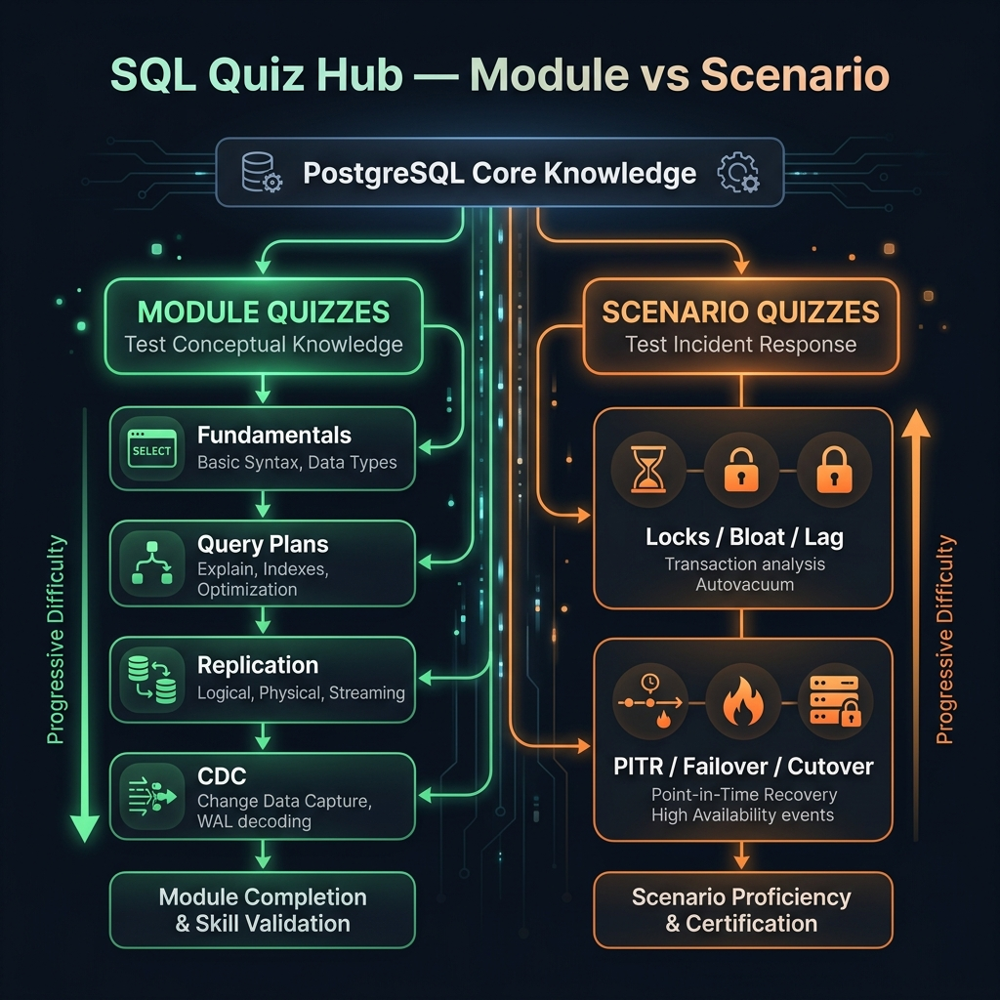

<!-- tags: sql, postgresql, quiz, overview -->
# ✅ SQL & PostgreSQL Quiz

> Đọc tài liệu xong mà không bị ép trả lời theo tình huống thật thì rất dễ tưởng mình hiểu. Track quiz này là nơi buộc người đọc biến kiến thức SQL/PostgreSQL thành reasoning: từ syntax, sang planner signal, rồi đến incident judgement.

| Aspect | Detail |
| --- | --- |
| **Concept** | Module quiz + scenario quiz cho SQL/PostgreSQL |
| **Audience** | Backend engineer, DBA, reviewer, on-call engineer |
| **Primary style** | Problem-Centric verification hub |
| **Entry point** | `module/` trước, `scenario/` sau |

📅 Ngày tạo: 2026-03-28 · 🔄 Cập nhật: 2026-04-04 · ⏱️ 4 phút đọc

---

## 1. DEFINE

Quiz library = checkpoint cho mental model. Hai loại:

- **Module quizzes**: verify kiến thức từng track (fundamentals, performance, replication)
- **Scenario quizzes**: mô phỏng incident production — triage nhiều tín hiệu cùng lúc

Đọc docs → làm module quiz → nếu pass → thử scenario quiz. Scenario quiz đo judgement, không đo recall.


| Variant | Mô tả |
| --- | --- |
| Module Quiz | Kiểm tra kiến thức theo từng track: fundamentals, performance, replication, CDC |
| Scenario Quiz | Mô phỏng incident / operational situation để ép người đọc ra quyết định |
| Review Loop | Sau khi quiz xong, quay lại đúng module còn yếu thay vì đọc lại toàn bộ |

| Approach | Time | Space | Khi chọn |
| --- | --- | --- | --- |
| Module first | Phụ thuộc số câu hỏi | O(1) | Dùng sau khi đọc xong một track và cần verify kiến thức nền. |
| Scenario second | Phụ thuộc độ sâu reasoning | O(1) | Dùng khi muốn kiểm tra judgement trên tình huống production. |
| Weak-area feedback loop | Phụ thuộc số lần review | O(1) | Dùng khi làm quiz xong mà chưa chắc chỗ nào đang mơ hồ. |

Core insight:

> Quiz tốt không hỏi “bạn nhớ syntax không”. Nó hỏi **bạn có nhìn ra invariant, planner signal và blast radius không**.

### Coverage Map

| Folder | Vai trò | Link |
| --- | --- | --- |
| `module/` | Checkpoint theo từng khối kiến thức | [module/README.md](./module/README.md) |
| `scenario/` | Incidents và decision-making dưới áp lực | [scenario/README.md](./scenario/README.md) |

---

## 2. VISUAL

Với SQL & PostgreSQL Quiz, điều cần nhìn trước không phải đáp án mà là cấu trúc reasoning của câu hỏi. Chỉ khi thấy nó đang kiểm tra lớp mental model nào, bạn mới tránh được việc chọn theo phản xạ.



### Level 1

```text
Read docs
   |
   v
Take module quiz
   |
   v
Review weak areas
   |
   v
Take scenario quiz
   |
   v
Build production judgement
```

*Hình: Level 1 cho thấy quiz là vòng lặp học tập, không phải appendix sau cùng.*

### Level 2

```text
If you fail at...                    Go back to...
----------------------------------  --------------------------------------------
constraints / joins / grouping      postgresql/fundamental
EXPLAIN / indexes / VACUUM          optimizer + postgresql/performance
replication / slots / PITR          postgresql/replication
incident prioritization             scenario quiz + optimizer triage playbooks
```

*Hình: Level 2 biến quiz hub thành feedback system — sai ở đâu thì quay lại đúng module ở đó.*

---
## 3. CODE

Khi pattern reasoning của SQL & PostgreSQL Quiz đã rõ, ta chuyển sang câu hỏi, truy vấn và artifact cụ thể để tự kiểm chứng xem mình đang hiểu cơ chế hay chỉ nhớ từ khóa.

### Problem 1: Basic — Chạy module quiz đúng thứ tự

> **Mục tiêu**: Không nhảy ngay vào scenario khi mental model nền còn chưa chắc.
> **Approach**: Đi theo thứ tự module fundamentals → performance → replication → CDC.
> **Ví dụ**: Đầu vào là một learner vừa đọc xong docs; đầu ra là quiz order hợp lý.
> **Độ phức tạp**: Basic — xây learning cadence.

```text
1. module/01-postgresql-fundamentals.md
2. module/02-query-plans-performance-and-maintenance.md
3. module/03-replication-and-ha.md
4. module/04-logical-replication-and-cdc.md
5. scenario/01-locks-bloat-replica-lag-incidents.md
6. scenario/02-pitr-failover-cutover-incidents.md
```

**Tại sao?** Nếu fundamentals chưa vững mà đã làm scenario quiz, bạn sẽ fail vì thiếu baseline chứ không phải vì scenario khó. Order này bảo đảm mỗi bước khó hơn bước trước và dùng đúng kiến thức vừa học.

**Kết luận**: Quiz hub không chỉ liệt kê file; nó sắp thứ tự verification để người đọc không tự phá learning curve của mình.

### Problem 2: Intermediate — Tách lỗi recall với lỗi judgement

> **Mục tiêu**: Nhìn ra learner đang yếu vì thiếu kiến thức nền hay vì thiếu production judgement.
> **Approach**: Module quiz đo recall + reasoning; scenario quiz đo prioritization + risk judgement.
> **Ví dụ**: Đầu vào là kết quả quiz; đầu ra là quyết định quay lại module nào.
> **Độ phức tạp**: Intermediate — map kết quả quiz sang remediation path.

```sql
-- quiz_feedback.sql — pseudo mapping từ lỗi sang module cần review
SELECT *
FROM (VALUES
  ('wrong join / grouping answer', 'postgresql/fundamental'),
  ('cannot read EXPLAIN signal', 'optimizer + postgresql/performance'),
  ('wrong failover or PITR judgement', 'postgresql/replication + scenario quiz'),
  ('cannot choose safe first action', 'optimizer/10-production-dba-triage-playbook')
) AS feedback(symptom, revisit_module);
```

**Tại sao?** “Trả lời sai” chưa đủ để sửa đúng. Bạn phải biết sai vì không nhớ semantics, không đọc được planner, hay không biết ưu tiên trong incident. Quiz hub cần chuyển lỗi thành hành động tiếp theo rõ ràng.

**Kết luận**: Giá trị thật của quiz nằm ở remediation path sau bài làm, không chỉ ở answer key.

### Problem 3: Advanced — Biến quiz thành incident rehearsal

> **Mục tiêu**: Dùng quiz như rehearsal cho production, không chỉ như bài test kiến thức.
> **Approach**: Kết hợp module quiz với scenario quiz và playbooks liên quan.
> **Ví dụ**: Đầu vào là một rotation on-call mới; đầu ra là practice loop trước khi trực thật.
> **Độ phức tạp**: Advanced — có operational context.

```text
Before on-call:
  - Read replication track
  - Finish module/03 and module/04
  - Finish scenario/01 and scenario/02
  - Compare your answer with:
      * optimizer/10-production-dba-triage-playbook.md
      * postgresql/replication/05-backup-and-pitr.md
  - Write: symptom -> evidence -> first action -> rollback
```

**Tại sao?** Production judgement không đến từ việc đọc docs passively. Nó đến từ việc buộc bản thân chọn một hành động, rồi giải thích vì sao hành động đó an toàn hơn các hành động còn lại. Quiz hub nên được dùng như rehearsal framework.

**Kết luận**: Khi quiz được dùng như rehearsal, nó trở thành phần cốt lõi của training path chứ không còn là phần “kiểm tra thêm nếu thích”.

---
## 4. PITFALLS

SQL & PostgreSQL Quiz đáng giá vì nó chỉ ra đúng kiểu sai lầm sẽ lặp lại trong production nếu không sửa mental model. Phần dưới đây gom những mẫu suy nghĩ dễ trượt nhất.

| # | Severity | Lỗi | Hậu quả | Fix |
| --- | --- | --- | --- | --- |
| 1 | 🔴 Fatal | Nhảy thẳng vào scenario quiz khi fundamentals còn yếu | Kết quả quiz nhiễu, learner không biết mình sai vì đâu | Hoàn thành module quiz theo đúng thứ tự trước. |
| 2 | 🟡 Common | Chỉ xem answer key mà không map lỗi sang module cần review | Không sửa đúng chỗ, lặp lại cùng lỗi | Sau mỗi quiz, ghi rõ symptom -> revisit module. |
| 3 | 🟡 Common | Xem quiz như memory test | Bỏ qua phần planner signal và incident judgement | Luôn hỏi “vì sao lựa chọn này an toàn nhất?”. |
| 4 | 🔵 Minor | Bỏ qua scenario quiz vì “đã đọc replication rồi” | Thiếu phản xạ xử lý dưới áp lực | Dùng scenario quiz như rehearsal bắt buộc trước on-call. |

---
## 5. REF

| Resource | Loại | Link | Ghi chú |
| --- | --- | --- | --- |
| PostgreSQL Documentation | Official docs | https://www.postgresql.org/docs/current/index.html | Canonical source để verify kiến thức quiz. |
| SQL Root Overview | Internal doc | ../README.md | Bản đồ tổng của module SQL/PostgreSQL. |

---

## 6. RECOMMEND

Khi đã nhìn ra mình hay sai ở đâu với SQL & PostgreSQL Quiz, bước tiếp theo là quay lại đúng module hoặc scenario liên quan để lấp khoảng trống đó.

| Mở rộng | Khi nào | Lý do | File/Link |
| --- | --- | --- | --- |
| Module Quizzes | Khi vừa đọc xong từng track | Verify kiến thức nền và reasoning theo module | [module/README.md](./module/README.md) |
| Scenario Quizzes | Khi muốn kiểm tra judgement production | Ép người đọc ưu tiên và rollback đúng | [scenario/README.md](./scenario/README.md) |
| SQL Root Hub | Khi không chắc nên học lại phần nào | Dùng root hub để route lại learning path | [../README.md](../README.md) |

---

## 7. QUICK REF

| Nếu gặp | Nghĩ ngay |
| --- | --- |
| Sai fundamentals | `module/01` rồi quay lại `postgresql/fundamental` |
| Sai plan/index/maintenance | `module/02` rồi quay lại `optimizer` + `performance` |
| Sai replication/CDC | `module/03`, `module/04` rồi quay lại `replication` |
| Sai incident judgement | `scenario/01`, `scenario/02` + triage playbook |