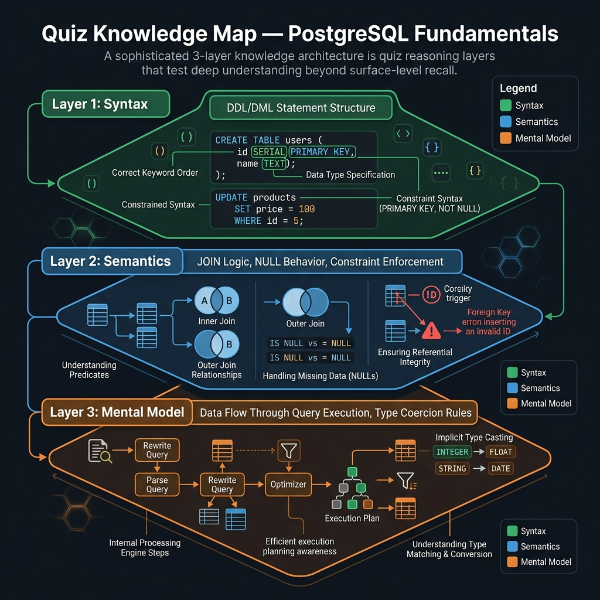

<!-- tags: sql, postgresql, quiz -->
# ✅ SQL Module Quiz — PostgreSQL Fundamentals

> Quiz nền cho `assets/sql/postgresql/fundamental`: kiểm tra mental model về data types, constraints, joins, grouping, JSONB, window functions và batch import.

| Aspect | Detail |
| --- | --- |
| **Level** | Basic → Intermediate |
| **Coverage** | types, DDL, joins, grouping, JSONB, windows, COPY |
| **Format** | 8 câu trắc nghiệm + đáp án giải thích ngắn |

📅 Ngày tạo: 2026-03-28 · 🔄 Cập nhật: 2026-04-04 · ⏱️ 8 phút đọc

---

## 1. DEFINE

Team mới onboard 3 backend engineers. Sprint 1: một engineer dùng `TEXT` cho boolean flag, một dùng `VARCHAR(1)` lưu 'Y'/'N', một dùng `BOOLEAN`. Code review thấy 3 conventions khác nhau cho cùng một concept. Merge xong, migration conflict.

Quiz này không kiểm tra bạn thuộc bao nhiêu data types. Nó kiểm tra bạn **có biết chọn đúng type cho đúng use case không** — DDL, constraints, transactions, joins — những nền tảng mà mọi query phức tạp hơn đều đứng trên.


| Variant | Mô tả |
| --- | --- |
| Knowledge Check | Kiểm tra recall về cú pháp, constraint, planner signal và execution semantics. |
| Reasoning Check | So sánh trade-off giữa nhiều lựa chọn SQL/PostgreSQL trước khi chốt đáp án. |
| Incident Check | Buộc người đọc chọn hành động an toàn nhất khi có lock, lag, bloat hoặc failover pressure. |

| Approach | Time | Space | Khi chọn |
| --- | --- | --- | --- |
| Structured artifact minh họa | Phụ thuộc cardinality | Phụ thuộc row width | Dùng để nắm baseline semantics trước khi tune planner hoặc index. |


---

Các failure mode trên nghe quen. Nhưng có trap: quiz tập trung syntax mà bỏ qua semantics = hiểu sai concept. Trap đó sẽ xuất hiện ở PITFALLS.

## 2. VISUAL

Với SQL Module Quiz — PostgreSQL Fundamentals, điều cần nhìn trước không phải đáp án mà là cấu trúc reasoning của câu hỏi. Chỉ khi thấy nó đang kiểm tra lớp mental model nào, bạn mới tránh được việc chọn theo phản xạ.



### Level 1

```text
Quiz Flow
---------
1. Đọc câu hỏi → xác định lớp vấn đề
2. Semantics hay planner hay incident?
3. Loại đáp án phá invariant trước
4. Chỉ chọn phương án an toàn nhất với production
```

*Hình: Level 1 cho ✅ SQL Module Quiz — PostgreSQL Fundamentals — nhìn vào happy path hoặc baseline heuristic trước khi đi sâu vào planner và trade-off.*

### Level 2

```text
Decision Lens                 Dấu hiệu cần nhìn                 Hướng xử lý
---------------------------  --------------------------------  -------------------------------------------
Semantics trước               Kết quả có đúng intent không?    1. Structured artifact minh họa
Planner / index signal        Cardinality, cost, buffers ra sao? 1. Structured artifact minh họa
Production pressure           Lock, WAL, lag, rollback nào đau? 1. Structured artifact minh họa
```

*Hình: Level 2 biến ✅ SQL Module Quiz — PostgreSQL Fundamentals thành checklist quyết định — từ semantics, sang plan signal, rồi đến áp lực production.*

---
## 3. CODE

Khi pattern reasoning của SQL Module Quiz — PostgreSQL Fundamentals đã rõ, ta chuyển sang câu hỏi, truy vấn và artifact cụ thể để tự kiểm chứng xem mình đang hiểu cơ chế hay chỉ nhớ từ khóa.

### Problem 1: Basic — Structured artifact minh họa

> **Mục tiêu**: Minh họa cách áp dụng **✅ SQL Module Quiz — PostgreSQL Fundamentals** qua ví dụ `Structured artifact minh họa` trong đúng ngữ cảnh schema, query hoặc vận hành.
> **Approach**: Đi từ case **Basic** dễ kiểm chứng nhất, rồi gắn nó với execution pattern, indexing hoặc operational workflow tương ứng.
> **Ví dụ**: Đầu vào là schema, query, workload hoặc bài toán DBA; đầu ra là snippet SQL hay artifact có thể copy để học, review hoặc benchmark.
> **Độ phức tạp**: Basic — ưu tiên correctness trước, sau đó mới mở rộng sang performance, locking hoặc maintainability.

```sql
-- fundamentals_quiz.sql — Join safely and aggregate with intent
SELECT
    c.customer_id,
    count(*) AS order_count,
    sum(o.total_amount) AS total_spent
FROM customers c
JOIN orders o ON o.customer_id = c.customer_id
WHERE o.status = 'paid'
GROUP BY c.customer_id;
```

**Tại sao?** Quiz không chỉ kiểm tra nhớ cú pháp. Nó buộc bạn map một tín hiệu thực tế vào đúng mental model: câu nào là vấn đề semantics, câu nào là planner/index, và câu nào là operational risk. Nếu không tách ba lớp này ra, bạn sẽ chọn đáp án theo cảm giác thay vì theo cơ chế.


---
Bạn đã đi qua PostgreSQL fundamentals quiz. Bây giờ đến phần nguy hiểm: syntax-only understanding — trap đã được setup từ đầu bài.

## 4. PITFALLS

SQL Module Quiz — PostgreSQL Fundamentals đáng giá vì nó chỉ ra đúng kiểu sai lầm sẽ lặp lại trong production nếu không sửa mental model. Phần dưới đây gom những mẫu suy nghĩ dễ trượt nhất.

| # | Severity | Lỗi | Hậu quả | Fix |
| --- | --- | --- | --- | --- |
| 1 | 🟡 Common | Đọc symptom nhưng không nhìn workload | Chọn sai fix, tốn thời gian benchmark lại | Khóa lại giả định cardinality, concurrency và cost trước khi sửa. |
| 2 | 🔴 Fatal | Tối ưu trên production mà không có rollback path | Có thể gây lock dài, lag replica hoặc mất cửa sổ khôi phục | Chuẩn bị `EXPLAIN`, lock budget và rollback plan trước khi chạy thay đổi. |
| 3 | 🔵 Minor | Ghi nhớ mẹo rời rạc thay vì mental model | Áp sai pattern khi bài toán đổi shape | Luôn map symptom → invariant → kỹ thuật tương ứng. |

---
Bạn đã đi qua Quiz Fundamentals và cạm bẫy. Các resources dưới đây giúp đi sâu hơn.

## 5. REF

| Resource | Loại | Link | Ghi chú |
| --- | --- | --- | --- |
| PostgreSQL Documentation | Official docs | https://www.postgresql.org/docs/current/index.html | Entry point để verify syntax, behavior và caveat. |
| PostgreSQL Tutorial | Official docs | https://www.postgresql.org/docs/current/tutorial.html | Nền tảng cho schema, query và transaction semantics. |

---

## 6. RECOMMEND

Khi đã nhìn ra mình hay sai ở đâu với SQL Module Quiz — PostgreSQL Fundamentals, bước tiếp theo là quay lại đúng module hoặc scenario liên quan để lấp khoảng trống đó.

| Mở rộng | Khi nào | Lý do | File/Link |
| --- | --- | --- | --- |
| Nếu còn yếu phần query nền, đọc lại [fundamental/README.md](../../postgresql/fundamental/README.md) | Khi cần mở rộng sau bài hiện tại | Giữ learning path liền mạch | Nội bộ module |
| Sau đó làm [Performance & Maintenance Quiz](./02-query-plans-performance-and-maintenance.md) | Khi cần mở rộng sau bài hiện tại | Giữ learning path liền mạch | Nội bộ module |

---

## 7. QUICK REF

| Nếu gặp | Nghĩ ngay |
| --- | --- |
| Câu hỏi về syntax/constraint | Kiểm invariant và schema-level guarantee trước. |
| Câu hỏi về plan/index | Kiểm selectivity, rows estimate, access path. |
| Câu hỏi incident | Chọn bước ít phá hệ thống nhất trước, rồi mới tối ưu sâu. |