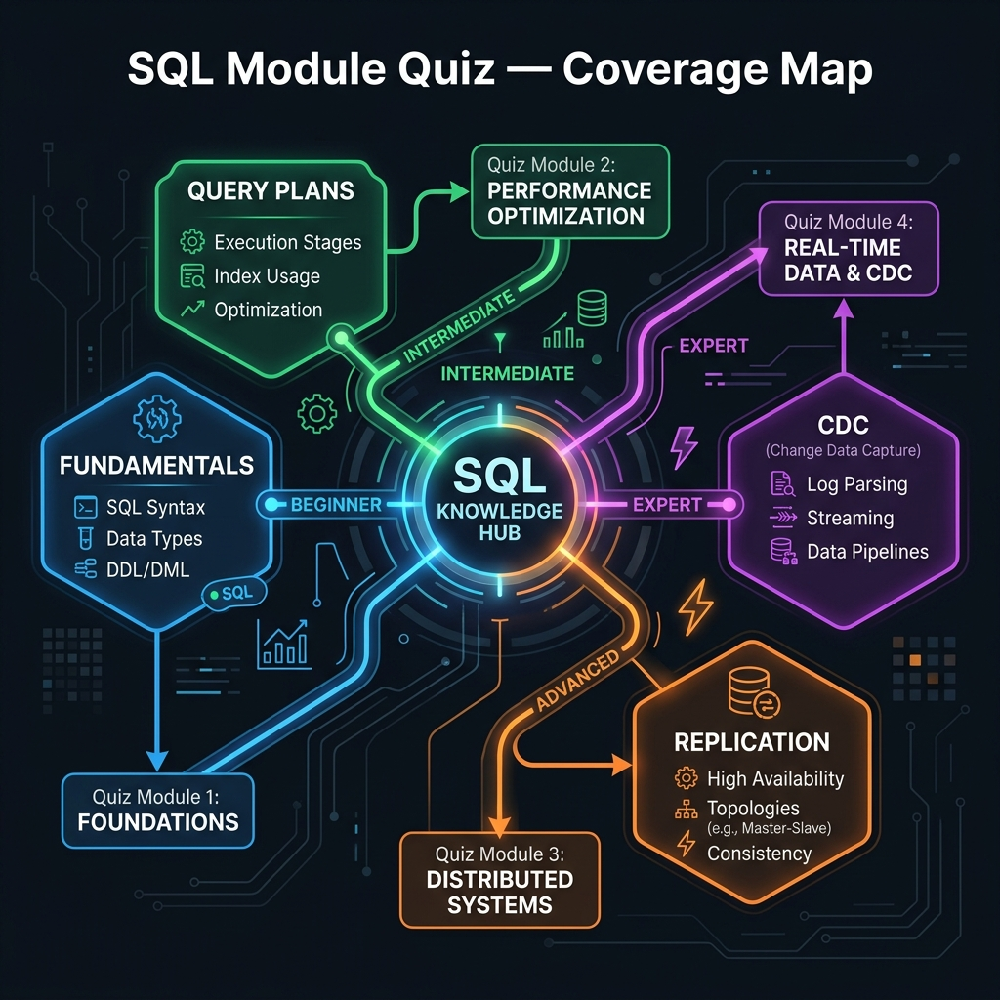

<!-- tags: sql, postgresql, quiz, overview -->
# 🧪 SQL Module Quizzes

> Module quizzes là checkpoint theo từng track kiến thức. Chúng không mô phỏng incident dài, mà kiểm tra xem bạn đã hiểu đủ semantics, planner signal và replication basics chưa.

| Aspect | Detail |
| --- | --- |
| **Concept** | Track-based quizzes |
| **Audience** | Learner vừa hoàn thành từng module |
| **Primary style** | Problem-Centric verification hub |
| **Entry point** | `01-postgresql-fundamentals.md` |

📅 Ngày tạo: 2026-03-28 · 🔄 Cập nhật: 2026-04-04 · ⏱️ 3 phút đọc

---

## 1. DEFINE

Module quiz = checkpoint sau mỗi track kiến thức. 4 bài cover:

1. **PostgreSQL Fundamentals** — types, DDL, constraints, joins
2. **Query Plans & Performance** — EXPLAIN, index strategy, VACUUM
3. **Replication & HA** — streaming, failover, quorum
4. **Logical Replication & CDC** — publication, slot, cutover

Mỗi quiz 8-10 câu, format trắc nghiệm + giải thích. Pass = bạn có mental model đủ vững để debug production.


| Variant | Mô tả |
| --- | --- |
| Fundamentals Quiz | Kiểm tra semantics nền: types, constraints, joins, grouping, JSONB, windows, COPY |
| Performance Quiz | Kiểm tra plan reading, indexes, locks, maintenance |
| Replication Quiz | Kiểm tra physical replication, lag, slots, failover, PITR |
| CDC Quiz | Kiểm tra logical replication, publication/subscription, schema drift |

| Approach | Time | Space | Khi chọn |
| --- | --- | --- | --- |
| Follow module order | Phụ thuộc số câu | O(1) | Dùng để verification ngay sau mỗi learning block. |
| Review weak area immediately | Phụ thuộc số lỗi | O(1) | Dùng để giữ feedback loop ngắn. |

Core insight:

> Module quiz đo mức “hiểu để làm việc” theo từng topic, trước khi bạn bị đặt vào incident dài và mơ hồ hơn của scenario quiz.

---

## 2. VISUAL

Với SQL Module Quizzes, điều cần nhìn trước không phải đáp án mà là cấu trúc reasoning của câu hỏi. Chỉ khi thấy nó đang kiểm tra lớp mental model nào, bạn mới tránh được việc chọn theo phản xạ.



### Level 1

```text
fundamentals quiz
      |
      v
performance quiz
      |
      v
replication quiz
      |
      v
CDC quiz
```

*Hình: Level 1 giữ module quiz đúng theo learning order của SQL/PostgreSQL tracks.*

### Level 2

```text
Track vừa học xong                 Module quiz
--------------------------------  ---------------------------------------------
postgresql/fundamental            01-postgresql-fundamentals.md
optimizer + performance           02-query-plans-performance-and-maintenance.md
replication basics                03-replication-and-ha.md
logical replication / CDC         04-logical-replication-and-cdc.md
```

*Hình: Level 2 map mỗi learning block sang quiz checkpoint tương ứng.*

---
## 3. CODE

Khi pattern reasoning của SQL Module Quizzes đã rõ, ta chuyển sang câu hỏi, truy vấn và artifact cụ thể để tự kiểm chứng xem mình đang hiểu cơ chế hay chỉ nhớ từ khóa.

### Problem 1: Basic — Chọn module quiz đúng thứ tự

> **Mục tiêu**: Không skip fundamentals khi đi kiểm tra kiến thức.
> **Approach**: Follow learning order của các tracks.
> **Ví dụ**: Đầu vào là track vừa học; đầu ra là quiz cần mở.
> **Độ phức tạp**: Basic — sequencing.

```text
If you just finished:
  - postgresql/fundamental -> module/01
  - optimizer/performance  -> module/02
  - replication basics     -> module/03
  - logical replication    -> module/04
```

**Tại sao?** Module quiz hiệu quả nhất khi chạy ngay sau track tương ứng. Nếu để quá xa, quiz chỉ đo trí nhớ rời rạc thay vì mental model vừa hình thành.

**Kết luận**: Module README nên được dùng như checkpoint scheduler, không phải catalog file đơn thuần.

### Problem 2: Intermediate — Map lỗi quiz sang module cần review

> **Mục tiêu**: Biết quay lại phần nào sau khi trả lời sai.
> **Approach**: Map symptom lỗi sang source module.
> **Ví dụ**: Đầu vào là loại câu sai; đầu ra là module cần đọc lại.
> **Độ phức tạp**: Intermediate — remediation path.

```sql
SELECT *
FROM (VALUES
  ('wrong answer about joins/grouping', '../../postgresql/fundamental/README.md'),
  ('cannot read plan/index signal', '../../optimizer/README.md'),
  ('wrong answer about lag/failover', '../../postgresql/replication/README.md'),
  ('wrong answer about publication/subscription', '../../postgresql/replication/02-logical-replication.md')
) AS feedback(symptom, revisit_target);
```

**Tại sao?** Giá trị của quiz không nằm ở điểm số mà ở remediation path. Nếu learner không biết nên đọc lại phần nào, quiz chỉ tạo frustration.

**Kết luận**: Module quiz nên luôn đi kèm đường quay lại đúng bài gốc.

### Problem 3: Advanced — Chuyển từ module quiz sang scenario quiz

> **Mục tiêu**: Biết khi nào đã đủ nền để vào incident-style reasoning.
> **Approach**: Dùng module quiz như gate trước scenario quiz.
> **Ví dụ**: Đầu vào là learner đã qua hết module quiz; đầu ra là bước tiếp theo.
> **Độ phức tạp**: Advanced — verification progression.

```text
Ready for scenario quiz when:
  - fundamentals answers are stable
  - performance answers use evidence, not guesswork
  - replication/CDC answers include lag, slots, failover, restore thinking
```

**Tại sao?** Scenario quiz không chỉ khó hơn; nó yêu cầu judgement dưới ambiguity. Nếu module quiz chưa vững, scenario quiz sẽ trở thành noise thay vì signal.

**Kết luận**: Module quiz là gate bắt buộc trước scenario quiz.

---
## 4. PITFALLS

SQL Module Quizzes đáng giá vì nó chỉ ra đúng kiểu sai lầm sẽ lặp lại trong production nếu không sửa mental model. Phần dưới đây gom những mẫu suy nghĩ dễ trượt nhất.

| # | Severity | Lỗi | Hậu quả | Fix |
| --- | --- | --- | --- | --- |
| 1 | 🟡 Common | Skip quiz 01 rồi làm quiz 02/03 | Lỗi reasoning bị che khuất bởi thiếu nền | Làm quiz theo đúng order. |
| 2 | 🟡 Common | Chấm đúng/sai mà không map lỗi | Không biết đọc lại phần nào | Luôn ghi symptom -> revisit target. |
| 3 | 🔵 Minor | Xem module quiz là optional | Learning loop thiếu checkpoint | Dùng quiz ngay sau mỗi track. |

---
## 5. REF

| Resource | Loại | Link | Ghi chú |
| --- | --- | --- | --- |
| SQL Quiz Hub | Internal doc | ../README.md | Hub tổng của toàn track quiz. |
| PostgreSQL Root Hub | Internal doc | ../../postgresql/README.md | Nơi quay lại learning tracks. |

---

## 6. RECOMMEND

Khi đã nhìn ra mình hay sai ở đâu với SQL Module Quizzes, bước tiếp theo là quay lại đúng module hoặc scenario liên quan để lấp khoảng trống đó.

| Mở rộng | Khi nào | Lý do | File/Link |
| --- | --- | --- | --- |
| Scenario Quizzes | Khi module quiz đã ổn | Chuyển sang incident-style judgement | [../scenario/README.md](../scenario/README.md) |
| SQL Root Quiz Hub | Khi cần route lại learning loop | Xem full verification path | [../README.md](../README.md) |

---

## 7. QUICK REF

| Module | Quiz |
| --- | --- |
| fundamentals | `01` |
| performance | `02` |
| replication | `03` |
| CDC | `04` |