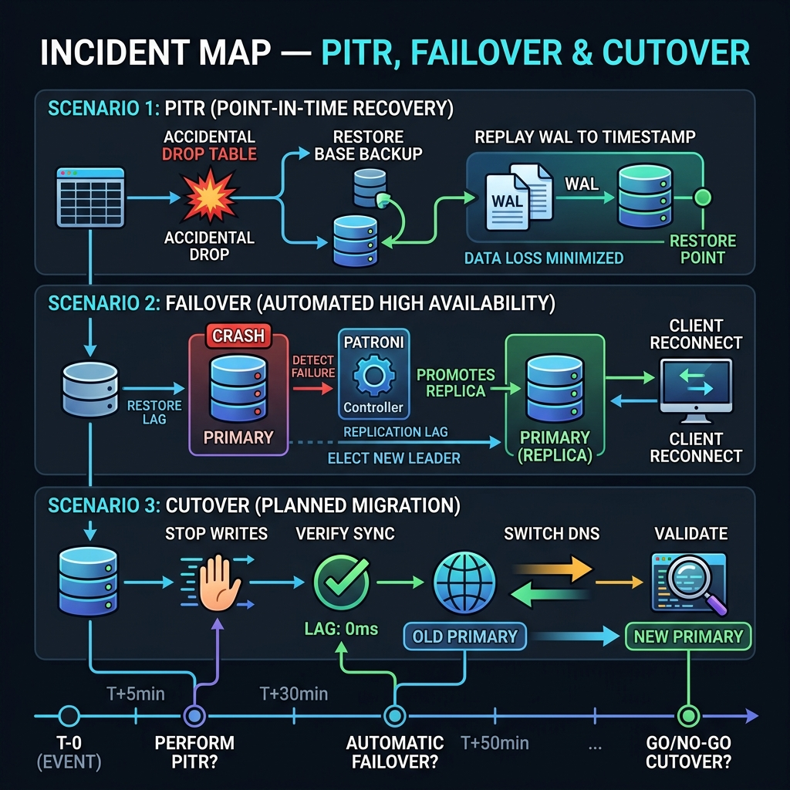

<!-- tags: sql, postgresql, quiz -->
# ✅ SQL Scenario Quiz — PITR, Failover & Cutover Incidents

> Bộ tình huống production cho PostgreSQL DBA: restore drills, failover under lag, logical replication cutover và các quyết định sai dễ gây downtime hoặc mất dữ liệu.

| Aspect | Detail |
| --- | --- |
| **Level** | Advanced → Expert |
| **Coverage** | PITR, failover, cutover, logical replication lag, stale routing |
| **Format** | 5 tình huống + đáp án phân tích |

📅 Ngày tạo: 2026-03-28 · 🔄 Cập nhật: 2026-04-04 · ⏱️ 10 phút đọc

---

## 1. DEFINE

Junior DBA chạy `DELETE FROM orders WHERE created_at < '2024-01-01'` — quên thêm `AND status = 'cancelled'`. 1.8 triệu orders production bị xóa. Team cần PITR. `pg_basebackup` mới nhất: 6 giờ trước. WAL archiver status: `last_archived_wal` = 4 giờ trước. 2 giờ WAL gap — data trong khoảng đó **mất vĩnh viễn**.

Scenario này mô phỏng áp lực PITR thật: bạn phải quyết định recovery target time, verify WAL continuity, và communicate RTO/RPO với stakeholders — tất cả trong khi business đang chảy máu.


| Variant | Mô tả |
| --- | --- |
| Knowledge Check | Kiểm tra recall về cú pháp, constraint, planner signal và execution semantics. |
| Reasoning Check | So sánh trade-off giữa nhiều lựa chọn SQL/PostgreSQL trước khi chốt đáp án. |
| Incident Check | Buộc người đọc chọn hành động an toàn nhất khi có lock, lag, bloat hoặc failover pressure. |

| Approach | Time | Space | Khi chọn |
| --- | --- | --- | --- |
| Structured artifact minh họa | Phụ thuộc cardinality | Phụ thuộc row width | Dùng để nắm baseline semantics trước khi tune planner hoặc index. |


---

Các failure mode trên nghe rõ. Nhưng có trap: PITR recovery thử lần đầu khi incident = high-stress mistakes. Trap đó sẽ xuất hiện ở PITFALLS.

## 2. VISUAL

Với SQL Scenario Quiz — PITR, Failover & Cutover Incidents, điều cần nhìn trước không phải đáp án mà là cấu trúc reasoning của câu hỏi. Chỉ khi thấy nó đang kiểm tra lớp mental model nào, bạn mới tránh được việc chọn theo phản xạ.



### Level 1

```text
Quiz Flow
---------
1. Đọc câu hỏi → xác định lớp vấn đề
2. Semantics hay planner hay incident?
3. Loại đáp án phá invariant trước
4. Chỉ chọn phương án an toàn nhất với production
```

*Hình: Level 1 cho ✅ SQL Scenario Quiz — PITR, Failover & Cutover Incidents — nhìn vào happy path hoặc baseline heuristic trước khi đi sâu vào planner và trade-off.*

### Level 2

```text
Decision Lens                 Dấu hiệu cần nhìn                 Hướng xử lý
---------------------------  --------------------------------  -------------------------------------------
Semantics trước               Kết quả có đúng intent không?    1. Structured artifact minh họa
Planner / index signal        Cardinality, cost, buffers ra sao? 1. Structured artifact minh họa
Production pressure           Lock, WAL, lag, rollback nào đau? 1. Structured artifact minh họa
```

*Hình: Level 2 biến ✅ SQL Scenario Quiz — PITR, Failover & Cutover Incidents thành checklist quyết định — từ semantics, sang plan signal, rồi đến áp lực production.*

---
## 3. CODE

Khi pattern reasoning của SQL Scenario Quiz — PITR, Failover & Cutover Incidents đã rõ, ta chuyển sang câu hỏi, truy vấn và artifact cụ thể để tự kiểm chứng xem mình đang hiểu cơ chế hay chỉ nhớ từ khóa.

### Problem 1: Basic — Structured artifact minh họa

> **Mục tiêu**: Minh họa cách áp dụng **✅ SQL Scenario Quiz — PITR, Failover & Cutover Incidents** qua ví dụ `Structured artifact minh họa` trong đúng ngữ cảnh schema, query hoặc vận hành.
> **Approach**: Đi từ case **Basic** dễ kiểm chứng nhất, rồi gắn nó với execution pattern, indexing hoặc operational workflow tương ứng.
> **Ví dụ**: Đầu vào là schema, query, workload hoặc bài toán DBA; đầu ra là snippet SQL hay artifact có thể copy để học, review hoặc benchmark.
> **Độ phức tạp**: Basic — ưu tiên correctness trước, sau đó mới mở rộng sang performance, locking hoặc maintainability.

```sql
-- pitr_failover_incidents.sql — Check replay state before failover or cutover
SELECT
    application_name,
    state,
    sync_state,
    write_lsn,
    flush_lsn,
    replay_lsn,
    pg_size_pretty(pg_wal_lsn_diff(pg_current_wal_lsn(), replay_lsn)) AS replay_gap
FROM pg_stat_replication;

SELECT
    slot_name,
    active,
    pg_size_pretty(pg_wal_lsn_diff(pg_current_wal_lsn(), restart_lsn)) AS retained_wal
FROM pg_replication_slots
ORDER BY pg_wal_lsn_diff(pg_current_wal_lsn(), restart_lsn) DESC;
```

**Tại sao?** Quiz không chỉ kiểm tra nhớ cú pháp. Nó buộc bạn map một tín hiệu thực tế vào đúng mental model: câu nào là vấn đề semantics, câu nào là planner/index, và câu nào là operational risk. Nếu không tách ba lớp này ra, bạn sẽ chọn đáp án theo cảm giác thay vì theo cơ chế.


---
Bạn đã đi qua PITR failover scenarios. Bây giờ đến phần nguy hiểm: untested recovery — trap đã được setup từ đầu bài.

## 4. PITFALLS

SQL Scenario Quiz — PITR, Failover & Cutover Incidents đáng giá vì nó chỉ ra đúng kiểu sai lầm sẽ lặp lại trong production nếu không sửa mental model. Phần dưới đây gom những mẫu suy nghĩ dễ trượt nhất.

| # | Severity | Lỗi | Hậu quả | Fix |
| --- | --- | --- | --- | --- |
| 1 | 🟡 Common | Đọc symptom nhưng không nhìn workload | Chọn sai fix, tốn thời gian benchmark lại | Khóa lại giả định cardinality, concurrency và cost trước khi sửa. |
| 2 | 🔴 Fatal | Tối ưu trên production mà không có rollback path | Có thể gây lock dài, lag replica hoặc mất cửa sổ khôi phục | Chuẩn bị `EXPLAIN`, lock budget và rollback plan trước khi chạy thay đổi. |
| 3 | 🔵 Minor | Ghi nhớ mẹo rời rạc thay vì mental model | Áp sai pattern khi bài toán đổi shape | Luôn map symptom → invariant → kỹ thuật tương ứng. |

---
Bạn đã đi qua Quiz PITR & Failover và cạm bẫy. Các resources dưới đây giúp đi sâu hơn.

## 5. REF

| Resource | Loại | Link | Ghi chú |
| --- | --- | --- | --- |
| PostgreSQL Documentation | Official docs | https://www.postgresql.org/docs/current/index.html | Entry point để verify syntax, behavior và caveat. |
| PostgreSQL Tutorial | Official docs | https://www.postgresql.org/docs/current/tutorial.html | Nền tảng cho schema, query và transaction semantics. |

---

## 6. RECOMMEND

Khi đã nhìn ra mình hay sai ở đâu với SQL Scenario Quiz — PITR, Failover & Cutover Incidents, bước tiếp theo là quay lại đúng module hoặc scenario liên quan để lấp khoảng trống đó.

| Mở rộng | Khi nào | Lý do | File/Link |
| --- | --- | --- | --- |
| Xem lại [Backup & PITR](../../postgresql/replication/05-backup-and-pitr.md) | Khi cần mở rộng sau bài hiện tại | Giữ learning path liền mạch | Nội bộ module |
| Xem lại [Patroni & HA Orchestration](../../postgresql/replication/03-patroni-ha-orchestration.md) | Khi cần mở rộng sau bài hiện tại | Giữ learning path liền mạch | Nội bộ module |
| Xem lại [Logical Replication](../../postgresql/replication/02-logical-replication.md) | Khi cần mở rộng sau bài hiện tại | Giữ learning path liền mạch | Nội bộ module |

---

## 7. QUICK REF

| Nếu gặp | Nghĩ ngay |
| --- | --- |
| Câu hỏi về syntax/constraint | Kiểm invariant và schema-level guarantee trước. |
| Câu hỏi về plan/index | Kiểm selectivity, rows estimate, access path. |
| Câu hỏi incident | Chọn bước ít phá hệ thống nhất trước, rồi mới tối ưu sâu. |