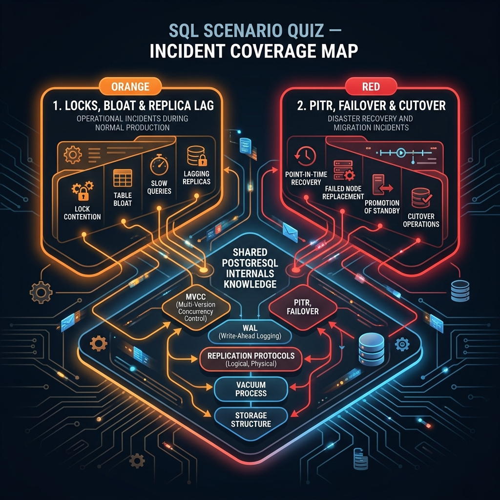

<!-- tags: sql, postgresql, quiz, overview -->
# 🚨 SQL Scenario Quizzes

> Đây là nơi learner bị ép trả lời như người trực production: symptom mơ hồ, thời gian ít, hành động sai có thể làm hệ thống nặng hơn. Scenario quiz đo judgement, không chỉ đo recall.

| Aspect | Detail |
| --- | --- |
| **Concept** | Incident-style SQL/PostgreSQL quizzes |
| **Audience** | Senior backend engineer, DBA, on-call engineer |
| **Primary style** | Problem-Centric incident verification |
| **Entry point** | `01-locks-bloat-replica-lag-incidents.md` |

📅 Ngày tạo: 2026-03-28 · 🔄 Cập nhật: 2026-04-04 · ⏱️ 3 phút đọc

---

## 1. DEFINE

Scenario quiz mô phỏng áp lực production thật: nhiều tín hiệu cùng lúc, thời gian ít, mỗi hành động sai đều có blast radius. 2 bài:

1. **Locks, Bloat & Replica Lag** — triage khi 3 symptoms xuất hiện đồng thời
2. **PITR, Failover & Cutover** — PITR under WAL gap, failover under lag, cutover rollback

Mục tiêu: luyện phán đoán theo evidence, không phải phản xạ.


| Variant | Mô tả |
| --- | --- |
| Locks / Bloat / Replica Lag | Tập trung vào contention, maintenance drift, WAL pressure, lag myths |
| PITR / Failover / Cutover | Tập trung vào restore, switchover, stale routing, async risk |

| Approach | Time | Space | Khi chọn |
| --- | --- | --- | --- |
| Scenario after module quizzes | Phụ thuộc incident length | O(1) | Dùng khi learner đã qua các quiz theo track và cần stress-test judgement. |
| Evidence-first answering | Phụ thuộc số signal | O(1) | Dùng để ép learner nói rõ symptom, evidence, first action, rollback. |

Core insight:

> Scenario quiz tốt không hỏi “bạn biết lệnh gì”. Nó hỏi **bạn sẽ làm gì trước**, **vì sao bước đó an toàn**, và **nếu sai thì rollback thế nào**.

---

## 2. VISUAL

Với SQL Scenario Quizzes, điều cần nhìn trước không phải đáp án mà là cấu trúc reasoning của câu hỏi. Chỉ khi thấy nó đang kiểm tra lớp mental model nào, bạn mới tránh được việc chọn theo phản xạ.



### Level 1

```text
Symptom appears
     |
     v
Classify incident
     |
     v
Gather evidence
     |
     v
Choose safest first action
     |
     v
Prepare rollback / next step
```

*Hình: Level 1 cho thấy scenario quiz đo full decision loop, không chỉ answer recall.*

### Level 2

```text
Scenario                           What it tests
---------------------------------  ----------------------------------------------
locks / bloat / lag                prioritization under mixed signals
PITR / failover / cutover          recovery thinking and blast-radius awareness
```

*Hình: Level 2 phân biệt rõ hai incident families của scenario track.*

---
## 3. CODE

Khi pattern reasoning của SQL Scenario Quizzes đã rõ, ta chuyển sang câu hỏi, truy vấn và artifact cụ thể để tự kiểm chứng xem mình đang hiểu cơ chế hay chỉ nhớ từ khóa.

### Problem 1: Basic — Chọn scenario quiz đúng concern

> **Mục tiêu**: Route đúng scenario trước khi luyện incident judgement.
> **Approach**: Map incident family sang file scenario phù hợp.
> **Ví dụ**: Đầu vào là concern hiện tại; đầu ra là scenario cần làm.
> **Độ phức tạp**: Basic — incident routing.

```text
If concern is:
  - locks, autovacuum drift, replica lag  -> scenario/01
  - restore, failover, cutover freshness  -> scenario/02
```

**Tại sao?** Hai scenario families dùng mental model khác nhau. Trộn chúng vào nhau làm learner khó biết mình đang fail ở contention reasoning hay ở recovery reasoning.

**Kết luận**: Scenario README phải route đúng family incident trước khi learner vào câu hỏi chi tiết.

### Problem 2: Intermediate — Chuẩn hóa format answer cho scenario

> **Mục tiêu**: Không trả lời incident quiz theo kiểu “đoán lệnh”.
> **Approach**: Ép mọi answer theo format symptom -> evidence -> first action -> rollback.
> **Ví dụ**: Đầu vào là một incident prompt; đầu ra là answer structure đúng.
> **Độ phức tạp**: Intermediate — reasoning discipline.

```text
Answer template:
  1. Symptom I believe is primary:
  2. Evidence I need first:
  3. Safest first action:
  4. Why not the more aggressive action:
  5. Rollback or next safe step:
```

**Tại sao?** Khi không có answer frame, learner dễ trả lời bằng lệnh mạnh nhất họ nhớ được. Scenario quiz tồn tại để phá thói quen đó và ép chọn hành động an toàn nhất trước.

**Kết luận**: Answer frame là phần bắt buộc của scenario training, không phải mẹo phụ.

### Problem 3: Advanced — Kết nối scenario quiz với production playbooks

> **Mục tiêu**: Không để scenario quiz tách rời docs vận hành.
> **Approach**: Cross-check answers với playbooks và replication docs liên quan.
> **Ví dụ**: Đầu vào là đáp án của learner; đầu ra là review path.
> **Độ phức tạp**: Advanced — rehearsal gần production.

```text
After answering scenario quiz:
  - compare with optimizer/10-production-dba-triage-playbook.md
  - compare with replication/05-backup-and-pitr.md
  - note where your first action was too aggressive or too vague
```

**Tại sao?** Scenario quiz chỉ có giá trị khi nó kéo người đọc quay lại playbook thật, nơi hành động được đặt trong bối cảnh rollback và blast radius. Nếu không có bước cross-check này, quiz chỉ là simulation rời rạc.

**Kết luận**: Scenario quiz phải đóng vai trò rehearsal layer phía trên docs production, không thể tách riêng.

---
## 4. PITFALLS

SQL Scenario Quizzes đáng giá vì nó chỉ ra đúng kiểu sai lầm sẽ lặp lại trong production nếu không sửa mental model. Phần dưới đây gom những mẫu suy nghĩ dễ trượt nhất.

| # | Severity | Lỗi | Hậu quả | Fix |
| --- | --- | --- | --- | --- |
| 1 | 🔴 Fatal | Trả lời bằng “fix mạnh nhất” ngay | Có thể gây incident nặng hơn trong thực tế | Luôn chọn safe first action trước. |
| 2 | 🟡 Common | Không nói rõ evidence cần xem | Quyết định dựa trên cảm giác | Dùng answer template symptom -> evidence -> action -> rollback. |
| 3 | 🟡 Common | Làm scenario quiz mà chưa qua module quiz | Khó biết đang thiếu nền hay thiếu judgement | Chỉ vào scenario sau module quizzes. |
| 4 | 🔵 Minor | Không cross-check với playbook thật | Quiz không chuyển thành operational habit | So answer với triage/PITR playbooks sau mỗi lần làm. |

---
## 5. REF

| Resource | Loại | Link | Ghi chú |
| --- | --- | --- | --- |
| SQL Quiz Hub | Internal doc | ../README.md | Hub tổng của quiz. |
| DBA Triage Playbook | Internal doc | ../../optimizer/10-production-dba-triage-playbook.md | Safe-first-action reference. |
| Backup & PITR | Internal doc | ../../postgresql/replication/05-backup-and-pitr.md | Recovery reference cho scenario 02. |

---

## 6. RECOMMEND

Khi đã nhìn ra mình hay sai ở đâu với SQL Scenario Quizzes, bước tiếp theo là quay lại đúng module hoặc scenario liên quan để lấp khoảng trống đó.

| Mở rộng | Khi nào | Lý do | File/Link |
| --- | --- | --- | --- |
| Module Quizzes | Khi còn thiếu baseline | Dùng để phân biệt lỗi nền và lỗi judgement | [../module/README.md](../module/README.md) |
| SQL Quiz Hub | Khi cần full learning loop | Route lại verification path | [../README.md](../README.md) |

---

## 7. QUICK REF

| Scenario | Chủ đề |
| --- | --- |
| `01` | Locks, bloat, lag, maintenance drift |
| `02` | PITR, failover, cutover, stale routing |