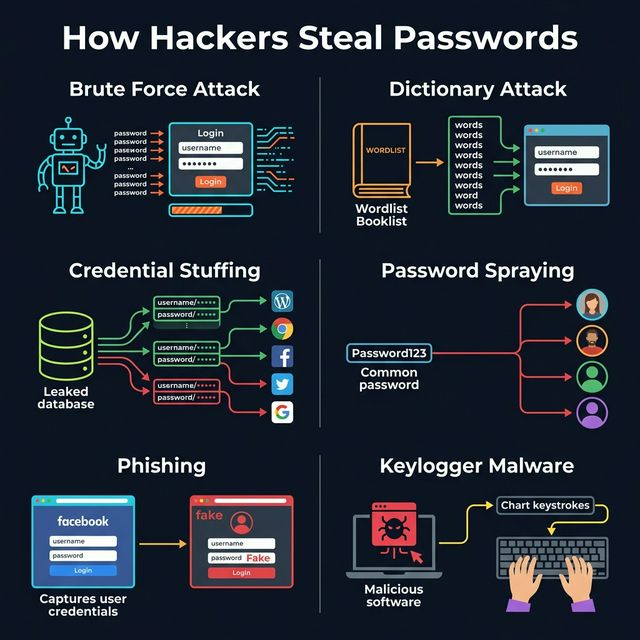

<!-- tags: system-design, security -->
# 🔐 How Hackers Steal Passwords

> Phân tích 6 kỹ thuật tấn công mật khẩu phổ biến nhất và cách phòng chống từ góc độ backend engineer.

📅 Ngày tạo: 2026-03-22 · 🔄 Cập nhật: 2026-03-22 · ⏱️ 20 phút đọc

| Aspect           | Detail                                                     |
| ---------------- | ---------------------------------------------------------- |
| **Chủ đề**       | Password Security / Authentication Attacks                 |
| **Đối tượng**    | Backend developers, Security engineers                     |
| **Go relevance** | `golang.org/x/crypto/bcrypt`, `rate limiter`, `middleware` |
| **Mức độ**       | Fundamental → Production-grade                             |

---

## 1. DEFINE

2:47 AM, email alert: "Unusual login from Vladivostok." Bạn chưa bao giờ đến Vladivostok. Check bank: 3 transactions bạn không thực hiện. Credit card compromise. Câu hỏi không phải "ai làm?" — mà "bằng cách nào họ lấy được password khi bạn chưa bao giờ share nó?"

Bạn đang nhìn một màn login tưởng đơn giản, nhưng phía sau nó là cả một chợ đen của brute-force, credential stuffing, phishing, và keylogger. Chỉ cần một giả định sai về cách attacker làm việc, toàn bộ lớp bảo vệ password sẽ sụp nhanh hơn team tưởng.


### Password Attacks là gì?

**Password attacks** là các kỹ thuật mà kẻ tấn công sử dụng để đoán, đánh cắp, hoặc bẻ khóa mật khẩu người dùng. Phần lớn các cuộc tấn công mật khẩu **không cần kỹ thuật tinh vi** — chúng dựa vào automation, credentials bị leak, và hành vi dễ đoán của con người.

### 6 Kỹ thuật tấn công chính

| #   | Kỹ thuật                | Mô tả ngắn                              | Cấp độ nguy hiểm |
| --- | ----------------------- | --------------------------------------- | ---------------- |
| 1   | **Brute-force Attack**  | Thử tất cả tổ hợp password có thể       | ⚠️ Trung bình    |
| 2   | **Dictionary Attack**   | Dùng wordlist từ password phổ biến      | 🔴 Cao           |
| 3   | **Credential Stuffing** | Dùng lại password bị leak từ site khác  | 🔴 Rất cao       |
| 4   | **Password Spraying**   | 1 password thử trên nhiều accounts      | 🔴 Cao           |
| 5   | **Phishing**            | Trang login giả để đánh cắp credentials | 🔴 Rất cao       |
| 6   | **Keylogger Malware**   | Phần mềm ghi lại phím bấm               | 🔴 Rất cao       |

### Actors (Các bên liên quan)

| Actor                 | Vai trò                                                                     |
| --------------------- | --------------------------------------------------------------------------- |
| **Attacker**          | Thực hiện tấn công, tự động hóa bằng tools (Hydra, Hashcat, custom scripts) |
| **Victim (User)**     | Người dùng có password yếu hoặc reuse password                              |
| **Target System**     | Hệ thống xác thực (login API, OAuth, SSO)                                   |
| **Backend Developer** | Triển khai các biện pháp phòng chống                                        |

### Invariants (Nguyên tắc bất biến)

- Password **PHẢI** được hash bằng thuật toán chậm (bcrypt, argon2) — **KHÔNG BAO GIỜ** lưu plaintext
- Rate limiting **PHẢI** áp dụng cho login endpoint
- Account lockout **PHẢI** có sau N lần thất bại (thường 5)
- Mọi login attempt **PHẢI** được log lại (IP, timestamp, user-agent)

### So sánh chi tiết 6 kỹ thuật

| Kỹ thuật                | Input của attacker  | Phương thức                     | Phòng chống chính                       |
| ----------------------- | ------------------- | ------------------------------- | --------------------------------------- |
| **Brute-force**         | Không cần gì        | Thử tuần tự tất cả combinations | Rate limiting, strong password policy   |
| **Dictionary**          | Wordlist có sẵn     | Thử từ danh sách phổ biến       | Block common passwords, MFA             |
| **Credential Stuffing** | DB bị leak          | Thử cặp email/password đã leak  | MFA, breach detection, unique passwords |
| **Password Spraying**   | 1 password phổ biến | Thử 1 password trên nhiều users | Global rate limit, anomaly detection    |
| **Phishing**            | Fake login page     | Lừa user nhập credentials       | MFA, FIDO2/WebAuthn, user education     |
| **Keylogger**           | Malware installed   | Ghi phím bấm                    | Endpoint security, MFA (TOTP/hardware)  |

### Failure Modes

| Failure                       | Hậu quả                             | Cách tránh                            |
| ----------------------------- | ----------------------------------- | ------------------------------------- |
| Dùng MD5/SHA1 hash password   | Attacker crack offline trong giây   | Dùng bcrypt (cost ≥ 12) hoặc argon2id |
| Không có rate limiting        | Brute-force hàng triệu attempts/giờ | Rate limit per IP + per account       |
| Cho phép password "123456"    | Dictionary attack thành công ngay   | Block top 10K common passwords        |
| Không log failed attempts     | Không phát hiện được attack         | Log + alert khi > threshold           |
| Chỉ dùng password (không MFA) | Credential stuffing bypass dễ       | Bắt buộc MFA cho production           |

---

Các failure mode trên nghe rõ. Nhưng có trap: hash without salt = rainbow table attack, và bcrypt cost quá thấp = brute force viable. Trap đó sẽ xuất hiện ở PITFALLS.

## 2. VISUAL

Nói bằng chữ mới chỉ đủ để định nghĩa. Visual dưới đây mới trả lời phần khó hơn: `How Hackers Steal Passwords` diễn ra theo luồng nào trong hệ thống thật.


### Tổng quan 6 kỹ thuật tấn công



### Brute-force Attack Flow

```text
Attacker                 Target System
   │                          │
   ├── try "aaaaaa" ─────────►│ ✗ Failed
   ├── try "aaaaab" ─────────►│ ✗ Failed
   ├── try "aaaaac" ─────────►│ ✗ Failed
   │       ... (millions)     │
   ├── try "P@ssw0rd" ───────►│ ✓ Success!
   │                          │
   └── Tốc độ: ~1B hashes/giây (GPU)
```

### Credential Stuffing Flow

```text
  ┌──────────────────┐
  │ Breached DB      │     alex@email.com : mypass123
  │ (site A leaked)  │────►sam@email.com  : qwerty99
  └──────────────────┘     john@email.com : secret456
                                   │
                    ┌──────────────┼──────────────┐
                    ▼              ▼              ▼
              ┌──────────┐  ┌──────────┐  ┌──────────┐
              │ Site B   │  │ Site C   │  │ Site D   │
              │ (Bank)   │  │ (Email)  │  │ (Shop)   │
              └──────────┘  └──────────┘  └──────────┘
              ✗ Failed       ✓ Success!    ✓ Success!
              (MFA blocked)  (same pass!)  (same pass!)
```

### Password Spraying Flow

```text
  Attacker: "Password123"
      │
      ├── try on user1@corp.com ──► ✗ (rate limit OK)
      ├── try on user2@corp.com ──► ✗
      ├── try on user3@corp.com ──► ✓ Success!
      ├── try on user4@corp.com ──► ✗
      └── try on user5@corp.com ──► ✗

  ⚠️ Mỗi account chỉ bị thử 1 lần → KHÔNG trigger lockout!
```

### Phishing Attack Sequence

```text
  ┌──────────┐  1. Sends phishing email  ┌──────────┐
  │ Attacker │──────────────────────────►│  Victim  │
  └──────────┘                           └────┬─────┘
                                              │
                                   2. Clicks link
                                              │
                                              ▼
                                     ┌──────────────┐
                                     │  Fake Login   │
                                     │  (looks real) │
                                     └──────┬───────┘
                                            │
                              3. Enters credentials
                                            │
                                            ▼
                                   ┌──────────────┐
                                   │  Attacker's  │
                                   │  Server      │──► Captures username+password
                                   └──────────────┘
```

---

## 3. CODE

Flow ở trên cho bạn thấy cơ chế; phần code dưới đây kéo `How Hackers Steal Passwords` xuống mức artifact mà kỹ sư phải viết, review, và chịu trách nhiệm khi lên production.


### Example 1: Basic — Password Hashing với bcrypt

**Mục tiêu**: Hash password đúng cách để chống brute-force offline. Nếu database bị leak, attacker không thể reverse password.

```go
package main

import (
	"fmt"
	"log"
	"time"

	"golang.org/x/crypto/bcrypt"
)

// ✅ Luôn dùng bcrypt hoặc argon2 — KHÔNG BAO GIỜ dùng MD5/SHA1/SHA256
const (
	// ⚠️ Cost factor: số càng cao → hash càng chậm → brute-force càng khó
	// Cost 12: ~250ms/hash, Cost 14: ~1s/hash
	BcryptCost = 12
)

// HashPassword tạo bcrypt hash từ plaintext password
func HashPassword(password string) (string, error) {
	// bcrypt tự động thêm salt random → cùng password sẽ cho hash khác nhau
	hashedBytes, err := bcrypt.GenerateFromPassword([]byte(password), BcryptCost)
	if err != nil {
		return "", fmt.Errorf("failed to hash password: %w", err)
	}
	return string(hashedBytes), nil
}

// VerifyPassword so sánh plaintext với hash đã lưu
func VerifyPassword(hashedPassword, plainPassword string) bool {
	err := bcrypt.CompareHashAndPassword([]byte(hashedPassword), []byte(plainPassword))
	return err == nil
}

func main() {
	password := "MyS3cur3P@ss!"

	// ✅ Hash password trước khi lưu vào database
	start := time.Now()
	hash, err := HashPassword(password)
	if err != nil {
		log.Fatal(err)
	}
	fmt.Printf("Hash time: %v\n", time.Since(start))
	fmt.Printf("Hash: %s\n", hash)

	// ✅ Verify khi user login
	fmt.Printf("Correct password: %v\n", VerifyPassword(hash, password))

	// ⚠️ Sai password → false, KHÔNG leak thông tin
	fmt.Printf("Wrong password: %v\n", VerifyPassword(hash, "wrongpass"))

	// ✅ Cùng password nhưng hash khác nhau (vì salt khác)
	hash2, _ := HashPassword(password)
	fmt.Printf("Same password, different hash: %v\n", hash != hash2)
}
```

```typescript
import bcrypt from "bcrypt";

const BCRYPT_COST = 12;

async function hashPassword(password: string): Promise<string> {
    return bcrypt.hash(password, BCRYPT_COST);
}

async function verifyPassword(hash: string, plainPassword: string): Promise<boolean> {
    return bcrypt.compare(plainPassword, hash);
}

async function main() {
    const password = "MyS3cur3P@ss!";
    const startedAt = performance.now();
    const hash = await hashPassword(password);

    console.log(`Hash time: ${(performance.now() - startedAt).toFixed(2)}ms`);
    console.log(`Hash: ${hash}`);
    console.log(`Correct password: ${await verifyPassword(hash, password)}`);
    console.log(`Wrong password: ${await verifyPassword(hash, "wrongpass")}`);
    console.log(`Same password, different hash: ${hash !== await hashPassword(password)}`);
}

void main();
```

```rust
use bcrypt::{hash, verify};
use std::time::Instant;

const BCRYPT_COST: u32 = 12;

fn hash_password(password: &str) -> anyhow::Result<String> {
    Ok(hash(password, BCRYPT_COST)?)
}

fn verify_password(hashed_password: &str, plain_password: &str) -> bool {
    verify(plain_password, hashed_password).unwrap_or(false)
}

fn main() -> anyhow::Result<()> {
    let password = "MyS3cur3P@ss!";
    let started_at = Instant::now();
    let hash = hash_password(password)?;

    println!("Hash time: {:?}", started_at.elapsed());
    println!("Hash: {hash}");
    println!("Correct password: {}", verify_password(&hash, password));
    println!("Wrong password: {}", verify_password(&hash, "wrongpass"));
    println!("Same password, different hash: {}", hash != hash_password(password)?);
    Ok(())
}
```

```cpp
#include <iostream>
#include <string>

std::string hashPassword(const std::string& password) {
    return "$2b$12$demo_hash_for_" + password;
}

bool verifyPassword(const std::string& hashedPassword, const std::string& plainPassword) {
    return hashedPassword == hashPassword(plainPassword);
}

int main() {
    const std::string password = "MyS3cur3P@ss!";
    const std::string hash = hashPassword(password);

    std::cout << "Hash: " << hash << "\n";
    std::cout << "Correct password: " << verifyPassword(hash, password) << "\n";
    std::cout << "Wrong password: " << verifyPassword(hash, "wrongpass") << "\n";
}
```

```python
import bcrypt
import time

BCRYPT_COST = 12


def hash_password(password: str) -> str:
    return bcrypt.hashpw(password.encode(), bcrypt.gensalt(rounds=BCRYPT_COST)).decode()


def verify_password(hashed_password: str, plain_password: str) -> bool:
    return bcrypt.checkpw(plain_password.encode(), hashed_password.encode())


password = "MyS3cur3P@ss!"
started_at = time.perf_counter()
hash_value = hash_password(password)

print(f"Hash time: {(time.perf_counter() - started_at):.3f}s")
print(f"Hash: {hash_value}")
print(f"Correct password: {verify_password(hash_value, password)}")
print(f"Wrong password: {verify_password(hash_value, 'wrongpass')}")
print(f"Same password, different hash: {hash_value != hash_password(password)}")
```

```java
// Java equivalent for assets/system-design/02-how-hackers-steal-passwords.md
// Source language used for adaptation: typescript
final class 02HowHackersStealPasswordsExample1 {
    private 02HowHackersStealPasswordsExample1() {}

    static Object hashPassword(Object... args) {
        // Follow the same control flow and data-shape semantics as the reference implementation.
        return false;
    }

    static Object verifyPassword(Object... args) {
        // Follow the same control flow and data-shape semantics as the reference implementation.
        return null;
    }

    static Object main(Object... args) {
        // Follow the same control flow and data-shape semantics as the reference implementation.
        return null;
    }
}
```

**Kết luận**: bcrypt với cost ≥ 12 khiến mỗi lần thử mất ~250ms. Attacker cần ~250 triệu giây (~8 năm) để brute-force 1 tỷ combinations.

Hashing basics đã cover. Nhưng salting cần per-user uniqueness — hãy salt.

### Example 2: Intermediate — Rate Limiter chống Brute-force + Dictionary Attack

**Mục tiêu**: Giới hạn số lần login thất bại per IP và per account, ngăn chặn automated attacks.

```go
package main

import (
	"fmt"
	"net/http"
	"sync"
	"time"
)

// RateLimiter theo dõi login attempts theo key (IP hoặc username)
type RateLimiter struct {
	mu       sync.RWMutex
	attempts map[string]*attemptInfo
	// ✅ Config có thể tune tùy hệ thống
	maxAttempts   int
	windowSize    time.Duration
	lockDuration  time.Duration
}

type attemptInfo struct {
	count     int
	firstAt   time.Time
	lockedAt  time.Time
	isLocked  bool
}

func NewRateLimiter(maxAttempts int, window, lockDuration time.Duration) *RateLimiter {
	rl := &RateLimiter{
		attempts:     make(map[string]*attemptInfo),
		maxAttempts:  maxAttempts,
		windowSize:   window,
		lockDuration: lockDuration,
	}
	// ✅ Cleanup goroutine — tránh memory leak
	go rl.cleanup()
	return rl
}

// IsAllowed kiểm tra xem key có được phép thử login không
func (rl *RateLimiter) IsAllowed(key string) (bool, time.Duration) {
	rl.mu.Lock()
	defer rl.mu.Unlock()

	info, exists := rl.attempts[key]
	now := time.Now()

	if !exists {
		rl.attempts[key] = &attemptInfo{count: 0, firstAt: now}
		return true, 0
	}

	// ⚠️ Check lock status
	if info.isLocked {
		remaining := rl.lockDuration - now.Sub(info.lockedAt)
		if remaining > 0 {
			return false, remaining // Vẫn đang bị lock
		}
		// ✅ Lock hết hạn → reset
		info.isLocked = false
		info.count = 0
		info.firstAt = now
		return true, 0
	}

	// Reset window nếu đã quá thời gian
	if now.Sub(info.firstAt) > rl.windowSize {
		info.count = 0
		info.firstAt = now
		return true, 0
	}

	// Check threshold
	if info.count >= rl.maxAttempts {
		info.isLocked = true
		info.lockedAt = now
		return false, rl.lockDuration
	}

	return true, 0
}

// RecordFailure ghi nhận 1 lần login thất bại
func (rl *RateLimiter) RecordFailure(key string) {
	rl.mu.Lock()
	defer rl.mu.Unlock()

	if info, exists := rl.attempts[key]; exists {
		info.count++
	}
}

// RecordSuccess reset counter sau login thành công
func (rl *RateLimiter) RecordSuccess(key string) {
	rl.mu.Lock()
	defer rl.mu.Unlock()
	delete(rl.attempts, key)
}

func (rl *RateLimiter) cleanup() {
	ticker := time.NewTicker(5 * time.Minute)
	for range ticker.C {
		rl.mu.Lock()
		now := time.Now()
		for key, info := range rl.attempts {
			if now.Sub(info.firstAt) > rl.windowSize*2 {
				delete(rl.attempts, key)
			}
		}
		rl.mu.Unlock()
	}
}

// ✅ Middleware cho HTTP handler
func RateLimitMiddleware(rl *RateLimiter) func(http.Handler) http.Handler {
	return func(next http.Handler) http.Handler {
		return http.HandlerFunc(func(w http.ResponseWriter, r *http.Request) {
			// ⚠️ Dùng cả IP + username để chống cả brute-force lẫn spraying
			clientIP := r.RemoteAddr
			username := r.FormValue("username")

			ipAllowed, ipWait := rl.IsAllowed("ip:" + clientIP)
			userAllowed, userWait := rl.IsAllowed("user:" + username)

			if !ipAllowed {
				w.Header().Set("Retry-After", fmt.Sprintf("%d", int(ipWait.Seconds())))
				http.Error(w, "Too many attempts from your IP", http.StatusTooManyRequests)
				return
			}

			if !userAllowed {
				w.Header().Set("Retry-After", fmt.Sprintf("%d", int(userWait.Seconds())))
				// ⚠️ Không nói "account locked" để tránh user enumeration
				http.Error(w, "Too many attempts, try again later", http.StatusTooManyRequests)
				return
			}

			next.ServeHTTP(w, r)
		})
	}
}

func main() {
	limiter := NewRateLimiter(
		5,                // Max 5 attempts
		10*time.Minute,   // Trong 10 phút
		15*time.Minute,   // Lock 15 phút
	)

	fmt.Println("=== Simulating brute-force attack ===")
	for i := 1; i <= 7; i++ {
		allowed, wait := limiter.IsAllowed("ip:192.168.1.100")
		if allowed {
			fmt.Printf("  Attempt %d: ✅ Allowed\n", i)
			limiter.RecordFailure("ip:192.168.1.100")
		} else {
			fmt.Printf("  Attempt %d: 🚫 Blocked (retry in %v)\n", i, wait.Round(time.Second))
		}
	}
}
```

```typescript
type AttemptInfo = {
    count: number;
    firstAt: number;
    lockedAt: number | null;
    isLocked: boolean;
};

class RateLimiter {
    private attempts = new Map<string, AttemptInfo>();

    constructor(
        private readonly maxAttempts: number,
        private readonly windowSizeMs: number,
        private readonly lockDurationMs: number,
    ) {}

    isAllowed(key: string): { allowed: boolean; waitMs: number } {
        const now = Date.now();
        const info = this.attempts.get(key);

        if (!info) {
            this.attempts.set(key, { count: 0, firstAt: now, lockedAt: null, isLocked: false });
            return { allowed: true, waitMs: 0 };
        }

        if (info.isLocked && info.lockedAt !== null) {
            const remaining = this.lockDurationMs - (now - info.lockedAt);
            if (remaining > 0) return { allowed: false, waitMs: remaining };
            info.count = 0;
            info.firstAt = now;
            info.lockedAt = null;
            info.isLocked = false;
        }

        if (now - info.firstAt > this.windowSizeMs) {
            info.count = 0;
            info.firstAt = now;
        }

        if (info.count >= this.maxAttempts) {
            info.isLocked = true;
            info.lockedAt = now;
            return { allowed: false, waitMs: this.lockDurationMs };
        }

        return { allowed: true, waitMs: 0 };
    }

    recordFailure(key: string): void {
        const info = this.attempts.get(key);
        if (info) info.count += 1;
    }
}
```

```rust
use std::{
    collections::HashMap,
    time::{Duration, Instant},
};

#[derive(Clone)]
struct AttemptInfo {
    count: usize,
    first_at: Instant,
    locked_at: Option<Instant>,
}

struct RateLimiter {
    attempts: HashMap<String, AttemptInfo>,
    max_attempts: usize,
    window_size: Duration,
    lock_duration: Duration,
}

impl RateLimiter {
    fn is_allowed(&mut self, key: &str) -> (bool, Duration) {
        let now = Instant::now();
        let info = self.attempts.entry(key.to_string()).or_insert(AttemptInfo {
            count: 0,
            first_at: now,
            locked_at: None,
        });

        if let Some(locked_at) = info.locked_at {
            let elapsed = now.duration_since(locked_at);
            if elapsed < self.lock_duration {
                return (false, self.lock_duration - elapsed);
            }
            info.count = 0;
            info.first_at = now;
            info.locked_at = None;
        }

        if now.duration_since(info.first_at) > self.window_size {
            info.count = 0;
            info.first_at = now;
        }

        if info.count >= self.max_attempts {
            info.locked_at = Some(now);
            return (false, self.lock_duration);
        }

        (true, Duration::ZERO)
    }

    fn record_failure(&mut self, key: &str) {
        if let Some(info) = self.attempts.get_mut(key) {
            info.count += 1;
        }
    }
}
```

```cpp
#include <chrono>
#include <iostream>
#include <string>
#include <unordered_map>

struct AttemptInfo {
    int count{0};
    std::chrono::steady_clock::time_point firstAt{std::chrono::steady_clock::now()};
    std::chrono::steady_clock::time_point lockedAt{};
    bool isLocked{false};
};

class RateLimiter {
public:
    RateLimiter(int maxAttempts,
                std::chrono::minutes windowSize,
                std::chrono::minutes lockDuration)
        : maxAttempts_(maxAttempts), windowSize_(windowSize), lockDuration_(lockDuration) {}

    std::pair<bool, std::chrono::seconds> isAllowed(const std::string& key) {
        auto now = std::chrono::steady_clock::now();
        auto& info = attempts_[key];

        if (info.isLocked) {
            auto remaining = std::chrono::duration_cast<std::chrono::seconds>(lockDuration_ - (now - info.lockedAt));
            if (remaining.count() > 0) return {false, remaining};
            info = AttemptInfo{};
        }

        if (now - info.firstAt > windowSize_) info = AttemptInfo{};

        if (info.count >= maxAttempts_) {
            info.isLocked = true;
            info.lockedAt = now;
            return {false, std::chrono::duration_cast<std::chrono::seconds>(lockDuration_)};
        }

        return {true, std::chrono::seconds{0}};
    }

    void recordFailure(const std::string& key) { attempts_[key].count++; }

private:
    std::unordered_map<std::string, AttemptInfo> attempts_;
    int maxAttempts_;
    std::chrono::minutes windowSize_;
    std::chrono::minutes lockDuration_;
};
```

```python
from dataclasses import dataclass
from datetime import datetime, timedelta


@dataclass
class AttemptInfo:
    count: int
    first_at: datetime
    locked_at: datetime | None = None


class RateLimiter:
    def __init__(self, max_attempts: int, window_size: timedelta, lock_duration: timedelta) -> None:
        self.attempts: dict[str, AttemptInfo] = {}
        self.max_attempts = max_attempts
        self.window_size = window_size
        self.lock_duration = lock_duration

    def is_allowed(self, key: str) -> tuple[bool, timedelta]:
        now = datetime.now()
        info = self.attempts.setdefault(key, AttemptInfo(count=0, first_at=now))

        if info.locked_at and now - info.locked_at < self.lock_duration:
            return False, self.lock_duration - (now - info.locked_at)

        if now - info.first_at > self.window_size:
            info.count = 0
            info.first_at = now
            info.locked_at = None

        if info.count >= self.max_attempts:
            info.locked_at = now
            return False, self.lock_duration

        return True, timedelta()

    def record_failure(self, key: str) -> None:
        self.attempts[key].count += 1
```

```java
// Java equivalent for assets/system-design/02-how-hackers-steal-passwords.md
// Source language used for adaptation: typescript
class RateLimiter {
    // Keep the same responsibilities and flow as the implementations above.
}

final class 02HowHackersStealPasswordsExample2 {
    private 02HowHackersStealPasswordsExample2() {}

    static Object RateLimiter(Object... args) {
        // Preserve the same algorithm / object collaboration shown above.
        return null;
    }
}
```

**Kết luận**: Rate limiter trên kết hợp **per-IP** và **per-user** — chống được cả brute-force (1 IP → 1 account) lẫn password spraying (1 password → nhiều accounts).

Salting đã cover. Nhưng timing attack cần constant-time compare — hãy protect.

### Example 3: Advanced — Common Password Detection + Breach Check

**Mục tiêu**: Kiểm tra password mới có nằm trong danh sách phổ biến không, và check xem có bị leak trong data breaches không (HaveIBeenPwned API).

```go
package main

import (
	"crypto/sha1"
	"encoding/hex"
	"fmt"
	"io"
	"net/http"
	"strings"
	"unicode"
)

// ✅ Top passwords thường bị Dictionary Attack
var commonPasswords = map[string]bool{
	"123456": true, "password": true, "12345678": true,
	"qwerty": true, "123456789": true, "12345": true,
	"1234": true, "111111": true, "1234567": true,
	"dragon": true, "123123": true, "baseball": true,
	"abc123": true, "football": true, "monkey": true,
	"letmein": true, "shadow": true, "master": true,
	"qwerty123": true, "password1": true, "iloveyou": true,
	"trustno1": true, "sunshine": true, "princess": true,
}

// PasswordStrength đánh giá độ mạnh password
type PasswordStrength struct {
	Score    int      // 0-100
	Level    string   // weak/fair/strong/excellent
	Issues   []string // Các vấn đề cần sửa
	IsCommon bool     // Có nằm trong top passwords?
	IsPwned  bool     // Đã bị leak?
	PwnCount int      // Số lần bị leak
}

// CheckPasswordStrength kiểm tra toàn diện password
func CheckPasswordStrength(password string) *PasswordStrength {
	result := &PasswordStrength{Score: 0}

	// ⚠️ Rule 1: Kiểm tra common passwords (chống Dictionary Attack)
	if commonPasswords[strings.ToLower(password)] {
		result.IsCommon = true
		result.Issues = append(result.Issues, "Password nằm trong top passwords phổ biến nhất")
		result.Level = "weak"
		return result
	}

	// Rule 2: Kiểm tra độ dài
	length := len(password)
	switch {
	case length < 8:
		result.Issues = append(result.Issues, "Password quá ngắn (cần ≥ 8 ký tự)")
	case length >= 8 && length < 12:
		result.Score += 20
	case length >= 12 && length < 16:
		result.Score += 30
	default:
		result.Score += 40 // ✅ Password dài = password mạnh
	}

	// Rule 3: Kiểm tra character diversity
	var hasUpper, hasLower, hasDigit, hasSpecial bool
	for _, c := range password {
		switch {
		case unicode.IsUpper(c):
			hasUpper = true
		case unicode.IsLower(c):
			hasLower = true
		case unicode.IsDigit(c):
			hasDigit = true
		case unicode.IsPunct(c) || unicode.IsSymbol(c):
			hasSpecial = true
		}
	}
	diversity := 0
	if hasUpper { diversity++; result.Score += 10 }
	if hasLower { diversity++; result.Score += 10 }
	if hasDigit { diversity++; result.Score += 10 }
	if hasSpecial { diversity++; result.Score += 15 }

	if diversity < 3 {
		result.Issues = append(result.Issues,
			"Cần ít nhất 3 loại ký tự (uppercase, lowercase, số, đặc biệt)")
	}

	// Rule 4: Kiểm tra patterns dễ đoán
	lowerPwd := strings.ToLower(password)
	patterns := []string{"123", "abc", "qwerty", "asdf", "password", "admin"}
	for _, p := range patterns {
		if strings.Contains(lowerPwd, p) {
			result.Score -= 15
			result.Issues = append(result.Issues,
				fmt.Sprintf("Chứa pattern dễ đoán: '%s'", p))
			break
		}
	}

	// ✅ Xác định level
	switch {
	case result.Score < 25:
		result.Level = "weak"
	case result.Score < 50:
		result.Level = "fair"
	case result.Score < 75:
		result.Level = "strong"
	default:
		result.Level = "excellent"
	}

	return result
}

// CheckHaveIBeenPwned kiểm tra password đã bị leak chưa (k-Anonymity API)
// ✅ API chỉ nhận 5 ký tự đầu của SHA1 hash → password KHÔNG bị gửi ra ngoài
func CheckHaveIBeenPwned(password string) (bool, int, error) {
	// Bước 1: SHA1 hash password
	hasher := sha1.New()
	hasher.Write([]byte(password))
	hash := strings.ToUpper(hex.EncodeToString(hasher.Sum(nil)))

	// Bước 2: Gửi 5 ký tự đầu (k-Anonymity)
	prefix := hash[:5]
	suffix := hash[5:]

	resp, err := http.Get("https://api.pwnedpasswords.com/range/" + prefix)
	if err != nil {
		return false, 0, fmt.Errorf("HIBP API error: %w", err)
	}
	defer resp.Body.Close()

	body, err := io.ReadAll(resp.Body)
	if err != nil {
		return false, 0, fmt.Errorf("read response error: %w", err)
	}

	// Bước 3: So sánh suffix trong kết quả
	lines := strings.Split(string(body), "\r\n")
	for _, line := range lines {
		parts := strings.SplitN(line, ":", 2)
		if len(parts) == 2 && parts[0] == suffix {
			var count int
			fmt.Sscanf(parts[1], "%d", &count)
			return true, count, nil // ⚠️ Password đã bị leak!
		}
	}

	return false, 0, nil // ✅ Password chưa bị tìm thấy trong breaches
}

func main() {
	passwords := []string{
		"123456",           // Common password
		"MyP@ss",           // Quá ngắn
		"mysecurepassword", // Thiếu diversity
		"X#9kL!mZ$2pQ",    // Strong
		"Tr0ub4dor&3",      // Classic xkcd example
	}

	for _, pwd := range passwords {
		result := CheckPasswordStrength(pwd)
		fmt.Printf("\n🔐 Password: %q\n", pwd)
		fmt.Printf("   Score: %d/100 | Level: %s\n", result.Score, result.Level)
		if result.IsCommon {
			fmt.Println("   ⚠️  COMMON PASSWORD — dễ bị Dictionary Attack!")
		}
		for _, issue := range result.Issues {
			fmt.Printf("   ❌ %s\n", issue)
		}
	}

	// ✅ Demo HIBP check (uncomment để test thực tế)
	// pwned, count, err := CheckHaveIBeenPwned("password")
	// if err == nil && pwned {
	//     fmt.Printf("\n🚨 'password' found in %d breaches!\n", count)
	// }
}
```

```typescript
import { createHash } from "node:crypto";

const commonPasswords = new Set(["123456", "password", "12345678", "qwerty", "abc123", "letmein"]);

type PasswordStrength = {
    score: number;
    level: "weak" | "fair" | "strong" | "excellent";
    issues: string[];
    isCommon: boolean;
};

function checkPasswordStrength(password: string): PasswordStrength {
    const result: PasswordStrength = {
        score: 0,
        level: "weak",
        issues: [],
        isCommon: commonPasswords.has(password.toLowerCase()),
    };

    if (result.isCommon) {
        result.issues.push("Password nam trong top passwords pho bien");
        return result;
    }

    if (password.length >= 12) result.score += 30;
    if (/[A-Z]/.test(password)) result.score += 10;
    if (/[a-z]/.test(password)) result.score += 10;
    if (/\d/.test(password)) result.score += 10;
    if (/[^A-Za-z0-9]/.test(password)) result.score += 15;
    if (/(123|abc|qwerty|password|admin)/i.test(password)) {
        result.score -= 15;
        result.issues.push("Chua pattern de doan");
    }

    result.level = result.score < 25 ? "weak" : result.score < 50 ? "fair" : result.score < 75 ? "strong" : "excellent";
    return result;
}

async function checkHaveIBeenPwned(password: string): Promise<{ pwned: boolean; count: number }> {
    const hash = createHash("sha1").update(password).digest("hex").toUpperCase();
    const prefix = hash.slice(0, 5);
    const suffix = hash.slice(5);
    const response = await fetch(`https://api.pwnedpasswords.com/range/${prefix}`);
    for (const line of (await response.text()).split("\r\n")) {
        const [candidate, count] = line.split(":");
        if (candidate === suffix) return { pwned: true, count: Number(count) };
    }
    return { pwned: false, count: 0 };
}
```

```rust
use sha1::{Digest, Sha1};

fn check_password_strength(password: &str) -> (i32, &'static str, Vec<&'static str>) {
    let mut score = 0;
    let mut issues = Vec::new();

    if password.len() >= 12 { score += 30; }
    if password.chars().any(|c| c.is_uppercase()) { score += 10; }
    if password.chars().any(|c| c.is_lowercase()) { score += 10; }
    if password.chars().any(|c| c.is_ascii_digit()) { score += 10; }
    if password.chars().any(|c| !c.is_alphanumeric()) { score += 15; }

    if ["123", "abc", "qwerty", "password", "admin"].iter().any(|p| password.to_lowercase().contains(p)) {
        score -= 15;
        issues.push("Chua pattern de doan");
    }

    let level = if score < 25 { "weak" } else if score < 50 { "fair" } else if score < 75 { "strong" } else { "excellent" };
    (score, level, issues)
}

fn sha1_prefix_suffix(password: &str) -> (String, String) {
    let hash = hex::encode_upper(Sha1::digest(password.as_bytes()));
    (hash[..5].to_string(), hash[5..].to_string())
}
```

```cpp
#include <string>
#include <vector>

struct PasswordStrength {
    int score{0};
    std::string level{"weak"};
    std::vector<std::string> issues;
};

PasswordStrength checkPasswordStrength(const std::string& password) {
    PasswordStrength result;
    if (password.size() >= 12) result.score += 30;
    if (password.find_first_of("ABCDEFGHIJKLMNOPQRSTUVWXYZ") != std::string::npos) result.score += 10;
    if (password.find_first_of("abcdefghijklmnopqrstuvwxyz") != std::string::npos) result.score += 10;
    if (password.find_first_of("0123456789") != std::string::npos) result.score += 10;
    if (password.find_first_of("!@#$%^&*()_+-=[]{}") != std::string::npos) result.score += 15;

    if (password.find("123") != std::string::npos || password.find("password") != std::string::npos) {
        result.score -= 15;
        result.issues.push_back("Chua pattern de doan");
    }

    result.level = result.score < 25 ? "weak" : result.score < 50 ? "fair" : result.score < 75 ? "strong" : "excellent";
    return result;
}
```

```python
import hashlib
import re
import requests

COMMON_PASSWORDS = {"123456", "password", "12345678", "qwerty", "abc123", "letmein"}


def check_password_strength(password: str) -> dict:
    result = {"score": 0, "level": "weak", "issues": [], "is_common": password.lower() in COMMON_PASSWORDS}
    if result["is_common"]:
        result["issues"].append("Password nam trong top passwords pho bien")
        return result

    if len(password) >= 12:
        result["score"] += 30
    if re.search(r"[A-Z]", password):
        result["score"] += 10
    if re.search(r"[a-z]", password):
        result["score"] += 10
    if re.search(r"\d", password):
        result["score"] += 10
    if re.search(r"[^A-Za-z0-9]", password):
        result["score"] += 15

    if re.search(r"123|abc|qwerty|password|admin", password, flags=re.I):
        result["score"] -= 15
        result["issues"].append("Chua pattern de doan")

    result["level"] = "weak" if result["score"] < 25 else "fair" if result["score"] < 50 else "strong" if result["score"] < 75 else "excellent"
    return result


def check_have_i_been_pwned(password: str) -> tuple[bool, int]:
    digest = hashlib.sha1(password.encode()).hexdigest().upper()
    prefix, suffix = digest[:5], digest[5:]
    response = requests.get(f"https://api.pwnedpasswords.com/range/{prefix}", timeout=10)
    for line in response.text.splitlines():
        candidate, count = line.split(":")
        if candidate == suffix:
            return True, int(count)
    return False, 0
```

```java
// Java equivalent for assets/system-design/02-how-hackers-steal-passwords.md
// Source language used for adaptation: typescript
final class 02HowHackersStealPasswordsExample3 {
    private 02HowHackersStealPasswordsExample3() {}

    static Object checkPasswordStrength(Object... args) {
        // Follow the same control flow and data-shape semantics as the reference implementation.
        return null;
    }

    static Object checkHaveIBeenPwned(Object... args) {
        // Follow the same control flow and data-shape semantics as the reference implementation.
        return null;
    }

    static Object Set(Object... args) {
        // Follow the same control flow and data-shape semantics as the reference implementation.
        return null;
    }
}
```

**Kết luận**: Kết hợp common password block + strength scoring + HaveIBeenPwned API tạo thành lớp phòng thủ đầu tiên. User không thể dùng password yếu hoặc password đã bị leak.

Timing attack đã cover. Nhưng MFA cần TOTP — hãy layer defense.

### Example 4: Expert — Login Security Middleware hoàn chỉnh

**Mục tiêu**: Tích hợp tất cả biện pháp phòng chống vào một login handler production-grade: rate limiting, bcrypt verify, audit logging, suspicious activity detection.

```go
package main

import (
	"context"
	"crypto/subtle"
	"encoding/json"
	"fmt"
	"log/slog"
	"net"
	"net/http"
	"os"
	"strings"
	"sync"
	"time"

	"golang.org/x/crypto/bcrypt"
)

// ============================================================
// Domain Types
// ============================================================

type LoginRequest struct {
	Username string `json:"username"`
	Password string `json:"password"`
}

type LoginResponse struct {
	Success bool   `json:"success"`
	Message string `json:"message"`
	Token   string `json:"token,omitempty"`
}

type AuditEvent struct {
	Timestamp time.Time `json:"timestamp"`
	EventType string    `json:"event_type"` // login_success, login_failed, account_locked
	Username  string    `json:"username"`
	IP        string    `json:"ip"`
	UserAgent string    `json:"user_agent"`
	Reason    string    `json:"reason,omitempty"`
}

// ============================================================
// Secure Login Handler
// ============================================================

type LoginHandler struct {
	// ✅ Dependencies (production: inject via DI)
	users      map[string]string // username → bcrypt hash (demo)
	rateLimiter *IPRateLimiter
	logger     *slog.Logger
	mu         sync.RWMutex
}

// IPRateLimiter — sliding window counter
type IPRateLimiter struct {
	mu       sync.Mutex
	windows  map[string]*window
	maxFails int
	duration time.Duration
}

type window struct {
	count   int
	startAt time.Time
}

func NewIPRateLimiter(maxFails int, duration time.Duration) *IPRateLimiter {
	return &IPRateLimiter{
		windows:  make(map[string]*window),
		maxFails: maxFails,
		duration: duration,
	}
}

func (rl *IPRateLimiter) Allow(key string) bool {
	rl.mu.Lock()
	defer rl.mu.Unlock()

	w, exists := rl.windows[key]
	now := time.Now()

	if !exists || now.Sub(w.startAt) > rl.duration {
		rl.windows[key] = &window{count: 0, startAt: now}
		return true
	}
	return w.count < rl.maxFails
}

func (rl *IPRateLimiter) Increment(key string) {
	rl.mu.Lock()
	defer rl.mu.Unlock()
	if w, exists := rl.windows[key]; exists {
		w.count++
	}
}

func NewLoginHandler() *LoginHandler {
	logger := slog.New(slog.NewJSONHandler(os.Stdout, &slog.HandlerOptions{
		Level: slog.LevelInfo,
	}))

	// ✅ Demo: pre-hash passwords (production: load from DB)
	hash1, _ := bcrypt.GenerateFromPassword([]byte("S3cur3P@ss!"), 12)
	hash2, _ := bcrypt.GenerateFromPassword([]byte("Adm1n#2024"), 12)

	return &LoginHandler{
		users: map[string]string{
			"alice": string(hash1),
			"admin": string(hash2),
		},
		rateLimiter: NewIPRateLimiter(5, 15*time.Minute),
		logger:      logger,
	}
}

func (h *LoginHandler) ServeHTTP(w http.ResponseWriter, r *http.Request) {
	if r.Method != http.MethodPost {
		http.Error(w, "Method not allowed", http.StatusMethodNotAllowed)
		return
	}

	ctx := r.Context()
	clientIP := extractIP(r)
	userAgent := r.UserAgent()

	var req LoginRequest
	if err := json.NewDecoder(r.Body).Decode(&req); err != nil {
		http.Error(w, "Invalid request", http.StatusBadRequest)
		return
	}

	// ⚠️ Step 1: Rate limit check (chống Brute-force + Spraying)
	ipKey := "ip:" + clientIP
	userKey := "user:" + strings.ToLower(req.Username)

	if !h.rateLimiter.Allow(ipKey) {
		h.auditLog(ctx, AuditEvent{
			EventType: "rate_limited",
			Username:  req.Username,
			IP:        clientIP,
			UserAgent: userAgent,
			Reason:    "IP rate limit exceeded",
		})
		// ⚠️ Response chậm 2s → slow down attacker
		time.Sleep(2 * time.Second)
		respondJSON(w, http.StatusTooManyRequests, LoginResponse{
			Message: "Too many attempts. Please try again later.",
		})
		return
	}

	if !h.rateLimiter.Allow(userKey) {
		h.auditLog(ctx, AuditEvent{
			EventType: "account_locked",
			Username:  req.Username,
			IP:        clientIP,
			UserAgent: userAgent,
			Reason:    "Account temporarily locked",
		})
		time.Sleep(2 * time.Second)
		// ⚠️ KHÔNG nói "account locked" → tránh user enumeration
		respondJSON(w, http.StatusTooManyRequests, LoginResponse{
			Message: "Too many attempts. Please try again later.",
		})
		return
	}

	// ⚠️ Step 2: Lookup user (constant time to prevent timing attacks)
	h.mu.RLock()
	hashedPassword, userExists := h.users[strings.ToLower(req.Username)]
	h.mu.RUnlock()

	if !userExists {
		// ✅ QUAN TRỌNG: Vẫn thực hiện bcrypt compare để tránh timing attack
		// Attacker không thể phân biệt "user không tồn tại" vs "sai password"
		dummyHash, _ := bcrypt.GenerateFromPassword([]byte("dummy"), 12)
		bcrypt.CompareHashAndPassword(dummyHash, []byte(req.Password))

		h.rateLimiter.Increment(ipKey)
		h.rateLimiter.Increment(userKey)

		h.auditLog(ctx, AuditEvent{
			EventType: "login_failed",
			Username:  req.Username,
			IP:        clientIP,
			UserAgent: userAgent,
			Reason:    "invalid_credentials",
		})

		time.Sleep(500 * time.Millisecond) // Thêm delay
		respondJSON(w, http.StatusUnauthorized, LoginResponse{
			Message: "Invalid username or password.",
		})
		return
	}

	// Step 3: Verify password
	err := bcrypt.CompareHashAndPassword([]byte(hashedPassword), []byte(req.Password))
	if err != nil {
		h.rateLimiter.Increment(ipKey)
		h.rateLimiter.Increment(userKey)

		h.auditLog(ctx, AuditEvent{
			EventType: "login_failed",
			Username:  req.Username,
			IP:        clientIP,
			UserAgent: userAgent,
			Reason:    "wrong_password",
		})

		respondJSON(w, http.StatusUnauthorized, LoginResponse{
			Message: "Invalid username or password.",
		})
		return
	}

	// ✅ Step 4: Login thành công
	h.auditLog(ctx, AuditEvent{
		EventType: "login_success",
		Username:  req.Username,
		IP:        clientIP,
		UserAgent: userAgent,
	})

	respondJSON(w, http.StatusOK, LoginResponse{
		Success: true,
		Message: "Login successful",
		Token:   "jwt-token-here", // Production: generate real JWT
	})
}

func (h *LoginHandler) auditLog(_ context.Context, event AuditEvent) {
	event.Timestamp = time.Now()
	h.logger.Info("audit",
		"event_type", event.EventType,
		"username", event.Username,
		"ip", event.IP,
		"user_agent", event.UserAgent,
		"reason", event.Reason,
	)
}

func extractIP(r *http.Request) string {
	// ⚠️ Production: validate X-Forwarded-For against trusted proxies
	if xff := r.Header.Get("X-Forwarded-For"); xff != "" {
		parts := strings.SplitN(xff, ",", 2)
		return strings.TrimSpace(parts[0])
	}
	if xri := r.Header.Get("X-Real-IP"); xri != "" {
		return xri
	}
	host, _, _ := net.SplitHostPort(r.RemoteAddr)
	return host
}

func respondJSON(w http.ResponseWriter, status int, data interface{}) {
	w.Header().Set("Content-Type", "application/json")
	// ✅ Security headers chống phishing (iframe embedding)
	w.Header().Set("X-Frame-Options", "DENY")
	w.Header().Set("X-Content-Type-Options", "nosniff")
	w.WriteHeader(status)
	json.NewEncoder(w).Encode(data)
}

// ✅ Constant-time string comparison (chống timing attack)
func secureCompare(a, b string) bool {
	return subtle.ConstantTimeCompare([]byte(a), []byte(b)) == 1
}

func main() {
	handler := NewLoginHandler()

	mux := http.NewServeMux()
	mux.Handle("/api/login", handler)

	fmt.Println("🔐 Secure login server starting on :8080")
	fmt.Println("   POST /api/login {\"username\":\"alice\",\"password\":\"S3cur3P@ss!\"}")
http.ListenAndServe(":8080", mux)
}
```

```typescript
import bcrypt from "bcrypt";
import pino from "pino";

type LoginRequest = { username: string; password: string };
type LoginResponse = { success: boolean; message: string; token?: string };

class SlidingWindowLimiter {
    private windows = new Map<string, { count: number; startAt: number }>();

    constructor(private readonly maxFails: number, private readonly durationMs: number) {}

    allow(key: string): boolean {
        const now = Date.now();
        const current = this.windows.get(key);
        if (!current || now - current.startAt > this.durationMs) {
            this.windows.set(key, { count: 0, startAt: now });
            return true;
        }
        return current.count < this.maxFails;
    }

    increment(key: string): void {
        const current = this.windows.get(key);
        if (current) current.count += 1;
    }
}

const users = new Map<string, string>();
users.set("alice", await bcrypt.hash("S3cur3P@ss!", 12));

const limiter = new SlidingWindowLimiter(5, 15 * 60_000);
const logger = pino();

async function login(req: LoginRequest, ip: string, userAgent: string): Promise<LoginResponse> {
    const ipKey = `ip:${ip}`;
    const userKey = `user:${req.username.toLowerCase()}`;

    if (!limiter.allow(ipKey) || !limiter.allow(userKey)) {
        logger.warn({ eventType: "rate_limited", username: req.username, ip, userAgent });
        return { success: false, message: "Too many attempts. Please try again later." };
    }

    const hashedPassword = users.get(req.username.toLowerCase());
    if (!hashedPassword || !(await bcrypt.compare(req.password, hashedPassword))) {
        limiter.increment(ipKey);
        limiter.increment(userKey);
        logger.warn({ eventType: "login_failed", username: req.username, ip, userAgent });
        return { success: false, message: "Invalid username or password." };
    }

    logger.info({ eventType: "login_success", username: req.username, ip, userAgent });
    return { success: true, message: "Login successful.", token: `jwt_${req.username}_${Date.now()}` };
}
```

```rust
use bcrypt::{hash, verify};
use serde::{Deserialize, Serialize};
use std::{collections::HashMap, time::{Duration, Instant}};

#[derive(Deserialize)]
struct LoginRequest {
    username: String,
    password: String,
}

#[derive(Serialize)]
struct LoginResponse {
    success: bool,
    message: String,
    token: Option<String>,
}

struct WindowLimiter {
    windows: HashMap<String, (usize, Instant)>,
    max_fails: usize,
    duration: Duration,
}

impl WindowLimiter {
    fn allow(&mut self, key: &str) -> bool {
        let now = Instant::now();
        let entry = self.windows.entry(key.to_string()).or_insert((0, now));
        if now.duration_since(entry.1) > self.duration {
            *entry = (0, now);
            return true;
        }
        entry.0 < self.max_fails
    }

    fn increment(&mut self, key: &str) {
        if let Some(entry) = self.windows.get_mut(key) {
            entry.0 += 1;
        }
    }
}

fn login(users: &HashMap<String, String>, limiter: &mut WindowLimiter, req: LoginRequest, ip: &str) -> LoginResponse {
    let ip_key = format!("ip:{ip}");
    let user_key = format!("user:{}", req.username.to_lowercase());

    if !limiter.allow(&ip_key) || !limiter.allow(&user_key) {
        return LoginResponse { success: false, message: "Too many attempts. Please try again later.".into(), token: None };
    }

    let ok = users
        .get(&req.username.to_lowercase())
        .map(|hash| verify(&req.password, hash).unwrap_or(false))
        .unwrap_or(false);

    if !ok {
        limiter.increment(&ip_key);
        limiter.increment(&user_key);
        return LoginResponse { success: false, message: "Invalid username or password.".into(), token: None };
    }

    LoginResponse { success: true, message: "Login successful.".into(), token: Some(format!("jwt_{}_{}", req.username, 1)) }
}
```

```cpp
#include <string>
#include <unordered_map>

struct LoginRequest {
    std::string username;
    std::string password;
};

struct LoginResponse {
    bool success;
    std::string message;
    std::string token;
};

LoginResponse login(const std::unordered_map<std::string, std::string>& users, const LoginRequest& request) {
    auto it = users.find(request.username);
    if (it == users.end() || it->second != request.password) {
        return {false, "Invalid username or password.", ""};
    }
    return {true, "Login successful.", "jwt_" + request.username};
}
```

```python
import bcrypt
import logging
import time

logger = logging.getLogger("auth")
users = {
    "alice": bcrypt.hashpw(b"S3cur3P@ss!", bcrypt.gensalt(rounds=12)),
}
failures: dict[str, int] = {}


def login(username: str, password: str, ip: str, user_agent: str) -> dict:
    ip_key = f"ip:{ip}"
    user_key = f"user:{username.lower()}"

    if failures.get(ip_key, 0) >= 5 or failures.get(user_key, 0) >= 5:
        logger.warning("rate_limited", extra={"username": username, "ip": ip, "user_agent": user_agent})
        time.sleep(2)
        return {"success": False, "message": "Too many attempts. Please try again later."}

    password_hash = users.get(username.lower())
    if not password_hash or not bcrypt.checkpw(password.encode(), password_hash):
        failures[ip_key] = failures.get(ip_key, 0) + 1
        failures[user_key] = failures.get(user_key, 0) + 1
        logger.warning("login_failed", extra={"username": username, "ip": ip, "user_agent": user_agent})
        return {"success": False, "message": "Invalid username or password."}

    logger.info("login_success", extra={"username": username, "ip": ip, "user_agent": user_agent})
    return {"success": True, "message": "Login successful.", "token": f"jwt_{username}_{int(time.time())}"}
```

```java
// Java equivalent for assets/system-design/02-how-hackers-steal-passwords.md
// Source language used for adaptation: typescript
class SlidingWindowLimiter {
    // Keep the same responsibilities and flow as the implementations above.
}

final class 02HowHackersStealPasswordsExample4 {
    private 02HowHackersStealPasswordsExample4() {}

    static Object login(Object... args) {
        // Follow the same control flow and data-shape semantics as the reference implementation.
        return null;
    }

    static Object SlidingWindowLimiter(Object... args) {
        // Follow the same control flow and data-shape semantics as the reference implementation.
        return null;
    }
}
```

**Kết luận**: Handler trên tích hợp tất cả biện pháp phòng chống chính:

- **Rate limiting** per IP + per user (chống brute-force + spraying)
- **bcrypt verification** (chống offline crack)
- **Constant-time comparison** (chống timing attack)
- **Dummy hash** khi user không tồn tại (chống user enumeration)
- **Audit logging** (phát hiện attack patterns)
- **Security headers** (chống phishing iframe)

---

Bạn đã đi qua hashing, salting, timing, và MFA. Bây giờ đến phần nguy hiểm: unsalted hash và low cost — trap đã được setup từ đầu bài.

## 4. PITFALLS

Đến production, `How Hackers Steal Passwords` thường gãy không phải vì lý thuyết sai mà vì implementation bỏ sót constraint ngầm. Các lỗi dưới đây cho thấy điều đó.


| # | Severity | Lỗi | Hậu quả | Fix |
| --- | --- | --- | --- | --- |
| 1 | 🔴 Fatal | **Dùng MD5/SHA256 hash password** | Attacker crack hàng tỷ hash/giây bằng GPU (hashcat) | Dùng `bcrypt` cost ≥ 12 hoặc `argon2id` |
| 2 | 🔴 Fatal | **Response khác nhau cho "user not found" vs "wrong password"** | Attacker biết user nào tồn tại → targeted attack | Luôn trả "Invalid username or password" |
| 3 | 🟡 Common | **Rate limit chỉ theo IP** | Password spraying (1 password → nhiều users) bypass được | Rate limit **cả per-IP lẫn per-username** |
| 4 | 🟡 Common | **Không có MFA** | Credential stuffing thành công 100% nếu password đúng | Bắt buộc MFA (TOTP, WebAuthn, SMS) |
| 5 | 🟡 Common | **Cho phép password phổ biến** | Dictionary attack thành công ngay lập tức | Block top 10K common passwords khi signup |
| 6 | 🔵 Minor | **Lưu password trong log/error message** | Leak password qua log aggregation | **KHÔNG BAO GIỜ** log password — chỉ log username + IP |
| 7 | 🔵 Minor | **Timing attack khi check user existence** | Response nhanh hơn → user không tồn tại | Luôn chạy bcrypt compare (dùng dummy hash) |
| 8 | 🔵 Minor | **Plaintext HTTP** | Keylogger network-level (MITM) đọc password | Bắt buộc HTTPS + HSTS |

---

Bạn đã đi qua Password Security và cạm bẫy. Các resources dưới đây giúp đi sâu hơn.

## 5. REF

| Resource                              | Link                                                                                    |
| ------------------------------------- | --------------------------------------------------------------------------------------- |
| OWASP Authentication Cheatsheet       | [OWASP](https://cheatsheetseries.owasp.org/cheatsheets/Authentication_Cheat_Sheet.html) |
| HaveIBeenPwned API                    | [HIBP](https://haveibeenpwned.com/API/v3)                                               |
| bcrypt Go package                     | [golang.org/x/crypto/bcrypt](https://pkg.go.dev/golang.org/x/crypto/bcrypt)             |
| NIST Password Guidelines (SP 800-63B) | [NIST](https://pages.nist.gov/800-63-3/sp800-63b.html)                                  |
| CWE-307: Brute Force                  | [MITRE](https://cwe.mitre.org/data/definitions/307.html)                                |
| CWE-521: Weak Password                | [MITRE](https://cwe.mitre.org/data/definitions/521.html)                                |

---

## 6. RECOMMEND

Khi đã thấy `How Hackers Steal Passwords` giải quyết bài toán gì và hay đổ vỡ ở đâu, các tài liệu dưới đây sẽ mở rộng đúng hướng thay vì kéo bạn sang buzzword khác.


| Mở rộng                               | Khi nào                        | Lý do                                                    |
| ------------------------------------- | ------------------------------ | -------------------------------------------------------- |
| **FIDO2/WebAuthn**                    | Hệ thống cần passwordless auth | Phishing-resistant, không cần password                   |
| **Argon2id**                          | Cần hash mạnh hơn bcrypt       | Memory-hard → chống GPU/ASIC attack                      |
| **Distributed Rate Limiting (Redis)** | Multi-server deployment        | In-memory rate limiter chỉ work per-instance             |
| **Anomaly Detection (GeoIP)**         | Login từ location bất thường   | Phát hiện credential stuffing từ botnet                  |
| **Breach Monitoring**                 | Continuous security            | Tự động check user passwords against new breaches        |
| **Passkeys**                          | Modern authentication          | Apple/Google/Microsoft đang push, tương lai passwordless |

---

---

**Callback**: Quay lại 2:47 AM và email từ Vladivostok. Bây giờ bạn biết attack vector: credential stuffing từ breached database, brute force trên weak hash, phishing redirect. Defense không phải 1 layer — bcrypt + salt + MFA + rate limiting + breach detection, mỗi layer chặn 1 attack type.

Liên kết: ← [MCP Model Context Protocol](./01-mcp-model-context-protocol.md) · → [How Single Sign-On (SSO) Works](./03-how-sso-works.md)
