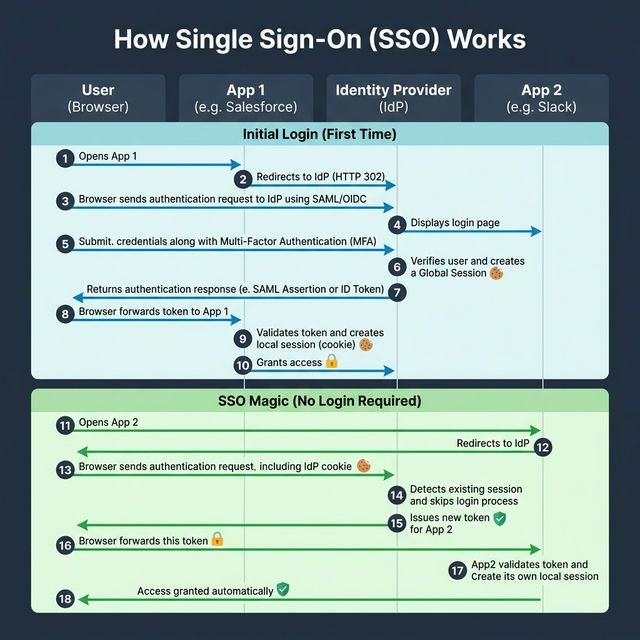
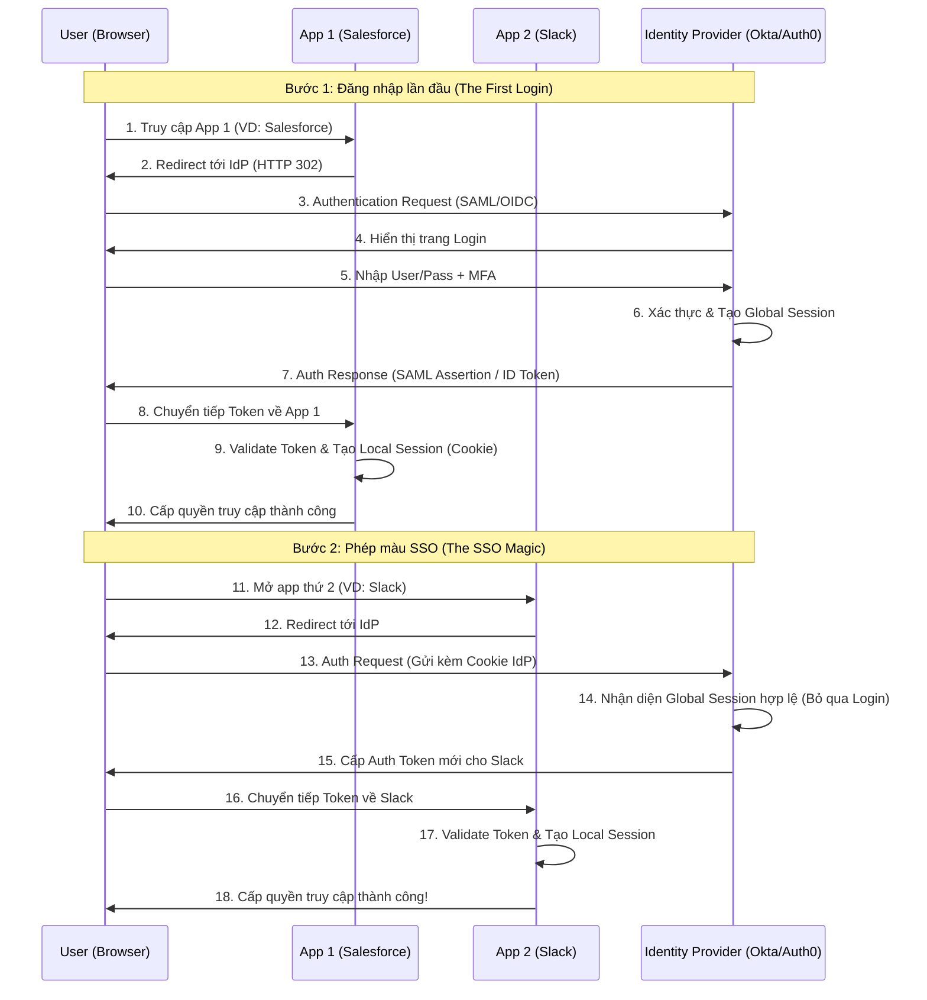

<!-- tags: system-design, authentication -->
# 🔄 How Single Sign-On (SSO) Works

> Single Sign-On (SSO) giúp người dùng đăng nhập một lần và truy cập nhiều ứng dụng mà không cần xác thực lại, thông qua một Identity Provider (IdP) trung tâm.

📅 Ngày tạo: 2026-03-22 · 🔄 Cập nhật: 2026-03-22 · ⏱️ 10 phút đọc

| Aspect         | Detail                                                                             |
| -------------- | ---------------------------------------------------------------------------------- |
| **Complexity** | 🌟🌟🌟                                                                             |
| **Use case**   | Xác thực tập trung cho hệ sinh thái nhiều ứng dụng (Internal tools, Microservices) |
| **Protocols**  | SAML, OpenID Connect (OIDC), OAuth 2.0                                             |

---

## 1. DEFINE

Thứ Hai đầu tuần: login Gmail, login Jira, login Confluence, login Slack, login GitHub, login AWS Console. 6 passwords, 3 MFA prompts, 2 password expired. Mất 12 phút trước khi viết dòng code đầu tiên. SSO tồn tại vì authentication friction không chỉ là annoyance — nó là productivity killer đo được bằng tiền.


**Single Sign-On (SSO)** là cơ chế xác thực cho phép người dùng đăng nhập một lần duy nhất bằng một tài khoản (credentials) phân phối bởi một hệ thống quản lý danh tính trung tâm (Identity Provider - IdP), sau đó có thể truy cập mượt mà vào nhiều ứng dụng (Service Providers - SPs) khác nhau.

**Tại sao cần SSO?**

- **User Experience (UX):** Không cần nhớ nhiều mật khẩu, giảm ma sát khi chuyển đổi ngữ cảnh giữa các ứng dụng.
- **Security:** Giảm rủi ro mật khẩu yếu, dễ triển khai MFA/2FA tập trung. Tránh việc ứng dụng thứ 3 tự lưu trữ mật khẩu người dùng.
- **Quản lý (Admin):** Cấp quyền (provisioning) và thu hồi quyền (deprovisioning) nhanh chóng từ một nơi duy nhất.

**Phân biệt:**
| Feature | Traditional Auth | SSO |
|---------|------------------|-----|
| Mật khẩu | Ứng dụng tự quản lý và lưu (Hash/Salt) | Identity Provider (IdP) quản lý |
| Trải nghiệm | Phải login lại ở mỗi ứng dụng | Login 1 lần, tự động vào các app khác |
| Protocols | Thường là tự build token/session | Chuẩn hóa: SAML, OIDC |

Các failure mode trên nghe dễ tránh. Nhưng có trap: SSO token không validate audience = token reuse cross-service, và session fixation = hijack. Trap đó sẽ xuất hiện ở PITFALLS.

## 2. VISUAL

Dưới đây là luồng hoạt động chi tiết của SSO:



### Sơ đồ Sequence: SSO Login Flow



_(Ý tưởng cốt lõi: Applications không tự xác thực người dùng mà uỷ quyền toàn bộ cho một Identity Provider trung tâm. IdP lưu Global Session và phát hành thẻ ID/Token cho từng ứng dụng con)._

## 3. CODE

Dưới đây là mô phỏng cách tích hợp SSO (OpenID Connect với `coreos/go-oidc` và `oauth2`).

SSO flow overview đã cover. Nhưng SP implementation cần OIDC — hãy integrate.

### 1. Basic: Service Provider (SP) OIDC Login Flow

**Introduce trước:**
Ứng dụng của chúng ta (Salesforce/Slack) đóng vai trò là Service Provider. Khi user vào `/login`, ta redirect họ tới IdP. Khi IdP trả về ở `/callback`, ta verify token và set local cookie.

```go
package main

import (
	"context"
	"crypto/rand"
	"encoding/base64"
	"fmt"
	"log"
	"net/http"

	"github.com/coreos/go-oidc/v3/oidc"
	"golang.org/x/oauth2"
)

var (
	clientID     = "YOUR_CLIENT_ID"
	clientSecret = "YOUR_CLIENT_SECRET"
	redirectURL  = "http://localhost:8080/callback"
	idpIssuer    = "https://dev-xxxx.okta.com/oauth2/default" // Hoặc Auth0
	oauth2Config oauth2.Config
	verifier     *oidc.IDTokenVerifier
)

func main() {
	ctx := context.Background()

	// 1. Khởi tạo OIDC Provider
	provider, err := oidc.NewProvider(ctx, idpIssuer)
	if err != nil {
		log.Fatal("Failed to initialized OIDC provider:", err)
	}

	// 2. Cấu hình OIDC / OAuth2
	oauth2Config = oauth2.Config{
		ClientID:     clientID,
		ClientSecret: clientSecret,
		RedirectURL:  redirectURL,
		Endpoint:     provider.Endpoint(),
		Scopes:       []string{oidc.ScopeOpenID, "profile", "email"},
	}

	verifier = provider.Verifier(&oidc.Config{ClientID: clientID})

	http.HandleFunc("/", homeHandler)
	http.HandleFunc("/login", loginHandler)
	http.HandleFunc("/callback", callbackHandler)

	fmt.Println("Server running on :8080")
	log.Fatal(http.ListenAndServe(":8080", nil))
}

// ⚠️ State generation để chặn CSRF attacks
func generateState() string {
	b := make([]byte, 16)
	rand.Read(b)
	return base64.URLEncoding.EncodeToString(b)
}

func loginHandler(w http.ResponseWriter, r *http.Request) {
	state := generateState()
	// Set state vào cookie để verify lúc callback
	http.SetCookie(w, &http.Cookie{Name: "oauth_state", Value: state, HttpOnly: true})

	// ✅ Redirect browser tới Identity Provider (Bước 2 trong sơ đồ)
	http.Redirect(w, r, oauth2Config.AuthCodeURL(state), http.StatusFound)
}

func callbackHandler(w http.ResponseWriter, r *http.Request) {
	// Verify state chống CSRF
	stateCookie, err := r.Cookie("oauth_state")
	if err != nil || r.URL.Query().Get("state") != stateCookie.Value {
		http.Error(w, "State invalid", http.StatusBadRequest)
		return
	}

	// Exchange Auth code lấy Token
	oauth2Token, err := oauth2Config.Exchange(context.Background(), r.URL.Query().Get("code"))
	if err != nil {
		http.Error(w, "Failed to exchange token", http.StatusInternalServerError)
		return
	}

	// Trích xuất ID Token (chứa thông tin đăng nhập)
	rawIDToken, ok := oauth2Token.Extra("id_token").(string)
	if !ok {
		http.Error(w, "No ID Token found", http.StatusInternalServerError)
		return
	}

	// ✅ Validate Token bằng public key lấy từ IdP (Bước 9 trong sơ đồ)
	idToken, err := verifier.Verify(context.Background(), rawIDToken)
	if err != nil {
		http.Error(w, "Failed to verify ID Token: "+err.Error(), http.StatusInternalServerError)
		return
	}

	// Lấy thông tin User profile
	var claims struct {
		Email string `json:"email"`
		Name  string `json:"name"`
	}
	if err := idToken.Claims(&claims); err != nil {
		http.Error(w, "Failed to parse claims", http.StatusInternalServerError)
		return
	}

	// TẠO LOCAL SESSION - Ví dụ: set cookie cho ứng dụng
	http.SetCookie(w, &http.Cookie{Name: "session", Value: "active_" + claims.Email, Path: "/"})
	w.Write([]byte(fmt.Sprintf("SSO Login Magic Successful! Hello %s", claims.Name)))
}

func homeHandler(w http.ResponseWriter, r *http.Request) {
	cookie, err := r.Cookie("session")
	if err != nil {
		w.Write([]byte(`Not logged in. <a href="/login">Login via SSO</a>`))
		return
	}
	w.Write([]byte(fmt.Sprintf("Welcome inside. Local session: %s", cookie.Value)))
}
```

```typescript
import express from "express";
import session from "express-session";
import { Issuer, generators } from "openid-client";

const app = express();
const issuer = await Issuer.discover("https://dev-xxxx.okta.com/oauth2/default");
const client = new issuer.Client({
    client_id: "YOUR_CLIENT_ID",
    client_secret: "YOUR_CLIENT_SECRET",
    redirect_uris: ["http://localhost:8080/callback"],
    response_types: ["code"],
});

app.use(session({ secret: "replace-me", resave: false, saveUninitialized: true }));

app.get("/login", (req, res) => {
    const state = generators.state();
    req.session.state = state;
    res.redirect(client.authorizationUrl({ scope: "openid profile email", state }));
});

app.get("/callback", async (req, res) => {
    if (req.query.state !== req.session.state) {
        return res.status(400).send("State invalid");
    }

    const params = client.callbackParams(req);
    const tokenSet = await client.callback("http://localhost:8080/callback", params, {
        state: req.session.state,
    });
    const claims = tokenSet.claims();
    req.session.user = { email: claims.email, name: claims.name };
    res.send(`SSO Login Magic Successful! Hello ${claims.name}`);
});
```

```rust
use axum::{
    extract::Query,
    response::{Html, IntoResponse, Redirect},
};
use openidconnect::{
    core::{CoreAuthenticationFlow, CoreClient},
    AuthorizationCode, CsrfToken, Nonce, Scope,
};
use std::collections::HashMap;

async fn login(client: CoreClient) -> impl IntoResponse {
    let (auth_url, _csrf, _nonce) = client
        .authorize_url(CoreAuthenticationFlow::AuthorizationCode, CsrfToken::new_random, Nonce::new_random)
        .add_scope(Scope::new("openid".into()))
        .add_scope(Scope::new("profile".into()))
        .add_scope(Scope::new("email".into()))
        .url();
    Redirect::temporary(auth_url.as_str())
}

async fn callback(Query(params): Query<HashMap<String, String>>) -> impl IntoResponse {
    let code = params.get("code").cloned().unwrap_or_default();
    let _auth_code = AuthorizationCode::new(code);
    Html("SSO Login Magic Successful!")
}
```

```cpp
#include <iostream>
#include <string>

std::string generateState() {
    return "random-state-token";
}

int main() {
    std::string state = generateState();
    std::string authorizationUrl =
        "https://dev-xxxx.okta.com/oauth2/default/v1/authorize?client_id=YOUR_CLIENT_ID"
        "&response_type=code&scope=openid%20profile%20email&state=" + state;

    std::cout << "Redirect user to: " << authorizationUrl << "\n";
    std::cout << "When callback returns, verify state, exchange code for token, then create local session.\n";
}
```

```python
from authlib.integrations.flask_client import OAuth
from flask import Flask, redirect, request, session, url_for
import secrets

app = Flask(__name__)
app.secret_key = "replace-me"

oauth = OAuth(app)
oauth.register(
    "okta",
    client_id="YOUR_CLIENT_ID",
    client_secret="YOUR_CLIENT_SECRET",
    server_metadata_url="https://dev-xxxx.okta.com/oauth2/default/.well-known/openid-configuration",
    client_kwargs={"scope": "openid profile email"},
)


@app.get("/login")
def login():
    session["oauth_state"] = secrets.token_urlsafe(16)
    return oauth.okta.authorize_redirect(
        redirect_uri=url_for("callback", _external=True),
        state=session["oauth_state"],
    )


@app.get("/callback")
def callback():
    if request.args.get("state") != session.get("oauth_state"):
        return "State invalid", 400

    token = oauth.okta.authorize_access_token()
    user = token["userinfo"]
    session["user"] = {"email": user["email"], "name": user["name"]}
    return f"SSO Login Magic Successful! Hello {user['name']}"
```

```java
import jakarta.servlet.http.HttpServletResponse;
import jakarta.servlet.http.HttpSession;
import java.io.IOException;
import java.net.URLEncoder;
import java.nio.charset.StandardCharsets;
import java.util.Map;
import java.util.UUID;
import org.springframework.stereotype.Controller;
import org.springframework.web.bind.annotation.GetMapping;
import org.springframework.web.bind.annotation.RequestParam;
import org.springframework.web.bind.annotation.ResponseBody;

@Controller
public class SsoController {
    private static final String CLIENT_ID = "YOUR_CLIENT_ID";
    private static final String REDIRECT_URI = "http://localhost:8080/callback";
    private static final String ISSUER = "https://dev-xxxx.okta.com/oauth2/default";

    @GetMapping("/login")
    public void login(HttpSession session, HttpServletResponse response) throws IOException {
        String state = UUID.randomUUID().toString();
        session.setAttribute("oauth_state", state);

        String authorizationUrl = ISSUER + "/v1/authorize"
            + "?client_id=" + CLIENT_ID
            + "&response_type=code"
            + "&scope=" + URLEncoder.encode("openid profile email", StandardCharsets.UTF_8)
            + "&redirect_uri=" + URLEncoder.encode(REDIRECT_URI, StandardCharsets.UTF_8)
            + "&state=" + URLEncoder.encode(state, StandardCharsets.UTF_8);

        response.sendRedirect(authorizationUrl);
    }

    @GetMapping("/callback")
    @ResponseBody
    public String callback(
        @RequestParam String state,
        @RequestParam String code,
        HttpSession session
    ) {
        String expectedState = (String) session.getAttribute("oauth_state");
        if (!state.equals(expectedState)) {
            return "State invalid";
        }

        // Thực tế sẽ exchange `code` lấy ID token qua OAuth client / Spring Security.
        Map<String, String> user = Map.of(
            "email", "alex@company.com",
            "name", "Alex"
        );
        session.setAttribute("user", user);
        return "SSO Login Magic Successful! Hello " + user.get("name");
    }
}
```

**Kết luận sau:** Service Provider (ứng dụng của bạn) không bao giờ thấy password của User. Tất cả những gì nó làm là trust (tin tưởng) Identity Provider, xác minh signature của Token, và cấp session local. Cùng một user nếu login vào Service B (sau khi đã login SP A) sẽ bỏ qua bước xuất hiện hộp thoại do session tại IdP đã tồn tại.

Bạn đã đi qua SSO flow và SP implementation. Bây giờ đến phần nguy hiểm: audience bypass và session fixation — trap đã được setup từ đầu bài.

## 4. PITFALLS

Khi đưa `🔄 How Single Sign-On (SSO) Works` vào production, lỗi thường không nằm ở khái niệm mà ở assumptions đội ngũ mang theo lúc triển khai. Bảng dưới đây gom đúng những cú trượt đó.


| # | Severity | Lỗi (Pitfall) | Hậu quả | Fix (Giải pháp) |
| --- | ----------------------------------------------------------------------------------------------------------------------------------------------------------------------------------- | ----------------------------------------------------------------------------------------------------------------------- |
| 1   | **Chưa kiểm tra State Token**<br>Bỏ qua bước verify state token trong luồng OIDC/OAuth2, dẫn đến tấn công CSRF. Kẻ xấu có thể ép người dùng login bằng account của chúng.           | ✅ Luôn random chuỗi `state`, gán vào session/cookie trước khi redirect, và verify `state` trả về trong callback hash.  |
| 2   | **Logout cục bộ thay vì Global Logout**<br>Khi người dùng bấm "Đăng xuất", ứng dụng chỉ xóa Local Session, nhưng IdP session vẫn còn. Lần tới bấm "Login", IdP tự cho vào lại luôn. | ✅ Chuyển hướng người dùng tới endpoint `/logout` của IdP sau khi clear local session. Nó gọi là Single Logout (SLO).   |
| 3   | **Token Signature Validation**<br>Chỉ tin tưởng Token dựa trên payload mà không verify chữ ký thuật toán (RS256) từ Identity Provider.                                              | ✅ Luôn dùng library chuẩn (`go-oidc`) để tự động tải JWKS keys từ IdP và tự động xác minh chữ ký mã hóa của JWT token. |
| 4   | **Tin tưởng Reply URL (Callback)**<br>Cấu hình Callback/Redirect URI trên IdP bằng regex lỏng lẻo (vd `*.company.com/callback`), rủi ro Open Redirect.                              | ✅ Khai báo Redirect URI trên IdP phải chính xác tuyệt đối (exact match) như `https://app.company.com/callback`.        |

Bạn đã đi qua SSO và cạm bẫy. Các resources dưới đây giúp đi sâu hơn.

## 5. REF

| Resource                 | Link                                                                                                                 |
| ------------------------ | -------------------------------------------------------------------------------------------------------------------- |
| RFC 6749 (OAuth 2.0)     | [https://datatracker.ietf.org/doc/html/rfc6749](https://datatracker.ietf.org/doc/html/rfc6749)                       |
| OpenID Connect Core 1.0  | [https://openid.net/specs/openid-connect-core-1_0.html](https://openid.net/specs/openid-connect-core-1_0.html)       |
| CoreOS Go OIDC           | [https://github.com/coreos/go-oidc](https://github.com/coreos/go-oidc)                                               |
| Okta Developer Docs: SSO | [https://developer.okta.com/docs/concepts/how-okta-works/](https://developer.okta.com/docs/concepts/how-okta-works/) |

## 6. RECOMMEND

Sau bài này, điều đáng đọc tiếp không phải một danh sách thuật ngữ mới mà là những chủ đề mở rộng trực tiếp từ boundary và trade-off của `🔄 How Single Sign-On (SSO) Works`.


| Mở rộng                   | Khi nào cần                                        | Lý do                                                                                                                                                |
| ------------------------- | -------------------------------------------------- | ---------------------------------------------------------------------------------------------------------------------------------------------------- |
| **SAML vs OIDC**          | Migration từ hệ thống doanh nghiệp cũ (Enterprise) | Ngân hàng hay bệnh viện cũ quen dùng XML-based SAML. Các app hiện đại Node/Go nên dùng OIDC (JSON JWT).                                              |
| **SAML JIT Provisioning** | Tự động tạo account trên app nhánh                 | Khi nhân viên mới vào, SSO login thành công. Nếu DB App chứa account chưa có, tự extract từ Token (Email, Name) và Insert DB luôn `Just-In-Time`.    |
| **IdP Federation**        | Doanh nghiệp lớn (M&A)                             | Xảy ra khi công ty bạn (dùng Okta) mua lại công ty khác (dùng Azure AD). Bạn nối 2 IdP lại với nhau thông qua Federation Trust thay vì tạo user mới. |

---

**Callback**: Quay lại 12 phút login thứ Hai. Bây giờ bạn biết: SSO + SAML/OIDC cho phép 1 login = access all services. Session token thay 6 passwords. Nhưng SSO failure = lock out khỏi mọi thứ. Single point of authentication cần redundancy, monitoring, và graceful degradation.

← Previous: [How Hackers Steal Passwords](./02-how-hackers-steal-passwords.md) · → Next: [How Can Cache Systems Go Wrong?](./04-how-cache-systems-go-wrong.md)
