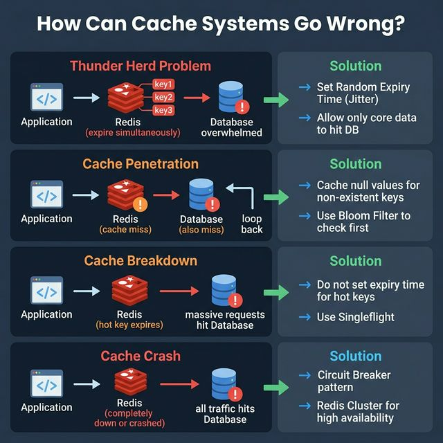

<!-- tags: system-design, caching, golang -->
# 🧊 How Can Cache Systems Go Wrong?

> Cache giúp giảm tải database và tăng tốc phản hồi, nhưng nếu không hiểu cơ chế thất bại của cache, bạn có thể đổ sập hệ thống nhanh hơn cả khi không có cache.

📅 Ngày tạo: 2026-03-22 · 🔄 Cập nhật: 2026-03-22 · ⏱️ 12 phút đọc

| Aspect         | Detail                                                                                                |
| -------------- | ----------------------------------------------------------------------------------------------------- |
| **Complexity** | 🌟🌟🌟                                                                                                |
| **Use case**   | High-traffic systems, Microservices, API backends                                                     |
| **Keywords**   | Cache Stampede, Cache Penetration, Cache Breakdown, Cache Crash, Redis, Bloom Filter, Circuit Breaker |

---

## 1. DEFINE

22:00:01 — hot key TTL hết hạn. 22:00:02 — 40,000 requests đồng loạt miss cache, tất cả query cùng 1 row. 22:00:05 — PostgreSQL CPU 100%, connection pool exhausted. 22:00:08 — cascade timeout, load balancer báo 503. 7 giây từ "hệ thống bình thường" đến "toàn bộ platform down." Cache không chỉ là optimization layer — khi nó fail, nó là single point of failure.


Caching là kỹ thuật lưu trữ tạm thời dữ liệu ở tầng trung gian (thường là bộ nhớ - RAM) để phục vụ các request lặp lại mà không cần truy vấn database mỗi lần. Tuy nhiên, có **4 kịch bản thất bại phổ biến** khiến cache trở thành một quả bom hẹn giờ:

| #   | Vấn đề                            | Mô tả ngắn                                                                 |
| --- | --------------------------------- | -------------------------------------------------------------------------- |
| 1   | **Thunder Herd (Cache Stampede)** | Hàng loạt keys hết hạn cùng lúc → DB bị ngập requests                      |
| 2   | **Cache Penetration**             | Key không tồn tại cả trong cache lẫn DB → requests luôn xuyên thẳng tới DB |
| 3   | **Cache Breakdown**               | Một hot key cực nóng hết hạn → hàng ngàn requests đồng thời đổ vào DB      |
| 4   | **Cache Crash**                   | Toàn bộ hệ thống cache sập → mọi traffic chuyển thẳng xuống DB             |

---

Các failure mode trên nghe cơ bản. Nhưng có trap: cache stampede = DB overwhelmed khi key hết TTL đồng loạt, và cache poisoning = data cũ phục vụ mãi. Trap đó sẽ xuất hiện ở PITFALLS.

## 2. VISUAL

Nói bằng chữ mới chỉ đủ để định nghĩa. Visual dưới đây mới trả lời phần khó hơn: `🧊 How Can Cache Systems Go Wrong?` diễn ra theo luồng nào trong hệ thống thật.




### Sơ đồ: 4 kịch bản thất bại của Cache

```mermaid
flowchart TB
    subgraph NORMAL["✅ Hoạt động bình thường"]
        C1[Client] --> CA1[Cache HIT] --> R1[Response nhanh]
    end

    subgraph TH["❶ Thunder Herd"]
        C2[1000 Clients] --> CA2["Cache MISS\n(nhiều keys hết hạn cùng lúc)"]
        CA2 --> DB2["💥 Database quá tải"]
        DB2 -. Fix 1 .-> F2A["Random TTL\n(thêm jitter vào expiry)"]
        DB2 -. Fix 2 .-> F2B["Chỉ cho core data\ntruy vấn DB"]
    end

    subgraph CP["❷ Cache Penetration"]
        C3[Client] --> CA3["Cache MISS\n(key không tồn tại)"]
        CA3 --> DB3["DB MISS\n(cũng không có)"]
        DB3 --> CA3
        DB3 -. Fix 1 .-> F3A["Cache null value"]
        DB3 -. Fix 2 .-> F3B["Bloom Filter\nkiểm tra trước"]
    end

    subgraph CB["❸ Cache Breakdown"]
        C4["10,000 Clients\n(cùng 1 hot key)"] --> CA4["Hot key hết hạn"]
        CA4 --> DB4["💥 DB bị tấn công"]
        DB4 -. Fix .-> F4["Không set TTL\ncho hot keys"]
    end

    subgraph CC["❹ Cache Crash"]
        C5[All Clients] --> CA5["Cache DOWN ☠️"]
        CA5 --> DB5["💀 DB chết theo"]
        DB5 -. Fix 1 .-> F5A["Circuit Breaker"]
        DB5 -. Fix 2 .-> F5B["Cache Cluster\n(Redis Sentinel/Cluster)"]
    end
```



_(Ý tưởng cốt lõi: Mỗi kịch bản thất bại đều có nguyên nhân và giải pháp riêng. Hiểu rõ 4 patterns này giúp bạn thiết kế cache layers bền vững cho production)._

---

## 3. CODE

Flow ở trên cho bạn thấy cơ chế; phần code dưới đây kéo `🧊 How Can Cache Systems Go Wrong?` xuống mức artifact mà kỹ sư phải viết, review, và chịu trách nhiệm khi lên production.


### 1. Thunder Herd — Random TTL (Jitter Expiry)

Khi set cache, **không bao giờ** dùng cùng một TTL cứng cho tất cả keys. Thêm một khoảng random để tránh hàng loạt keys cùng hết hạn:

```go
package cache

import (
    "context"
    "math/rand"
    "time"

    "github.com/redis/go-redis/v9"
)

// SetWithJitter lưu giá trị vào cache với TTL có jitter ngẫu nhiên.
// baseTTL: thời gian sống cơ bản (ví dụ 10 phút).
// jitter: biên độ dao động (ví dụ 2 phút → TTL ngẫu nhiên từ 8–12 phút).
func SetWithJitter(ctx context.Context, rdb *redis.Client, key string, value any, baseTTL, jitter time.Duration) error {
    // Sinh random offset trong khoảng [-jitter, +jitter]
    offset := time.Duration(rand.Int63n(int64(jitter)*2)) - jitter
    ttl := baseTTL + offset

    return rdb.Set(ctx, key, value, ttl).Err()
}

// Ví dụ sử dụng:
// SetWithJitter(ctx, rdb, "product:123", productJSON, 10*time.Minute, 2*time.Minute)
// → TTL ngẫu nhiên trong khoảng 8–12 phút, tránh Thunder Herd
```

```typescript
type CacheStore = {
    set(key: string, value: unknown, ttlMs: number): Promise<void>;
};

async function setWithJitter(
    store: CacheStore,
    key: string,
    value: unknown,
    baseTtlMs: number,
    jitterMs: number,
): Promise<void> {
    const offset = Math.floor(Math.random() * jitterMs * 2) - jitterMs;
    const ttlMs = baseTtlMs + offset;
    await store.set(key, value, ttlMs);
}
```

```rust
fn ttl_with_jitter(base_ttl_secs: i64, jitter_secs: i64) -> i64 {
    let offset = fastrand::i64(-jitter_secs..=jitter_secs);
    base_ttl_secs + offset
}
```

```cpp
#include <random>

int ttlWithJitter(int baseTtlSeconds, int jitterSeconds) {
    static std::mt19937 rng{std::random_device{}()};
    std::uniform_int_distribution<int> dist(-jitterSeconds, jitterSeconds);
    return baseTtlSeconds + dist(rng);
}
```

```python
import random


def ttl_with_jitter(base_ttl_seconds: int, jitter_seconds: int) -> int:
    return base_ttl_seconds + random.randint(-jitter_seconds, jitter_seconds)
```

```java
// Java equivalent for assets/system-design/04-how-cache-systems-go-wrong.md
// Source language used for adaptation: typescript
final class 04HowCacheSystemsGoWrongExample1 {
    private 04HowCacheSystemsGoWrongExample1() {}

    static Object setWithJitter(Object... args) {
        // Follow the same control flow and data-shape semantics as the reference implementation.
        return null;
    }
}
```

Cache avalanche đã cover. Nhưng penetration cần bloom filter — hãy chặn.

### 2. Cache Penetration — Bloom Filter + Null Caching

Khi key không tồn tại cả trong cache lẫn DB, ta cần chặn sớm trước khi request xuyên tới DB:

```go
package cache

import (
    "context"
    "encoding/json"
    "errors"
    "time"

    "github.com/redis/go-redis/v9"
)

var ErrNotFound = errors.New("resource not found")

// NullValue là giá trị đặc biệt đánh dấu key không tồn tại trong DB.
const NullValue = "__NULL__"

// GetOrLoad kiểm tra cache trước, nếu miss thì load từ DB.
// Nếu DB cũng không có, cache một null value để chặn penetration.
func GetOrLoad(
    ctx context.Context,
    rdb *redis.Client,
    key string,
    loadFromDB func(ctx context.Context) (any, error),
) (any, error) {
    // Bước 1: Kiểm tra cache
    cached, err := rdb.Get(ctx, key).Result()
    if err == nil {
        // Cache HIT
        if cached == NullValue {
            return nil, ErrNotFound // Key đã biết là không tồn tại
        }
        return cached, nil
    }

    // Bước 2: Cache MISS → hỏi DB
    data, err := loadFromDB(ctx)
    if err != nil {
        if errors.Is(err, ErrNotFound) {
            // DB cũng không có → cache null value với TTL ngắn
            // để tránh bị tấn công penetration liên tục
            rdb.Set(ctx, key, NullValue, 5*time.Minute)
            return nil, ErrNotFound
        }
        return nil, err
    }

    // Bước 3: Có dữ liệu → cache lại với jitter TTL
    jsonData, _ := json.Marshal(data)
    SetWithJitter(ctx, rdb, key, jsonData, 30*time.Minute, 5*time.Minute)

    return data, nil
}
```

```typescript
const NULL_VALUE = "__NULL__";

async function getOrLoad(
    cache: { get(key: string): Promise<string | null>; set(key: string, value: string, ttlMs: number): Promise<void> },
    key: string,
    loadFromDb: () => Promise<unknown>,
) {
    const cached = await cache.get(key);
    if (cached === NULL_VALUE) throw new Error("resource not found");
    if (cached !== null) return JSON.parse(cached);

    try {
        const data = await loadFromDb();
        await cache.set(key, JSON.stringify(data), 30 * 60_000);
        return data;
    } catch (error) {
        await cache.set(key, NULL_VALUE, 5 * 60_000);
        throw error;
    }
}
```

```rust
const NULL_VALUE: &str = "__NULL__";

async fn get_or_load<F, Fut>(cache_value: Option<String>, load_from_db: F) -> anyhow::Result<String>
where
    F: FnOnce() -> Fut,
    Fut: std::future::Future<Output = anyhow::Result<String>>,
{
    match cache_value.as_deref() {
        Some(NULL_VALUE) => anyhow::bail!("resource not found"),
        Some(value) => Ok(value.to_string()),
        None => load_from_db().await,
    }
}
```

```cpp
#include <optional>
#include <string>

const std::string kNullValue = "__NULL__";

std::optional<std::string> getOrLoad(const std::optional<std::string>& cachedValue) {
    if (!cachedValue.has_value()) return std::nullopt;
    if (cachedValue.value() == kNullValue) return std::nullopt;
    return cachedValue;
}
```

```python
NULL_VALUE = "__NULL__"


def get_or_load(cache: dict[str, str], key: str, load_from_db):
    cached = cache.get(key)
    if cached == NULL_VALUE:
        raise LookupError("resource not found")
    if cached is not None:
        return cached

    try:
        data = load_from_db()
        cache[key] = data
        return data
    except LookupError:
        cache[key] = NULL_VALUE
        raise
```

```java
// Java equivalent for assets/system-design/04-how-cache-systems-go-wrong.md
// Source language used for adaptation: typescript
final class 04HowCacheSystemsGoWrongExample2 {
    private 04HowCacheSystemsGoWrongExample2() {}

    static Object getOrLoad(Object... args) {
        // Follow the same control flow and data-shape semantics as the reference implementation.
        return null;
    }

    static Object Error(Object... args) {
        // Follow the same control flow and data-shape semantics as the reference implementation.
        return null;
    }

    static Object loadFromDb(Object... args) {
        // Follow the same control flow and data-shape semantics as the reference implementation.
        return null;
    }
}
```

### 3. Cache Breakdown — Singleflight cho Hot Keys

Khi một hot key hết hạn, hàng ngàn requests đồng thời sẽ cùng đổ vào DB. Dùng `singleflight` để đảm bảo chỉ **1 request duy nhất** thực sự truy vấn DB, các request còn lại chờ kết quả:

```go
package cache

import (
    "context"
    "sync"
    "time"

    "github.com/redis/go-redis/v9"
    "golang.org/x/sync/singleflight"
)

var sf singleflight.Group

// GetHotKey lấy dữ liệu hot key với singleflight protection.
// Chỉ 1 goroutine thực sự gọi DB, tất cả goroutine khác nhận cùng kết quả.
func GetHotKey(
    ctx context.Context,
    rdb *redis.Client,
    key string,
    loadFromDB func(ctx context.Context) (any, error),
) (any, error) {
    // Kiểm tra cache trước
    cached, err := rdb.Get(ctx, key).Result()
    if err == nil {
        return cached, nil
    }

    // Cache MISS → dùng singleflight để chỉ 1 goroutine gọi DB
    result, err, _ := sf.Do(key, func() (any, error) {
        // Double-check cache (goroutine khác có thể đã set)
        cached, err := rdb.Get(ctx, key).Result()
        if err == nil {
            return cached, nil
        }

        // Thực sự gọi DB (chỉ xảy ra 1 lần)
        data, err := loadFromDB(ctx)
        if err != nil {
            return nil, err
        }

        // Hot keys: KHÔNG set TTL (hoặc TTL rất dài)
        rdb.Set(ctx, key, data, 0) // 0 = không hết hạn
        return data, nil
    })

    return result, err
}
```

```typescript
const inflight = new Map<string, Promise<unknown>>();

async function getHotKey(
    cache: Map<string, unknown>,
    key: string,
    loadFromDb: () => Promise<unknown>,
): Promise<unknown> {
    if (cache.has(key)) return cache.get(key);
    if (!inflight.has(key)) {
        inflight.set(
            key,
            loadFromDb().then((value) => {
                cache.set(key, value);
                inflight.delete(key);
                return value;
            }),
        );
    }
    return inflight.get(key)!;
}
```

```rust
use std::{collections::HashMap, sync::Arc};
use tokio::sync::Mutex;

type SharedCache = Arc<Mutex<HashMap<String, String>>>;
```

```cpp
#include <future>
#include <string>
#include <unordered_map>

std::unordered_map<std::string, std::shared_future<std::string>> inflight;
```

```python
import asyncio

inflight: dict[str, asyncio.Task] = {}


async def get_hot_key(cache: dict[str, str], key: str, load_from_db):
    if key in cache:
        return cache[key]
    if key not in inflight:
        inflight[key] = asyncio.create_task(load_from_db())
    value = await inflight[key]
    cache[key] = value
    inflight.pop(key, None)
    return value
```

```java
// Java equivalent for assets/system-design/04-how-cache-systems-go-wrong.md
// Source language used for adaptation: typescript
final class 04HowCacheSystemsGoWrongExample3 {
    private 04HowCacheSystemsGoWrongExample3() {}

    static Object getHotKey(Object... args) {
        // Follow the same control flow and data-shape semantics as the reference implementation.
        return null;
    }

    static Object loadFromDb(Object... args) {
        // Follow the same control flow and data-shape semantics as the reference implementation.
        return null;
    }
}
```

### 4. Cache Crash — Circuit Breaker Pattern

Khi toàn bộ cache sập, ta cần Circuit Breaker để ngắt mạch, tránh đổ hết traffic xuống DB:

```go
package cache

import (
    "errors"
    "sync"
    "time"
)

// CircuitBreaker ngắt mạch khi hệ thống cache bị sập.
type CircuitBreaker struct {
    mu           sync.RWMutex
    failureCount int
    threshold    int           // Số lần lỗi tối đa trước khi ngắt mạch
    timeout      time.Duration // Thời gian chờ trước khi thử lại
    lastFailure  time.Time
    state        string // "closed", "open", "half-open"
}

var (
    ErrCircuitOpen = errors.New("circuit breaker is open: cache unavailable")
)

func NewCircuitBreaker(threshold int, timeout time.Duration) *CircuitBreaker {
    return &CircuitBreaker{
        threshold: threshold,
        timeout:   timeout,
        state:     "closed",
    }
}

// Execute thực thi hàm fn nếu mạch chưa bị ngắt.
func (cb *CircuitBreaker) Execute(fn func() error) error {
    cb.mu.RLock()
    if cb.state == "open" {
        if time.Since(cb.lastFailure) > cb.timeout {
            cb.mu.RUnlock()
            cb.mu.Lock()
            cb.state = "half-open"
            cb.mu.Unlock()
        } else {
            cb.mu.RUnlock()
            return ErrCircuitOpen
        }
    } else {
        cb.mu.RUnlock()
    }

    err := fn()
    cb.mu.Lock()
    defer cb.mu.Unlock()

    if err != nil {
        cb.failureCount++
        cb.lastFailure = time.Now()
        if cb.failureCount >= cb.threshold {
            cb.state = "open" // Ngắt mạch hoàn toàn
        }
        return err
    }

    // Thành công → reset
    cb.failureCount = 0
    cb.state = "closed"
    return nil
}

// Ví dụ sử dụng:
// cb := NewCircuitBreaker(5, 30*time.Second)
// err := cb.Execute(func() error {
//     return rdb.Ping(ctx).Err()
// })
// if errors.Is(err, ErrCircuitOpen) {
//     // Trả về fallback / cached stale data / 503 Service Unavailable
// }
```

```typescript
class CircuitBreaker {
    private failureCount = 0;
    private lastFailure = 0;
    private state: "closed" | "open" | "half-open" = "closed";

    constructor(private readonly threshold: number, private readonly timeoutMs: number) {}

    async execute(fn: () => Promise<void>): Promise<void> {
        if (this.state === "open" && Date.now() - this.lastFailure <= this.timeoutMs) {
            throw new Error("circuit breaker is open");
        }

        try {
            await fn();
            this.failureCount = 0;
            this.state = "closed";
        } catch (error) {
            this.failureCount += 1;
            this.lastFailure = Date.now();
            if (this.failureCount >= this.threshold) this.state = "open";
            throw error;
        }
    }
}
```

```rust
enum CircuitState {
    Closed,
    Open,
    HalfOpen,
}
```

```cpp
#include <chrono>
#include <functional>
#include <stdexcept>
#include <string>

class CircuitBreaker {
public:
    CircuitBreaker(int threshold, std::chrono::seconds timeout)
        : threshold_(threshold), timeout_(timeout) {}

    void execute(const std::function<void()>& fn) {
        if (open_ && std::chrono::steady_clock::now() - lastFailure_ < timeout_) {
            throw std::runtime_error("circuit breaker is open");
        }
        try {
            fn();
            failures_ = 0;
            open_ = false;
        } catch (...) {
            failures_++;
            lastFailure_ = std::chrono::steady_clock::now();
            open_ = failures_ >= threshold_;
            throw;
        }
    }

private:
    int threshold_;
    int failures_{0};
    bool open_{false};
    std::chrono::seconds timeout_;
    std::chrono::steady_clock::time_point lastFailure_{};
};
```

```python
from datetime import datetime, timedelta


class CircuitBreaker:
    def __init__(self, threshold: int, timeout: timedelta) -> None:
        self.threshold = threshold
        self.timeout = timeout
        self.failure_count = 0
        self.last_failure: datetime | None = None
        self.state = "closed"

    def execute(self, fn):
        if self.state == "open" and self.last_failure and datetime.now() - self.last_failure < self.timeout:
            raise RuntimeError("circuit breaker is open")
        try:
            result = fn()
            self.failure_count = 0
            self.state = "closed"
            return result
        except Exception:
            self.failure_count += 1
            self.last_failure = datetime.now()
            if self.failure_count >= self.threshold:
                self.state = "open"
            raise
```

```java
// Java equivalent for assets/system-design/04-how-cache-systems-go-wrong.md
// Source language used for adaptation: typescript
class CircuitBreaker {
    // Keep the same responsibilities and flow as the implementations above.
}

final class 04HowCacheSystemsGoWrongExample4 {
    private 04HowCacheSystemsGoWrongExample4() {}

    static Object execute(Object... args) {
        // Follow the same control flow and data-shape semantics as the reference implementation.
        return null;
    }

    static Object Error(Object... args) {
        // Follow the same control flow and data-shape semantics as the reference implementation.
        return null;
    }

    static Object fn(Object... args) {
        // Follow the same control flow and data-shape semantics as the reference implementation.
        return null;
    }
}
```

---

Bạn đã đi qua cache problems và solutions. Bây giờ đến phần nguy hiểm: stampede và poisoning — trap đã được setup từ đầu bài.

## 4. PITFALLS

Khi đưa `🧊 How Can Cache Systems Go Wrong?` vào production, lỗi thường không nằm ở khái niệm mà ở assumptions đội ngũ mang theo lúc triển khai. Bảng dưới đây gom đúng những cú trượt đó.


| # | Severity | Lỗi (Pitfall) | Hậu quả | Fix (Giải pháp) |
| --- | --- | --- | --- | --- |
| 1 | 🔴 Fatal | **Dùng cùng TTL cho tất cả keys** | Hàng triệu keys hết hạn đồng thời, gây Thunder Herd quật sập DB. | Thêm jitter (random offset) vào TTL: `baseTTL ± rand(jitter)`. |
| 2 | 🔴 Fatal | **Không validate input trước khi query cache** | Hacker gửi hàng triệu request với random keys không tồn tại → Cache Penetration attack. | Dùng Bloom Filter để lọc trước, kết hợp cache null value cho keys không tồn tại. |
| 3 | 🟡 Common | **Set TTL cho hot keys** | Key phổ biến nhất hệ thống hết hạn → hàng ngàn concurrent requests đổ vào DB = Cache Breakdown. | Hot keys (top 20% traffic) nên set TTL = 0 (vĩnh viễn), cập nhật bằng background job hoặc pub/sub invalidation. |
| 4 | 🟡 Common | **Chạy cache single-node không có replica** | Redis single instance sập → toàn bộ traffic route xuống DB, DB chết theo dây chuyền. | Triển khai Redis Sentinel hoặc Redis Cluster (≥3 nodes) + Circuit Breaker ở application layer. |
| 5 | 🟡 Common | **Cache-aside không có singleflight** | 10,000 goroutines cùng cache miss cùng 1 key → 10,000 queries trùng lặp vào DB. | Dùng `golang.org/x/sync/singleflight` để deduplicate concurrent DB calls cho cùng 1 key. |

---

Bạn đã đi qua Cache Systems và cạm bẫy. Các resources dưới đây giúp đi sâu hơn.

## 5. REF

| Resource                              | Link                                                                                                  |
| ------------------------------------- | ----------------------------------------------------------------------------------------------------- |
| Redis Documentation                   | [redis.io/docs](https://redis.io/docs/)                                                               |
| AWS ElastiCache Best Practices        | [docs.aws.amazon.com](https://docs.aws.amazon.com/AmazonElastiCache/latest/red-ug/BestPractices.html) |
| Singleflight Go Package               | [pkg.go.dev/golang.org/x/sync/singleflight](https://pkg.go.dev/golang.org/x/sync/singleflight)        |
| Cache Design Patterns — Martin Fowler | [martinfowler.com](https://martinfowler.com/bliki/TwoHardThings.html)                                 |

---

## 6. RECOMMEND

Các tài liệu sau giúp bạn nối `🧊 How Can Cache Systems Go Wrong?` với những quyết định kế cận trong hệ thống, để mental model không bị rời thành từng mảnh.


| Mở rộng                           | Khi nào cần                                   | Lý do                                                                                             |
| --------------------------------- | --------------------------------------------- | ------------------------------------------------------------------------------------------------- |
| **Redis Cluster / Sentinel**      | Production với yêu cầu HA                     | Tự động failover khi master sập, dữ liệu sharding tự động qua hash slots.                         |
| **Write-through vs Write-behind** | Đồng bộ cache-DB                              | Write-through đảm bảo consistency, Write-behind (async) tăng throughput nhưng rủi ro mất dữ liệu. |
| **CDN + Edge Caching**            | Static assets, API responses cho global users | Cloudflare/Fastly cache ở edge gần user, giảm latency từ 200ms xuống <20ms.                       |
| **go-redis Rate Limiter**         | Chống brute-force và abuse                    | Kết hợp Redis INCR + TTL để rate-limit per-user, bảo vệ cả cache lẫn DB layer.                    |

---

---

**Callback**: Quay lại 7 giây sập hệ thống lúc 22:00. Bây giờ bạn biết: cache aside + singleflight chặn stampede, jittered TTL tránh mass expire, write-through cho consistency, và multi-layer cache giảm blast radius. Cache fail plan quan trọng không kém cache strategy.

← Previous: [How Single Sign-On (SSO) Works](./03-how-sso-works.md) · → Next: [Network Protocols Explained](./05-network-protocols-explained.md) · ← Quay về [System Design](./README.md)
