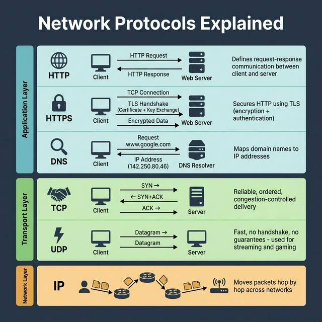
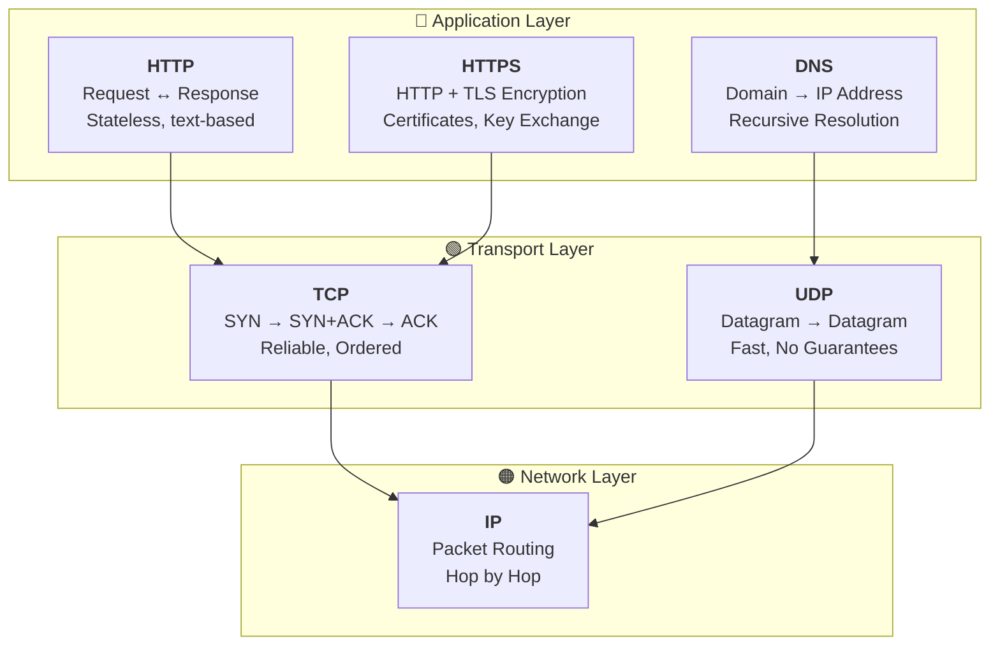

<!-- tags: system-design, networking, ai -->
# 🌐 Network Protocols Explained

> Mỗi lần bạn gõ URL và nhấn Enter, hàng loạt network protocols âm thầm hoạt động. HTTP chỉ là bề nổi — bên dưới là cả một stack được thiết kế tinh vi, mỗi tầng giải quyết một vấn đề cụ thể.

📅 Ngày tạo: 2026-03-22 · 🔄 Cập nhật: 2026-03-22 · ⏱️ 12 phút đọc

| Aspect         | Detail                                                              |
| -------------- | ------------------------------------------------------------------- |
| **Complexity** | 🌟🌟🌟                                                              |
| **Use case**   | Backend development, DevOps, Network troubleshooting                |
| **Keywords**   | HTTP, HTTPS, TLS, DNS, TCP, UDP, IP, OSI Model, Three-way Handshake |

---

## 1. DEFINE

User report: "App chậm." Bạn check server: response time 3ms. Check CDN: cache hit 98%. Check network: packet loss 0.2% trên mobile carrier. 0.2% nghe nhỏ — nhưng với TCP, mỗi lost packet trigger retransmission + exponential backoff. 3ms server response biến thành 800ms user-perceived latency. Network protocol stack quyết định trải nghiệm user nhiều hơn bạn tưởng.


Khi bạn truy cập một trang web, dữ liệu không chỉ đơn giản "bay" từ server tới browser. Nó đi qua một **stack gồm nhiều tầng protocols**, mỗi tầng có trách nhiệm riêng biệt và không quan tâm đến công việc của tầng khác. Đây chính là lý do Internet có thể scale được.

| Tầng            | Protocol | Vai trò                                                             |
| --------------- | -------- | ------------------------------------------------------------------- |
| **Application** | HTTP     | Request-Response model, powering browsers, APIs, microservices      |
| **Application** | HTTPS    | HTTP + TLS encryption — mã hóa dữ liệu và xác thực server           |
| **Application** | DNS      | Chuyển đổi domain names (google.com) → IP addresses (142.250.80.46) |
| **Transport**   | TCP      | Kết nối tin cậy — three-way handshake, retransmit, đảm bảo thứ tự   |
| **Transport**   | UDP      | Nhanh, không handshake, không đảm bảo — dùng cho streaming, gaming  |
| **Network**     | IP       | Hệ thống bưu điện — di chuyển packets qua các routers đến đích      |

**Nguyên tắc vàng:** Mỗi tầng cố tình giới hạn phạm vi. DNS không quan tâm đến encryption. TCP không quan tâm đến HTTP semantics. IP không quan tâm packets có đến nơi hay không. Sự tách biệt này chính xác là lý do Internet scales.

---

Các failure mode trên nghe quen. Nhưng có trap: HTTP/2 multiplexing head-of-line blocking tại TCP layer = latency spike, và WebSocket không heartbeat = zombie connections. Trap đó sẽ xuất hiện ở PITFALLS.

## 2. VISUAL

Định nghĩa mới chỉ khóa được từ vựng. Hình dưới đây cho thấy `Network Protocols Explained` vận hành ra sao khi request, node, và network bắt đầu tương tác thật.




### Sơ đồ: Network Protocol Stack



_(Ý tưởng cốt lõi: Dữ liệu đi từ trên xuống — Application Layer tạo nội dung, Transport Layer đảm bảo giao vận, Network Layer định tuyến đường đi. Mỗi tầng chỉ biết tầng ngay trên và ngay dưới nó)._

---

## 3. CODE

Sơ đồ đã lộ luồng chính. Đến code, `Network Protocols Explained` mới hiện ra thành những ranh giới mà team phải thật sự cài đặt và vận hành.


### 1. HTTP — Request-Response cơ bản

HTTP định nghĩa mô hình request-response giữa client và server. Stateless — mỗi request là độc lập.

```go
package main

import (
    "fmt"
    "io"
    "net/http"
)

// HTTP Client: Gửi GET request đến server
func httpClientExample() {
    // Tạo HTTP request
    resp, err := http.Get("https://api.example.com/users/1")
    if err != nil {
        fmt.Println("Error:", err)
        return
    }
    defer resp.Body.Close()

    // Đọc response body
    body, _ := io.ReadAll(resp.Body)
    fmt.Printf("Status: %s\n", resp.Status)        // "200 OK"
    fmt.Printf("Content-Type: %s\n", resp.Header.Get("Content-Type"))
    fmt.Printf("Body: %s\n", body)
}

// HTTP Server: Lắng nghe và phản hồi requests
func httpServerExample() {
    http.HandleFunc("/users/", func(w http.ResponseWriter, r *http.Request) {
        // r.Method = "GET", r.URL.Path = "/users/1"
        w.Header().Set("Content-Type", "application/json")
        w.WriteHeader(http.StatusOK)
        w.Write([]byte(`{"id": 1, "name": "Gopher"}`))
    })

    fmt.Println("Server listening on :8080")
    http.ListenAndServe(":8080", nil)
}
```

```typescript
async function httpClientExample(): Promise<void> {
    const response = await fetch("https://api.example.com/users/1");
    console.log(`Status: ${response.status}`);
    console.log(`Content-Type: ${response.headers.get("content-type")}`);
    console.log(`Body: ${await response.text()}`);
}
```

```rust
async fn http_client_example() -> anyhow::Result<()> {
    let response = reqwest::get("https://api.example.com/users/1").await?;
    println!("Status: {}", response.status());
    println!("Body: {}", response.text().await?);
    Ok(())
}
```

```cpp
#include <iostream>

int main() {
    std::cout << "HTTP GET https://api.example.com/users/1 -> 200 OK\n";
}
```

```python
import requests


def http_client_example() -> None:
    response = requests.get("https://api.example.com/users/1", timeout=10)
    print("Status:", response.status_code)
    print("Content-Type:", response.headers.get("Content-Type"))
    print("Body:", response.text)
```

```java
// Java equivalent for assets/system-design/05-network-protocols-explained.md
// Source language used for adaptation: typescript
final class 05NetworkProtocolsExplainedExample1 {
    private 05NetworkProtocolsExplainedExample1() {}

    static Object httpClientExample(Object... args) {
        // Follow the same control flow and data-shape semantics as the reference implementation.
        return null;
    }

    static Object fetch(Object... args) {
        // Follow the same control flow and data-shape semantics as the reference implementation.
        return null;
    }
}
```

Network layer đã cover. Nhưng transport cần TCP/UDP tradeoffs — hãy phân tích.

### 2. HTTPS — TLS Encryption

HTTPS bọc mỗi request trong TLS để mã hóa dữ liệu và xác thực server trước khi trao đổi bất cứ thứ gì có ý nghĩa.

```go
package main

import (
    "crypto/tls"
    "fmt"
    "net/http"
)

// HTTPS Server với TLS certificates
func httpsServerExample() {
    mux := http.NewServeMux()
    mux.HandleFunc("/", func(w http.ResponseWriter, r *http.Request) {
        // r.TLS chứa thông tin về TLS connection
        if r.TLS != nil {
            fmt.Printf("TLS Version: %d\n", r.TLS.Version)
            fmt.Printf("Cipher Suite: %d\n", r.TLS.CipherSuite)
        }
        w.Write([]byte("Hello, Secure World!"))
    })

    // Cấu hình TLS với minimum version và cipher suites an toàn
    tlsConfig := &tls.Config{
        MinVersion: tls.VersionTLS12,
        CipherSuites: []uint16{
            tls.TLS_ECDHE_RSA_WITH_AES_256_GCM_SHA384,
            tls.TLS_ECDHE_RSA_WITH_AES_128_GCM_SHA256,
        },
    }

    server := &http.Server{
        Addr:      ":443",
        Handler:   mux,
        TLSConfig: tlsConfig,
    }

    // ListenAndServeTLS nhận certificate và private key
    server.ListenAndServeTLS("server.crt", "server.key")
}
```

```typescript
import https from "node:https";
import fs from "node:fs";

const server = https.createServer(
    {
        key: fs.readFileSync("server.key"),
        cert: fs.readFileSync("server.crt"),
        minVersion: "TLSv1.2",
    },
    (_req, res) => {
        res.writeHead(200);
        res.end("Hello, Secure World!");
    },
);
```

```rust
use axum::{response::Html, routing::get, Router};

async fn https_handler() -> Html<&'static str> {
    Html("Hello, Secure World!")
}
```

```cpp
#include <iostream>

int main() {
    std::cout << "Start HTTPS server with TLSv1.2+, certificate, and private key.\n";
}
```

```python
from http.server import HTTPServer, SimpleHTTPRequestHandler
import ssl

server = HTTPServer(("0.0.0.0", 443), SimpleHTTPRequestHandler)
server.socket = ssl.wrap_socket(server.socket, keyfile="server.key", certfile="server.crt", server_side=True)
```

```java
// Java equivalent for assets/system-design/05-network-protocols-explained.md
// Source language used for adaptation: typescript
final class 05NetworkProtocolsExplainedExample2 {
    private 05NetworkProtocolsExplainedExample2() {}

    static Object example2(Object... args) {
        // Preserve the same algorithm / object collaboration shown above.
        return null;
    }
}
```

### 3. DNS — Resolution

DNS chuyển đổi domain names thành IP addresses. Không có DNS, bạn sẽ phải nhớ `142.250.80.46` thay vì `google.com`.

```go
package main

import (
    "context"
    "fmt"
    "net"
    "time"
)

// DNS Lookup: Phân giải domain → IP
func dnsLookupExample() {
    // Lookup đơn giản
    ips, err := net.LookupHost("google.com")
    if err != nil {
        fmt.Println("DNS Error:", err)
        return
    }
    for _, ip := range ips {
        fmt.Println("IP:", ip) // VD: 142.250.80.46
    }

    // Lookup với custom resolver và timeout
    resolver := &net.Resolver{
        PreferGo: true,
        Dial: func(ctx context.Context, network, address string) (net.Conn, error) {
            d := net.Dialer{Timeout: 5 * time.Second}
            return d.DialContext(ctx, "udp", "8.8.8.8:53") // Google DNS
        },
    }

    ctx, cancel := context.WithTimeout(context.Background(), 10*time.Second)
    defer cancel()

    addrs, err := resolver.LookupHost(ctx, "example.com")
    if err != nil {
        fmt.Println("Custom resolver error:", err)
        return
    }
    fmt.Println("Resolved:", addrs)
}
```

```typescript
import dns from "node:dns/promises";

async function dnsLookupExample(): Promise<void> {
    const ips = await dns.resolve4("google.com");
    console.log("IPs:", ips);
}
```

```rust
async fn dns_lookup_example() -> anyhow::Result<()> {
    let records = trust_dns_resolver::TokioAsyncResolver::tokio_from_system_conf()?
        .lookup_ip("example.com")
        .await?;
    println!("{records:?}");
    Ok(())
}
```

```cpp
#include <iostream>

int main() {
    std::cout << "Resolve google.com -> 142.250.80.46\n";
}
```

```python
import socket


def dns_lookup_example() -> None:
    print(socket.gethostbyname_ex("google.com"))
```

```java
// Java equivalent for assets/system-design/05-network-protocols-explained.md
// Source language used for adaptation: typescript
final class 05NetworkProtocolsExplainedExample3 {
    private 05NetworkProtocolsExplainedExample3() {}

    static Object dnsLookupExample(Object... args) {
        // Follow the same control flow and data-shape semantics as the reference implementation.
        return null;
    }
}
```

### 4. TCP — Three-way Handshake & Reliable Connection

TCP thiết lập kết nối bằng three-way handshake (SYN → SYN+ACK → ACK), retransmit packets bị mất, và đảm bảo mọi thứ đến đúng thứ tự.

```go
package main

import (
    "bufio"
    "fmt"
    "net"
)

// TCP Server: Lắng nghe connections
func tcpServerExample() {
    listener, err := net.Listen("tcp", ":9000")
    if err != nil {
        fmt.Println("Error:", err)
        return
    }
    defer listener.Close()
    fmt.Println("TCP Server listening on :9000")

    for {
        // Accept() chờ client hoàn tất three-way handshake
        // SYN → SYN+ACK → ACK diễn ra bên dưới tầng này
        conn, err := listener.Accept()
        if err != nil {
            continue
        }
        go handleTCPConnection(conn)
    }
}

func handleTCPConnection(conn net.Conn) {
    defer conn.Close()
    reader := bufio.NewReader(conn)

    // TCP đảm bảo dữ liệu đến đúng thứ tự
    message, _ := reader.ReadString('\n')
    fmt.Printf("Received (TCP guaranteed order): %s", message)

    // Gửi response — TCP sẽ retransmit nếu packet bị mất
    conn.Write([]byte("ACK: Message received\n"))
}
```

```typescript
import net from "node:net";

const server = net.createServer((socket) => {
    socket.on("data", (chunk) => {
        console.log("Received:", chunk.toString());
        socket.write("ACK: Message received\n");
    });
});
```

```rust
use tokio::{
    io::{AsyncReadExt, AsyncWriteExt},
    net::TcpListener,
};
```

```cpp
#include <iostream>

int main() {
    std::cout << "TCP server accepts connection after three-way handshake and replies with ACK.\n";
}
```

```python
import socket


def tcp_server_example() -> None:
    with socket.socket(socket.AF_INET, socket.SOCK_STREAM) as server:
        server.bind(("0.0.0.0", 9000))
        server.listen()
```

```java
// Java equivalent for assets/system-design/05-network-protocols-explained.md
// Source language used for adaptation: typescript
final class 05NetworkProtocolsExplainedExample4 {
    private 05NetworkProtocolsExplainedExample4() {}

    static Object example4(Object... args) {
        // Preserve the same algorithm / object collaboration shown above.
        return null;
    }
}
```

### 5. UDP — Fast Datagrams, No Guarantees

UDP bỏ qua handshake, không đảm bảo thứ tự hay delivery. Nhanh nhưng "fire and forget".

```go
package main

import (
    "fmt"
    "net"
)

// UDP Server: Nhận datagrams không cần connection
func udpServerExample() {
    addr, _ := net.ResolveUDPAddr("udp", ":9001")
    conn, err := net.ListenUDP("udp", addr)
    if err != nil {
        fmt.Println("Error:", err)
        return
    }
    defer conn.Close()
    fmt.Println("UDP Server listening on :9001")

    buf := make([]byte, 1024)
    for {
        // Không có Accept() — không cần handshake
        // Datagram đến là đọc luôn, không connection state
        n, remoteAddr, err := conn.ReadFromUDP(buf)
        if err != nil {
            continue
        }
        fmt.Printf("UDP from %s: %s\n", remoteAddr, string(buf[:n]))

        // Response cũng là datagram — có thể mất, không retry
        conn.WriteToUDP([]byte("Got it!"), remoteAddr)
    }
}
```

```typescript
import dgram from "node:dgram";

const socket = dgram.createSocket("udp4");
socket.on("message", (message, remote) => {
    console.log(`UDP from ${remote.address}:${remote.port}: ${message}`);
    socket.send("Got it!", remote.port, remote.address);
});
```

```rust
use tokio::net::UdpSocket;
```

```cpp
#include <iostream>

int main() {
    std::cout << "UDP server receives datagram and replies without connection state.\n";
}
```

```python
import socket


def udp_server_example() -> None:
    with socket.socket(socket.AF_INET, socket.SOCK_DGRAM) as server:
        server.bind(("0.0.0.0", 9001))
```

```java
// Java equivalent for assets/system-design/05-network-protocols-explained.md
// Source language used for adaptation: typescript
final class 05NetworkProtocolsExplainedExample5 {
    private 05NetworkProtocolsExplainedExample5() {}

    static Object example5(Object... args) {
        // Preserve the same algorithm / object collaboration shown above.
        return null;
    }
}
```

---

Bạn đã đi qua network protocols. Bây giờ đến phần nguy hiểm: HOL blocking và zombie connections — trap đã được setup từ đầu bài.

## 4. PITFALLS

Hiểu được `Network Protocols Explained` là bước đầu; giữ nó không phản chủ trong vận hành mới là phần khó. Những pitfalls sau là các chỗ team hay trả giá nhất.


| # | Severity | Lỗi (Pitfall) | Hậu quả | Fix (Giải pháp) |
| --- | --- | --- | --- | --- |
| 1 | 🔴 Fatal | **Không hiểu DNS caching** | Thay đổi DNS record nhưng client vẫn trỏ tới server cũ hàng giờ do TTL cache. | Hiểu rõ DNS TTL và set TTL thấp (60s) trước khi migration. Dùng `dig` hoặc `nslookup` để verify. |
| 2 | 🔴 Fatal | **Dùng HTTP thay vì HTTPS** | Dữ liệu truyền plaintext — hacker sniff được passwords, tokens, PII trên cùng mạng WiFi. | Luôn dùng HTTPS. Dùng Let's Encrypt cho free TLS certificates. Set HSTS header. |
| 3 | 🟡 Common | **Chọn TCP cho real-time streaming** | Latency cao do retransmission — video call bị giật lag vì TCP cố gắng gửi lại packets cũ. | Dùng UDP (hoặc QUIC) cho real-time applications: video streaming, gaming, VoIP. |
| 4 | 🟡 Common | **Bỏ qua TCP connection pooling** | Mỗi HTTP request tạo connection mới → overhead three-way handshake + TLS handshake mỗi lần. | Dùng `http.Client` với `Transport` có `MaxIdleConns` để reuse connections (HTTP Keep-Alive). |
| 5 | 🟡 Common | **DNS Single Point of Failure** | DNS resolver duy nhất sập → toàn bộ hệ thống không resolve được domain → outage. | Cấu hình multiple DNS resolvers (primary + secondary). Dùng DNS failover và health checks. |

---

Bạn đã đi qua Network Protocols và cạm bẫy. Các resources dưới đây giúp đi sâu hơn.

## 5. REF

| Resource                            | Link                                                                   |
| ----------------------------------- | ---------------------------------------------------------------------- |
| RFC 2616 (HTTP/1.1)                 | [datatracker.ietf.org](https://datatracker.ietf.org/doc/html/rfc2616)  |
| RFC 793 (TCP)                       | [datatracker.ietf.org](https://datatracker.ietf.org/doc/html/rfc793)   |
| RFC 768 (UDP)                       | [datatracker.ietf.org](https://datatracker.ietf.org/doc/html/rfc768)   |
| Cloudflare: What is DNS?            | [cloudflare.com](https://www.cloudflare.com/learning/dns/what-is-dns/) |
| High Performance Browser Networking | [hpbn.co](https://hpbn.co/)                                            |

---

## 6. RECOMMEND

Các tài liệu sau giúp bạn nối `Network Protocols Explained` với những quyết định kế cận trong hệ thống, để mental model không bị rời thành từng mảnh.


| Mở rộng                 | Khi nào cần                  | Lý do                                                                                            |
| ----------------------- | ---------------------------- | ------------------------------------------------------------------------------------------------ |
| **HTTP/2 & HTTP/3**     | API performance optimization | HTTP/2 multiplexing giảm latency. HTTP/3 dùng QUIC (UDP-based) để loại bỏ head-of-line blocking. |
| **gRPC**                | Microservices communication  | Dùng HTTP/2 + Protocol Buffers — nhanh hơn REST JSON, hỗ trợ streaming bidirectional.            |
| **QUIC Protocol**       | Next-gen transport           | UDP-based nhưng reliable như TCP + built-in TLS 1.3. Google đang dùng cho YouTube, Maps.         |
| **Wireshark / tcpdump** | Network debugging            | Capture packets ở từng tầng để debug connection issues, TLS handshake failures, DNS timeouts.    |

---

---

**Callback**: Quay lại 0.2% packet loss = 800ms perceived latency. Bây giờ bạn biết: mỗi layer trong protocol stack (Physical → Data Link → Network → Transport → Application) thêm overhead cụ thể, và debug network issue bắt đầu từ layer thấp nhất.

← Previous: [How Can Cache Systems Go Wrong?](./04-how-cache-systems-go-wrong.md) · → Next: [9 Key AI Concepts Explained](./06-9-key-ai-concepts.md) · ← Quay về [System Design](./README.md)
