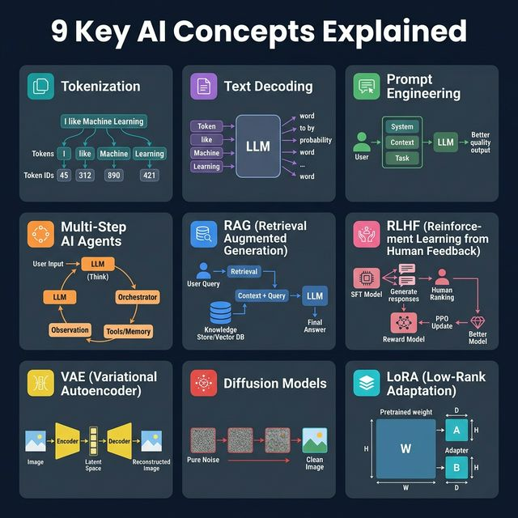
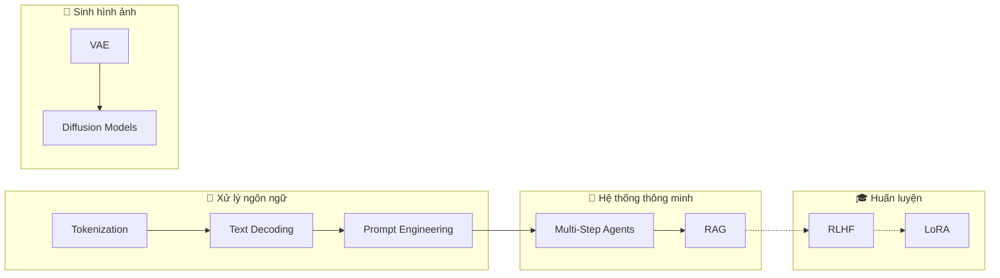

<!-- tags: system-design, ai -->
# 🤖 9 Key AI Concepts Explained

> "AI đang thay đổi cách chúng ta viết code, nhưng hiểu bản chất hoạt động bên trong mới là nền tảng để tận dụng đúng và đủ." — 9 khái niệm AI cốt lõi mà mọi engineer nên biết.

📅 Ngày tạo: 2026-03-22 · 🔄 Cập nhật: 2026-03-22 · ⏱️ 15 phút đọc

| Aspect         | Detail                                                                                      |
| -------------- | ------------------------------------------------------------------------------------------- |
| **Complexity** | 🌟🌟🌟🌟                                                                                    |
| **Use case**   | AI Engineering, LLM Integration, Prompt Design, Fine-tuning                                 |
| **Keywords**   | Tokenization, Text Decoding, Prompt Engineering, AI Agents, RAG, RLHF, VAE, Diffusion, LoRA |

---

## 1. DEFINE

Team đang dùng GPT-4 generate code, nhưng output có lúc brilliant, lúc hallucinate hoàn toàn sai. Product Manager hỏi: "Tại sao AI có lúc sai? Confidence score có đáng tin không?" Bạn không trả lời được vì chưa bao giờ nhìn sâu hơn API surface. 9 concepts dưới đây là foundation để hiểu AI đang làm gì bên trong — không phải ma thuật, mà statistics + linear algebra + optimization.

Một buổi review sản phẩm bỗng đầy những từ như tokenization, RAG, RLHF, LoRA, diffusion, và mọi người đều gật đầu như đã hiểu. Vấn đề là nếu team chỉ nhớ tên mà không giữ được mental model, quyết định AI sau đó sẽ dựa trên buzzword chứ không dựa trên cơ chế.


AI/ML có rất nhiều thuật ngữ phức tạp, nhưng có **9 khái niệm cốt lõi** mà khi nắm vững, bạn sẽ hiểu được phần lớn cách các hệ thống AI hiện đại hoạt động — từ ChatGPT đến Stable Diffusion.

| #   | Concept                  | Tên đầy đủ                                 | Mô tả ngắn                                                                |
| --- | ------------------------ | ------------------------------------------ | ------------------------------------------------------------------------- |
| 1   | **Tokenization**         | —                                          | Tách văn bản thành các đơn vị nhỏ (tokens) mà model có thể xử lý          |
| 2   | **Text Decoding**        | —                                          | Cách model chọn từ tiếp theo từ xác suất phân phối                        |
| 3   | **Prompt Engineering**   | —                                          | Nghệ thuật viết câu lệnh để hướng dẫn AI tạo output chính xác             |
| 4   | **Multi-Step AI Agents** | —                                          | AI tự lập kế hoạch, sử dụng tools, và lặp lại cho đến khi giải quyết xong |
| 5   | **RAG**                  | Retrieval-Augmented Generation             | Kết hợp tìm kiếm dữ liệu + sinh nội dung để trả lời chính xác hơn         |
| 6   | **RLHF**                 | Reinforcement Learning from Human Feedback | Dùng phản hồi con người để tinh chỉnh model an toàn hơn                   |
| 7   | **VAE**                  | Variational Autoencoder                    | Nén dữ liệu vào không gian tiềm ẩn rồi tái tạo lại                        |
| 8   | **Diffusion Models**     | —                                          | Tạo hình ảnh bằng cách gradually khử nhiễu từ random noise                |
| 9   | **LoRA**                 | Low-Rank Adaptation                        | Fine-tune model khổng lồ với chi phí rất nhỏ bằng adapter nhẹ             |

---

Các failure mode trên nghe rõ. Nhưng có trap: embedding model mismatch giữa index và query = search irrelevant, và prompt injection bypass safety = data leak. Trap đó sẽ xuất hiện ở PITFALLS.

## 2. VISUAL

Khái niệm đã có tên. Sang sơ đồ, `9 Key AI Concepts Explained` mới bộc lộ nơi dữ liệu chảy qua, nơi control đổi tay, và chỗ trade-off bắt đầu hiện hình.




### Sơ đồ: Mối quan hệ giữa các khái niệm AI



_(Ý tưởng cốt lõi: Tokenization là bước đầu tiên của mọi thứ — text phải được tách thành tokens trước khi model xử lý. Từ đó, các khái niệm khác xây dựng lên nhau để tạo ra hệ thống AI hoàn chỉnh)._

---

## 3. CODE

Sơ đồ đã lộ luồng chính. Đến code, `9 Key AI Concepts Explained` mới hiện ra thành những ranh giới mà team phải thật sự cài đặt và vận hành.


### 1. Tokenization — Tách văn bản thành tokens

Tokenization là bước đầu tiên: chuyển text thành các con số (token IDs) mà model có thể xử lý.

```go
package main

import (
    "fmt"
    "strings"
)

// SimpleTokenizer minh họa cơ chế tokenization cơ bản.
// Trong thực tế, GPT dùng BPE (Byte Pair Encoding),
// còn BERT dùng WordPiece — phức tạp hơn nhiều.
type SimpleTokenizer struct {
    vocab map[string]int // Từ điển: word → token ID
}

func NewSimpleTokenizer() *SimpleTokenizer {
    return &SimpleTokenizer{
        vocab: map[string]int{
            "I": 1, "like": 2, "machine": 3,
            "learning": 4, "is": 5, "fun": 6,
            "<UNK>": 0, // Token cho từ không biết
        },
    }
}

// Encode chuyển text → token IDs
func (t *SimpleTokenizer) Encode(text string) []int {
    words := strings.Fields(strings.ToLower(text))
    tokens := make([]int, len(words))
    for i, word := range words {
        if id, ok := t.vocab[word]; ok {
            tokens[i] = id
        } else {
            tokens[i] = t.vocab["<UNK>"] // Từ không có trong vocab
        }
    }
    return tokens
}

// Ví dụ: "I like machine learning" → [1, 2, 3, 4]
```

```typescript
class SimpleTokenizer {
    private readonly vocab = new Map<string, number>([
        ["i", 1],
        ["like", 2],
        ["machine", 3],
        ["learning", 4],
        ["<unk>", 0],
    ]);

    encode(text: string): number[] {
        return text.toLowerCase().split(/\s+/).map((word) => this.vocab.get(word) ?? 0);
    }
}
```

```rust
use std::collections::HashMap;

struct SimpleTokenizer {
    vocab: HashMap<String, i32>,
}

impl SimpleTokenizer {
    fn encode(&self, text: &str) -> Vec<i32> {
        text.to_lowercase()
            .split_whitespace()
            .map(|word| *self.vocab.get(word).unwrap_or(&0))
            .collect()
    }
}
```

```cpp
#include <sstream>
#include <string>
#include <unordered_map>
#include <vector>

std::vector<int> encode(const std::string& text, const std::unordered_map<std::string, int>& vocab) {
    std::istringstream input(text);
    std::vector<int> tokens;
    std::string word;
    while (input >> word) tokens.push_back(vocab.contains(word) ? vocab.at(word) : 0);
    return tokens;
}
```

```python
class SimpleTokenizer:
    def __init__(self) -> None:
        self.vocab = {"i": 1, "like": 2, "machine": 3, "learning": 4, "<unk>": 0}

    def encode(self, text: str) -> list[int]:
        return [self.vocab.get(word, 0) for word in text.lower().split()]
```

```java
// Java equivalent for assets/system-design/06-9-key-ai-concepts.md
// Source language used for adaptation: typescript
class SimpleTokenizer {
    // Keep the same responsibilities and flow as the implementations above.
}

final class 069KeyAiConceptsExample1 {
    private 069KeyAiConceptsExample1() {}

    static Object SimpleTokenizer(Object... args) {
        // Preserve the same algorithm / object collaboration shown above.
        return null;
    }
}
```

Foundation models đã cover. Nhưng RAG cần retrieval pipeline — hãy build.

### 2. Text Decoding — Chiến lược chọn từ tiếp theo

Sau khi model tính xác suất cho mỗi token tiềm năng, decoding strategy quyết định token nào được chọn.

```go
package main

import (
    "math"
    "math/rand"
)

// DecodingStrategy mô phỏng các chiến lược decoding.

// GreedyDecode luôn chọn token có xác suất cao nhất.
// Ưu: Nhanh, deterministic. Nhược: Nhàm chán, lặp lại.
func GreedyDecode(probs []float64) int {
    maxIdx := 0
    for i, p := range probs {
        if p > probs[maxIdx] {
            maxIdx = i
        }
    }
    return maxIdx
}

// TemperatureSample điều chỉnh "creativity" của model.
// temperature < 1.0 → Tập trung hơn (ít sáng tạo)
// temperature > 1.0 → Phân tán hơn (nhiều sáng tạo)
// temperature = 1.0 → Giữ nguyên phân phối gốc
func TemperatureSample(probs []float64, temperature float64) int {
    adjusted := make([]float64, len(probs))
    sum := 0.0
    for i, p := range probs {
        adjusted[i] = math.Exp(math.Log(p) / temperature)
        sum += adjusted[i]
    }
    // Chuẩn hóa thành xác suất
    for i := range adjusted {
        adjusted[i] /= sum
    }
    // Lấy mẫu ngẫu nhiên theo phân phối đã điều chỉnh
    r := rand.Float64()
    cumulative := 0.0
    for i, p := range adjusted {
        cumulative += p
        if r <= cumulative {
            return i
        }
    }
    return len(adjusted) - 1
}
```

```typescript
function greedyDecode(probs: number[]): number {
    return probs.reduce((best, current, index, array) => (current > array[best] ? index : best), 0);
}

function temperatureSample(probs: number[], temperature: number): number {
    const adjusted = probs.map((prob) => Math.exp(Math.log(prob) / temperature));
    const total = adjusted.reduce((sum, value) => sum + value, 0);
    let cumulative = 0;
    const target = Math.random();
    for (let index = 0; index < adjusted.length; index += 1) {
        cumulative += adjusted[index] / total;
        if (target <= cumulative) return index;
    }
    return adjusted.length - 1;
}
```

```rust
fn greedy_decode(probs: &[f64]) -> usize {
    probs
        .iter()
        .enumerate()
        .max_by(|a, b| a.1.partial_cmp(b.1).unwrap())
        .map(|(index, _)| index)
        .unwrap_or(0)
}
```

```cpp
#include <algorithm>
#include <vector>

int greedyDecode(const std::vector<double>& probs) {
    return static_cast<int>(std::distance(probs.begin(), std::max_element(probs.begin(), probs.end())));
}
```

```python
import math
import random


def greedy_decode(probs: list[float]) -> int:
    return max(range(len(probs)), key=lambda index: probs[index])


def temperature_sample(probs: list[float], temperature: float) -> int:
    adjusted = [math.exp(math.log(prob) / temperature) for prob in probs]
    total = sum(adjusted)
    target = random.random()
    cumulative = 0.0
    for index, value in enumerate(adjusted):
        cumulative += value / total
        if target <= cumulative:
            return index
    return len(adjusted) - 1
```

```java
// Java equivalent for assets/system-design/06-9-key-ai-concepts.md
// Source language used for adaptation: typescript
final class 069KeyAiConceptsExample2 {
    private 069KeyAiConceptsExample2() {}

    static Object greedyDecode(Object... args) {
        // Follow the same control flow and data-shape semantics as the reference implementation.
        return null;
    }

    static Object temperatureSample(Object... args) {
        // Follow the same control flow and data-shape semantics as the reference implementation.
        return null;
    }
}
```

### 3. Prompt Engineering — Cấu trúc prompt hiệu quả

```go
package main

import "fmt"

// PromptTemplate cấu trúc prompt theo best practices.
type PromptTemplate struct {
    SystemRole  string // Vai trò của AI
    Context     string // Bối cảnh / dữ liệu liên quan
    Task        string // Nhiệm vụ cụ thể
    OutputFormat string // Định dạng output mong muốn
}

// Build tạo ra prompt hoàn chỉnh theo format chuẩn.
func (p *PromptTemplate) Build() string {
    return fmt.Sprintf(`## System
%s

## Context
%s

## Task
%s

## Output Format
%s`, p.SystemRole, p.Context, p.Task, p.OutputFormat)
}

// Ví dụ sử dụng:
// prompt := PromptTemplate{
//     SystemRole:   "You are a senior Go engineer.",
//     Context:      "We have a REST API handling 10k req/s.",
//     Task:         "Review this code for performance issues.",
//     OutputFormat: "List issues as bullet points with severity.",
// }
// result := prompt.Build()
```

```typescript
type PromptTemplate = {
    systemRole: string;
    context: string;
    task: string;
    outputFormat: string;
};

function buildPrompt(template: PromptTemplate): string {
    return `## System\n${template.systemRole}\n\n## Context\n${template.context}\n\n## Task\n${template.task}\n\n## Output Format\n${template.outputFormat}`;
}
```

```rust
struct PromptTemplate {
    system_role: String,
    context: String,
    task: String,
    output_format: String,
}
```

```cpp
#include <string>

struct PromptTemplate {
    std::string systemRole;
    std::string context;
    std::string task;
    std::string outputFormat;
};
```

```python
from dataclasses import dataclass


@dataclass
class PromptTemplate:
    system_role: str
    context: str
    task: str
    output_format: str
```

```java
// Java equivalent for assets/system-design/06-9-key-ai-concepts.md
// Source language used for adaptation: typescript
final class 069KeyAiConceptsExample3 {
    private 069KeyAiConceptsExample3() {}

    static Object buildPrompt(Object... args) {
        // Follow the same control flow and data-shape semantics as the reference implementation.
        return null;
    }
}
```

### 4. Multi-Step AI Agents — ReAct Pattern

```go
package main

import "fmt"

// Agent thực hiện vòng lặp Thought → Action → Observation.
type Agent struct {
    tools   map[string]func(string) string
    memory  []string
    maxIter int
}

// Step thực hiện một bước trong vòng lặp agent.
type Step struct {
    Thought     string // AI suy nghĩ cần làm gì
    Action      string // Tool cần gọi
    ActionInput string // Input cho tool
    Observation string // Kết quả từ tool
}

// Run chạy agent loop cho đến khi có final answer.
func (a *Agent) Run(query string) string {
    for i := 0; i < a.maxIter; i++ {
        // 1. THOUGHT: LLM phân tích tình huống
        thought := fmt.Sprintf("Step %d: Analyzing '%s'", i+1, query)

        // 2. ACTION: Chọn tool phù hợp
        action := "search" // LLM sẽ quyết định tool nào

        // 3. OBSERVATION: Gọi tool và nhận kết quả
        tool, exists := a.tools[action]
        if !exists {
            continue
        }
        observation := tool(query)

        // Lưu vào memory
        a.memory = append(a.memory, fmt.Sprintf(
            "Thought: %s\nAction: %s\nObservation: %s",
            thought, action, observation,
        ))

        // 4. Nếu đủ thông tin → trả final answer
        if len(a.memory) >= 2 {
            return fmt.Sprintf("Final Answer based on %d steps", len(a.memory))
        }
    }
    return "Could not find answer"
}
```

```typescript
class Agent {
    constructor(
        private readonly tools: Record<string, (input: string) => string>,
        private readonly maxIter: number,
        private readonly memory: string[] = [],
    ) {}

    run(query: string): string {
        for (let index = 0; index < this.maxIter; index += 1) {
            const observation = this.tools.search?.(query) ?? "no tool";
            this.memory.push(`Step ${index + 1}: ${observation}`);
            if (this.memory.length >= 2) return `Final Answer based on ${this.memory.length} steps`;
        }
        return "Could not find answer";
    }
}
```

```rust
struct Agent {
    memory: Vec<String>,
    max_iter: usize,
}
```

```cpp
#include <string>
#include <vector>

class Agent {
public:
    std::string run(const std::string& query) {
        memory_.push_back("observe " + query);
        return "Final Answer";
    }

private:
    std::vector<std::string> memory_;
};
```

```python
class Agent:
    def __init__(self, tools: dict[str, callable], max_iter: int) -> None:
        self.tools = tools
        self.max_iter = max_iter
        self.memory: list[str] = []

    def run(self, query: str) -> str:
        for index in range(self.max_iter):
            observation = self.tools["search"](query)
            self.memory.append(f"Step {index + 1}: {observation}")
            if len(self.memory) >= 2:
                return f"Final Answer based on {len(self.memory)} steps"
        return "Could not find answer"
```

```java
// Java equivalent for assets/system-design/06-9-key-ai-concepts.md
// Source language used for adaptation: typescript
class Agent {
    // Keep the same responsibilities and flow as the implementations above.
}

final class 069KeyAiConceptsExample4 {
    private 069KeyAiConceptsExample4() {}

    static Object Agent(Object... args) {
        // Preserve the same algorithm / object collaboration shown above.
        return null;
    }
}
```

### 5. RAG — Retrieval-Augmented Generation

```go
package main

import (
    "fmt"
    "math"
    "sort"
)

// Document đại diện cho một tài liệu trong knowledge store.
type Document struct {
    Content   string
    Embedding []float64 // Vector biểu diễn ngữ nghĩa
}

// RAGPipeline kết hợp tìm kiếm + sinh nội dung.
type RAGPipeline struct {
    documents []Document
}

// CosineSimilarity tính độ tương đồng giữa 2 vectors.
func CosineSimilarity(a, b []float64) float64 {
    dotProduct, normA, normB := 0.0, 0.0, 0.0
    for i := range a {
        dotProduct += a[i] * b[i]
        normA += a[i] * a[i]
        normB += b[i] * b[i]
    }
    if normA == 0 || normB == 0 {
        return 0
    }
    return dotProduct / (math.Sqrt(normA) * math.Sqrt(normB))
}

// Retrieve tìm top-K documents gần nhất với query.
func (r *RAGPipeline) Retrieve(queryEmbedding []float64, topK int) []Document {
    type scored struct {
        doc   Document
        score float64
    }
    var results []scored
    for _, doc := range r.documents {
        score := CosineSimilarity(queryEmbedding, doc.Embedding)
        results = append(results, scored{doc, score})
    }
    sort.Slice(results, func(i, j int) bool {
        return results[i].score > results[j].score
    })
    docs := make([]Document, 0, topK)
    for i := 0; i < topK && i < len(results); i++ {
        docs = append(docs, results[i].doc)
    }
    return docs
}

// Generate tạo prompt kết hợp context + query rồi gọi LLM.
func (r *RAGPipeline) Generate(query string, context []Document) string {
    // Trong thực tế, đây là gọi OpenAI/Anthropic API
    prompt := fmt.Sprintf("Context:\n")
    for _, doc := range context {
        prompt += fmt.Sprintf("- %s\n", doc.Content)
    }
    prompt += fmt.Sprintf("\nQuestion: %s\nAnswer:", query)
    return prompt // → gửi tới LLM
}
```

```typescript
type Document = { content: string; embedding: number[] };

function cosineSimilarity(a: number[], b: number[]): number {
    const dot = a.reduce((sum, value, index) => sum + value * b[index], 0);
    const normA = Math.sqrt(a.reduce((sum, value) => sum + value * value, 0));
    const normB = Math.sqrt(b.reduce((sum, value) => sum + value * value, 0));
    return normA === 0 || normB === 0 ? 0 : dot / (normA * normB);
}
```

```rust
struct Document {
    content: String,
    embedding: Vec<f64>,
}
```

```cpp
#include <string>
#include <vector>

struct Document {
    std::string content;
    std::vector<double> embedding;
};
```

```python
from dataclasses import dataclass
from math import sqrt


@dataclass
class Document:
    content: str
    embedding: list[float]


def cosine_similarity(a: list[float], b: list[float]) -> float:
    dot = sum(x * y for x, y in zip(a, b))
    norm_a = sqrt(sum(x * x for x in a))
    norm_b = sqrt(sum(y * y for y in b))
    return 0.0 if norm_a == 0 or norm_b == 0 else dot / (norm_a * norm_b)
```

```java
// Java equivalent for assets/system-design/06-9-key-ai-concepts.md
// Source language used for adaptation: typescript
final class 069KeyAiConceptsExample5 {
    private 069KeyAiConceptsExample5() {}

    static Object cosineSimilarity(Object... args) {
        // Follow the same control flow and data-shape semantics as the reference implementation.
        return null;
    }
}
```

---

Bạn đã đi qua AI concepts. Bây giờ đến phần nguy hiểm: embedding mismatch và prompt injection — trap đã được setup từ đầu bài.

## 4. PITFALLS

Hiểu được `9 Key AI Concepts Explained` là bước đầu; giữ nó không phản chủ trong vận hành mới là phần khó. Những pitfalls sau là các chỗ team hay trả giá nhất.


| # | Severity | Lỗi (Pitfall) | Hậu quả | Fix (Giải pháp) |
| --- | --- | --- | --- | --- |
| 1 | 🔴 Fatal | **Bỏ qua token limits** | Prompt quá dài bị cắt ngắn, model thiếu context trả lời sai. | Đếm tokens trước khi gửi. Dùng tiktoken (OpenAI) hoặc tokenizer tương ứng để kiểm soát. |
| 2 | 🔴 Fatal | **Dùng temperature = 0 cho mọi use case** | Output cứng nhắc, thiếu sáng tạo. Nhưng temperature cao cho code → sinh code sai. | Code/Math: temperature 0–0.2. Creative writing: 0.7–1.0. Brainstorming: 1.0+. |
| 3 | 🟡 Common | **RAG không có chunking strategy** | Documents quá dài không fit vào context window. Quá ngắn mất ngữ cảnh. | Chunk 500–1000 tokens với 100–200 tokens overlap. Dùng semantic chunking thay vì split cơ học. |
| 4 | 🟡 Common | **Fine-tune full model thay vì LoRA** | Tốn hàng ngàn USD GPU, mất tuần training. Overfit dữ liệu nhỏ. | LoRA chỉ train 0.1–1% parameters. Rẻ hơn 100x, nhanh hơn 10x, kết quả tương đương. |
| 5 | 🟡 Common | **Không có guardrails cho AI Agents** | Agent loop vô hạn, gọi API vô tội vạ, tốn tiền bill khổng lồ. | Set max iterations, timeout, và budget limits. Validate mỗi action trước khi thực thi. |

---

Bạn đã đi qua AI Concepts và cạm bẫy. Các resources dưới đây giúp đi sâu hơn.

## 5. REF

| Resource                 | Link                                                                   |
| ------------------------ | ---------------------------------------------------------------------- |
| OpenAI Tokenizer         | [platform.openai.com/tokenizer](https://platform.openai.com/tokenizer) |
| Prompt Engineering Guide | [promptingguide.ai](https://www.promptingguide.ai/)                    |
| RAG Paper (Lewis et al.) | [arxiv.org/abs/2005.11401](https://arxiv.org/abs/2005.11401)           |
| LoRA Paper (Hu et al.)   | [arxiv.org/abs/2106.09685](https://arxiv.org/abs/2106.09685)           |
| RLHF — InstructGPT Paper | [arxiv.org/abs/2203.02155](https://arxiv.org/abs/2203.02155)           |

---

## 6. RECOMMEND

Khi đã thấy `9 Key AI Concepts Explained` giải quyết bài toán gì và hay đổ vỡ ở đâu, các tài liệu dưới đây sẽ mở rộng đúng hướng thay vì kéo bạn sang buzzword khác.


| Mở rộng                       | Khi nào cần               | Lý do                                                                           |
| ----------------------------- | ------------------------- | ------------------------------------------------------------------------------- |
| **LangChain / LlamaIndex**    | Xây dựng RAG production   | Framework chuẩn để kết nối LLM với data sources, vector stores, tools.          |
| **Ollama + Local LLMs**       | AI không phụ thuộc cloud  | Chạy Llama 3, Mistral, Gemma trên máy local. Privacy-first, zero API cost.      |
| **Hugging Face Transformers** | Fine-tuning và nghiên cứu | Thư viện Python chuẩn công nghiệp cho training, inference, model sharing.       |
| **Vector Databases**          | RAG scale lớn             | Pinecone, Weaviate, Qdrant, pgvector — lưu trữ và tìm kiếm embeddings hiệu quả. |

---

---

**Callback**: Quay lại câu hỏi PM: "Tại sao AI có lúc sai?" Bây giờ bạn biết: model predict probability distribution, không phải truth. Temperature, top-k, embedding space, attention mechanism — mỗi concept giải thích một behavior bạn thấy ở output.

← Previous: [Network Protocols Explained](./05-network-protocols-explained.md) · → Next: [Top Software Architectural Styles](./07-software-architecture-styles.md) · ← Quay về [System Design](./README.md)
