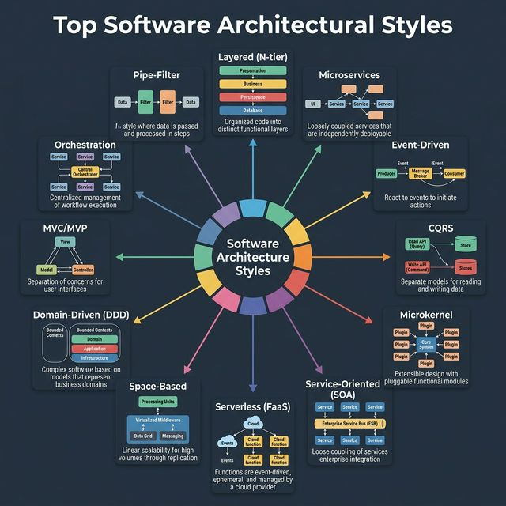
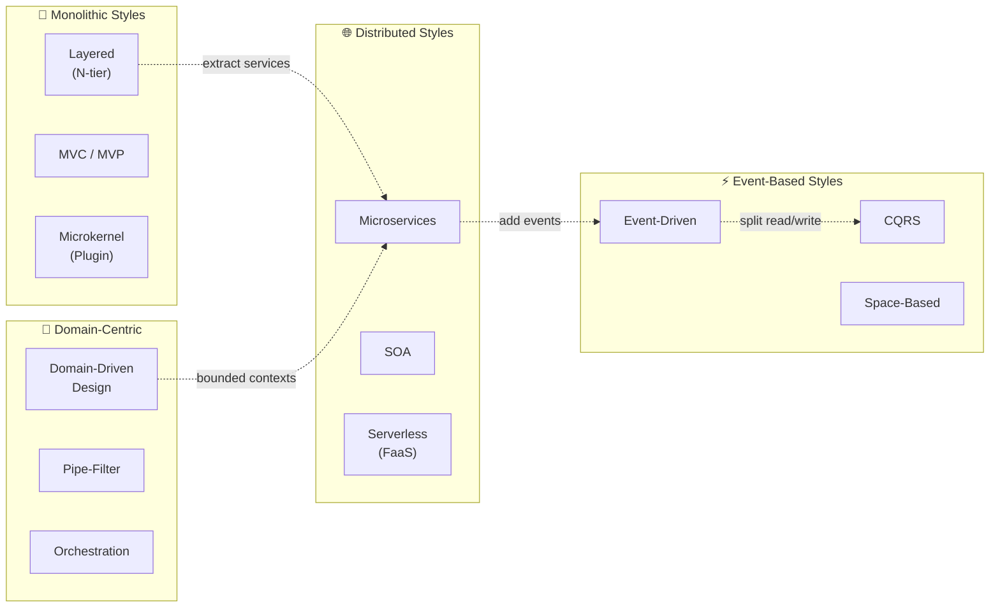

<!-- tags: system-design, architecture -->
# 🏗️ Top Software Architectural Styles

> Kiến trúc phần mềm quyết định cách hệ thống hoạt động, mở rộng, và bảo trì. Chọn sai kiến trúc có thể khiến dự án phải viết lại từ đầu — chọn đúng giúp team ship nhanh và tự tin trong nhiều năm.

📅 Ngày tạo: 2026-03-22 · 🔄 Cập nhật: 2026-03-22 · ⏱️ 15 phút đọc

| Aspect         | Detail                                                                                     |
| -------------- | ------------------------------------------------------------------------------------------ |
| **Complexity** | 🌟🌟🌟🌟                                                                                   |
| **Use case**   | System Design, Architecture Decision Records, Technical Leadership                         |
| **Keywords**   | Layered, Microservices, Event-Driven, CQRS, DDD, SOA, Microkernel, Serverless, Space-Based |

---

## 1. DEFINE

Year 1: monolith chạy perfect, team 5 người ship weekly. Year 3: team 30 người, monolith compile 45 phút, deploy queue dài 3 ngày, mỗi merge conflict là một cuộc chiến. CTO tuyên bố: "Chuyển microservices!" 18 tháng migration, cost tăng 4x, zero business feature mới. Sai lầm không phải monolith — sai lầm là chọn architecture style theo trend thay vì theo pressure hệ thống đang chịu.


Kiến trúc phần mềm cung cấp **blueprint** cho system design, mô tả cách các components tương tác với nhau để deliver chức năng cụ thể. Mỗi architectural style giải quyết một nhóm vấn đề khác nhau — không có kiến trúc nào là "tốt nhất" cho mọi trường hợp.

| #   | Architectural Style        | Mô tả ngắn                                                          | Khi nào dùng                                  |
| --- | -------------------------- | ------------------------------------------------------------------- | --------------------------------------------- |
| 1   | **Layered (N-tier)**       | Chia phần mềm thành các tầng logic (Presentation → Business → Data) | Ứng dụng CRUD truyền thống, enterprise apps   |
| 2   | **Microservices**          | Suite các services nhỏ, deploy độc lập, mỗi service 1 trách nhiệm   | Hệ thống lớn cần scale từng phần, nhiều team  |
| 3   | **Event-Driven**           | Các components giao tiếp qua events, loosely coupled                | Real-time processing, pub/sub, IoT            |
| 4   | **CQRS**                   | Tách riêng Read (Query) và Write (Command) operations               | Hệ thống đọc/ghi workload chênh lệch lớn      |
| 5   | **Microkernel (Plugin)**   | Core system tối giản + plugin mở rộng                               | IDE, browser extensions, rule engines         |
| 6   | **Service-Oriented (SOA)** | Services giao tiếp qua Enterprise Service Bus (ESB)                 | Enterprise integration, legacy modernization  |
| 7   | **Serverless (FaaS)**      | Functions chạy on-demand, không quản lý server                      | Event processing, webhooks, APIs nhỏ          |
| 8   | **Space-Based**            | Processing units + Virtualized Middleware (Data Grid)               | Hệ thống ultra-high concurrency, trading      |
| 9   | **Domain-Driven (DDD)**    | Tập trung vào domain logic, Bounded Contexts                        | Business logic phức tạp, nhiều domain experts |
| 10  | **MVC / MVP**              | Tách Model-View-Controller/Presenter                                | Web apps, mobile apps, GUI applications       |
| 11  | **Pipe-Filter**            | Data chảy qua chuỗi filter theo thứ tự                              | Data pipelines, ETL, compiler stages          |
| 12  | **Orchestration**          | Central orchestrator điều phối flow giữa các services               | Workflow engines, saga pattern                |

---

Các failure mode trên nghe dễ tránh. Nhưng có trap: monolith biến distributed monolith = worst of both worlds, và microservice quá sớm = complexity overhead. Trap đó sẽ xuất hiện ở PITFALLS.

## 2. VISUAL

Khái niệm đã có tên. Sang sơ đồ, `Top Software Architectural Styles` mới bộc lộ nơi dữ liệu chảy qua, nơi control đổi tay, và chỗ trade-off bắt đầu hiện hình.




### Sơ đồ: So sánh các Architectural Styles



_(Ý tưởng cốt lõi: Các architectural styles không loại trừ nhau — một hệ thống thực tế thường kết hợp nhiều styles. Ví dụ: Microservices + Event-Driven + CQRS + DDD là combo rất phổ biến)._

---

## 3. CODE

Từ sơ đồ sang implementation là chỗ nhiều hiểu lầm nhất. Đoạn code tiếp theo giúp `Top Software Architectural Styles` đứng xuống mặt đất thay vì ở lại trên whiteboard.


### 1. Layered Architecture — Classic N-tier

Chia code thành các tầng, mỗi tầng chỉ gọi tầng ngay bên dưới.

```go
package main

// ─── LAYER 1: Presentation (HTTP Handler) ───
type UserHandler struct {
    service UserService
}

func (h *UserHandler) GetUser(w http.ResponseWriter, r *http.Request) {
    id := r.URL.Query().Get("id")
    user, err := h.service.FindByID(r.Context(), id) // Gọi xuống Business Layer
    if err != nil {
        http.Error(w, err.Error(), http.StatusNotFound)
        return
    }
    json.NewEncoder(w).Encode(user)
}

// ─── LAYER 2: Business Logic (Service) ───
type UserService struct {
    repo UserRepository
}

func (s *UserService) FindByID(ctx context.Context, id string) (*User, error) {
    user, err := s.repo.GetByID(ctx, id) // Gọi xuống Data Layer
    if err != nil {
        return nil, fmt.Errorf("user not found: %w", err)
    }
    // Business rules tại đây
    user.LastAccessed = time.Now()
    return user, nil
}

// ─── LAYER 3: Data Access (Repository) ───
type UserRepository struct {
    db *sql.DB
}

func (r *UserRepository) GetByID(ctx context.Context, id string) (*User, error) {
    var user User
    err := r.db.QueryRowContext(ctx,
        "SELECT id, name, email FROM users WHERE id = $1", id,
    ).Scan(&user.ID, &user.Name, &user.Email)
    return &user, err
}
```

```typescript
type User = { id: string; name: string; email: string; lastAccessed?: Date };

class UserRepository {
    async getById(id: string): Promise<User> {
        return { id, name: "Alice", email: "alice@example.com" };
    }
}

class UserService {
    constructor(private readonly repo: UserRepository) {}

    async findById(id: string): Promise<User> {
        const user = await this.repo.getById(id);
        user.lastAccessed = new Date();
        return user;
    }
}
```

```rust
struct UserService<R> {
    repo: R,
}
```

```cpp
struct User {
    std::string id;
    std::string name;
    std::string email;
};
```

```python
class UserRepository:
    def get_by_id(self, user_id: str) -> dict:
        return {"id": user_id, "name": "Alice", "email": "alice@example.com"}


class UserService:
    def __init__(self, repo: UserRepository) -> None:
        self.repo = repo

    def find_by_id(self, user_id: str) -> dict:
        user = self.repo.get_by_id(user_id)
        user["last_accessed"] = "now"
        return user
```

```java
// Java equivalent for assets/system-design/07-software-architecture-styles.md
// Source language used for adaptation: typescript
class UserRepository {
    // Keep the same responsibilities and flow as the implementations above.
}

class UserService {
    // Keep the same responsibilities and flow as the implementations above.
}

final class 07SoftwareArchitectureStylesExample1 {
    private 07SoftwareArchitectureStylesExample1() {}

    static Object getById(Object... args) {
        // Follow the same control flow and data-shape semantics as the reference implementation.
        return null;
    }

    static Object findById(Object... args) {
        // Follow the same control flow and data-shape semantics as the reference implementation.
        return 0;
    }

    static Object Date(Object... args) {
        // Follow the same control flow and data-shape semantics as the reference implementation.
        return null;
    }
}
```

Layered architecture đã cover. Nhưng event-driven cần async mindset — hãy decouple.

### 2. Event-Driven Architecture

Components giao tiếp qua events thay vì gọi trực tiếp — loosely coupled.

```go
package events

import "sync"

// EventBus là message broker đơn giản cho Event-Driven Architecture.
type EventBus struct {
    mu       sync.RWMutex
    handlers map[string][]func(Event)
}

type Event struct {
    Type    string
    Payload any
}

func NewEventBus() *EventBus {
    return &EventBus{handlers: make(map[string][]func(Event))}
}

// Subscribe đăng ký handler cho một loại event.
func (eb *EventBus) Subscribe(eventType string, handler func(Event)) {
    eb.mu.Lock()
    defer eb.mu.Unlock()
    eb.handlers[eventType] = append(eb.handlers[eventType], handler)
}

// Publish phát event tới tất cả subscribers — async, loosely coupled.
func (eb *EventBus) Publish(event Event) {
    eb.mu.RLock()
    defer eb.mu.RUnlock()
    for _, handler := range eb.handlers[event.Type] {
        go handler(event) // Async execution — không block publisher
    }
}

// Sử dụng:
// bus := NewEventBus()
// bus.Subscribe("user.created", func(e Event) { sendWelcomeEmail(e) })
// bus.Subscribe("user.created", func(e Event) { createAuditLog(e) })
// bus.Publish(Event{Type: "user.created", Payload: newUser})
```

```typescript
type Event = { type: string; payload: unknown };

class EventBus {
    private readonly handlers = new Map<string, Array<(event: Event) => void>>();

    subscribe(eventType: string, handler: (event: Event) => void): void {
        this.handlers.set(eventType, [...(this.handlers.get(eventType) ?? []), handler]);
    }

    publish(event: Event): void {
        for (const handler of this.handlers.get(event.type) ?? []) {
            queueMicrotask(() => handler(event));
        }
    }
}
```

```rust
struct Event {
    event_type: String,
}
```

```cpp
#include <functional>
#include <string>
#include <unordered_map>
#include <vector>

struct Event {
    std::string type;
};
```

```python
class EventBus:
    def __init__(self) -> None:
        self.handlers: dict[str, list] = {}

    def subscribe(self, event_type: str, handler) -> None:
        self.handlers.setdefault(event_type, []).append(handler)

    def publish(self, event: dict) -> None:
        for handler in self.handlers.get(event["type"], []):
            handler(event)
```

```java
// Java equivalent for assets/system-design/07-software-architecture-styles.md
// Source language used for adaptation: typescript
class EventBus {
    // Keep the same responsibilities and flow as the implementations above.
}

final class 07SoftwareArchitectureStylesExample2 {
    private 07SoftwareArchitectureStylesExample2() {}

    static Object EventBus(Object... args) {
        // Preserve the same algorithm / object collaboration shown above.
        return null;
    }
}
```

### 3. CQRS — Tách Read và Write

```go
package cqrs

import "context"

// ─── COMMAND SIDE (Write) ───
type CreateOrderCommand struct {
    UserID    string
    ProductID string
    Quantity  int
}

type CommandHandler struct {
    writeDB *sql.DB // Database tối ưu cho write (normalized)
}

func (h *CommandHandler) Handle(ctx context.Context, cmd CreateOrderCommand) error {
    _, err := h.writeDB.ExecContext(ctx,
        "INSERT INTO orders (user_id, product_id, quantity) VALUES ($1, $2, $3)",
        cmd.UserID, cmd.ProductID, cmd.Quantity,
    )
    // Sau khi write thành công → publish event để sync read model
    return err
}

// ─── QUERY SIDE (Read) ───
type OrderSummary struct {
    OrderID     string
    UserName    string
    ProductName string
    Total       float64
}

type QueryHandler struct {
    readDB *sql.DB // Database tối ưu cho read (denormalized, pre-joined)
}

func (h *QueryHandler) GetOrderSummary(ctx context.Context, orderID string) (*OrderSummary, error) {
    var summary OrderSummary
    // Read model đã được denormalize sẵn — query nhanh, không cần JOIN
    err := h.readDB.QueryRowContext(ctx,
        "SELECT order_id, user_name, product_name, total FROM order_summaries WHERE order_id = $1",
        orderID,
    ).Scan(&summary.OrderID, &summary.UserName, &summary.ProductName, &summary.Total)
    return &summary, err
}
```

```typescript
type CreateOrderCommand = { userId: string; productId: string; quantity: number };
type OrderSummary = { orderId: string; userName: string; productName: string; total: number };
```

```rust
struct CreateOrderCommand {
    user_id: String,
    product_id: String,
    quantity: i32,
}
```

```cpp
struct OrderSummary {
    std::string orderId;
    std::string userName;
    std::string productName;
    double total;
};
```

```python
class CommandHandler:
    def handle(self, command: dict) -> None:
        print("insert order", command)


class QueryHandler:
    def get_order_summary(self, order_id: str) -> dict:
        return {"order_id": order_id, "user_name": "Alice", "product_name": "Book", "total": 42.0}
```

```java
// Java equivalent for assets/system-design/07-software-architecture-styles.md
// Source language used for adaptation: typescript
final class 07SoftwareArchitectureStylesExample3 {
    private 07SoftwareArchitectureStylesExample3() {}

    static Object example3(Object... args) {
        // Preserve the same algorithm / object collaboration shown above.
        return null;
    }
}
```

### 4. Microkernel (Plugin Architecture)

```go
package plugin

// Plugin interface — mọi plugin phải implement interface này.
type Plugin interface {
    Name() string
    Execute(input map[string]any) (map[string]any, error)
}

// CoreSystem là kernel tối giản, chỉ biết load và chạy plugins.
type CoreSystem struct {
    plugins map[string]Plugin
}

func NewCoreSystem() *CoreSystem {
    return &CoreSystem{plugins: make(map[string]Plugin)}
}

// Register thêm plugin vào core system.
func (c *CoreSystem) Register(p Plugin) {
    c.plugins[p.Name()] = p
}

// Run thực thi một plugin theo tên.
func (c *CoreSystem) Run(name string, input map[string]any) (map[string]any, error) {
    p, ok := c.plugins[name]
    if !ok {
        return nil, fmt.Errorf("plugin %q not found", name)
    }
    return p.Execute(input)
}

// Ví dụ plugin cụ thể:
type TaxCalculator struct{}
func (t *TaxCalculator) Name() string { return "tax-calculator" }
func (t *TaxCalculator) Execute(input map[string]any) (map[string]any, error) {
    amount := input["amount"].(float64)
    return map[string]any{"tax": amount * 0.1}, nil
}
```

```typescript
interface Plugin {
    name(): string;
    execute(input: Record<string, unknown>): Record<string, unknown>;
}

class CoreSystem {
    private readonly plugins = new Map<string, Plugin>();

    register(plugin: Plugin): void {
        this.plugins.set(plugin.name(), plugin);
    }
}
```

```rust
trait Plugin {
    fn name(&self) -> &str;
}
```

```cpp
#include <string>

class Plugin {
public:
    virtual std::string name() const = 0;
    virtual ~Plugin() = default;
};
```

```python
class Plugin:
    def name(self) -> str:
        raise NotImplementedError


class CoreSystem:
    def __init__(self) -> None:
        self.plugins: dict[str, Plugin] = {}

    def register(self, plugin: Plugin) -> None:
        self.plugins[plugin.name()] = plugin
```

```java
// Java equivalent for assets/system-design/07-software-architecture-styles.md
// Source language used for adaptation: typescript
class Plugin {
    // Keep the same responsibilities and flow as the implementations above.
}

class CoreSystem {
    // Keep the same responsibilities and flow as the implementations above.
}

final class 07SoftwareArchitectureStylesExample4 {
    private 07SoftwareArchitectureStylesExample4() {}

    static Object CoreSystem(Object... args) {
        // Preserve the same algorithm / object collaboration shown above.
        return null;
    }
}
```

---

Bạn đã đi qua architecture styles. Bây giờ đến phần nguy hiểm: distributed monolith và premature microservices — trap đã được setup từ đầu bài.

## 4. PITFALLS

Khi đưa `Top Software Architectural Styles` vào production, lỗi thường không nằm ở khái niệm mà ở assumptions đội ngũ mang theo lúc triển khai. Bảng dưới đây gom đúng những cú trượt đó.


| # | Severity | Lỗi (Pitfall) | Hậu quả | Fix (Giải pháp) |
| --- | --- | --- | --- | --- |
| 1 | 🔴 Fatal | **Chọn Microservices cho dự án nhỏ** | Overhead deployment, monitoring, networking vượt xa benefits. 2-3 developers quản lý 20 services = disaster. | Bắt đầu với Monolith hoặc Modular Monolith. Extract services khi thật sự cần scale riêng. |
| 2 | 🔴 Fatal | **Layered Architecture với big ball of mud** | Business logic rò rỉ vào Presentation layer, Repository biết về HTTP context. | Enforce dependency rules: mỗi layer chỉ import layer ngay dưới. Dùng interfaces tại boundaries. |
| 3 | 🟡 Common | **Event-Driven không có Dead Letter Queue** | Events bị mất khi consumer crash → dữ liệu inconsistent, không ai biết. | Cấu hình DLQ cho mọi queue. Monitor DLQ size. Implement retry + exponential backoff. |
| 4 | 🟡 Common | **CQRS everywhere** | Complexity tăng gấp đôi (2 models, sync mechanism) cho hệ thống CRUD đơn giản. | Chỉ dùng CQRS khi read/write workload chênh lệch ≥10:1 hoặc cần different read models. |
| 5 | 🟡 Common | **DDD với anemic domain model** | Domain objects chỉ là data holders (getters/setters), business logic nằm ở services → mất hết lợi ích DDD. | Business rules phải nằm trong Domain Entities/Aggregates. Services chỉ orchestrate, không chứa logic. |

---

Bạn đã đi qua Architecture Styles và cạm bẫy. Các resources dưới đây giúp đi sâu hơn.

## 5. REF

| Resource                                                | Link                                                                                        |
| ------------------------------------------------------- | ------------------------------------------------------------------------------------------- |
| Fundamentals of Software Architecture (Richards & Ford) | [oreilly.com](https://www.oreilly.com/library/view/fundamentals-of-software/9781492043447/) |
| Martin Fowler — Software Architecture Guide             | [martinfowler.com](https://martinfowler.com/architecture/)                                  |
| Microsoft — Cloud Architecture Patterns                 | [learn.microsoft.com](https://learn.microsoft.com/en-us/azure/architecture/patterns/)       |
| System Design Primer                                    | [github.com/donnemartin](https://github.com/donnemartin/system-design-primer)               |

---

## 6. RECOMMEND

Khi đã thấy `Top Software Architectural Styles` giải quyết bài toán gì và hay đổ vỡ ở đâu, các tài liệu dưới đây sẽ mở rộng đúng hướng thay vì kéo bạn sang buzzword khác.


| Mở rộng                                 | Khi nào cần                                | Lý do                                                                                                   |
| --------------------------------------- | ------------------------------------------ | ------------------------------------------------------------------------------------------------------- |
| **Architecture Decision Records (ADR)** | Mọi dự án                                  | Ghi lại WHY chọn kiến trúc X thay vì Y. Khi team mới join, họ hiểu context thay vì đoán.                |
| **Modular Monolith**                    | Migration path từ monolith → microservices | Tách logic thành modules rõ ràng trong 1 deployable unit. Khi ready → extract module thành service.     |
| **Saga Pattern**                        | Distributed transactions                   | Khi một business operation span nhiều services, Saga orchestrate compensating transactions thay vì 2PC. |
| **Strangler Fig Pattern**               | Modernize legacy systems                   | Dần dần thay thế từng phần legacy bằng new services, không cần big-bang rewrite.                        |

---

---

**Callback**: Quay lại 18 tháng migration, 4x cost, zero feature mới. Bây giờ bạn biết: architecture style phải match team size, deployment frequency, và scaling pressure — không phải trend. Monolith → modular monolith → microservices là evolution, không phải revolution.

← Previous: [9 Key AI Concepts Explained](./06-9-key-ai-concepts.md) · → Next: [12 Architectural Concepts](./08-architectural-concepts.md) · ← Quay về [System Design](./README.md)
