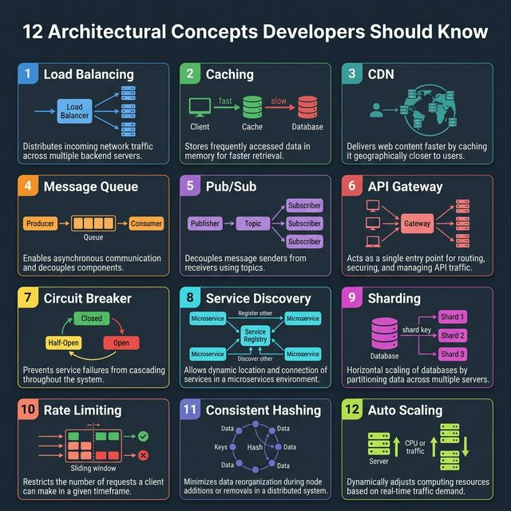
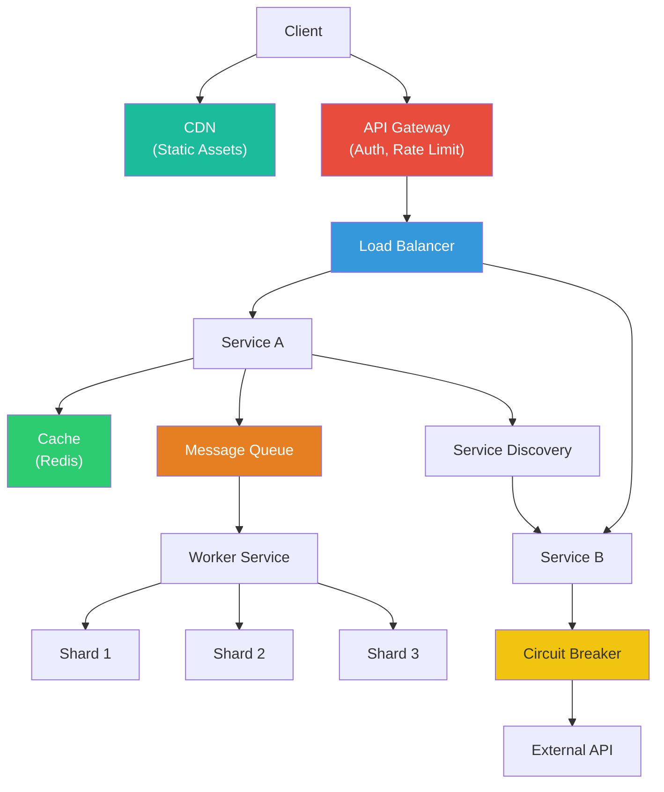

<!-- tags: system-design, ai, architecture -->
# 🏛️ 12 Architectural Concepts Developers Should Know

> Những khái niệm kiến trúc này xuất hiện trong hầu hết mọi hệ thống production. Không cần xây tất cả từ đầu, nhưng cần hiểu chúng hoạt động thế nào để đưa ra architectural decisions đúng đắn.

📅 Ngày tạo: 2026-03-22 · 🔄 Cập nhật: 2026-03-22 · ⏱️ 15 phút đọc

| Aspect         | Detail                                                                                                                                                           |
| -------------- | ---------------------------------------------------------------------------------------------------------------------------------------------------------------- |
| **Complexity** | 🌟🌟🌟🌟                                                                                                                                                         |
| **Use case**   | System Design Interviews, Production Architecture, Scaling                                                                                                       |
| **Keywords**   | Load Balancing, Caching, CDN, Message Queue, Pub/Sub, API Gateway, Circuit Breaker, Service Discovery, Sharding, Rate Limiting, Consistent Hashing, Auto Scaling |

---

## 1. DEFINE

Whiteboard meeting: 6 engineers, mỗi người ném một buzzword — "circuit breaker!", "sharding!", "CQRS!", "rate limiting!". Sau 2 giờ, whiteboard đầy boxes và arrows nhưng không ai trả lời được: "Concept nào giải quyết áp lực nào?" 12 concepts dưới đây không phải để kể tên — mà để gắn đúng concept vào đúng failure mode.


Mỗi khái niệm dưới đây giải quyết một thách thức cụ thể khi hệ thống cần **scale, reliability, hoặc performance**. Hiểu rõ 12 concepts này là nền tảng để thiết kế bất kỳ distributed system nào.

| #   | Concept                | Mô tả                                                        | Vấn đề giải quyết                                  |
| --- | ---------------------- | ------------------------------------------------------------ | -------------------------------------------------- |
| 1   | **Load Balancing**     | Phân tải incoming traffic tới nhiều servers                  | Tránh single server bị quá tải                     |
| 2   | **Caching**            | Lưu dữ liệu hay truy cập vào memory (Redis, Memcached)       | Giảm latency, giảm load database                   |
| 3   | **CDN**                | Phân phối static assets tới edge servers gần user            | Giảm latency download cho global users             |
| 4   | **Message Queue**      | Producer enqueue messages, consumers xử lý async             | Decouple components, xử lý bất đồng bộ             |
| 5   | **Pub/Sub**            | Publish messages tới topic, nhiều subscribers nhận           | Fan-out events tới nhiều consumers                 |
| 6   | **API Gateway**        | Entry point duy nhất cho client requests                     | Routing, auth, rate limiting, protocol translation |
| 7   | **Circuit Breaker**    | Monitor downstream calls, ngắt khi failure vượt threshold    | Prevent cascade failures                           |
| 8   | **Service Discovery**  | Tự động track available service instances                    | Dynamic service-to-service communication           |
| 9   | **Sharding**           | Chia dataset lớn ra nhiều nodes theo shard key               | Scale writes horizontally                          |
| 10  | **Rate Limiting**      | Giới hạn requests trong time window                          | Chống abuse, bảo vệ services khỏi overload         |
| 11  | **Consistent Hashing** | Phân phối data với minimal reorganization khi nodes thay đổi | Stable data distribution trong dynamic clusters    |
| 12  | **Auto Scaling**       | Tự động thêm/bớt compute resources theo metrics              | Tối ưu cost và luôn đủ capacity                    |

---

Các failure mode trên nghe cơ bản. Nhưng có trap: CAP theorem hiểu sai = tưởng chọn được 3/3, và eventual consistency không handle conflict = data diverge. Trap đó sẽ xuất hiện ở PITFALLS.

## 2. VISUAL

Khái niệm đã có tên. Sang sơ đồ, `12 Architectural Concepts Developers Should Know` mới bộc lộ nơi dữ liệu chảy qua, nơi control đổi tay, và chỗ trade-off bắt đầu hiện hình.




### Sơ đồ: Kiến trúc tổng hợp sử dụng 12 concepts



_(Ý tưởng cốt lõi: Trong một hệ thống production thực tế, các concepts này **kết hợp với nhau** — client requests đi qua CDN → API Gateway → Load Balancer → Services → Cache/Queue/Database. Mỗi lớp giải quyết một vấn đề riêng)._

---

## 3. CODE

Sơ đồ đã lộ luồng chính. Đến code, `12 Architectural Concepts Developers Should Know` mới hiện ra thành những ranh giới mà team phải thật sự cài đặt và vận hành.


### 1. Load Balancer — Round Robin đơn giản

```go
package lb

import "sync/atomic"

// RoundRobinLB phân phối requests đều giữa các servers.
type RoundRobinLB struct {
    servers []string
    counter uint64
}

func NewRoundRobinLB(servers []string) *RoundRobinLB {
    return &RoundRobinLB{servers: servers}
}

// Next trả về server tiếp theo theo vòng tròn.
// Thread-safe nhờ atomic operations.
func (lb *RoundRobinLB) Next() string {
    idx := atomic.AddUint64(&lb.counter, 1)
    return lb.servers[idx%uint64(len(lb.servers))]
}
// Ví dụ: servers = ["10.0.0.1", "10.0.0.2", "10.0.0.3"]
// Request 1 → 10.0.0.2, Request 2 → 10.0.0.3, Request 3 → 10.0.0.1
```

```typescript
class RoundRobinLB {
    private counter = 0;

    constructor(private readonly servers: string[]) {}

    next(): string {
        const server = this.servers[this.counter % this.servers.length];
        this.counter += 1;
        return server;
    }
}
```

```rust
struct RoundRobinLb {
    servers: Vec<String>,
    counter: usize,
}
```

```cpp
#include <string>
#include <vector>

class RoundRobinLB {
public:
    explicit RoundRobinLB(std::vector<std::string> servers) : servers_(std::move(servers)) {}
    std::string next() { return servers_[counter_++ % servers_.size()]; }
private:
    std::vector<std::string> servers_;
    std::size_t counter_{0};
};
```

```python
class RoundRobinLB:
    def __init__(self, servers: list[str]) -> None:
        self.servers = servers
        self.counter = 0

    def next(self) -> str:
        server = self.servers[self.counter % len(self.servers)]
        self.counter += 1
        return server
```

```java
// Java equivalent for assets/system-design/08-architectural-concepts.md
// Source language used for adaptation: typescript
class RoundRobinLB {
    // Keep the same responsibilities and flow as the implementations above.
}

final class 08ArchitecturalConceptsExample1 {
    private 08ArchitecturalConceptsExample1() {}

    static Object RoundRobinLB(Object... args) {
        // Preserve the same algorithm / object collaboration shown above.
        return null;
    }
}
```

CAP theorem đã cover. Nhưng CQRS cần read/write separation — hãy split.

### 2. Cache — In-Memory Cache with TTL

```go
package cache

import (
    "sync"
    "time"
)

type entry struct {
    value     any
    expiresAt time.Time
}

// TTLCache lưu dữ liệu trong memory với thời gian hết hạn.
type TTLCache struct {
    mu    sync.RWMutex
    items map[string]entry
}

func NewTTLCache() *TTLCache {
    return &TTLCache{items: make(map[string]entry)}
}

// Set thêm item vào cache với TTL cụ thể.
func (c *TTLCache) Set(key string, value any, ttl time.Duration) {
    c.mu.Lock()
    defer c.mu.Unlock()
    c.items[key] = entry{
        value:     value,
        expiresAt: time.Now().Add(ttl),
    }
}

// Get lấy item từ cache, trả về false nếu không tồn tại hoặc đã hết hạn.
func (c *TTLCache) Get(key string) (any, bool) {
    c.mu.RLock()
    defer c.mu.RUnlock()
    e, ok := c.items[key]
    if !ok || time.Now().After(e.expiresAt) {
        return nil, false // Cache miss hoặc expired
    }
    return e.value, true // Cache hit
}
```

```typescript
type Entry = { value: unknown; expiresAt: number };

class TTLCache {
    private readonly items = new Map<string, Entry>();

    set(key: string, value: unknown, ttlMs: number): void {
        this.items.set(key, { value, expiresAt: Date.now() + ttlMs });
    }

    get(key: string): unknown | undefined {
        const entry = this.items.get(key);
        if (!entry || Date.now() > entry.expiresAt) return undefined;
        return entry.value;
    }
}
```

```rust
use std::{collections::HashMap, time::Instant};

struct TtlCache<T> {
    items: HashMap<String, (T, Instant)>,
}
```

```cpp
#include <chrono>
#include <string>
#include <unordered_map>

struct Entry {
    std::string value;
    std::chrono::steady_clock::time_point expiresAt;
};
```

```python
from datetime import datetime, timedelta


class TTLCache:
    def __init__(self) -> None:
        self.items: dict[str, tuple[object, datetime]] = {}

    def set(self, key: str, value: object, ttl: timedelta) -> None:
        self.items[key] = (value, datetime.now() + ttl)
```

```java
// Java equivalent for assets/system-design/08-architectural-concepts.md
// Source language used for adaptation: typescript
class TTLCache {
    // Keep the same responsibilities and flow as the implementations above.
}

final class 08ArchitecturalConceptsExample2 {
    private 08ArchitecturalConceptsExample2() {}

    static Object TTLCache(Object... args) {
        // Preserve the same algorithm / object collaboration shown above.
        return null;
    }
}
```

### 3. Circuit Breaker — Prevent Cascade Failures

```go
package circuitbreaker

import (
    "errors"
    "sync"
    "time"
)

type State int

const (
    Closed   State = iota // Bình thường — cho phép requests
    Open                  // Ngắt mạch — từ chối mọi requests
    HalfOpen              // Thử lại — cho 1 request kiểm tra
)

type CircuitBreaker struct {
    mu            sync.Mutex
    state         State
    failureCount  int
    threshold     int           // Số lần fail trước khi mở
    timeout       time.Duration // Thời gian chờ trước khi thử lại
    lastFailureAt time.Time
}

func New(threshold int, timeout time.Duration) *CircuitBreaker {
    return &CircuitBreaker{
        state:     Closed,
        threshold: threshold,
        timeout:   timeout,
    }
}

// Execute gọi function với circuit breaker protection.
func (cb *CircuitBreaker) Execute(fn func() error) error {
    cb.mu.Lock()
    switch cb.state {
    case Open:
        // Kiểm tra xem đã đủ thời gian chờ chưa
        if time.Since(cb.lastFailureAt) > cb.timeout {
            cb.state = HalfOpen // Thử lại 1 request
        } else {
            cb.mu.Unlock()
            return errors.New("circuit breaker is open — request rejected")
        }
    }
    cb.mu.Unlock()

    // Thực thi function
    err := fn()

    cb.mu.Lock()
    defer cb.mu.Unlock()
    if err != nil {
        cb.failureCount++
        cb.lastFailureAt = time.Now()
        if cb.failureCount >= cb.threshold {
            cb.state = Open // Mở circuit — ngắt mạch
        }
        return err
    }
    // Thành công → reset về Closed
    cb.failureCount = 0
    cb.state = Closed
    return nil
}
```

```typescript
class CircuitBreaker {
    private state: "closed" | "open" | "half-open" = "closed";
    private failureCount = 0;
    private lastFailureAt = 0;

    constructor(private readonly threshold: number, private readonly timeoutMs: number) {}
}
```

```rust
enum State {
    Closed,
    Open,
    HalfOpen,
}
```

```cpp
enum class State { Closed, Open, HalfOpen };
```

```python
class CircuitBreaker:
    def __init__(self, threshold: int, timeout_seconds: int) -> None:
        self.threshold = threshold
        self.timeout_seconds = timeout_seconds
        self.failure_count = 0
        self.state = "closed"
```

```java
// Java equivalent for assets/system-design/08-architectural-concepts.md
// Source language used for adaptation: typescript
class CircuitBreaker {
    // Keep the same responsibilities and flow as the implementations above.
}

final class 08ArchitecturalConceptsExample3 {
    private 08ArchitecturalConceptsExample3() {}

    static Object CircuitBreaker(Object... args) {
        // Preserve the same algorithm / object collaboration shown above.
        return null;
    }
}
```

### 4. Rate Limiter — Sliding Window Counter

```go
package ratelimit

import (
    "sync"
    "time"
)

// SlidingWindowLimiter giới hạn requests trong time window.
type SlidingWindowLimiter struct {
    mu       sync.Mutex
    requests map[string][]time.Time // client → list timestamps
    limit    int                    // Max requests per window
    window   time.Duration          // Time window (e.g., 1 minute)
}

func NewSlidingWindowLimiter(limit int, window time.Duration) *SlidingWindowLimiter {
    return &SlidingWindowLimiter{
        requests: make(map[string][]time.Time),
        limit:    limit,
        window:   window,
    }
}

// Allow kiểm tra client có được phép request không.
func (l *SlidingWindowLimiter) Allow(clientID string) bool {
    l.mu.Lock()
    defer l.mu.Unlock()

    now := time.Now()
    windowStart := now.Add(-l.window)

    // Lọc bỏ requests cũ ngoài window
    var valid []time.Time
    for _, t := range l.requests[clientID] {
        if t.After(windowStart) {
            valid = append(valid, t)
        }
    }

    if len(valid) >= l.limit {
        l.requests[clientID] = valid
        return false // Rate limited!
    }

    l.requests[clientID] = append(valid, now)
    return true // Allowed
}
```

```typescript
class SlidingWindowLimiter {
    private readonly requests = new Map<string, number[]>();

    constructor(private readonly limit: number, private readonly windowMs: number) {}
}
```

```rust
use std::{collections::HashMap, time::Instant};

struct SlidingWindowLimiter {
    requests: HashMap<String, Vec<Instant>>,
}
```

```cpp
#include <chrono>
#include <string>
#include <unordered_map>
#include <vector>

class SlidingWindowLimiter {
    std::unordered_map<std::string, std::vector<std::chrono::steady_clock::time_point>> requests_;
};
```

```python
from datetime import datetime, timedelta


class SlidingWindowLimiter:
    def __init__(self, limit: int, window: timedelta) -> None:
        self.limit = limit
        self.window = window
        self.requests: dict[str, list[datetime]] = {}
```

```java
// Java equivalent for assets/system-design/08-architectural-concepts.md
// Source language used for adaptation: typescript
class SlidingWindowLimiter {
    // Keep the same responsibilities and flow as the implementations above.
}

final class 08ArchitecturalConceptsExample4 {
    private 08ArchitecturalConceptsExample4() {}

    static Object SlidingWindowLimiter(Object... args) {
        // Preserve the same algorithm / object collaboration shown above.
        return null;
    }
}
```

### 5. Consistent Hashing — Distribute Data Across Nodes

```go
package consistenthash

import (
    "hash/crc32"
    "sort"
    "strconv"
)

// Ring implements consistent hashing.
type Ring struct {
    nodes    map[uint32]string // hash → node name
    sorted   []uint32         // sorted hashes for binary search
    replicas int              // virtual nodes per physical node
}

func NewRing(replicas int) *Ring {
    return &Ring{
        nodes:    make(map[uint32]string),
        replicas: replicas,
    }
}

// AddNode thêm node vào ring với virtual replicas.
func (r *Ring) AddNode(node string) {
    for i := 0; i < r.replicas; i++ {
        hash := crc32.ChecksumIEEE([]byte(node + strconv.Itoa(i)))
        r.nodes[hash] = node
        r.sorted = append(r.sorted, hash)
    }
    sort.Slice(r.sorted, func(i, j int) bool { return r.sorted[i] < r.sorted[j] })
}

// GetNode tìm node chịu trách nhiệm cho key.
// Di chuyển theo chiều kim đồng hồ trên ring tới node gần nhất.
func (r *Ring) GetNode(key string) string {
    hash := crc32.ChecksumIEEE([]byte(key))
    idx := sort.Search(len(r.sorted), func(i int) bool {
        return r.sorted[i] >= hash
    })
    if idx >= len(r.sorted) {
        idx = 0 // Wrap around ring
    }
    return r.nodes[r.sorted[idx]]
}
```

```typescript
class Ring {
    constructor(private readonly nodes: string[]) {}

    getNode(key: string): string {
        let hash = 0;
        for (const char of key) hash = (hash * 31 + char.charCodeAt(0)) >>> 0;
        return this.nodes[hash % this.nodes.length];
    }
}
```

```rust
struct Ring {
    nodes: Vec<String>,
}
```

```cpp
#include <string>
#include <vector>

class Ring {
public:
    explicit Ring(std::vector<std::string> nodes) : nodes_(std::move(nodes)) {}
private:
    std::vector<std::string> nodes_;
};
```

```python
class Ring:
    def __init__(self, nodes: list[str]) -> None:
        self.nodes = nodes

    def get_node(self, key: str) -> str:
        return self.nodes[hash(key) % len(self.nodes)]
```

```java
// Java equivalent for assets/system-design/08-architectural-concepts.md
// Source language used for adaptation: typescript
class Ring {
    // Keep the same responsibilities and flow as the implementations above.
}

final class 08ArchitecturalConceptsExample5 {
    private 08ArchitecturalConceptsExample5() {}

    static Object Ring(Object... args) {
        // Preserve the same algorithm / object collaboration shown above.
        return null;
    }
}
```

---

Bạn đã đi qua architectural concepts. Bây giờ đến phần nguy hiểm: CAP misconception và conflict resolution — trap đã được setup từ đầu bài.

## 4. PITFALLS

Hiểu được `12 Architectural Concepts Developers Should Know` là bước đầu; giữ nó không phản chủ trong vận hành mới là phần khó. Những pitfalls sau là các chỗ team hay trả giá nhất.


| # | Severity | Lỗi (Pitfall) | Hậu quả | Fix (Giải pháp) |
| --- | --- | --- | --- | --- |
| 1 | 🔴 Fatal | **Cache không có invalidation strategy** | Stale data phục vụ cho users, orders sai giá, hiển thị thông tin cũ. | Dùng TTL + event-driven invalidation. Cache-aside pattern: write-through hoặc write-back tùy use case. |
| 2 | 🔴 Fatal | **Sharding key chọn sai** | Hot shard — 1 node chịu 90% traffic, còn lại idle. Ví dụ: shard by country → US shard quá tải. | Chọn key có high cardinality và uniform distribution. Ví dụ: user_id thay vì country_code. |
| 3 | 🟡 Common | **Circuit Breaker threshold quá thấp** | Service bị ngắt bởi 1-2 lỗi thoáng qua (network hiccup), false positive liên tục. | Set threshold dựa trên baseline error rate. Dùng rolling window thay vì counter tuyệt đối. |
| 4 | 🟡 Common | **Rate Limiting chỉ ở application layer** | Attacker DDoS vẫn đến được app servers, tốn compute resources dù bị reject. | Rate limit ở nhiều tầng: WAF/CDN edge → API Gateway → Application. Dùng token bucket ở edge. |
| 5 | 🟡 Common | **API Gateway thành Single Point of Failure** | Gateway sập → toàn bộ hệ thống offline, không ai truy cập được. | Deploy gateway cluster (multiple instances). Health checks + auto-failover. Dùng managed services (AWS ALB/API Gateway). |

---

Bạn đã đi qua Architectural Concepts và cạm bẫy. Các resources dưới đây giúp đi sâu hơn.

## 5. REF

| Resource                                          | Link                                                                                  |
| ------------------------------------------------- | ------------------------------------------------------------------------------------- |
| System Design Primer                              | [github.com/donnemartin](https://github.com/donnemartin/system-design-primer)         |
| Designing Data-Intensive Applications (Kleppmann) | [dataintensive.net](https://dataintensive.net/)                                       |
| AWS Well-Architected Framework                    | [aws.amazon.com](https://aws.amazon.com/architecture/well-architected/)               |
| Microsoft Cloud Design Patterns                   | [learn.microsoft.com](https://learn.microsoft.com/en-us/azure/architecture/patterns/) |
| ByteByteGo System Design                          | [bytebytego.com](https://bytebytego.com/)                                             |

---

## 6. RECOMMEND

Sau bài này, điều đáng đọc tiếp không phải một danh sách thuật ngữ mới mà là những chủ đề mở rộng trực tiếp từ boundary và trade-off của `12 Architectural Concepts Developers Should Know`.


| Mở rộng                          | Khi nào cần                        | Lý do                                                                                               |
| -------------------------------- | ---------------------------------- | --------------------------------------------------------------------------------------------------- |
| **Service Mesh (Istio/Linkerd)** | Microservices ≥ 10 services        | Tự động hóa Circuit Breaker, Service Discovery, mTLS, observability mà không cần code.              |
| **Event Sourcing**               | Audit trail + eventual consistency | Lưu mọi state changes dưới dạng events — tái tạo state bất kỳ thời điểm nào.                        |
| **Chaos Engineering**            | Production ≥ 99.9% SLA             | Netflix Chaos Monkey — inject failures để kiểm tra Circuit Breaker, Auto Scaling thực sự hoạt động. |
| **Feature Flags**                | Safe deployments                   | Tách deployment khỏi release — deploy code nhưng chỉ bật feature cho 1% users trước.                |

---

---

**Callback**: Quay lại whiteboard đầy buzzwords. Bây giờ bạn biết: mỗi concept map vào 1 failure mode cụ thể. Circuit breaker cho cascade failure. Rate limiting cho abuse. Sharding cho data scale. Load balancer cho traffic distribution. Không có concept nào cần "vì mọi người đều dùng."

← Previous: [Top Software Architectural Styles](./07-software-architecture-styles.md) · → Next: [Apache Kafka vs. RabbitMQ](./09-kafka-vs-rabbitmq.md) · ← Quay về [System Design](./README.md)
