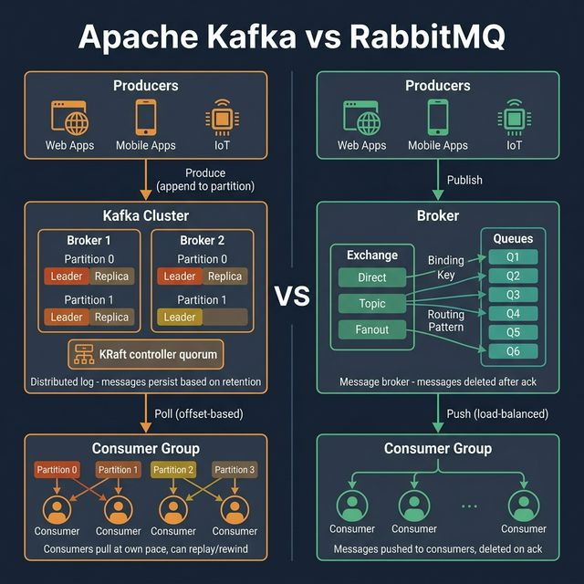
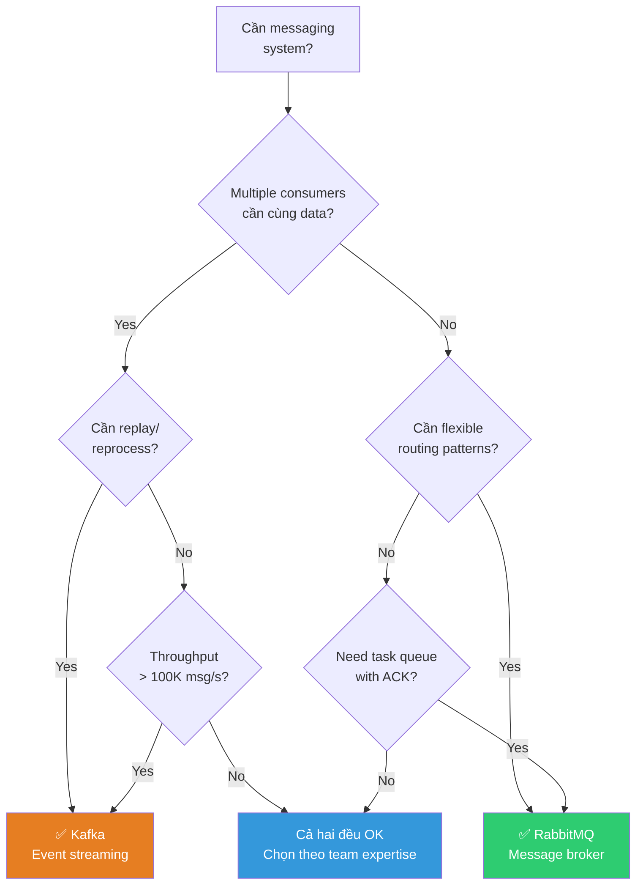

<!-- tags: system-design, message-queue -->
# 📨 Apache Kafka vs. RabbitMQ

> Kafka và RabbitMQ đều xử lý messages, nhưng giải quyết những vấn đề hoàn toàn khác nhau. Kafka là distributed log cho event streaming. RabbitMQ là message broker cho task distribution. Chọn sai tool = kiến trúc sai từ gốc.

📅 Ngày tạo: 2026-03-22 · 🔄 Cập nhật: 2026-03-22 · ⏱️ 15 phút đọc

| Aspect         | Detail                                                                         |
| -------------- | ------------------------------------------------------------------------------ |
| **Complexity** | 🌟🌟🌟🌟                                                                       |
| **Use case**   | Event Streaming, Message Queuing, System Design                                |
| **Keywords**   | Kafka, RabbitMQ, Pub/Sub, Event Sourcing, Consumer Groups, Exchange, Partition |

---

## 1. DEFINE

Bạn đang thiết kế luồng order event và team tranh luận gay gắt: Kafka hay RabbitMQ. Câu hỏi nghe như so công cụ, nhưng thực ra là đang chọn **mô hình tư duy cho dữ liệu**: event log để replay và stream, hay broker để phân phối task rồi xác nhận đã xử lý.


### Kafka — Distributed Log

**Kafka** là một distributed commit log. Producers append messages vào **partitions**. Messages tồn tại dựa trên **retention policy** (thời gian hoặc size), không phải vì đã được consume. Consumers **pull** messages theo offset riêng của mình — có thể rewind, replay, reprocess bất kỳ lúc nào.

| Thành phần         | Vai trò                                                 |
| ------------------ | ------------------------------------------------------- |
| **Producer**       | Ghi messages vào Topic/Partition                        |
| **Topic**          | Logical channel, chia thành nhiều Partitions            |
| **Partition**      | Ordered, immutable log — mỗi message có offset duy nhất |
| **Broker**         | Server lưu trữ partitions (Leader/Replica)              |
| **Consumer Group** | Nhóm consumers, mỗi consumer đọc từ partitions riêng    |
| **KRaft**          | Controller quorum thay thế ZooKeeper (Kafka 3.3+)       |

Kafka internals đã cover. Nhưng RabbitMQ cần different mental model — hãy so sánh.

### RabbitMQ — Message Broker

**RabbitMQ** là một message broker truyền thống. Producers publish messages tới **exchanges**. Exchanges route tới **queues** dựa trên binding keys và patterns. Messages được **push** tới consumers và **xóa sau khi acknowledged**.

| Thành phần   | Vai trò                                                   |
| ------------ | --------------------------------------------------------- |
| **Producer** | Publish messages tới Exchange                             |
| **Exchange** | Route messages tới Queue (Direct, Topic, Fanout, Headers) |
| **Queue**    | Buffer lưu trữ messages chờ consumer xử lý                |
| **Binding**  | Rule nối Exchange → Queue theo routing key                |
| **Consumer** | Nhận messages từ Queue, gửi ACK sau khi xử lý             |

### So sánh trực tiếp

| Tiêu chí              |        Apache Kafka        |            RabbitMQ             |
| --------------------- | :------------------------: | :-----------------------------: |
| **Mô hình**           |      Distributed Log       |         Message Broker          |
| **Message delivery**  |  Pull (consumer chủ động)  |     Push (broker chủ động)      |
| **Message retention** | Giữ theo retention policy  |         Xóa sau khi ACK         |
| **Replay**            |  ✅ Rewind offset bất kỳ   |      ❌ Không replay được       |
| **Ordering**          |    ✅ Trong 1 partition    |        ✅ Trong 1 queue         |
| **Throughput**        |        Triệu msg/s         |           Nghìn msg/s           |
| **Routing**           |   Đơn giản (topic-based)   |  Phức tạp (exchange patterns)   |
| **Use case**          | Event streaming, CDC, logs | Task queues, RPC, notifications |
| **Protocol**          |         Custom TCP         |        AMQP, MQTT, STOMP        |

---

Các failure mode trên nghe quen. Nhưng có trap: Kafka consumer group rebalance = processing gap, và RabbitMQ queue leak = memory overflow. Trap đó sẽ xuất hiện ở PITFALLS.

## 2. VISUAL

Khái niệm đã có tên. Sang sơ đồ, `Apache Kafka vs. RabbitMQ` mới bộc lộ nơi dữ liệu chảy qua, nơi control đổi tay, và chỗ trade-off bắt đầu hiện hình.




### Sơ đồ: Khi nào chọn Kafka, khi nào chọn RabbitMQ?



_(Sai lầm phổ biến nhất: dùng Kafka như queue hoặc RabbitMQ như event log. Chúng là tools khác nhau cho use cases khác nhau)._

---

## 3. CODE

Sơ đồ đã lộ luồng chính. Đến code, `Apache Kafka vs. RabbitMQ` mới hiện ra thành những ranh giới mà team phải thật sự cài đặt và vận hành.


### 1. Kafka Producer & Consumer (Go + confluent-kafka-go)

```go
package kafka

import (
    "context"
    "encoding/json"
    "log/slog"

    "github.com/confluentinc/confluent-kafka-go/v2/kafka"
)

// ─── PRODUCER ───
type Producer struct {
    producer *kafka.Producer
    topic    string
}

type OrderEvent struct {
    OrderID string  `json:"order_id"`
    UserID  string  `json:"user_id"`
    Amount  float64 `json:"amount"`
    Action  string  `json:"action"` // "created", "paid", "shipped"
}

func NewProducer(brokers, topic string) (*Producer, error) {
    p, err := kafka.NewProducer(&kafka.ConfigMap{
        "bootstrap.servers": brokers,
        "acks":              "all",       // Đợi tất cả replicas ACK
        "retries":           3,
        "linger.ms":         5,           // Batch messages 5ms
    })
    if err != nil {
        return nil, err
    }
    return &Producer{producer: p, topic: topic}, nil
}

// Publish gửi event tới Kafka partition.
// Key quyết định partition → cùng OrderID luôn vào cùng partition → đảm bảo ordering.
func (p *Producer) Publish(ctx context.Context, event OrderEvent) error {
    data, _ := json.Marshal(event)
    return p.producer.Produce(&kafka.Message{
        TopicPartition: kafka.TopicPartition{
            Topic:     &p.topic,
            Partition: kafka.PartitionAny, // Kafka chọn partition theo key
        },
        Key:   []byte(event.OrderID), // Cùng key → cùng partition → ordering
        Value: data,
    }, nil)
}

// ─── CONSUMER ───
type Consumer struct {
    consumer *kafka.Consumer
    logger   *slog.Logger
}

func NewConsumer(brokers, group, topic string) (*Consumer, error) {
    c, err := kafka.NewConsumer(&kafka.ConfigMap{
        "bootstrap.servers":  brokers,
        "group.id":           group,
        "auto.offset.reset":  "earliest", // Đọc từ đầu nếu consumer mới
        "enable.auto.commit": false,       // Manual commit → chỉ commit sau khi xử lý xong
    })
    if err != nil {
        return nil, err
    }
    c.SubscribeTopics([]string{topic}, nil)
    return &Consumer{consumer: c, logger: slog.Default()}, nil
}

// Consume đọc messages từ Kafka — pull-based, offset tracking.
func (c *Consumer) Consume(ctx context.Context, handler func(OrderEvent) error) error {
    for {
        select {
        case <-ctx.Done():
            return ctx.Err()
        default:
            msg, err := c.consumer.ReadMessage(-1)
            if err != nil {
                c.logger.Error("read error", "error", err)
                continue
            }

            var event OrderEvent
            if err := json.Unmarshal(msg.Value, &event); err != nil {
                c.logger.Error("unmarshal error", "error", err)
                continue
            }

            // Xử lý event
            if err := handler(event); err != nil {
                c.logger.Error("handler error", "event", event, "error", err)
                continue // Không commit → sẽ được đọc lại
            }

            // ✅ Manual commit — chỉ commit sau khi xử lý thành công
            c.consumer.CommitMessage(msg)
        }
    }
}
```

```typescript
type OrderEvent = {
    orderId: string;
    userId: string;
    amount: number;
    action: "created" | "paid" | "shipped";
};

class KafkaProducer {
    constructor(private readonly topic: string) {}

    async publish(event: OrderEvent): Promise<void> {
        console.log("publish", this.topic, event.orderId, event);
    }
}
```

```rust
struct OrderEvent {
    order_id: String,
    user_id: String,
    amount: f64,
    action: String,
}
```

```cpp
struct OrderEvent {
    std::string orderId;
    std::string userId;
    double amount;
    std::string action;
};
```

```python
from dataclasses import dataclass


@dataclass
class OrderEvent:
    order_id: str
    user_id: str
    amount: float
    action: str
```

```java
// Java equivalent for assets/system-design/09-kafka-vs-rabbitmq.md
// Source language used for adaptation: typescript
class KafkaProducer {
    // Keep the same responsibilities and flow as the implementations above.
}

final class 09KafkaVsRabbitmqExample1 {
    private 09KafkaVsRabbitmqExample1() {}

    static Object publish(Object... args) {
        // Follow the same control flow and data-shape semantics as the reference implementation.
        return null;
    }
}
```

### 2. RabbitMQ Publisher & Consumer (Go + amqp091-go)

```go
package rabbitmq

import (
    "context"
    "encoding/json"
    "log/slog"
    "time"

    amqp "github.com/rabbitmq/amqp091-go"
)

// ─── PUBLISHER ───
type Publisher struct {
    conn    *amqp.Connection
    channel *amqp.Channel
}

type EmailTask struct {
    To      string `json:"to"`
    Subject string `json:"subject"`
    Body    string `json:"body"`
}

func NewPublisher(url string) (*Publisher, error) {
    conn, err := amqp.Dial(url)
    if err != nil {
        return nil, err
    }
    ch, err := conn.Channel()
    if err != nil {
        return nil, err
    }

    // Declare exchange — Direct routing
    ch.ExchangeDeclare(
        "notifications", // Exchange name
        "direct",        // Type: direct, topic, fanout, headers
        true,            // Durable — survive broker restart
        false, false, false, nil,
    )

    return &Publisher{conn: conn, channel: ch}, nil
}

// Publish gửi task tới RabbitMQ exchange với routing key.
func (p *Publisher) Publish(ctx context.Context, routingKey string, task EmailTask) error {
    data, _ := json.Marshal(task)
    return p.channel.PublishWithContext(ctx,
        "notifications", // Exchange
        routingKey,       // Routing key (ví dụ: "email.welcome")
        false, false,
        amqp.Publishing{
            ContentType:  "application/json",
            Body:         data,
            DeliveryMode: amqp.Persistent, // ✅ Message survive broker restart
            Timestamp:    time.Now(),
        },
    )
}

// ─── CONSUMER ───
type Consumer struct {
    conn    *amqp.Connection
    channel *amqp.Channel
    logger  *slog.Logger
}

func NewConsumer(url, queue, exchange, routingKey string) (*Consumer, error) {
    conn, err := amqp.Dial(url)
    if err != nil {
        return nil, err
    }
    ch, err := conn.Channel()
    if err != nil {
        return nil, err
    }

    // Declare queue
    ch.QueueDeclare(queue, true, false, false, false, nil)

    // Bind queue to exchange via routing key
    ch.QueueBind(queue, routingKey, exchange, false, nil)

    // Prefetch: chỉ nhận 10 messages cùng lúc — tránh consumer bị overwhelm
    ch.Qos(10, 0, false)

    return &Consumer{conn: conn, channel: ch, logger: slog.Default()}, nil
}

// Consume nhận messages — push-based, ACK sau khi xử lý.
func (c *Consumer) Consume(ctx context.Context, handler func(EmailTask) error) error {
    msgs, err := c.channel.Consume(
        "email-queue", // Queue
        "",            // Consumer tag (auto-generated)
        false,         // Auto-ACK = false → manual ACK
        false, false, false, nil,
    )
    if err != nil {
        return err
    }

    for {
        select {
        case <-ctx.Done():
            return ctx.Err()
        case msg := <-msgs:
            var task EmailTask
            if err := json.Unmarshal(msg.Body, &task); err != nil {
                msg.Nack(false, false) // Reject, don't requeue
                continue
            }

            if err := handler(task); err != nil {
                // ❌ Failed → Nack + Requeue
                msg.Nack(false, true) // Requeue for retry
                c.logger.Error("handler failed", "error", err)
                continue
            }

            // ✅ Success → ACK → message deleted from queue
            msg.Ack(false)
        }
    }
}
```

```typescript
type EmailTask = { to: string; subject: string; body: string };

class RabbitPublisher {
    async publish(routingKey: string, task: EmailTask): Promise<void> {
        console.log("exchange=notifications", routingKey, task);
    }
}
```

```rust
struct EmailTask {
    to: String,
    subject: String,
    body: String,
}
```

```cpp
struct EmailTask {
    std::string to;
    std::string subject;
    std::string body;
};
```

```python
def publish_email_task(routing_key: str, task: dict) -> None:
    print("publish", routing_key, task)
```

```java
// Java equivalent for assets/system-design/09-kafka-vs-rabbitmq.md
// Source language used for adaptation: typescript
class RabbitPublisher {
    // Keep the same responsibilities and flow as the implementations above.
}

final class 09KafkaVsRabbitmqExample2 {
    private 09KafkaVsRabbitmqExample2() {}

    static Object publish(Object... args) {
        // Follow the same control flow and data-shape semantics as the reference implementation.
        return null;
    }
}
```

### 3. Kafka Streams — Real-time Stream Processing (Go Pattern)

Kafka Streams là library xử lý event streams trực tiếp trên Kafka — join, aggregate, window operations mà không cần cluster riêng (Spark, Flink). Go không có native Kafka Streams library, nhưng có thể implement tương tự bằng **goka** hoặc pattern thủ công.

```go
package streaming

import (
    "context"
    "encoding/json"
    "log/slog"
    "sync"
    "time"
)

// ─── STREAM PROCESSOR ───
// Pattern: Consume → Transform → Produce (giống Kafka Streams topology)

type StreamProcessor struct {
    consumer *Consumer   // Kafka consumer (từ example 1)
    producer *Producer   // Kafka producer (từ example 1)
    logger   *slog.Logger
    state    *StateStore  // In-memory state cho aggregation
}

// StateStore — local state để aggregate (giống KTable)
type StateStore struct {
    mu    sync.RWMutex
    data  map[string]*OrderAggregate
}

type OrderAggregate struct {
    UserID     string  `json:"user_id"`
    TotalSpent float64 `json:"total_spent"`
    OrderCount int     `json:"order_count"`
    LastOrder  time.Time `json:"last_order"`
}

// ✅ Windowed Aggregation — tính tổng orders theo user trong 5 phút
func (sp *StreamProcessor) ProcessStream(ctx context.Context) error {
    // Ticker flush aggregated results mỗi 5 phút
    ticker := time.NewTicker(5 * time.Minute)
    defer ticker.Stop()

    go func() {
        for {
            select {
            case <-ctx.Done():
                return
            case <-ticker.C:
                sp.flushAggregates(ctx)
            }
        }
    }()

    // Consume → Transform → Aggregate
    return sp.consumer.Consume(ctx, func(event OrderEvent) error {
        // ✅ Step 1: Filter — chỉ xử lý "paid" events
        if event.Action != "paid" {
            return nil
        }

        // ✅ Step 2: Aggregate — cộng dồn theo user
        sp.state.mu.Lock()
        agg, exists := sp.state.data[event.UserID]
        if !exists {
            agg = &OrderAggregate{UserID: event.UserID}
            sp.state.data[event.UserID] = agg
        }
        agg.TotalSpent += event.Amount
        agg.OrderCount++
        agg.LastOrder = time.Now()
        sp.state.mu.Unlock()

        // ✅ Step 3: Enrich — thêm computed fields
        if agg.TotalSpent > 10000 {
            sp.logger.Info("VIP customer detected",
                "user_id", event.UserID,
                "total_spent", agg.TotalSpent,
            )
        }
        return nil
    })
}

// Flush aggregated results tới output topic
func (sp *StreamProcessor) flushAggregates(ctx context.Context) {
    sp.state.mu.RLock()
    defer sp.state.mu.RUnlock()

    for _, agg := range sp.state.data {
        data, _ := json.Marshal(agg)
        sp.producer.Publish(ctx, OrderEvent{
            OrderID: agg.UserID,
            UserID:  agg.UserID,
            Amount:  agg.TotalSpent,
            Action:  "aggregated",
        })
        _ = data // Suppress unused
    }
}
```

```typescript
type OrderAggregate = {
    userId: string;
    totalSpent: number;
    orderCount: number;
};

class StreamProcessor {
    private readonly state = new Map<string, OrderAggregate>();

    process(event: OrderEvent): void {
        if (event.action !== "paid") return;
        const current = this.state.get(event.userId) ?? { userId: event.userId, totalSpent: 0, orderCount: 0 };
        current.totalSpent += event.amount;
        current.orderCount += 1;
        this.state.set(event.userId, current);
    }
}
```

```rust
use std::collections::HashMap;

struct OrderAggregate {
    user_id: String,
    total_spent: f64,
    order_count: i32,
}

type StateStore = HashMap<String, OrderAggregate>;
```

```cpp
#include <string>
#include <unordered_map>

struct OrderAggregate {
    std::string userId;
    double totalSpent{0};
    int orderCount{0};
};
```

```python
class StreamProcessor:
    def __init__(self) -> None:
        self.state: dict[str, dict] = {}

    def process(self, event: OrderEvent) -> None:
        if event.action != "paid":
            return
        aggregate = self.state.setdefault(event.user_id, {"user_id": event.user_id, "total_spent": 0.0, "order_count": 0})
        aggregate["total_spent"] += event.amount
        aggregate["order_count"] += 1
```

```java
// Java equivalent for assets/system-design/09-kafka-vs-rabbitmq.md
// Source language used for adaptation: typescript
class StreamProcessor {
    // Keep the same responsibilities and flow as the implementations above.
}

final class 09KafkaVsRabbitmqExample3 {
    private 09KafkaVsRabbitmqExample3() {}

    static Object StreamProcessor(Object... args) {
        // Preserve the same algorithm / object collaboration shown above.
        return null;
    }
}
```

**Kiến trúc Kafka Streams Topology:**

```
┌─────────────┐     ┌──────────┐     ┌─────────────┐     ┌──────────────┐
│ Source Topic │────▶│  Filter  │────▶│  Aggregate  │────▶│ Output Topic │
│ (orders)    │     │ (paid)   │     │ (by user)   │     │ (analytics)  │
└─────────────┘     └──────────┘     └──────┬──────┘     └──────────────┘
                                            │
                                    ┌───────▼───────┐
                                    │  State Store  │
                                    │ (in-memory /  │
                                    │  changelog)   │
                                    └───────────────┘
```

### 4. Dead Letter Queue (DLQ) — Error Handling Pattern

Messages fail nhiều lần → chuyển vào DLQ thay vì retry vô tận. DLQ cho phép investigate, fix, và replay failed messages.

```go
package dlq

import (
    "context"
    "encoding/json"
    "fmt"
    "log/slog"
    "time"

    "github.com/confluentinc/confluent-kafka-go/v2/kafka"
)

// ─── DLQ CONSUMER ───
// Pattern: Retry N lần → DLQ nếu vẫn fail

type DLQConsumer struct {
    consumer   *kafka.Consumer
    dlqProducer *kafka.Producer
    mainTopic  string
    dlqTopic   string // ví dụ: "orders.dlq"
    maxRetries int
    logger     *slog.Logger
}

type DLQMessage struct {
    OriginalTopic string          `json:"original_topic"`
    OriginalKey   string          `json:"original_key"`
    OriginalValue json.RawMessage `json:"original_value"`
    Error         string          `json:"error"`
    RetryCount    int             `json:"retry_count"`
    FailedAt      time.Time       `json:"failed_at"`
    ConsumerGroup string          `json:"consumer_group"`
}

func (dc *DLQConsumer) ConsumeWithDLQ(
    ctx context.Context,
    handler func(json.RawMessage) error,
) error {
    for {
        select {
        case <-ctx.Done():
            return ctx.Err()
        default:
            msg, err := dc.consumer.ReadMessage(time.Second * 5)
            if err != nil {
                continue // Timeout hoặc lỗi tạm
            }

            // Đọc retry count từ header
            retryCount := dc.getRetryCount(msg)

            // Thử xử lý message
            if err := handler(msg.Value); err != nil {
                if retryCount >= dc.maxRetries {
                    // ❌ Đã retry đủ → chuyển vào DLQ
                    dc.sendToDLQ(ctx, msg, err, retryCount)
                    dc.consumer.CommitMessage(msg) // Commit để không đọc lại
                    dc.logger.Error("message sent to DLQ",
                        "topic", *msg.TopicPartition.Topic,
                        "key", string(msg.Key),
                        "retries", retryCount,
                        "error", err,
                    )
                } else {
                    // 🔄 Retry — produce lại vào main topic với retry count tăng
                    dc.retryMessage(ctx, msg, retryCount+1)
                    dc.consumer.CommitMessage(msg)
                    dc.logger.Warn("message retried",
                        "retry", retryCount+1,
                        "max", dc.maxRetries,
                    )
                }
                continue
            }

            // ✅ Success
            dc.consumer.CommitMessage(msg)
        }
    }
}

func (dc *DLQConsumer) sendToDLQ(ctx context.Context, msg *kafka.Message, handlerErr error, retryCount int) {
    dlqMsg := DLQMessage{
        OriginalTopic: *msg.TopicPartition.Topic,
        OriginalKey:   string(msg.Key),
        OriginalValue: msg.Value,
        Error:         handlerErr.Error(),
        RetryCount:    retryCount,
        FailedAt:      time.Now(),
    }
    data, _ := json.Marshal(dlqMsg)

    dc.dlqProducer.Produce(&kafka.Message{
        TopicPartition: kafka.TopicPartition{Topic: &dc.dlqTopic, Partition: kafka.PartitionAny},
        Key:            msg.Key,
        Value:          data,
    }, nil)
}

func (dc *DLQConsumer) retryMessage(ctx context.Context, msg *kafka.Message, retryCount int) {
    headers := append(msg.Headers, kafka.Header{
        Key:   "x-retry-count",
        Value: []byte(fmt.Sprintf("%d", retryCount)),
    })
    dc.dlqProducer.Produce(&kafka.Message{
        TopicPartition: kafka.TopicPartition{Topic: &dc.mainTopic, Partition: kafka.PartitionAny},
        Key:            msg.Key,
        Value:          msg.Value,
        Headers:        headers,
    }, nil)
}

func (dc *DLQConsumer) getRetryCount(msg *kafka.Message) int {
    for _, h := range msg.Headers {
        if h.Key == "x-retry-count" {
            count := 0
            fmt.Sscanf(string(h.Value), "%d", &count)
            return count
        }
    }
    return 0
}
```

```typescript
type DLQMessage = {
    originalTopic: string;
    originalKey: string;
    error: string;
    retryCount: number;
};

function shouldSendToDlq(retryCount: number, maxRetries: number): boolean {
    return retryCount >= maxRetries;
}
```

```rust
struct DlqMessage {
    original_topic: String,
    original_key: String,
    error: String,
    retry_count: i32,
}
```

```cpp
struct DLQMessage {
    std::string originalTopic;
    std::string originalKey;
    std::string error;
    int retryCount;
};
```

```python
def should_send_to_dlq(retry_count: int, max_retries: int) -> bool:
    return retry_count >= max_retries
```

```java
// Java equivalent for assets/system-design/09-kafka-vs-rabbitmq.md
// Source language used for adaptation: typescript
final class 09KafkaVsRabbitmqExample4 {
    private 09KafkaVsRabbitmqExample4() {}

    static Object shouldSendToDlq(Object... args) {
        // Follow the same control flow and data-shape semantics as the reference implementation.
        return false;
    }
}
```

**Kiến trúc DLQ Flow:**

```
┌──────────┐     ┌──────────────┐     ┌──────────┐
│ Producer │────▶│  Main Topic  │────▶│ Consumer │
└──────────┘     └──────────────┘     └────┬─────┘
                        ▲                   │
                        │              ┌────▼────┐
                   Retry (count < 3)   │ Handler │
                        │              └────┬────┘
                        │                   │
                   ┌────┴────┐         ┌────▼────┐
                   │  Retry  │◄────────│  Error? │
                   └─────────┘   Yes   └────┬────┘
                                            │ count >= 3
                                       ┌────▼────┐
                                       │   DLQ   │
                                       │  Topic  │
                                       └────┬────┘
                                            │
                                       ┌────▼────────────┐
                                       │ DLQ Dashboard   │
                                       │ (investigate &  │
                                       │  replay)        │
                                       └─────────────────┘
```

### 5. Schema Registry — Protobuf Schema Evolution

Khi multiple teams produce/consume cùng topic → **Schema Registry** đảm bảo mọi người agree on data format. Schemas versioned → backward/forward compatible.

```go
package schema

import (
    "context"
    "log/slog"

    "github.com/confluentinc/confluent-kafka-go/v2/kafka"
    "github.com/confluentinc/confluent-kafka-go/v2/schemaregistry"
    "github.com/confluentinc/confluent-kafka-go/v2/schemaregistry/serde"
    "github.com/confluentinc/confluent-kafka-go/v2/schemaregistry/serde/protobuf"
)

// ─── PROTOBUF SCHEMA PRODUCER ───
// Schema Registry đảm bảo:
// 1. Producer chỉ gửi messages đúng schema
// 2. Schema versioned → backward compatible
// 3. Consumer luôn biết cách deserialize

type SchemaProducer struct {
    producer   *kafka.Producer
    serializer *protobuf.Serializer
    topic      string
}

func NewSchemaProducer(brokers, registryURL, topic string) (*SchemaProducer, error) {
    // ✅ Kết nối Schema Registry
    client, err := schemaregistry.NewClient(
        schemaregistry.NewConfig(registryURL),
    )
    if err != nil {
        return nil, err
    }

    // ✅ Tạo Protobuf serializer — auto-register schema
    ser, err := protobuf.NewSerializer(client, serde.ValueSerde, protobuf.NewSerializerConfig())
    if err != nil {
        return nil, err
    }

    p, err := kafka.NewProducer(&kafka.ConfigMap{
        "bootstrap.servers": brokers,
        "acks":              "all",
    })
    if err != nil {
        return nil, err
    }

    return &SchemaProducer{
        producer:   p,
        serializer: ser,
        topic:      topic,
    }, nil
}

// Produce — serialize với Schema Registry validation
// Nếu message không match schema → error trước khi gửi
func (sp *SchemaProducer) Produce(ctx context.Context, key string, msg interface{}) error {
    // ✅ Serialize với schema validation
    payload, err := sp.serializer.Serialize(sp.topic, msg)
    if err != nil {
        slog.Error("schema validation failed", "error", err)
        return err // Schema mismatch → không gửi
    }

    return sp.producer.Produce(&kafka.Message{
        TopicPartition: kafka.TopicPartition{
            Topic:     &sp.topic,
            Partition: kafka.PartitionAny,
        },
        Key:   []byte(key),
        Value: payload, // ✅ Schema-encoded payload
    }, nil)
}
```

```typescript
type OrderCreatedV1 = { orderId: string; userId: string; amount: number };
type OrderCreatedV2 = OrderCreatedV1 & { currency?: string };
```

```rust
struct SchemaProducer {
    topic: String,
}
```

```cpp
struct OrderCreatedV1 {
    std::string orderId;
    std::string userId;
    double amount;
};
```

```python
def validate_schema(payload: dict) -> None:
    required = {"order_id", "user_id", "amount"}
    missing = required - payload.keys()
    if missing:
        raise ValueError(f"schema mismatch: missing {sorted(missing)}")
```

```java
// Java equivalent for assets/system-design/09-kafka-vs-rabbitmq.md
// Source language used for adaptation: typescript
final class 09KafkaVsRabbitmqExample5 {
    private 09KafkaVsRabbitmqExample5() {}

    static Object example5(Object... args) {
        // Preserve the same algorithm / object collaboration shown above.
        return null;
    }
}
```

**Schema Evolution Rules:**

```
┌─────────────────────────────────────────────────────────────┐
│                    SCHEMA REGISTRY                           │
│                                                              │
│  Topic: "orders"                                            │
│                                                              │
│  v1: { order_id, user_id, amount }                          │
│  v2: { order_id, user_id, amount, currency }    ← ADD field │
│  v3: { order_id, user_id, amount, currency,                │
│         shipping_address }                      ← ADD field │
│                                                              │
│  Rules:                                                      │
│  ✅ BACKWARD: v2 consumer đọc được v1 messages              │
│  ✅ FORWARD:  v1 consumer đọc được v2 messages              │
│  ❌ BREAKING: xóa field, đổi type → KHÔNG CHO PHÉP         │
└─────────────────────────────────────────────────────────────┘
```

### 6. NATS & Redis Streams — Lightweight Alternatives

Không phải lúc nào cũng cần Kafka cluster. **NATS** cho ultra-low latency pub/sub. **Redis Streams** cho simple event streaming.

```go
package alternatives

import (
    "context"
    "encoding/json"
    "log/slog"
    "time"

    "github.com/nats-io/nats.go"
    "github.com/redis/go-redis/v9"
)

// ═══════════════════════════════════════
// NATS — Ultra-low latency Pub/Sub
// ═══════════════════════════════════════

type NATSClient struct {
    conn *nats.Conn
    js   nats.JetStreamContext // JetStream = persistence layer
}

func NewNATSClient(url string) (*NATSClient, error) {
    nc, err := nats.Connect(url)
    if err != nil {
        return nil, err
    }
    js, err := nc.JetStream()
    if err != nil {
        return nil, err
    }

    // ✅ Tạo stream — tương tự Kafka topic
    js.AddStream(&nats.StreamConfig{
        Name:      "ORDERS",
        Subjects:  []string{"orders.>"},          // Wildcard subjects
        Retention: nats.LimitsPolicy,             // Giữ theo limits
        MaxAge:    24 * time.Hour,                // TTL 24h
        Storage:   nats.FileStorage,              // Persist to disk
        Replicas:  3,                              // Replication factor
    })

    return &NATSClient{conn: nc, js: js}, nil
}

// Publish — gửi message tới NATS JetStream
func (n *NATSClient) Publish(ctx context.Context, subject string, data interface{}) error {
    payload, _ := json.Marshal(data)
    _, err := n.js.Publish(subject, payload) // ví dụ: "orders.created"
    return err
}

// Subscribe — pull-based consumer (giống Kafka consumer group)
func (n *NATSClient) Subscribe(ctx context.Context, subject string, handler func([]byte) error) error {
    // ✅ Durable consumer — offset tracking tự động
    sub, err := n.js.PullSubscribe(subject, "order-processor",
        nats.AckExplicit(),      // Manual ACK
        nats.MaxDeliver(3),       // Max retries trước khi DLQ
    )
    if err != nil {
        return err
    }

    for {
        select {
        case <-ctx.Done():
            return ctx.Err()
        default:
            msgs, _ := sub.Fetch(10, nats.MaxWait(5*time.Second))
            for _, msg := range msgs {
                if err := handler(msg.Data); err != nil {
                    msg.Nak() // Retry
                    continue
                }
                msg.Ack() // ✅ Success
            }
        }
    }
}

// ═══════════════════════════════════════
// Redis Streams — Simple Event Streaming
// ═══════════════════════════════════════

type RedisStreamClient struct {
    client *redis.Client
    logger *slog.Logger
}

func NewRedisStreamClient(addr string) *RedisStreamClient {
    return &RedisStreamClient{
        client: redis.NewClient(&redis.Options{Addr: addr}),
        logger: slog.Default(),
    }
}

// Publish — XADD thêm message vào stream
func (r *RedisStreamClient) Publish(ctx context.Context, stream string, data map[string]interface{}) (string, error) {
    // ✅ Redis auto-generates ID: "1679900000000-0" (timestamp-sequence)
    return r.client.XAdd(ctx, &redis.XAddArgs{
        Stream: stream,      // ví dụ: "orders"
        Values: data,
        MaxLen: 100000,       // Cap stream size → tránh memory overflow
    }).Result()
}

// Consume — XREADGROUP consumer group (giống Kafka consumer group)
func (r *RedisStreamClient) Consume(
    ctx context.Context,
    stream, group, consumer string,
    handler func(redis.XMessage) error,
) error {
    // ✅ Tạo consumer group nếu chưa có
    r.client.XGroupCreateMkStream(ctx, stream, group, "0")

    for {
        select {
        case <-ctx.Done():
            return ctx.Err()
        default:
            // ✅ XREADGROUP — đọc messages chưa ACK
            results, err := r.client.XReadGroup(ctx, &redis.XReadGroupArgs{
                Group:    group,
                Consumer: consumer,
                Streams:  []string{stream, ">"},   // ">" = chỉ messages mới
                Count:    10,
                Block:    5 * time.Second,
            }).Result()
            if err != nil {
                continue
            }

            for _, result := range results {
                for _, msg := range result.Messages {
                    if err := handler(msg); err != nil {
                        r.logger.Error("handler failed", "id", msg.ID, "error", err)
                        continue // Không ACK → pending list → retry
                    }
                    // ✅ XACK — acknowledge message
                    r.client.XAck(ctx, stream, group, msg.ID)
                }
            }
        }
    }
}
```

```typescript
class NatsClient {
    async publish(subject: string, data: unknown): Promise<void> {
        console.log("nats publish", subject, data);
    }
}

class RedisStreamClient {
    async publish(stream: string, data: Record<string, unknown>): Promise<string> {
        console.log("xadd", stream, data);
        return "1679900000000-0";
    }
}
```

```rust
struct NatsClient;
struct RedisStreamClient;
```

```cpp
class NatsClient {};
class RedisStreamClient {};
```

```python
class NATSClient:
    def publish(self, subject: str, data: dict) -> None:
        print("nats", subject, data)


class RedisStreamClient:
    def publish(self, stream: str, data: dict) -> str:
        print("xadd", stream, data)
        return "1679900000000-0"
```

```java
// Java equivalent for assets/system-design/09-kafka-vs-rabbitmq.md
// Source language used for adaptation: typescript
class NatsClient {
    // Keep the same responsibilities and flow as the implementations above.
}

class RedisStreamClient {
    // Keep the same responsibilities and flow as the implementations above.
}

final class 09KafkaVsRabbitmqExample6 {
    private 09KafkaVsRabbitmqExample6() {}

    static Object publish(Object... args) {
        // Follow the same control flow and data-shape semantics as the reference implementation.
        return null;
    }
}
```

**So sánh Messaging Systems:**

| Tiêu chí           |      Kafka      |     RabbitMQ      |       NATS        |   Redis Streams    |
| ------------------ | :-------------: | :---------------: | :---------------: | :----------------: |
| **Throughput**     |   Triệu msg/s   |    Nghìn msg/s    |    Triệu msg/s    |  Trăm nghìn msg/s  |
| **Latency**        |      <10ms      |       <1ms        |       <1ms        |        <1ms        |
| **Persistence**    |  ✅ Disk (log)  |  ✅ Disk (queue)  |   ✅ JetStream    | ✅ In-memory + AOF |
| **Replay**         | ✅ Offset-based |        ❌         |   ✅ JetStream    |    ✅ ID-based     |
| **Routing**        |   Topic-based   | Exchange patterns | Subject wildcards |  Stream per topic  |
| **Cluster**        | Broker cluster  |  Single/cluster   |      Cluster      |  Sentinel/Cluster  |
| **Ops complexity** |     ❌ Cao      |   ⚠️ Trung bình   |      ✅ Thấp      |      ✅ Thấp       |
| **Best for**       | Event streaming |    Task queues    |   Microservices   |  Simple streaming  |

---

Bạn đã đi qua Kafka và RabbitMQ. Bây giờ đến phần nguy hiểm: rebalance gap và queue leak — trap đã được setup từ đầu bài.

## 4. PITFALLS

Khi đưa `Apache Kafka vs. RabbitMQ` vào production, lỗi thường không nằm ở khái niệm mà ở assumptions đội ngũ mang theo lúc triển khai. Bảng dưới đây gom đúng những cú trượt đó.


| # | Severity | Lỗi (Pitfall) | Hậu quả | Fix (Giải pháp) |
| --- | --- | --- | --- | --- |
| 1 | 🔴 Fatal | **Dùng Kafka như task queue** | Kafka không xóa messages sau consume → consumer group rebalancing phức tạp cho task distribution. | Dùng RabbitMQ cho task queues. Kafka phù hợp cho event streaming, CDC, logs. |
| 2 | 🔴 Fatal | **RabbitMQ không set Prefetch (QoS)** | 1 consumer nhận hàng triệu messages → OOM kill. Các consumers khác idle. | Set `ch.Qos(prefetchCount, 0, false)` — giới hạn messages in-flight per consumer. |
| 3 | 🟡 Common | **Kafka auto.commit.enable=true** | Messages được commit trước khi xử lý xong → crash = data loss. | Manual commit: `enable.auto.commit: false`, commit sau khi handler thành công. |
| 4 | 🟡 Common | **Không set partition key** | Messages cùng entity phân tán random → mất ordering guarantee. | Dùng entity ID (order_id, user_id) làm key → cùng key luôn vào cùng partition. |
| 5 | 🟡 Common | **RabbitMQ dùng transient messages** | Broker restart → messages biến mất. | `DeliveryMode: amqp.Persistent` + durable queue + durable exchange. |
| 6 | 🔵 Minor | **Không có DLQ** | Failed messages retry vô tận → consumer stuck, blocking healthy messages. | DLQ với max retries → investigate failed messages offline. |
| 7 | 🔵 Minor | **Schema thay đổi không compatible** | Consumer crash vì không đọc được message format mới. | Schema Registry + backward/forward compatibility rules. |
| 8 | 🔵 Minor | **Dùng Kafka cho hệ thống nhỏ** | Over-engineering: 3 brokers + ZooKeeper cho 100 msg/s. | NATS hoặc Redis Streams cho hệ thống nhỏ, đơn giản. |

---

Bạn đã đi qua Kafka vs RabbitMQ và cạm bẫy. Các resources dưới đây giúp đi sâu hơn.

## 5. REF

| Resource                   | Link                                                                             |
| -------------------------- | -------------------------------------------------------------------------------- |
| Apache Kafka Documentation | [kafka.apache.org](https://kafka.apache.org/documentation/)                      |
| RabbitMQ Documentation     | [rabbitmq.com](https://www.rabbitmq.com/documentation.html)                      |
| confluent-kafka-go         | [github.com/confluentinc](https://github.com/confluentinc/confluent-kafka-go)    |
| amqp091-go                 | [github.com/rabbitmq](https://github.com/rabbitmq/amqp091-go)                    |
| Confluent Schema Registry  | [docs.confluent.io](https://docs.confluent.io/platform/current/schema-registry/) |
| NATS JetStream             | [docs.nats.io](https://docs.nats.io/nats-concepts/jetstream)                     |
| Redis Streams              | [redis.io](https://redis.io/docs/data-types/streams/)                            |

---

## 6. RECOMMEND

Các tài liệu sau giúp bạn nối `Apache Kafka vs. RabbitMQ` với những quyết định kế cận trong hệ thống, để mental model không bị rời thành từng mảnh.


```
┌─────────────────────────────────────────────────────────────────┐
│                    MESSAGING DECISION TREE                       │
│                                                                  │
│  ┌────────────────┐    "Cần event streaming,                    │
│  │  High throughput │    CDC, log aggregation?"                  │
│  │  Event replay    │──── YES ────▶  Apache Kafka               │
│  │  Multi-consumer  │                                            │
│  └────────────────┘                                              │
│                                                                  │
│  ┌────────────────┐    "Cần task queue,                         │
│  │  Complex routing │    RPC, notifications?"                   │
│  │  Message ACK     │──── YES ────▶  RabbitMQ                   │
│  │  Priority queue  │                                            │
│  └────────────────┘                                              │
│                                                                  │
│  ┌────────────────┐    "Microservices,                          │
│  │  Ultra-low lat  │    request-reply, IoT?"                    │
│  │  Cloud-native   │──── YES ────▶  NATS                        │
│  │  Simple ops     │                                             │
│  └────────────────┘                                              │
│                                                                  │
│  ┌────────────────┐    "Already have Redis,                     │
│  │  Simple stream  │    lightweight streaming?"                 │
│  │  No new infra   │──── YES ────▶  Redis Streams               │
│  │  < 100K msg/s   │                                             │
│  └────────────────┘                                              │
└─────────────────────────────────────────────────────────────────┘
```

---

---

**Callback**: Quay lại consumer lag 2 triệu messages. Bây giờ bạn biết: Kafka = event log, replay, stream processing. RabbitMQ = task queue, routing, worker distribution. Dùng Kafka như task queue = sai mental model. Mental model đúng → tool đúng → zero lag.

← Previous: [12 Architectural Concepts](./08-architectural-concepts.md) · → Next: [The Modern HTTP Ecosystem](./10-http-ecosystem.md) · ← Quay về [System Design](./README.md)
