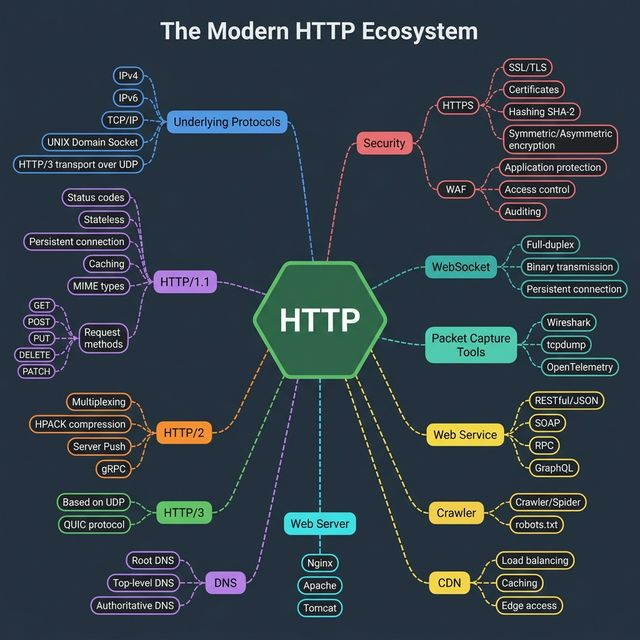
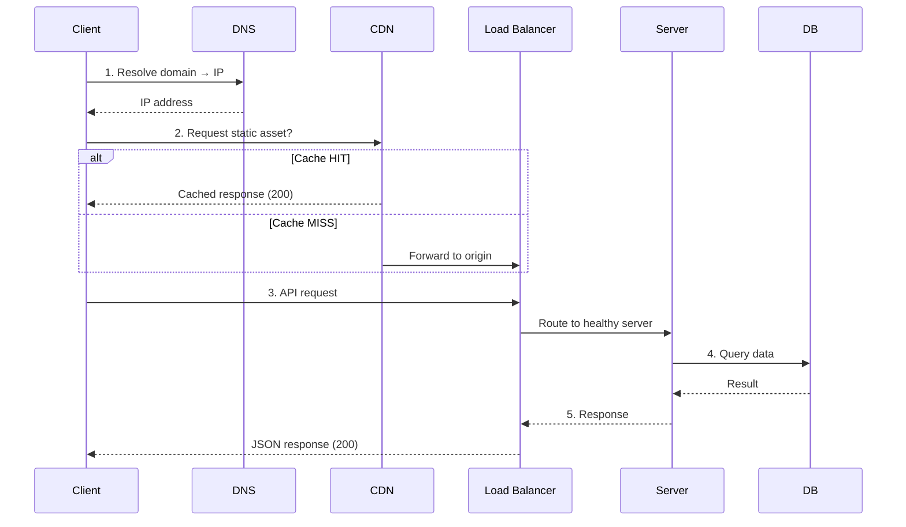

<!-- tags: system-design, networking -->
# 🌐 The Modern HTTP Ecosystem

> HTTP đã tiến hóa từ HTTP/1.1 qua HTTP/2 đến HTTP/3 (QUIC/UDP). Ngày nay, nó là xương sống của hầu hết mọi thứ trên internet — từ browsers, APIs đến streaming, cloud, và AI systems.

📅 Ngày tạo: 2026-03-22 · 🔄 Cập nhật: 2026-03-22 · ⏱️ 18 phút đọc

| Aspect         | Detail                                                                          |
| -------------- | ------------------------------------------------------------------------------- |
| **Complexity** | 🌟🌟🌟🌟                                                                        |
| **Use case**   | Web fundamentals, API design, System Design                                     |
| **Keywords**   | HTTP/1.1, HTTP/2, HTTP/3, QUIC, HTTPS, WebSocket, REST, GraphQL, gRPC, DNS, CDN |

---

## 1. DEFINE

Chrome DevTools: request waterfall dài như thác nước, mỗi resource chờ resource trước hoàn thành. HTTP/1.1 head-of-line blocking — 6 connections per domain, mỗi connection xử lý 1 request tại 1 thời điểm. Upgrade lên HTTP/2: multiplexing, 1 connection xử lý song song. Nhưng QUIC (HTTP/3) lại bỏ TCP — tại sao? Câu trả lời nằm ở sự tiến hóa của web protocol stack.


### HTTP Versions — Evolution

| Version      | Năm  | Transport      | Key Features                                                                                           |
| ------------ | ---- | -------------- | ------------------------------------------------------------------------------------------------------ |
| **HTTP/1.1** | 1997 | TCP            | Persistent connections, chunked transfer, caching (ETag, If-Modified-Since), pipelining                |
| **HTTP/2**   | 2015 | TCP            | Multiplexing (nhiều requests trên 1 connection), HPACK header compression, Server Push, binary framing |
| **HTTP/3**   | 2022 | **UDP (QUIC)** | 0-RTT handshake, no head-of-line blocking, connection migration (chuyển mạng không mất connection)     |

### Underlying Protocols

| Protocol               | Layer     | Vai trò                                                      |
| ---------------------- | --------- | ------------------------------------------------------------ |
| **TCP/IP**             | Transport | Reliable, ordered delivery — nền tảng cho HTTP/1.1 và HTTP/2 |
| **UDP**                | Transport | Unreliable, fast — nền tảng cho HTTP/3 (QUIC protocol)       |
| **QUIC**               | Transport | UDP-based, built-in TLS 1.3, multiplexed streams, 0-RTT      |
| **IPv4/IPv6**          | Network   | Addressing — IPv6 cho address space vô hạn                   |
| **Unix Domain Socket** | Local     | IPC — communication giữa processes trên cùng machine         |

### Security Layer

| Component        | Vai trò                                                        |
| ---------------- | -------------------------------------------------------------- |
| **HTTPS**        | HTTP over TLS — encrypt mọi traffic                            |
| **TLS/SSL**      | Transport Layer Security — handshake, key exchange, encryption |
| **Certificates** | X.509 — xác thực server identity (Let's Encrypt, CA)           |
| **WAF**          | Web Application Firewall — chặn SQL injection, XSS, DDoS       |
| **Hashing**      | SHA-256 cho integrity verification                             |
| **Encryption**   | Symmetric (AES, ChaCha20) + Asymmetric (RSA, ECDH)             |

### Web Services & Data Formats

| Type          | Protocol                | Data Format       | Use Case                          |
| ------------- | ----------------------- | ----------------- | --------------------------------- |
| **REST**      | HTTP                    | JSON              | Web APIs, CRUD operations         |
| **GraphQL**   | HTTP                    | JSON              | Flexible queries, frontend-driven |
| **gRPC**      | HTTP/2                  | Protobuf (binary) | Microservices, high-performance   |
| **SOAP**      | HTTP                    | XML               | Enterprise, legacy systems        |
| **WebSocket** | TCP (upgrade from HTTP) | Binary/Text       | Real-time: chat, gaming, trading  |

### Infrastructure

| Component      | Vai trò                                                               |
| -------------- | --------------------------------------------------------------------- |
| **DNS**        | Domain → IP resolution (Root → TLD → Authoritative → Local)           |
| **CDN**        | Static assets tại edge servers gần users (Cloudflare, AWS CloudFront) |
| **Web Server** | NGINX, Apache, Caddy — reverse proxy, load balancing, TLS termination |
| **Proxy**      | Forward proxy (client-side), Reverse proxy (server-side), API Gateway |
| **Crawler**    | Search engine bots — guided by robots.txt                             |

### Observability

| Tool              | Vai trò                                                         |
| ----------------- | --------------------------------------------------------------- |
| **Wireshark**     | GUI packet capture — phân tích protocol-level                   |
| **tcpdump**       | CLI packet capture — lightweight, server-side                   |
| **OpenTelemetry** | Distributed tracing + metrics + logs — end-to-end observability |

---

Các failure mode trên nghe rõ. Nhưng có trap: HTTP/2 push promise bị browser ignore = bandwidth waste, và keep-alive timeout mismatch = broken connections. Trap đó sẽ xuất hiện ở PITFALLS.

## 2. VISUAL

Định nghĩa mới chỉ khóa được từ vựng. Hình dưới đây cho thấy `The Modern HTTP Ecosystem` vận hành ra sao khi request, node, và network bắt đầu tương tác thật.




### Sơ đồ: HTTP Request Lifecycle



### So sánh HTTP versions

```
HTTP/1.1                 HTTP/2                    HTTP/3
┌──────────┐            ┌──────────┐             ┌──────────┐
│ Request 1│            │ Stream 1 │             │ Stream 1 │
│──────────│            │ Stream 2 │             │ Stream 2 │
│ Request 2│ Sequential │ Stream 3 │ Multiplexed │ Stream 3 │ QUIC
│──────────│            │ Stream 4 │             │ Stream 4 │
│ Request 3│            └──────────┘             └──────────┘
└──────────┘                 │                        │
      │                      │                        │
   ┌──▼──┐              ┌───▼───┐               ┌───▼───┐
   │ TCP │              │  TCP  │               │  UDP  │
   │     │              │ (HOL  │               │ (QUIC)│
   └─────┘              │block) │               │ No HOL│
                        └───────┘               └───────┘
```

_(HTTP/1.1: sequential requests. HTTP/2: multiplexed nhưng vẫn HOL blocking ở TCP layer. HTTP/3: QUIC trên UDP giải quyết hoàn toàn HOL blocking)._

---

## 3. CODE

Sơ đồ đã lộ luồng chính. Đến code, `The Modern HTTP Ecosystem` mới hiện ra thành những ranh giới mà team phải thật sự cài đặt và vận hành.


### 1. HTTP Server — HTTP/1.1 & HTTP/2 (Go standard library)

```go
package main

import (
    "context"
    "crypto/tls"
    "encoding/json"
    "log/slog"
    "net/http"
    "os"
    "os/signal"
    "syscall"
    "time"
)

func main() {
    logger := slog.New(slog.NewJSONHandler(os.Stdout, nil))

    mux := http.NewServeMux()

    // ✅ RESTful endpoint
    mux.HandleFunc("GET /api/users/{id}", func(w http.ResponseWriter, r *http.Request) {
        id := r.PathValue("id") // Go 1.22+ path parameters
        w.Header().Set("Content-Type", "application/json")
        w.Header().Set("Cache-Control", "public, max-age=60") // CDN caching
        json.NewEncoder(w).Encode(map[string]string{
            "id":   id,
            "name": "Alice",
        })
    })

    // ✅ Health check cho Load Balancer
    mux.HandleFunc("GET /healthz", func(w http.ResponseWriter, r *http.Request) {
        w.WriteHeader(http.StatusOK)
        w.Write([]byte(`{"status":"ok"}`))
    })

    // ✅ HTTP/2 Server — Go tự động enable HTTP/2 khi có TLS
    server := &http.Server{
        Addr:    ":443",
        Handler: loggingMiddleware(logger, mux),
        TLSConfig: &tls.Config{
            MinVersion: tls.VersionTLS13, // TLS 1.3 only
        },
        ReadTimeout:  10 * time.Second,
        WriteTimeout: 10 * time.Second,
        IdleTimeout:  120 * time.Second,
    }

    // Graceful shutdown
    go func() {
        logger.Info("server starting", "addr", server.Addr, "protocol", "HTTP/2+TLS1.3")
        if err := server.ListenAndServeTLS("cert.pem", "key.pem"); err != http.ErrServerClosed {
            logger.Error("server error", "error", err)
            os.Exit(1)
        }
    }()

    quit := make(chan os.Signal, 1)
    signal.Notify(quit, syscall.SIGINT, syscall.SIGTERM)
    <-quit

    ctx, cancel := context.WithTimeout(context.Background(), 30*time.Second)
    defer cancel()
    server.Shutdown(ctx)
    logger.Info("server stopped")
}

// Logging middleware — structured JSON logs
func loggingMiddleware(logger *slog.Logger, next http.Handler) http.Handler {
    return http.HandlerFunc(func(w http.ResponseWriter, r *http.Request) {
        start := time.Now()
        wrapped := &responseWriter{ResponseWriter: w, statusCode: http.StatusOK}
        next.ServeHTTP(wrapped, r)
        logger.Info("request",
            "method", r.Method,
            "path", r.URL.Path,
            "status", wrapped.statusCode,
            "duration_ms", time.Since(start).Milliseconds(),
            "proto", r.Proto, // "HTTP/1.1" hoặc "HTTP/2.0"
            "remote", r.RemoteAddr,
        )
    })
}

type responseWriter struct {
    http.ResponseWriter
    statusCode int
}

func (rw *responseWriter) WriteHeader(code int) {
    rw.statusCode = code
    rw.ResponseWriter.WriteHeader(code)
}
```

```typescript
import http2 from "node:http2";

const server = http2.createSecureServer({
    key: "server-key",
    cert: "server-cert",
    minVersion: "TLSv1.3",
});

server.on("stream", (stream, headers) => {
    if (headers[":path"]?.startsWith("/api/users/")) {
        stream.respond({ ":status": 200, "content-type": "application/json", "cache-control": "public, max-age=60" });
        stream.end(JSON.stringify({ id: "1", name: "Alice" }));
    }
});
```

```rust
use axum::{routing::get, Json, Router};
use serde_json::json;

async fn get_user() -> Json<serde_json::Value> {
    Json(json!({ "id": "1", "name": "Alice" }))
}
```

```cpp
#include <iostream>

int main() {
    std::cout << "HTTP server exposes /api/users/{id} and /healthz with TLS-enabled HTTP/2.\n";
}
```

```python
from fastapi import FastAPI

app = FastAPI()


@app.get("/api/users/{user_id}")
def get_user(user_id: str) -> dict:
    return {"id": user_id, "name": "Alice"}
```

```java
// Java equivalent for assets/system-design/10-http-ecosystem.md
// Source language used for adaptation: typescript
final class 10HttpEcosystemExample1 {
    private 10HttpEcosystemExample1() {}

    static Object example1(Object... args) {
        // Preserve the same algorithm / object collaboration shown above.
        return null;
    }
}
```

### 2. WebSocket — Real-time Bidirectional Communication

```go
package main

import (
    "log/slog"
    "net/http"
    "sync"

    "github.com/gorilla/websocket"
)

var upgrader = websocket.Upgrader{
    ReadBufferSize:  1024,
    WriteBufferSize: 1024,
    CheckOrigin:     func(r *http.Request) bool { return true }, // ⚠️ Production: check origin
}

// ─── HUB — quản lý tất cả connections ───
type Hub struct {
    clients    map[*websocket.Conn]bool
    broadcast  chan []byte
    register   chan *websocket.Conn
    unregister chan *websocket.Conn
    mu         sync.RWMutex
}

func NewHub() *Hub {
    return &Hub{
        clients:    make(map[*websocket.Conn]bool),
        broadcast:  make(chan []byte, 256),
        register:   make(chan *websocket.Conn),
        unregister: make(chan *websocket.Conn),
    }
}

func (h *Hub) Run() {
    for {
        select {
        case conn := <-h.register:
            h.mu.Lock()
            h.clients[conn] = true
            h.mu.Unlock()
            slog.Info("client connected", "total", len(h.clients))

        case conn := <-h.unregister:
            h.mu.Lock()
            delete(h.clients, conn)
            h.mu.Unlock()
            conn.Close()

        case msg := <-h.broadcast:
            h.mu.RLock()
            for conn := range h.clients {
                if err := conn.WriteMessage(websocket.TextMessage, msg); err != nil {
                    conn.Close()
                    delete(h.clients, conn)
                }
            }
            h.mu.RUnlock()
        }
    }
}

// ─── WebSocket Handler ───
func wsHandler(hub *Hub) http.HandlerFunc {
    return func(w http.ResponseWriter, r *http.Request) {
        // ✅ Upgrade HTTP → WebSocket
        conn, err := upgrader.Upgrade(w, r, nil)
        if err != nil {
            slog.Error("upgrade failed", "error", err)
            return
        }
        hub.register <- conn

        // Read messages from client
        defer func() { hub.unregister <- conn }()
        for {
            _, msg, err := conn.ReadMessage()
            if err != nil {
                break
            }
            hub.broadcast <- msg // Broadcast tới tất cả clients
        }
    }
}
```

```typescript
import { WebSocketServer } from "ws";

const wss = new WebSocketServer({ port: 8081 });
const clients = new Set();

wss.on("connection", (socket) => {
    clients.add(socket);
    socket.on("message", (message) => {
        for (const client of clients) client.send(message.toString());
    });
    socket.on("close", () => clients.delete(socket));
});
```

```rust
use tokio::sync::broadcast;

type Hub = broadcast::Sender<String>;
```

```cpp
#include <iostream>

int main() {
    std::cout << "WebSocket hub upgrades HTTP connection and broadcasts incoming messages.\n";
}
```

```python
from fastapi import WebSocket

connections: set[WebSocket] = set()
```

```java
// Java equivalent for assets/system-design/10-http-ecosystem.md
// Source language used for adaptation: typescript
final class 10HttpEcosystemExample2 {
    private 10HttpEcosystemExample2() {}

    static Object WebSocketServer(Object... args) {
        // Follow the same control flow and data-shape semantics as the reference implementation.
        return null;
    }

    static Object Set(Object... args) {
        // Follow the same control flow and data-shape semantics as the reference implementation.
        return null;
    }
}
```

### 3. HTTP Client — Retry, Timeout, Connection Pool

```go
package httpclient

import (
    "context"
    "fmt"
    "io"
    "log/slog"
    "math"
    "net/http"
    "time"
)

// ─── RESILIENT HTTP CLIENT ───
type Client struct {
    client     *http.Client
    maxRetries int
    logger     *slog.Logger
}

func NewClient() *Client {
    return &Client{
        client: &http.Client{
            Timeout: 30 * time.Second,
            Transport: &http.Transport{
                MaxIdleConns:        100,              // Connection pool size
                MaxIdleConnsPerHost: 10,               // Per-host connections
                IdleConnTimeout:     90 * time.Second, // Idle connection TTL
                TLSHandshakeTimeout: 10 * time.Second, // TLS timeout
            },
        },
        maxRetries: 3,
        logger:     slog.Default(),
    }
}

// DoWithRetry — Exponential backoff retry cho transient errors
func (c *Client) DoWithRetry(ctx context.Context, req *http.Request) (*http.Response, error) {
    var lastErr error

    for attempt := 0; attempt <= c.maxRetries; attempt++ {
        if attempt > 0 {
            // Exponential backoff: 1s, 2s, 4s
            backoff := time.Duration(math.Pow(2, float64(attempt-1))) * time.Second
            c.logger.Warn("retrying request",
                "attempt", attempt,
                "backoff", backoff,
                "url", req.URL.String(),
            )

            select {
            case <-ctx.Done():
                return nil, ctx.Err()
            case <-time.After(backoff):
            }
        }

        resp, err := c.client.Do(req.WithContext(ctx))
        if err != nil {
            lastErr = err
            continue
        }

        // ✅ Retry chỉ cho server errors (5xx) và rate limiting (429)
        if resp.StatusCode >= 500 || resp.StatusCode == 429 {
            io.Copy(io.Discard, resp.Body) // Drain body để reuse connection
            resp.Body.Close()
            lastErr = fmt.Errorf("HTTP %d", resp.StatusCode)
            continue
        }

        return resp, nil // ✅ Success hoặc client error (4xx) → không retry
    }

    return nil, fmt.Errorf("max retries exceeded: %w", lastErr)
}
```

```typescript
class HttpClient {
    async doWithRetry(input: RequestInfo, init?: RequestInit): Promise<Response> {
        let lastError: unknown;
        for (let attempt = 0; attempt <= 3; attempt += 1) {
            try {
                const response = await fetch(input, init);
                if (response.status >= 500 || response.status === 429) {
                    lastError = new Error(`HTTP ${response.status}`);
                    await new Promise((resolve) => setTimeout(resolve, 2 ** attempt * 1000));
                    continue;
                }
                return response;
            } catch (error) {
                lastError = error;
            }
        }
        throw lastError;
    }
}
```

```rust
async fn do_with_retry(client: &reqwest::Client, request: reqwest::Request) -> anyhow::Result<reqwest::Response> {
    client.execute(request).await.map_err(Into::into)
}
```

```cpp
#include <iostream>

int main() {
    std::cout << "HTTP client uses timeout, connection pooling, and retries only for 5xx/429.\n";
}
```

```python
import requests
from requests.adapters import HTTPAdapter
from urllib3.util.retry import Retry

session = requests.Session()
session.mount(
    "https://",
    HTTPAdapter(max_retries=Retry(total=3, status_forcelist=[429, 500, 502, 503, 504])),
)
```

```java
// Java equivalent for assets/system-design/10-http-ecosystem.md
// Source language used for adaptation: typescript
class HttpClient {
    // Keep the same responsibilities and flow as the implementations above.
}

final class 10HttpEcosystemExample3 {
    private 10HttpEcosystemExample3() {}

    static Object doWithRetry(Object... args) {
        // Follow the same control flow and data-shape semantics as the reference implementation.
        return null;
    }

    static Object fetch(Object... args) {
        // Follow the same control flow and data-shape semantics as the reference implementation.
        return null;
    }

    static Object Error(Object... args) {
        // Follow the same control flow and data-shape semantics as the reference implementation.
        return null;
    }
}
```

### 4. gRPC — High-performance Microservices Communication

```go
package grpc

import (
    "context"
    "log/slog"
    "net"

    "google.golang.org/grpc"
    "google.golang.org/grpc/codes"
    "google.golang.org/grpc/status"
)

// ─── gRPC SERVER ───
// gRPC chạy trên HTTP/2 — multiplexed, binary (Protobuf), bidirectional streaming

type UserService struct {
    logger *slog.Logger
    // UnimplementedUserServiceServer để forward-compatible
}

// GetUser — Unary RPC (1 request → 1 response)
func (s *UserService) GetUser(ctx context.Context, req *GetUserRequest) (*User, error) {
    if req.Id == "" {
        return nil, status.Error(codes.InvalidArgument, "user ID required")
    }

    // Lookup user...
    return &User{
        Id:    req.Id,
        Name:  "Alice",
        Email: "alice@example.com",
    }, nil
}

func StartGRPCServer(addr string) error {
    lis, err := net.Listen("tcp", addr)
    if err != nil {
        return err
    }

    server := grpc.NewServer(
        grpc.UnaryInterceptor(loggingInterceptor), // ✅ Middleware
    )
    // RegisterUserServiceServer(server, &UserService{})

    slog.Info("gRPC server starting", "addr", addr)
    return server.Serve(lis)
}

// Logging interceptor — giống HTTP middleware
func loggingInterceptor(
    ctx context.Context,
    req interface{},
    info *grpc.UnaryServerInfo,
    handler grpc.UnaryHandler,
) (interface{}, error) {
    start := time.Now()
    resp, err := handler(ctx, req)

    slog.Info("grpc request",
        "method", info.FullMethod,
        "duration_ms", time.Since(start).Milliseconds(),
        "error", err,
    )
    return resp, err
}

// Proto types (thường generated từ .proto file)
type GetUserRequest struct {
    Id string
}

type User struct {
    Id    string
    Name  string
    Email string
}
```

```typescript
type GetUserRequest = { id: string };
type User = { id: string; name: string; email: string };
```

```rust
struct GetUserRequest {
    id: String,
}

struct User {
    id: String,
    name: String,
    email: String,
}
```

```cpp
struct User {
    std::string id;
    std::string name;
    std::string email;
};
```

```python
class UserService:
    async def get_user(self, user_id: str) -> dict:
        return {"id": user_id, "name": "Alice", "email": "alice@example.com"}
```

```java
// Java equivalent for assets/system-design/10-http-ecosystem.md
// Source language used for adaptation: typescript
final class 10HttpEcosystemExample4 {
    private 10HttpEcosystemExample4() {}

    static Object example4(Object... args) {
        // Preserve the same algorithm / object collaboration shown above.
        return null;
    }
}
```

---

Bạn đã đi qua HTTP ecosystem. Bây giờ đến phần nguy hiểm: server push waste và timeout mismatch — trap đã được setup từ đầu bài.

## 4. PITFALLS

Hiểu được `The Modern HTTP Ecosystem` là bước đầu; giữ nó không phản chủ trong vận hành mới là phần khó. Những pitfalls sau là các chỗ team hay trả giá nhất.


| # | Severity | Lỗi (Pitfall) | Hậu quả | Fix (Giải pháp) |
| --- | --- | --- | --- | --- |
| 1 | 🔴 Fatal | **Không set timeouts trên HTTP client** | 1 slow server → goroutine leak → OOM. Default `http.Client` có timeout = 0 (vô hạn). | Luôn set `Timeout`, `ReadTimeout`, `WriteTimeout`. Dùng `context.WithTimeout`. |
| 2 | 🔴 Fatal | **Không drain response body** | Connection không được reuse → connection pool exhausted → "no free connections". | `io.Copy(io.Discard, resp.Body)` rồi `resp.Body.Close()` — kể cả khi không dùng body. |
| 3 | 🟡 Common | **HTTP/2 mà không TLS** | Go chỉ tự động enable HTTP/2 khi có TLS. Nếu dùng `ListenAndServe` (không TLS) → vẫn HTTP/1.1. | Dùng `ListenAndServeTLS` hoặc cấu hình `h2c` (HTTP/2 cleartext) cho internal services. |
| 4 | 🟡 Common | **WebSocket không handle reconnect** | Network glitch → connection drop → client offline mãi. | Client-side: exponential backoff reconnect. Server-side: heartbeat/ping-pong. |
| 5 | 🟡 Common | **Retry mọi HTTP errors** | 4xx errors (Bad Request, Unauthorized) retry vô nghĩa — request sẽ luôn fail. | Chỉ retry 5xx và 429 (Rate Limit). 4xx là client error — fix request, không retry. |
| 6 | 🔵 Minor | **DNS caching quá lâu** | Server IP thay đổi nhưng client vẫn dùng IP cũ → connection failures. | Set reasonable DNS TTL. Go: dùng custom Resolver hoặc periodic DNS refresh. |

---

Bạn đã đi qua HTTP Ecosystem và cạm bẫy. Các resources dưới đây giúp đi sâu hơn.

## 5. REF

| Resource          | Link                                                            |
| ----------------- | --------------------------------------------------------------- |
| HTTP/2 RFC 9113   | [httpwg.org](https://httpwg.org/specs/rfc9113.html)             |
| HTTP/3 RFC 9114   | [httpwg.org](https://httpwg.org/specs/rfc9114.html)             |
| Go net/http       | [pkg.go.dev](https://pkg.go.dev/net/http)                       |
| gorilla/websocket | [github.com/gorilla](https://github.com/gorilla/websocket)      |
| gRPC Go           | [grpc.io](https://grpc.io/docs/languages/go/)                   |
| OpenTelemetry Go  | [opentelemetry.io](https://opentelemetry.io/docs/languages/go/) |

---

## 6. RECOMMEND

Khi đã thấy `The Modern HTTP Ecosystem` giải quyết bài toán gì và hay đổ vỡ ở đâu, các tài liệu dưới đây sẽ mở rộng đúng hướng thay vì kéo bạn sang buzzword khác.


| Mở rộng                | Khi nào cần          | Lý do                                                                     |
| ---------------------- | -------------------- | ------------------------------------------------------------------------- |
| **HTTP/3 (quic-go)**   | Ultra-low latency    | 0-RTT handshake, no HOL blocking — tốt cho mobile/unstable networks.      |
| **GraphQL**            | Frontend-driven APIs | Client chọn exact fields cần — giảm over-fetching, tốt cho mobile.        |
| **Server-Sent Events** | One-way streaming    | Nhẹ hơn WebSocket cho server → client push (notifications, live updates). |
| **OpenTelemetry**      | Distributed tracing  | End-to-end request tracing qua multiple services — debug latency issues.  |

---

---

**Callback**: Quay lại waterfall dài như thác nước. Bây giờ bạn biết: HTTP/2 multiplexing giải quyết head-of-line blocking ở application layer, HTTP/3 (QUIC) giải quyết ở transport layer. Mỗi version giải quyết bottleneck mà version trước tạo ra.

← Previous: [Apache Kafka vs. RabbitMQ](./09-kafka-vs-rabbitmq.md) · → Next: [Real-time Web Updates](./11-realtime-web-updates.md) · ← Quay về [System Design](./README.md)
