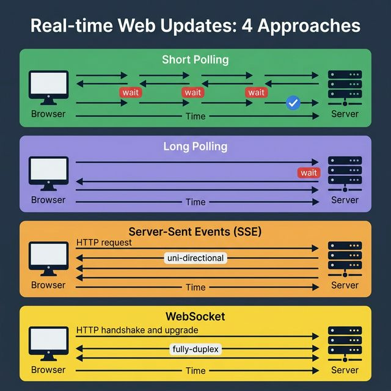
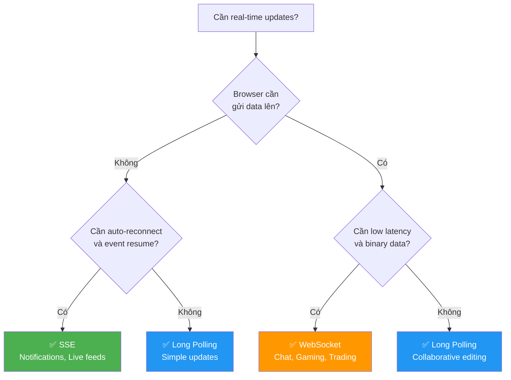

<!-- tags: system-design, real-time -->
# 🔄 Real-time Web Updates

> HTTP server không thể tự động khởi tạo connection tới browser. Vậy làm sao để browser nhận được real-time updates? 4 giải pháp: Short Polling, Long Polling, SSE, và WebSocket.

📅 Ngày tạo: 2026-03-22 · 🔄 Cập nhật: 2026-03-22 · ⏱️ 15 phút đọc

| Aspect         | Detail                                                       |
| -------------- | ------------------------------------------------------------ |
| **Complexity** | 🌟🌟🌟                                                       |
| **Use case**   | Real-time communication, Live updates, Chat, Notifications   |
| **Keywords**   | Short Polling, Long Polling, SSE, WebSocket, HTTP, Real-time |

---

## 1. DEFINE

Chat app: user gửi message, người nhận thấy sau 5 giây. "Đó là realtime rồi mà?" — Không, đó là polling mỗi 5 giây. Real realtime là WebSocket: 1 message gửi, 1 event push, delay dưới 100ms. Nhưng giữa Short Polling, Long Polling, SSE, và WebSocket — mỗi cái giải quyết một trade-off khác nhau giữa complexity, scalability, và latency.


### Vấn Đề

HTTP là **request-response protocol** — browser phải chủ động gửi request, server mới có thể trả response. Server **không thể tự động push** data tới browser.

Vậy khi cần real-time updates (chat, notifications, live scores, stock prices), ta phải làm gì?

### 4 Giải Pháp

| Approach          | Ai chủ động?               | Connection              | Direction                          | Latency                  |
| ----------------- | -------------------------- | ----------------------- | ---------------------------------- | ------------------------ |
| **Short Polling** | Browser                    | Nhiều connections ngắn  | Request → Response                 | Cao (phụ thuộc interval) |
| **Long Polling**  | Browser (nhưng server giữ) | Connection giữ lâu      | Request → Response (delayed)       | Trung bình               |
| **SSE**           | Server push                | 1 connection persistent | Server → Browser (uni-directional) | Thấp                     |
| **WebSocket**     | Cả hai                     | 1 connection persistent | Fully-duplex (bidirectional)       | Rất thấp                 |

### Short Polling

Browser gửi request liên tục theo interval cố định (ví dụ: mỗi 3 giây). Server trả response ngay lập tức — dù có data mới hay không.

- ✅ **Đơn giản** — chỉ cần HTTP GET thông thường
- ❌ **Tốn bandwidth** — hầu hết responses trống (no new data)
- ❌ **Latency cao** — data mới có thể phải chờ đến lần poll tiếp theo

### Long Polling

Browser gửi request. Server **giữ connection mở** cho đến khi có data mới, rồi mới trả response. Browser nhận response xong → gửi request mới ngay lập tức.

- ✅ **Giảm request thừa** — server chỉ response khi có data
- ❌ **Server hold resources** — mỗi connection chiếm 1 thread/goroutine
- ❌ **Timeout handling** phức tạp — connection có thể bị timeout

Polling đã cover. Nhưng SSE cần server push — hãy stream.

### Server-Sent Events (SSE)

Browser mở 1 HTTP connection. Server giữ connection mở và **push events liên tục** tới browser. Uni-directional: chỉ server → browser.

- ✅ **Auto-reconnect** — browser tự reconnect nếu connection drop
- ✅ **Event IDs** — resume từ last event khi reconnect
- ✅ **Native browser support** — `EventSource` API
- ❌ **Uni-directional** — browser không gửi được data ngược lên
- ❌ **HTTP/1.1 limit** — max 6 connections per domain

Polling đã cover. Nhưng SSE cần server push — hãy stream.

### WebSocket

Browser và server thực hiện **HTTP upgrade handshake**, rồi chuyển sang WebSocket protocol. Cả hai bên đều có thể gửi/nhận messages bất kỳ lúc nào (**fully-duplex**).

- ✅ **Bidirectional** — cả browser và server đều gửi được
- ✅ **Low latency** — không cần request/response overhead
- ✅ **Binary support** — gửi được binary frames
- ❌ **Phức tạp hơn** — cần handle reconnect, heartbeat, state
- ❌ **Proxy/firewall issues** — một số proxy không support WebSocket

---

Các failure mode trên nghe dễ tránh. Nhưng có trap: WebSocket không reconnect = data loss, và SSE single-direction bị dùng cho bidirectional = wrong tool. Trap đó sẽ xuất hiện ở PITFALLS.

## 2. VISUAL

Khái niệm đã có tên. Sang sơ đồ, `🔄 Real-time Web Updates` mới bộc lộ nơi dữ liệu chảy qua, nơi control đổi tay, và chỗ trade-off bắt đầu hiện hình.




### Timeline Diagram

```
SHORT POLLING
Browser  ──req──▶  Server          Browser gửi request liên tục
         ◀──res──  (empty)         Server trả ngay (thường rỗng)
         ──req──▶
         ◀──res──  (empty)
         ──req──▶
         ◀──res──  ✅ data!        Cuối cùng có data mới

LONG POLLING
Browser  ──req──▶  Server          Browser gửi request
                   ⏳ wait...      Server giữ connection
                   ⏳ wait...      Chờ data mới...
         ◀──res──  ✅ data!        Có data → trả response
         ──req──▶                  Browser gửi request mới ngay
                   ⏳ wait...

SSE (Server-Sent Events)
Browser  ──req──▶  Server          Browser mở EventSource
         ◀──event  data: {"msg":"hi"}    Server push events
         ◀──event  data: {"msg":"ho"}    Liên tục, uni-directional
         ◀──event  data: {"msg":"ha"}
                                   Browser KHÔNG gửi ngược được

WEBSOCKET
Browser  ──upgrade──▶  Server      HTTP upgrade handshake
         ◀──101 Switching──        Server accept
         ◀══════════════▶          Fully-duplex channel
         ──msg──▶                  Browser gửi
         ◀──msg──                  Server gửi
         ──msg──▶                  Bất kỳ bên nào, bất kỳ lúc nào
```

### Mermaid: Decision Flowchart



---

## 3. CODE

Sơ đồ đã lộ luồng chính. Đến code, `🔄 Real-time Web Updates` mới hiện ra thành những ranh giới mà team phải thật sự cài đặt và vận hành.


### 1. Short Polling — Client & Server

```go
package main

import (
    "encoding/json"
    "log/slog"
    "math/rand"
    "net/http"
    "sync"
    "time"
)

// ─── SHORT POLLING SERVER ───
// Browser gửi GET /poll mỗi 3 giây
// Server trả ngay — có data thì trả, không có thì trả rỗng

type Message struct {
    ID        int       `json:"id"`
    Text      string    `json:"text"`
    CreatedAt time.Time `json:"created_at"`
}

type ShortPollingServer struct {
    mu       sync.RWMutex
    messages []Message
    lastID   int
}

func (s *ShortPollingServer) HandlePoll(w http.ResponseWriter, r *http.Request) {
    // Client gửi last_id để chỉ nhận messages mới
    var lastID int
    if v := r.URL.Query().Get("last_id"); v != "" {
        json.Unmarshal([]byte(v), &lastID)
    }

    s.mu.RLock()
    var newMsgs []Message
    for _, msg := range s.messages {
        if msg.ID > lastID {
            newMsgs = append(newMsgs, msg)
        }
    }
    s.mu.RUnlock()

    w.Header().Set("Content-Type", "application/json")

    if len(newMsgs) == 0 {
        // ❌ Trả rỗng — bandwidth wasted
        json.NewEncoder(w).Encode(map[string]interface{}{
            "messages": []Message{},
            "has_new":  false,
        })
        return
    }

    // ✅ Có data mới
    json.NewEncoder(w).Encode(map[string]interface{}{
        "messages": newMsgs,
        "has_new":  true,
    })
}

func main() {
    server := &ShortPollingServer{}

    // Simulate new messages
    go func() {
        for {
            time.Sleep(time.Duration(2+rand.Intn(5)) * time.Second)
            server.mu.Lock()
            server.lastID++
            server.messages = append(server.messages, Message{
                ID:        server.lastID,
                Text:      "Hello from server!",
                CreatedAt: time.Now(),
            })
            server.mu.Unlock()
        }
    }()

    http.HandleFunc("GET /poll", server.HandlePoll)
    slog.Info("short polling server", "addr", ":8080")
    http.ListenAndServe(":8080", nil)
}
```

```typescript
type Message = { id: number; text: string; createdAt: string };

class ShortPollingServer {
    private readonly messages: Message[] = [];

    handlePoll(lastId: number): { messages: Message[]; hasNew: boolean } {
        const messages = this.messages.filter((message) => message.id > lastId);
        return { messages, hasNew: messages.length > 0 };
    }
}
```

```rust
struct Message {
    id: i32,
    text: String,
}
```

```cpp
struct Message {
    int id;
    std::string text;
};
```

```python
from dataclasses import dataclass
from datetime import datetime


@dataclass
class Message:
    id: int
    text: str
    created_at: datetime
```

```java
// Java equivalent for assets/system-design/11-realtime-web-updates.md
// Source language used for adaptation: typescript
class ShortPollingServer {
    // Keep the same responsibilities and flow as the implementations above.
}

final class 11RealtimeWebUpdatesExample1 {
    private 11RealtimeWebUpdatesExample1() {}

    static Object ShortPollingServer(Object... args) {
        // Preserve the same algorithm / object collaboration shown above.
        return null;
    }
}
```

Polling đã cover. Nhưng SSE cần server push — hãy stream.

### 2. Long Polling — Server holds connection

```go
package longpoll

import (
    "context"
    "encoding/json"
    "net/http"
    "sync"
    "time"
)

// ─── LONG POLLING SERVER ───
// Browser gửi request → Server giữ connection → Trả khi có data mới

type LongPollServer struct {
    mu       sync.Mutex
    waiters  []chan []byte // Channels waiting for new data
}

func NewLongPollServer() *LongPollServer {
    return &LongPollServer{}
}

func (s *LongPollServer) HandlePoll(w http.ResponseWriter, r *http.Request) {
    // Tạo channel để chờ data mới
    ch := make(chan []byte, 1)
    s.mu.Lock()
    s.waiters = append(s.waiters, ch)
    s.mu.Unlock()

    // ✅ Context với timeout — tránh giữ connection vô hạn
    ctx, cancel := context.WithTimeout(r.Context(), 30*time.Second)
    defer cancel()

    select {
    case data := <-ch:
        // ✅ Có data mới → trả response
        w.Header().Set("Content-Type", "application/json")
        w.Write(data)

    case <-ctx.Done():
        // ⏰ Timeout — trả empty response, browser sẽ gửi request mới
        w.Header().Set("Content-Type", "application/json")
        json.NewEncoder(w).Encode(map[string]interface{}{
            "timeout": true,
            "message": "No new data. Please reconnect.",
        })
    }

    // Cleanup: remove waiter
    s.mu.Lock()
    for i, waiter := range s.waiters {
        if waiter == ch {
            s.waiters = append(s.waiters[:i], s.waiters[i+1:]...)
            break
        }
    }
    s.mu.Unlock()
}

// Publish — gửi data tới tất cả waiters
func (s *LongPollServer) Publish(data interface{}) {
    payload, _ := json.Marshal(data)

    s.mu.Lock()
    defer s.mu.Unlock()

    for _, ch := range s.waiters {
        select {
        case ch <- payload:
        default: // Channel full — skip
        }
    }
    // Clear all waiters — họ đã nhận data
    s.waiters = nil
}
```

```typescript
class LongPollServer {
    private readonly waiters = new Set<(payload: unknown) => void>();

    async handlePoll(timeoutMs = 30_000): Promise<unknown> {
        return new Promise((resolve) => {
            const timer = setTimeout(() => resolve({ timeout: true }), timeoutMs);
            this.waiters.add((payload) => {
                clearTimeout(timer);
                resolve(payload);
            });
        });
    }
}
```

```rust
use tokio::sync::oneshot;

type Waiter = oneshot::Sender<Vec<u8>>;
```

```cpp
#include <functional>
#include <vector>

using Waiter = std::function<void(const std::string&)>;
```

```python
class LongPollServer:
    def __init__(self) -> None:
        self.waiters: list = []

    async def handle_poll(self) -> dict:
        return {"timeout": True, "message": "No new data. Please reconnect."}
```

```java
// Java equivalent for assets/system-design/11-realtime-web-updates.md
// Source language used for adaptation: typescript
class LongPollServer {
    // Keep the same responsibilities and flow as the implementations above.
}

final class 11RealtimeWebUpdatesExample2 {
    private 11RealtimeWebUpdatesExample2() {}

    static Object handlePoll(Object... args) {
        // Follow the same control flow and data-shape semantics as the reference implementation.
        return null;
    }

    static Object Promise(Object... args) {
        // Follow the same control flow and data-shape semantics as the reference implementation.
        return null;
    }
}
```

### 3. SSE (Server-Sent Events) — Uni-directional push

```go
package sse

import (
    "fmt"
    "log/slog"
    "net/http"
    "sync"
    "time"
)

// ─── SSE SERVER ───
// Server push events liên tục tới browser qua 1 HTTP connection
// Browser dùng EventSource API để nhận

type SSEServer struct {
    mu      sync.RWMutex
    clients map[chan string]bool
}

func NewSSEServer() *SSEServer {
    return &SSEServer{
        clients: make(map[chan string]bool),
    }
}

func (s *SSEServer) HandleSSE(w http.ResponseWriter, r *http.Request) {
    // ✅ SSE headers — bắt buộc
    w.Header().Set("Content-Type", "text/event-stream")
    w.Header().Set("Cache-Control", "no-cache")
    w.Header().Set("Connection", "keep-alive")
    w.Header().Set("Access-Control-Allow-Origin", "*")

    // ✅ Flush headers ngay
    flusher, ok := w.(http.Flusher)
    if !ok {
        http.Error(w, "Streaming not supported", http.StatusInternalServerError)
        return
    }

    // Tạo client channel
    ch := make(chan string, 10)
    s.mu.Lock()
    s.clients[ch] = true
    s.mu.Unlock()

    // Cleanup khi disconnect
    defer func() {
        s.mu.Lock()
        delete(s.clients, ch)
        s.mu.Unlock()
        close(ch)
    }()

    // ✅ Gửi initial event
    eventID := 0
    fmt.Fprintf(w, "id: %d\nevent: connected\ndata: {\"status\":\"ok\"}\n\n", eventID)
    flusher.Flush()

    // Loop gửi events
    for {
        select {
        case <-r.Context().Done():
            slog.Info("SSE client disconnected")
            return

        case msg := <-ch:
            eventID++
            // ✅ SSE format: id, event, data, followed by double newline
            fmt.Fprintf(w, "id: %d\nevent: message\ndata: %s\n\n", eventID, msg)
            flusher.Flush()
        }
    }
}

// Broadcast — gửi message tới tất cả connected clients
func (s *SSEServer) Broadcast(message string) {
    s.mu.RLock()
    defer s.mu.RUnlock()

    for ch := range s.clients {
        select {
        case ch <- message:
        default: // Buffer full — skip slow client
        }
    }
}

// JavaScript client:
//
//   const es = new EventSource('/events');
//   es.addEventListener('message', (e) => {
//       console.log(JSON.parse(e.data));
//   });
//   es.addEventListener('connected', (e) => {
//       console.log('Connected:', JSON.parse(e.data));
//   });
//   es.onerror = () => console.log('Reconnecting...');
//   // ✅ Browser tự auto-reconnect khi connection drop
```

```typescript
import express from "express";

const app = express();
const clients = new Set<import("node:http").ServerResponse>();

app.get("/events", (_req, res) => {
    res.setHeader("Content-Type", "text/event-stream");
    res.setHeader("Cache-Control", "no-cache");
    clients.add(res);
});
```

```rust
struct SseServer;
```

```cpp
#include <iostream>

int main() {
    std::cout << "SSE keeps one HTTP connection open and flushes events as text/event-stream.\n";
}
```

```python
def format_sse(event_id: int, event: str, data: str) -> str:
    return f"id: {event_id}\\nevent: {event}\\ndata: {data}\\n\\n"
```

```java
// Java equivalent for assets/system-design/11-realtime-web-updates.md
// Source language used for adaptation: typescript
final class 11RealtimeWebUpdatesExample3 {
    private 11RealtimeWebUpdatesExample3() {}

    static Object example3(Object... args) {
        // Preserve the same algorithm / object collaboration shown above.
        return null;
    }
}
```

### 4. WebSocket — Fully-duplex Communication

```go
package ws

import (
    "encoding/json"
    "log/slog"
    "net/http"
    "sync"
    "time"

    "github.com/gorilla/websocket"
)

// ─── WEBSOCKET SERVER ───
// Fully-duplex: cả browser và server gửi/nhận messages bất kỳ lúc nào

var upgrader = websocket.Upgrader{
    ReadBufferSize:  1024,
    WriteBufferSize: 1024,
    CheckOrigin:     func(r *http.Request) bool { return true },
}

type WSMessage struct {
    Type    string          `json:"type"`
    Payload json.RawMessage `json:"payload"`
}

type WSHub struct {
    mu      sync.RWMutex
    clients map[*websocket.Conn]bool
}

func NewWSHub() *WSHub {
    return &WSHub{
        clients: make(map[*websocket.Conn]bool),
    }
}

func (h *WSHub) HandleWS(w http.ResponseWriter, r *http.Request) {
    // ✅ HTTP Upgrade → WebSocket
    conn, err := upgrader.Upgrade(w, r, nil)
    if err != nil {
        slog.Error("websocket upgrade failed", "error", err)
        return
    }
    defer conn.Close()

    // Register client
    h.mu.Lock()
    h.clients[conn] = true
    h.mu.Unlock()

    defer func() {
        h.mu.Lock()
        delete(h.clients, conn)
        h.mu.Unlock()
    }()

    // ✅ Heartbeat — keep connection alive
    conn.SetPongHandler(func(string) error {
        conn.SetReadDeadline(time.Now().Add(60 * time.Second))
        return nil
    })

    go func() {
        ticker := time.NewTicker(30 * time.Second)
        defer ticker.Stop()
        for range ticker.C {
            if err := conn.WriteMessage(websocket.PingMessage, nil); err != nil {
                return
            }
        }
    }()

    // ✅ Read loop — nhận messages từ browser
    for {
        _, raw, err := conn.ReadMessage()
        if err != nil {
            if websocket.IsUnexpectedCloseError(err,
                websocket.CloseGoingAway,
                websocket.CloseNormalClosure,
            ) {
                slog.Error("websocket error", "error", err)
            }
            break
        }

        var msg WSMessage
        if err := json.Unmarshal(raw, &msg); err != nil {
            continue
        }

        // Route by message type
        switch msg.Type {
        case "chat":
            // Broadcast to all clients
            h.Broadcast(raw)
        case "ping":
            // Reply to sender only
            conn.WriteJSON(WSMessage{Type: "pong"})
        }
    }
}

// Broadcast — gửi message tới tất cả connected WebSocket clients
func (h *WSHub) Broadcast(data []byte) {
    h.mu.RLock()
    defer h.mu.RUnlock()

    for conn := range h.clients {
        if err := conn.WriteMessage(websocket.TextMessage, data); err != nil {
            conn.Close()
            delete(h.clients, conn)
        }
    }
}
```

```typescript
import { WebSocketServer } from "ws";

const wss = new WebSocketServer({ port: 8081 });
const sockets = new Set();
```

```rust
struct WSMessage {
    message_type: String,
}
```

```cpp
struct WSMessage {
    std::string type;
    std::string payload;
};
```

```python
class WSHub:
    def __init__(self) -> None:
        self.clients: set = set()

    async def broadcast(self, payload: str) -> None:
        for client in list(self.clients):
            await client.send_text(payload)
```

```java
// Java equivalent for assets/system-design/11-realtime-web-updates.md
// Source language used for adaptation: typescript
final class 11RealtimeWebUpdatesExample4 {
    private 11RealtimeWebUpdatesExample4() {}

    static Object WebSocketServer(Object... args) {
        // Follow the same control flow and data-shape semantics as the reference implementation.
        return null;
    }

    static Object Set(Object... args) {
        // Follow the same control flow and data-shape semantics as the reference implementation.
        return null;
    }
}
```

---

Bạn đã đi qua realtime patterns. Bây giờ đến phần nguy hiểm: no reconnect và wrong channel — trap đã được setup từ đầu bài.

## 4. PITFALLS

Hiểu được `🔄 Real-time Web Updates` là bước đầu; giữ nó không phản chủ trong vận hành mới là phần khó. Những pitfalls sau là các chỗ team hay trả giá nhất.


| # | Severity | Lỗi (Pitfall) | Hậu quả | Fix (Giải pháp) |
| --- | --- | --- | --- | --- |
| 1 | 🔴 Fatal | **Short polling interval quá ngắn** | 100ms interval × 10K users = 100K requests/giây → DDoS chính server mình. | Interval tối thiểu 3-5 giây. Dùng exponential backoff khi idle. |
| 2 | 🔴 Fatal | **Long polling không set timeout** | Connection giữ mãi → file descriptor exhaustion → server crash. | Timeout 30-60s. Browser retry ngay sau timeout. |
| 3 | 🟡 Common | **SSE không handle reconnect** | Client disconnect → mất events trong khoảng thời gian offline. | Dùng `Last-Event-ID` header — server resume từ event cuối cùng. |
| 4 | 🟡 Common | **WebSocket không heartbeat** | NAT/proxy timeout (thường 60s idle) → connection drop mà không biết. | Ping/pong mỗi 30s. Set `ReadDeadline` và `PongHandler`. |
| 5 | 🟡 Common | **Dùng WebSocket cho mọi thứ** | Over-engineering: notifications chỉ cần server → client. WebSocket phức tạp hơn SSE. | SSE cho uni-directional push. WebSocket chỉ khi cần bidirectional. |
| 6 | 🔵 Minor | **SSE trên HTTP/1.1 — max 6 connections** | Browser giới hạn 6 connections per domain. 6 tabs = hết connections. | Dùng HTTP/2 (multiplexed) hoặc shared SSE connection qua SharedWorker. |

---

Bạn đã đi qua Realtime Web Updates và cạm bẫy. Các resources dưới đây giúp đi sâu hơn.

## 5. REF

| Resource                | Link                                                                                         |
| ----------------------- | -------------------------------------------------------------------------------------------- |
| MDN: Server-Sent Events | [developer.mozilla.org](https://developer.mozilla.org/en-US/docs/Web/API/Server-sent_events) |
| MDN: WebSocket API      | [developer.mozilla.org](https://developer.mozilla.org/en-US/docs/Web/API/WebSockets_API)     |
| gorilla/websocket       | [github.com/gorilla](https://github.com/gorilla/websocket)                                   |
| Go net/http SSE         | [pkg.go.dev](https://pkg.go.dev/net/http#Flusher)                                            |
| RFC 6455 — WebSocket    | [rfc-editor.org](https://www.rfc-editor.org/rfc/rfc6455)                                     |

---

## 6. RECOMMEND

Khi đã thấy `🔄 Real-time Web Updates` giải quyết bài toán gì và hay đổ vỡ ở đâu, các tài liệu dưới đây sẽ mở rộng đúng hướng thay vì kéo bạn sang buzzword khác.


| Mở rộng            | Khi nào cần             | Lý do                                                                        |
| ------------------ | ----------------------- | ---------------------------------------------------------------------------- |
| **Socket.IO**      | Cross-browser fallback  | Auto-fallback: WebSocket → Long Polling → Polling. Rooms, namespaces.        |
| **gRPC Streaming** | Microservices real-time | Server streaming, client streaming, bidirectional streaming trên HTTP/2.     |
| **WebTransport**   | Next-gen real-time      | HTTP/3 based, UDP transport, multiple streams. Thay thế WebSocket tương lai. |
| **Redis Pub/Sub**  | Multi-server broadcast  | Khi chạy nhiều server instances, cần share events giữa các servers.          |

---

---

**Callback**: Quay lại chat lag 5 giây. Bây giờ bạn biết: Short Polling → Long Polling → SSE → WebSocket, mỗi bước giảm latency nhưng tăng complexity. WebSocket cho bi-directional, SSE cho server-push one-way, Polling cho legacy. Chọn theo latency requirement, không phải theo trend.

← Previous: [The Modern HTTP Ecosystem](./10-http-ecosystem.md) · → Next: [Top 20 System Design Concepts](./12-top-20-system-design-concepts.md) · ← Quay về [System Design](./README.md)
