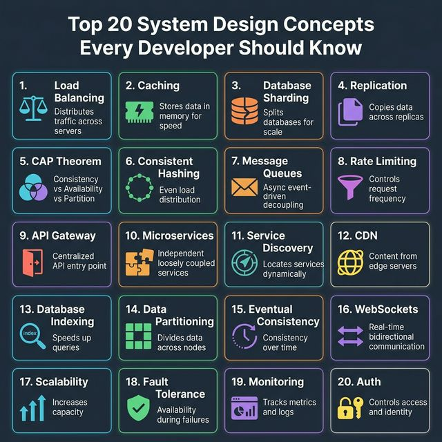
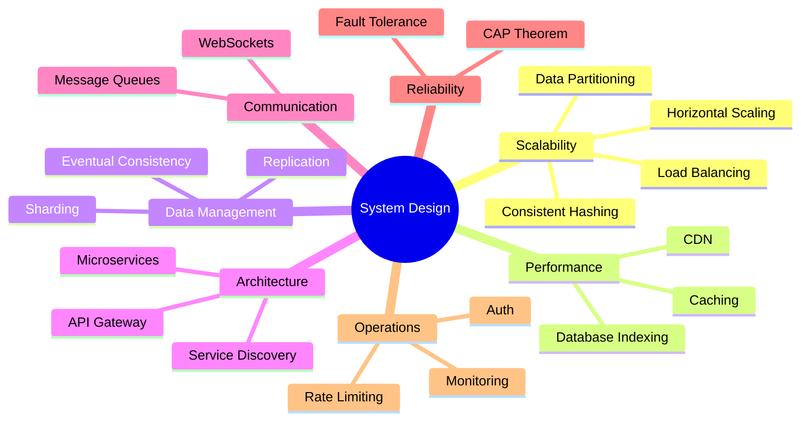

<!-- tags: system-design, ai -->
# 🏗️ Top 20 System Design Concepts

> 20 khái niệm System Design quan trọng nhất mà developer cần nắm vững — từ Load Balancing, Caching, Sharding đến Monitoring và Authentication.

📅 Ngày tạo: 2026-03-22 · 🔄 Cập nhật: 2026-03-22 · ⏱️ 20 phút đọc

| Aspect         | Detail                                                                     |
| -------------- | -------------------------------------------------------------------------- |
| **Complexity** | 🌟🌟🌟🌟                                                                   |
| **Use case**   | System Design fundamentals, Interview preparation, Architecture review     |
| **Keywords**   | Load Balancing, Caching, Sharding, CAP Theorem, Microservices, API Gateway |

---

## 1. DEFINE

Một buổi phỏng vấn system design thường ném ra hàng chục khái niệm nghe quen tai, và người trả lời dễ rơi vào bẫy kể tên thật nhiều mà không biết concept nào giải quyết áp lực nào. Bài này tồn tại để biến danh sách 20 từ khóa đó thành một bản đồ có thể dùng được.


### Tổng Quan

System Design là quá trình xác định **kiến trúc, components, modules và interfaces** của một hệ thống phần mềm để đáp ứng yêu cầu. 20 khái niệm dưới đây là nền tảng để thiết kế hệ thống scalable, reliable và performant.

### Bảng Tóm Tắt 20 Concepts

| #   | Concept                            | Mô tả                                                     | Category        |
| --- | ---------------------------------- | --------------------------------------------------------- | --------------- |
| 1   | **Load Balancing**                 | Phân phối traffic tới nhiều servers                       | Scalability     |
| 2   | **Caching**                        | Lưu data thường xuyên truy cập vào memory                 | Performance     |
| 3   | **Database Sharding**              | Chia database theo horizontal partitions                  | Data Management |
| 4   | **Replication**                    | Sao chép data sang nhiều replicas                         | Availability    |
| 5   | **CAP Theorem**                    | Trade-off: Consistency, Availability, Partition Tolerance | Theory          |
| 6   | **Consistent Hashing**             | Phân phối load đều trong dynamic server environments      | Scalability     |
| 7   | **Message Queues**                 | Decouple services bằng async event-driven architecture    | Communication   |
| 8   | **Rate Limiting**                  | Kiểm soát tần suất requests                               | Security        |
| 9   | **API Gateway**                    | Điểm vào trung tâm cho routing API requests               | Infrastructure  |
| 10  | **Microservices**                  | Chia hệ thống thành services nhỏ, độc lập                 | Architecture    |
| 11  | **Service Discovery**              | Tìm services dynamically trong distributed systems        | Infrastructure  |
| 12  | **CDN**                            | Deliver content từ edge servers gần user                  | Performance     |
| 13  | **Database Indexing**              | Tăng tốc queries bằng index                               | Data Management |
| 14  | **Data Partitioning**              | Chia data theo nodes cho scalability                      | Data Management |
| 15  | **Eventual Consistency**           | Đảm bảo consistency over time                             | Theory          |
| 16  | **WebSockets**                     | Bi-directional real-time communication                    | Communication   |
| 17  | **Scalability**                    | Tăng capacity bằng scale up/out                           | Scalability     |
| 18  | **Fault Tolerance**                | Đảm bảo availability khi failures xảy ra                  | Reliability     |
| 19  | **Monitoring**                     | Theo dõi metrics, logs, alerts                            | Operations      |
| 20  | **Authentication & Authorization** | Xác thực danh tính và phân quyền                          | Security        |

---

Các failure mode trên nghe cơ bản. Nhưng có trap: biết concept nhưng không biết khi nào apply = over-engineering, và mix concepts sai context = complexity spike. Trap đó sẽ xuất hiện ở PITFALLS.

## 2. VISUAL

Định nghĩa mới chỉ khóa được từ vựng. Hình dưới đây cho thấy `Top 20 System Design Concepts` vận hành ra sao khi request, node, và network bắt đầu tương tác thật.




### Mermaid: System Design Concepts Map



---

## 3. CODE

Từ sơ đồ sang implementation là chỗ nhiều hiểu lầm nhất. Đoạn code tiếp theo giúp `Top 20 System Design Concepts` đứng xuống mặt đất thay vì ở lại trên whiteboard.


### 1. Load Balancing

Phân phối incoming traffic tới nhiều servers để không server nào bị quá tải.

**Algorithms phổ biến:**

| Algorithm            | Mô tả                         | Use case               |
| -------------------- | ----------------------------- | ---------------------- |
| Round Robin          | Lần lượt từng server          | Servers đều nhau       |
| Weighted Round Robin | Server mạnh nhận nhiều hơn    | Servers không đều      |
| Least Connections    | Server ít connections nhất    | Long-lived connections |
| IP Hash              | Hash IP client → fixed server | Session affinity       |
| Consistent Hashing   | Hash ring                     | Dynamic server pool    |

```go
// Simple round-robin load balancer
type RoundRobin struct {
    backends []string
    current  uint64
}

func (rr *RoundRobin) Next() string {
    idx := atomic.AddUint64(&rr.current, 1)
    return rr.backends[idx%uint64(len(rr.backends))]
}
```

```java
// Java equivalent for assets/system-design/12-top-20-system-design-concepts.md
// Source language used for adaptation: go
final class 12Top20SystemDesignConceptsExample1 {
    private 12Top20SystemDesignConceptsExample1() {}

    static Object example1(Object... args) {
        // Preserve the same algorithm / object collaboration shown above.
        return null;
    }
}
```

### 2. Caching

Lưu data thường xuyên truy cập vào memory (RAM) để giảm latency và database load.

**Cache strategies:**

| Strategy          | Mô tả                                     | Khi nào dùng                |
| ----------------- | ----------------------------------------- | --------------------------- |
| **Cache-Aside**   | App đọc cache → miss → đọc DB → ghi cache | Read-heavy workloads        |
| **Write-Through** | Ghi cache + DB cùng lúc                   | Data consistency quan trọng |
| **Write-Behind**  | Ghi cache trước, async ghi DB             | Write-heavy workloads       |
| **Read-Through**  | Cache tự đọc DB khi miss                  | Simplify app logic          |

```go
// Cache-aside pattern
func GetUser(ctx context.Context, id string) (*User, error) {
    // 1. Check cache
    if cached, err := redis.Get(ctx, "user:"+id).Result(); err == nil {
        var user User
        json.Unmarshal([]byte(cached), &user)
        return &user, nil
    }

    // 2. Cache miss → query DB
    user, err := db.QueryUser(ctx, id)
    if err != nil {
        return nil, err
    }

    // 3. Set cache with TTL
    data, _ := json.Marshal(user)
    redis.Set(ctx, "user:"+id, data, 15*time.Minute)

    return user, nil
}
```

```typescript
async function getUser(id: string): Promise<User> {
    const cached = await redis.get(`user:${id}`);
    if (cached) return JSON.parse(cached) as User;

    const user = await db.queryUser(id);
    await redis.set(`user:${id}`, JSON.stringify(user), { px: 15 * 60_000 });
    return user;
}
```

```rust
async fn get_user(id: &str) -> anyhow::Result<User> {
    if let Some(cached) = redis_get(format!("user:{id}")).await? {
        return Ok(serde_json::from_str(&cached)?);
    }
    let user = db_query_user(id).await?;
    redis_set(format!("user:{id}"), serde_json::to_string(&user)?, 900).await?;
    Ok(user)
}
```

```cpp
User getUser(const std::string& id) {
    if (auto cached = redisGet("user:" + id); cached.has_value()) {
        return parseUser(cached.value());
    }
    User user = queryUser(id);
    redisSet("user:" + id, serializeUser(user), 900);
    return user;
}
```

```python
def get_user(user_id: str) -> dict:
    cached = redis_client.get(f"user:{user_id}")
    if cached:
        return json.loads(cached)

    user = db.query_user(user_id)
    redis_client.set(f"user:{user_id}", json.dumps(user), ex=15 * 60)
    return user
```

```java
// Java equivalent for assets/system-design/12-top-20-system-design-concepts.md
// Source language used for adaptation: typescript
final class 12Top20SystemDesignConceptsExample2 {
    private 12Top20SystemDesignConceptsExample2() {}

    static Object getUser(Object... args) {
        // Follow the same control flow and data-shape semantics as the reference implementation.
        return null;
    }
}
```

### 3. Database Sharding

Chia database thành nhiều **shards** (horizontal partitions), mỗi shard chứa một subset data.

```
Shard Key: user_id
├── Shard 0: user_id % 4 == 0  →  DB Server A
├── Shard 1: user_id % 4 == 1  →  DB Server B
├── Shard 2: user_id % 4 == 2  →  DB Server C
└── Shard 3: user_id % 4 == 3  →  DB Server D
```

**Lưu ý:** Cross-shard queries rất đắt. Chọn shard key cẩn thận để tránh hotspots.

### 4. Replication

Sao chép data sang nhiều replicas để đảm bảo availability và fault tolerance.

| Mode                | Mô tả                             | Trade-off               |
| ------------------- | --------------------------------- | ----------------------- |
| **Leader-Follower** | 1 leader writes, N followers read | Simple, read scalable   |
| **Leader-Leader**   | Multiple leaders write            | Conflict resolution cần |
| **Quorum**          | W + R > N → consistency           | Tunable consistency     |

### 5. CAP Theorem

Trong distributed system, chỉ có thể đảm bảo **2 trong 3** tính chất:

```
        Consistency
           /\
          /  \
         /    \
        / CP   \ CA ← (không tồn tại trong
       /  systems\     distributed systems)
      /          \
     /____________\
  Partition      Availability
  Tolerance
     AP systems
```

- **CP:** MongoDB, HBase — sacrifices availability
- **AP:** Cassandra, DynamoDB — sacrifices consistency
- **CA:** Traditional RDBMS (single node) — không partition tolerant

### 6. Consistent Hashing

Phân phối data trên hash ring. Khi thêm/xóa server, chỉ cần di chuyển `K/N` keys (K = total keys, N = servers).

```go
// Simplified consistent hashing
type HashRing struct {
    ring     map[uint32]string // hash → node
    sorted   []uint32          // sorted hashes
    replicas int               // virtual nodes per real node
}

func (h *HashRing) Get(key string) string {
    hash := crc32.ChecksumIEEE([]byte(key))
    idx := sort.Search(len(h.sorted), func(i int) bool {
        return h.sorted[i] >= hash
    })
    if idx >= len(h.sorted) {
        idx = 0 // wrap around ring
    }
    return h.ring[h.sorted[idx]]
}
```

```typescript
class HashRing {
    constructor(private readonly ring: Map<number, string>, private readonly sorted: number[]) {}

    get(key: string): string {
        let hash = 0;
        for (const char of key) hash = (hash * 31 + char.charCodeAt(0)) >>> 0;
        const index = this.sorted.findIndex((value) => value >= hash);
        return this.ring.get(this.sorted[index === -1 ? 0 : index])!;
    }
}
```

```rust
struct HashRing {
    ring: std::collections::BTreeMap<u32, String>,
}
```

```cpp
class HashRing {
public:
    std::string get(const std::string& key) const {
        return nodes_.at(std::hash<std::string>{}(key) % nodes_.size());
    }
private:
    std::vector<std::string> nodes_{"node-a", "node-b", "node-c"};
};
```

```python
class HashRing:
    def __init__(self, nodes: list[str]) -> None:
        self.nodes = nodes

    def get(self, key: str) -> str:
        return self.nodes[hash(key) % len(self.nodes)]
```

```java
// Java equivalent for assets/system-design/12-top-20-system-design-concepts.md
// Source language used for adaptation: typescript
class HashRing {
    // Keep the same responsibilities and flow as the implementations above.
}

final class 12Top20SystemDesignConceptsExample3 {
    private 12Top20SystemDesignConceptsExample3() {}

    static Object HashRing(Object... args) {
        // Preserve the same algorithm / object collaboration shown above.
        return null;
    }
}
```

### 7. Message Queues

Decouple producers và consumers bằng async message passing.

```
Producer → [Queue] → Consumer
                   → Consumer
                   → Consumer
```

**Tools:** Kafka (event streaming), RabbitMQ (message broker), Redis Streams, NATS.

### 8. Rate Limiting

Kiểm soát số lượng requests trong một khoảng thời gian.

| Algorithm          | Mô tả                                                  |
| ------------------ | ------------------------------------------------------ |
| **Token Bucket**   | Tokens refill theo rate cố định. Request tiêu 1 token. |
| **Sliding Window** | Đếm requests trong window time N giây trượt.           |
| **Fixed Window**   | Đếm requests trong window cố định (mỗi phút).          |
| **Leaky Bucket**   | Requests xếp hàng, xử lý theo rate cố định.            |

```go
// Token bucket rate limiter
type TokenBucket struct {
    rate       float64   // tokens per second
    capacity   float64   // max tokens
    tokens     float64
    lastRefill time.Time
    mu         sync.Mutex
}

func (tb *TokenBucket) Allow() bool {
    tb.mu.Lock()
    defer tb.mu.Unlock()

    now := time.Now()
    elapsed := now.Sub(tb.lastRefill).Seconds()
    tb.tokens = min(tb.capacity, tb.tokens+elapsed*tb.rate)
    tb.lastRefill = now

    if tb.tokens >= 1 {
        tb.tokens--
        return true
    }
    return false
}
```

```typescript
class TokenBucket {
    constructor(
        private readonly rate: number,
        private readonly capacity: number,
        private tokens = capacity,
        private lastRefill = Date.now(),
    ) {}

    allow(): boolean {
        const now = Date.now();
        const elapsed = (now - this.lastRefill) / 1000;
        this.tokens = Math.min(this.capacity, this.tokens + elapsed * this.rate);
        this.lastRefill = now;
        if (this.tokens >= 1) {
            this.tokens -= 1;
            return true;
        }
        return false;
    }
}
```

```rust
struct TokenBucket {
    rate: f64,
    capacity: f64,
    tokens: f64,
}
```

```cpp
class TokenBucket {
public:
    bool allow() {
        if (tokens_ >= 1.0) {
            tokens_ -= 1.0;
            return true;
        }
        return false;
    }
private:
    double tokens_{10.0};
};
```

```python
class TokenBucket:
    def __init__(self, rate: float, capacity: float) -> None:
        self.rate = rate
        self.capacity = capacity
        self.tokens = capacity
        self.last_refill = time.time()

    def allow(self) -> bool:
        now = time.time()
        self.tokens = min(self.capacity, self.tokens + (now - self.last_refill) * self.rate)
        self.last_refill = now
        if self.tokens >= 1:
            self.tokens -= 1
            return True
        return False
```

```java
// Java equivalent for assets/system-design/12-top-20-system-design-concepts.md
// Source language used for adaptation: typescript
class TokenBucket {
    // Keep the same responsibilities and flow as the implementations above.
}

final class 12Top20SystemDesignConceptsExample4 {
    private 12Top20SystemDesignConceptsExample4() {}

    static Object TokenBucket(Object... args) {
        // Preserve the same algorithm / object collaboration shown above.
        return null;
    }
}
```

### 9. API Gateway

Điểm vào trung tâm cho tất cả API requests. Xử lý routing, authentication, rate limiting, load balancing.

```
Client → API Gateway → Service A
                     → Service B
                     → Service C

Functions:
├── Request routing
├── Authentication/Authorization
├── Rate limiting
├── Request/Response transformation
├── Circuit breaking
├── Logging & Monitoring
└── SSL termination
```

**Tools:** Kong, NGINX, AWS API Gateway, Traefik.

### 10. Microservices

Chia monolith thành nhiều services nhỏ, độc lập, deploy riêng biệt.

| Aspect     | Monolith       | Microservices          |
| ---------- | -------------- | ---------------------- |
| Deploy     | Toàn bộ app    | Từng service           |
| Scale      | Scale cả app   | Scale từng service     |
| Tech stack | 1 tech         | Mỗi service tech riêng |
| Coupling   | Tight          | Loose                  |
| Complexity | Simple ban đầu | Distributed complexity |

### 11. Service Discovery

Tìm kiếm services dynamically trong distributed system mà không cần hardcode addresses.

| Pattern         | Mô tả                                     | Tool                  |
| --------------- | ----------------------------------------- | --------------------- |
| **Client-side** | Client query registry → connect trực tiếp | Eureka, Consul        |
| **Server-side** | Load balancer query registry → route      | AWS ELB, K8s Services |
| **DNS-based**   | DNS records cho service endpoints         | CoreDNS, Consul DNS   |

### 12. CDN (Content Delivery Network)

Cache và deliver static content (images, CSS, JS) từ edge servers gần user nhất.

```
User (Vietnam) → CDN Edge (Singapore) → Origin (US)
                 ✅ Cache hit: 20ms
                 ❌ Cache miss: 200ms → fetch origin → cache → respond
```

**Providers:** Cloudflare, AWS CloudFront, Akamai, Fastly.

### 13. Database Indexing

Tạo data structure (B-Tree, Hash) trên columns để tăng tốc query lookups.

```sql
-- Without index: Full table scan O(N)
SELECT * FROM users WHERE email = 'john@example.com';

-- With index: B-Tree lookup O(log N)
CREATE INDEX idx_users_email ON users(email);

-- Composite index cho multi-column queries
CREATE INDEX idx_orders_user_date ON orders(user_id, created_at);
```

```typescript
const withoutIndex = "SELECT * FROM users WHERE email = 'john@example.com'";
const createIndex = "CREATE INDEX idx_users_email ON users(email)";
```

```rust
let create_index = "CREATE INDEX idx_orders_user_date ON orders(user_id, created_at)";
```

```cpp
const char* createIndex = "CREATE INDEX idx_users_email ON users(email);";
```

```python
create_index = "CREATE INDEX idx_orders_user_date ON orders(user_id, created_at)"
```

**Trade-off:** Index tăng tốc **reads** nhưng **chậm writes** (cần update index mỗi INSERT/UPDATE).

### 14. Data Partitioning

Chia data thành partitions (logical segments) distributed across nodes.

| Type           | Mô tả              | Example                             |
| -------------- | ------------------ | ----------------------------------- |
| **Horizontal** | Chia rows          | Users 1-1M → Node A, 1M-2M → Node B |
| **Vertical**   | Chia columns       | Profile → Node A, Orders → Node B   |
| **Functional** | Chia theo function | Auth DB, Product DB, Order DB       |

### 15. Eventual Consistency

Trong distributed system, **tất cả replicas sẽ eventually converge** về cùng state — nhưng tại bất kỳ thời điểm nào, replicas có thể không đồng bộ.

```
Write → Leader ──sync──→ Follower 1  ✅ (đã sync)
                ──async─→ Follower 2  ⏳ (đang sync)
                ──async─→ Follower 3  ❌ (chưa sync)

→ Read Follower 3 lúc này = stale data
→ Sau vài ms/s → Follower 3 sync xong → consistent
```

**Trade-off:** Tăng availability và performance, nhưng tạm thời đọc được stale data.

### 16. WebSockets

Fully-duplex, persistent connection giữa client và server cho real-time updates.

```
HTTP:      Request → Response → Done (stateless)
WebSocket: Upgrade → Bidirectional messages ↔ Persistent
```

**Use cases:** Chat, live notifications, gaming, collaborative editing, stock tickers.

### 17. Scalability

| Type                       | Mô tả                        | Ưu điểm                   | Nhược điểm                           |
| -------------------------- | ---------------------------- | ------------------------- | ------------------------------------ |
| **Vertical (Scale Up)**    | Nâng cấp hardware (CPU, RAM) | Simple                    | Có giới hạn, single point of failure |
| **Horizontal (Scale Out)** | Thêm machines                | Unlimited, fault tolerant | Complex (distributed systems)        |

### 18. Fault Tolerance

Khả năng hệ thống **tiếp tục hoạt động** khi một phần bị lỗi.

**Techniques:**

- **Redundancy** — nhiều instances cho mỗi service
- **Circuit Breaker** — ngắt calls tới service đang fail
- **Retry with Backoff** — retry với exponential delay
- **Graceful Degradation** — giảm features thay vì crash hoàn toàn
- **Health Checks** — detect và remove unhealthy instances

### 19. Monitoring

Theo dõi system health qua **metrics, logs, traces**.

| Pillar      | Mô tả                                             | Tools                         |
| ----------- | ------------------------------------------------- | ----------------------------- |
| **Metrics** | Numerical measurements (CPU, latency, error rate) | Prometheus, Grafana, Datadog  |
| **Logs**    | Event records from applications                   | ELK Stack, Loki, Fluentd      |
| **Traces**  | Request flow across services                      | Jaeger, Zipkin, OpenTelemetry |
| **Alerts**  | Notifications khi thresholds bị vượt              | PagerDuty, OpsGenie           |

### 20. Authentication & Authorization

| Concept                    | Mô tả                                   | Mechanism              |
| -------------------------- | --------------------------------------- | ---------------------- |
| **Authentication** (AuthN) | Xác thực "You are who you say you are"  | JWT, OAuth2, SAML, MFA |
| **Authorization** (AuthZ)  | Phân quyền "What are you allowed to do" | RBAC, ABAC, ACL        |

```
Client → API Gateway → Auth Service → Verify JWT
                                     → Check permissions
                                     → ✅ Allowed / ❌ Denied
```

---

Bạn đã đi qua 20 system design concepts. Bây giờ đến phần nguy hiểm: over-engineering và contextless application — trap đã được setup từ đầu bài.

## 4. PITFALLS

Hiểu được `Top 20 System Design Concepts` là bước đầu; giữ nó không phản chủ trong vận hành mới là phần khó. Những pitfalls sau là các chỗ team hay trả giá nhất.


| # | Severity | Lỗi (Pitfall) | Hậu quả | Fix (Giải pháp) |
| --- | --- | --- | --- | --- |
| 1 | 🔴 Fatal | **Cache invalidation sai** | Stale data hiển thị, inconsistency | TTL + event-driven invalidation. Cache key versioning. |
| 2 | 🔴 Fatal | **Sharding key chọn sai** | Hotspot — 1 shard nhận 90% traffic | Analyze access patterns. Dùng composite shard key. |
| 3 | 🟡 Common | **Microservices quá sớm** | Distributed complexity cho team nhỏ | Start monolith → Extract services khi cần. |
| 4 | 🟡 Common | **Không rate limit** | DDoS, cascade failures, billing spike | Token bucket ở API Gateway layer. |
| 5 | 🟡 Common | **Index quá nhiều columns** | Write performance giảm, storage tăng | Index chỉ columns hay query. Monitor slow queries. |
| 6 | 🔵 Minor | **WebSocket không heartbeat** | Connection drop silently | Ping/pong mỗi 30s. Reconnect logic ở client. |

---

Bạn đã đi qua System Design Concepts và cạm bẫy. Các resources dưới đây giúp đi sâu hơn.

## 5. REF

| Resource                              | Link                                                                          |
| ------------------------------------- | ----------------------------------------------------------------------------- |
| System Design Primer                  | [github.com/donnemartin](https://github.com/donnemartin/system-design-primer) |
| Designing Data-Intensive Applications | [O'Reilly — Martin Kleppmann](https://dataintensive.net/)                     |
| ByteByteGo System Design              | [bytebytego.com](https://bytebytego.com/)                                     |
| Google SRE Book                       | [sre.google/sre-book](https://sre.google/sre-book/table-of-contents/)         |
| AWS Well-Architected Framework        | [aws.amazon.com](https://aws.amazon.com/architecture/well-architected/)       |

---

## 6. RECOMMEND

Khi đã thấy `Top 20 System Design Concepts` giải quyết bài toán gì và hay đổ vỡ ở đâu, các tài liệu dưới đây sẽ mở rộng đúng hướng thay vì kéo bạn sang buzzword khác.


| Mở rộng                      | Khi nào cần                    | Lý do                                                             |
| ---------------------------- | ------------------------------ | ----------------------------------------------------------------- |
| **Distributed Transactions** | Multi-service data consistency | Saga pattern, 2PC, Outbox pattern cho cross-service transactions. |
| **Event Sourcing + CQRS**    | Audit trail, complex domain    | Store events thay vì state. Separate read/write models.           |
| **Chaos Engineering**        | Production reliability         | Inject failures (Netflix Chaos Monkey) để test fault tolerance.   |
| **Zero Trust Architecture**  | Security-first design          | "Never trust, always verify" — mỗi request đều phải authenticate. |

---

---

**Callback**: Quay lại whiteboard trắng 45 phút. Bây giờ bạn biết: 20 concepts không phải checklist apply hết — mà là toolkit chọn theo áp lực. URL shortener cần: consistent hashing + cache + read-heavy optimization. Social feed cần: fan-out + message queue + CDN. Map concept vào problem, không phải tên vào slide.

← Previous: [Real-time Web Updates](./11-realtime-web-updates.md) · → Next: [How Go Maps Work Internally](./13-go-map-internals.md) · ← Quay về [System Design](./README.md)
