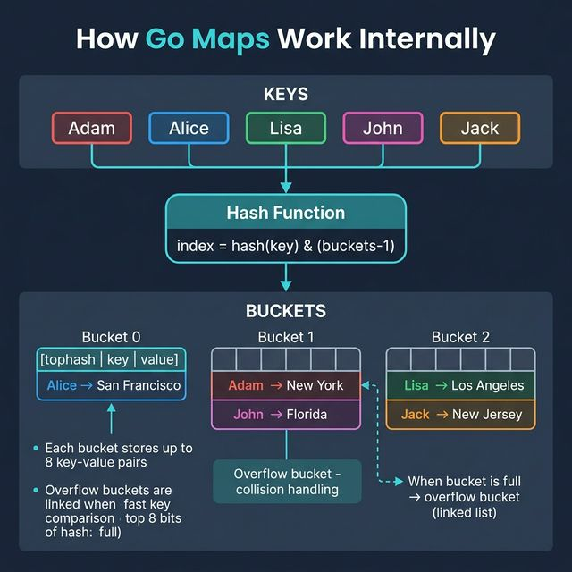
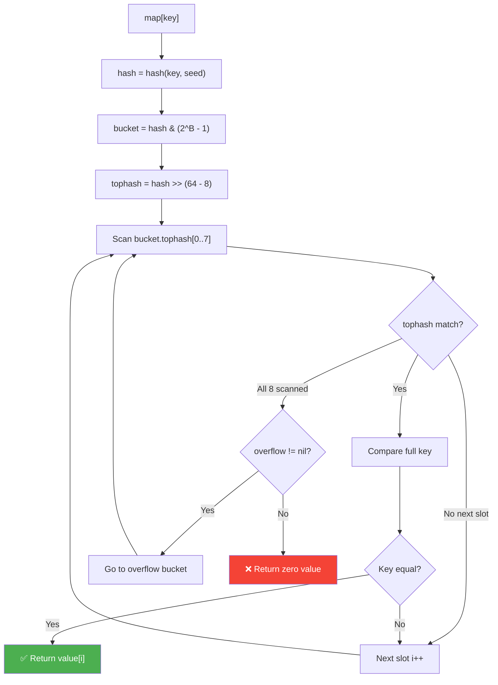

<!-- tags: system-design, golang -->
# 🗺️ How Go Maps Work Internally

> Go `map` là hash table implementation — key-value store với O(1) average lookup. Bài viết deep-dive vào cách Go runtime quản lý buckets, hash function, collision handling, và evacuation khi grow.

📅 Ngày tạo: 2026-03-22 · 🔄 Cập nhật: 2026-03-22 · ⏱️ 18 phút đọc

| Aspect         | Detail                                                                |
| -------------- | --------------------------------------------------------------------- |
| **Complexity** | 🌟🌟🌟🌟                                                              |
| **Use case**   | Hash table internals, Performance optimization, Interview preparation |
| **Keywords**   | map, hash table, bucket, overflow, evacuation, load factor            |

---

## 1. DEFINE

Production Go service: memory tăng linearly 200MB → 4GB trong 3 tuần. pprof heap profile: `map[string]Session` chiếm 87% heap. Map chỉ có 50,000 entries — tại sao 4GB? Vì Go map chỉ grow, không bao giờ shrink buckets. Delete key chỉ clear slot, bucket array không thu nhỏ. Hiểu map internals không phải academic exercise — nó là survival skill khi debug memory production.


### Map là gì?

`map[K]V` trong Go là **hash table** — data structure lưu key-value pairs, cho phép lookup, insert, delete trong **O(1) average time**.

```go
// Khai báo và sử dụng map
cities := map[string]string{
    "Adam":  "New York",
    "Alice": "San Francisco",
    "Lisa":  "Los Angeles",
    "John":  "Florida",
    "Jack":  "New Jersey",
}

// Lookup O(1)
city := cities["Alice"] // "San Francisco"

// Insert O(1)
cities["Bob"] = "Chicago"

// Delete O(1)
delete(cities, "John")

// Check existence
if city, ok := cities["Adam"]; ok {
    fmt.Println(city) // "New York"
}
```

```typescript
const cities = new Map<string, string>([
    ["Adam", "New York"],
    ["Alice", "San Francisco"],
    ["Lisa", "Los Angeles"],
]);

const city = cities.get("Alice");
cities.set("Bob", "Chicago");
cities.delete("John");
```

```rust
use std::collections::HashMap;

let mut cities = HashMap::from([
    ("Adam", "New York"),
    ("Alice", "San Francisco"),
    ("Lisa", "Los Angeles"),
]);
```

```cpp
std::unordered_map<std::string, std::string> cities{
    {"Adam", "New York"},
    {"Alice", "San Francisco"},
    {"Lisa", "Los Angeles"},
};
```

```python
cities = {
    "Adam": "New York",
    "Alice": "San Francisco",
    "Lisa": "Los Angeles",
}
```

```java
// Java equivalent for assets/system-design/13-go-map-internals.md
// Source language used for adaptation: typescript
final class 13GoMapInternalsExample1 {
    private 13GoMapInternalsExample1() {}

    static Object example1(Object... args) {
        // Preserve the same algorithm / object collaboration shown above.
        return null;
    }
}
```

### Cách Hoạt Động (High-level)

```
1. Keys được đưa vào map
2. Hash function chuyển key thành số → xác định bucket index
3. Key-value pair được lưu vào bucket tương ứng
4. Khi 2 keys hash vào cùng bucket → collision → overflow bucket
5. Lookup: hash key → tìm bucket → scan tophash → so sánh key → trả value
```

### So Sánh với Java HashMap

| Aspect            | Go `map`                                 | Java `HashMap`                            |
| ----------------- | ---------------------------------------- | ----------------------------------------- |
| **Bucket size**   | 8 key-value pairs per bucket             | 1 entry per bucket                        |
| **Collision**     | Overflow bucket (linked list of buckets) | Linked list → Red-Black Tree (≥8 entries) |
| **Hash function** | AES-based (runtime, per-process seed)    | `hashCode()` method                       |
| **Grow strategy** | Incremental evacuation                   | Rehash toàn bộ khi load factor > 0.75     |
| **Thread-safe**   | ❌ Không (cần `sync.Map` hoặc mutex)     | ❌ Không (cần `ConcurrentHashMap`)        |
| **Ordered**       | ❌ Không (random iteration)              | ❌ Không (`LinkedHashMap` cho ordered)    |

---

Các failure mode trên nghe quen. Nhưng có trap: concurrent map write = fatal runtime panic, và hash collision tận dụng = DoS attack. Trap đó sẽ xuất hiện ở PITFALLS.

## 2. VISUAL

Nói bằng chữ mới chỉ đủ để định nghĩa. Visual dưới đây mới trả lời phần khó hơn: `How Go Maps Work Internally` diễn ra theo luồng nào trong hệ thống thật.




### Internal Structure

```
┌─────────────────────────────────────────────────────┐
│                     hmap (header)                    │
├─────────────────────────────────────────────────────┤
│  count: 5          // số key-value pairs            │
│  B: 2              // log2(buckets) → 4 buckets     │
│  hash0: 0xA3B1...  // random seed (per-map)         │
│  buckets: *bmap    // pointer tới bucket array       │
│  oldbuckets: nil   // dùng khi growing              │
│  nevacuate: 0      // evacuation progress           │
└─────────────────────────────────────────────────────┘
          │
          ▼
┌─────────────────────────────────────────────────────┐
│              Bucket Array (2^B = 4 buckets)         │
├──────────┬──────────┬──────────┬──────────┤
│ Bucket 0 │ Bucket 1 │ Bucket 2 │ Bucket 3 │
└──────────┴──────────┴──────────┴──────────┘
     │
     ▼
┌─────────────────────────────────────────┐
│            Bucket (bmap)                 │
├─────────────────────────────────────────┤
│  tophash[8]  // top 8 bits of hash      │
│  keys[8]     // 8 keys                  │
│  values[8]   // 8 values                │
│  overflow    // → next overflow bucket  │
└─────────────────────────────────────────┘
```

### Mermaid: Map Lookup Flow



---

## 3. CODE

Từ sơ đồ sang implementation là chỗ nhiều hiểu lầm nhất. Đoạn code tiếp theo giúp `How Go Maps Work Internally` đứng xuống mặt đất thay vì ở lại trên whiteboard.


### 1. Custom HashMap — Go Implementation

```go
package hashmap

import (
    "fmt"
    "hash/fnv"
)

// ─── CUSTOM HASHMAP ───
// Simplified Go map implementation to understand internals
// Real Go map uses AES hash + incremental evacuation

const bucketSize = 8 // mỗi bucket chứa 8 entries (giống Go runtime)

type entry[K comparable, V any] struct {
    key   K
    value V
    used  bool
}

type bucket[K comparable, V any] struct {
    tophash  [bucketSize]uint8
    entries  [bucketSize]entry[K, V]
    overflow *bucket[K, V] // linked list cho collisions
}

type HashMap[K comparable, V any] struct {
    buckets    []bucket[K, V]
    count      int
    B          uint8   // log2(len(buckets))
    loadFactor float64 // threshold để grow
}

func New[K comparable, V any]() *HashMap[K, V] {
    return &HashMap[K, V]{
        buckets:    make([]bucket[K, V], 4), // 2^2 = 4 buckets ban đầu
        B:          2,
        loadFactor: 6.5, // Go mặc định: 6.5 entries per bucket
    }
}

// hash — tính hash value cho key
func (m *HashMap[K, V]) hash(key K) uint64 {
    h := fnv.New64a()
    fmt.Fprintf(h, "%v", key)
    return h.Sum64()
}

// tophash — lấy 8 bits cao nhất của hash
func tophash(hash uint64) uint8 {
    top := uint8(hash >> 56)
    if top < 2 { // 0 và 1 reserved cho empty/evacuated markers
        top += 2
    }
    return top
}

// bucketIndex — xác định bucket nào
func (m *HashMap[K, V]) bucketIndex(hash uint64) int {
    // hash & (2^B - 1) → tương đương hash % len(buckets)
    return int(hash & ((1 << m.B) - 1))
}

// Put — insert hoặc update key-value pair
func (m *HashMap[K, V]) Put(key K, value V) {
    // ✅ Check load factor → grow nếu cần
    if float64(m.count)/float64(len(m.buckets)) > m.loadFactor {
        m.grow()
    }

    h := m.hash(key)
    idx := m.bucketIndex(h)
    top := tophash(h)

    b := &m.buckets[idx]
    for {
        for i := 0; i < bucketSize; i++ {
            if !b.entries[i].used {
                // ✅ Slot trống → insert
                b.tophash[i] = top
                b.entries[i] = entry[K, V]{key: key, value: value, used: true}
                m.count++
                return
            }
            if b.tophash[i] == top && b.entries[i].key == key {
                // ✅ Key đã tồn tại → update value
                b.entries[i].value = value
                return
            }
        }
        // Bucket đầy → check overflow
        if b.overflow == nil {
            b.overflow = &bucket[K, V]{} // tạo overflow bucket
        }
        b = b.overflow
    }
}

// Get — lookup value by key
func (m *HashMap[K, V]) Get(key K) (V, bool) {
    h := m.hash(key)
    idx := m.bucketIndex(h)
    top := tophash(h)

    b := &m.buckets[idx]
    for b != nil {
        for i := 0; i < bucketSize; i++ {
            if !b.entries[i].used {
                continue
            }
            // ✅ So sánh tophash trước (fast path — 1 byte comparison)
            if b.tophash[i] == top && b.entries[i].key == key {
                return b.entries[i].value, true
            }
        }
        b = b.overflow // check overflow bucket
    }

    var zero V
    return zero, false
}

// Delete — xóa key-value pair
func (m *HashMap[K, V]) Delete(key K) bool {
    h := m.hash(key)
    idx := m.bucketIndex(h)
    top := tophash(h)

    b := &m.buckets[idx]
    for b != nil {
        for i := 0; i < bucketSize; i++ {
            if b.tophash[i] == top && b.entries[i].used && b.entries[i].key == key {
                b.tophash[i] = 0
                b.entries[i] = entry[K, V]{}
                m.count--
                return true
            }
        }
        b = b.overflow
    }
    return false
}

// grow — double bucket count và rehash
func (m *HashMap[K, V]) grow() {
    newB := m.B + 1
    newBuckets := make([]bucket[K, V], 1<<newB)

    // Evacuation: di chuyển entries sang buckets mới
    for i := range m.buckets {
        b := &m.buckets[i]
        for b != nil {
            for j := 0; j < bucketSize; j++ {
                if !b.entries[j].used {
                    continue
                }
                e := b.entries[j]
                h := m.hash(e.key)
                newIdx := int(h & ((1 << newB) - 1))
                top := tophash(h)

                // Insert vào new bucket
                nb := &newBuckets[newIdx]
                inserted := false
                for !inserted {
                    for k := 0; k < bucketSize; k++ {
                        if !nb.entries[k].used {
                            nb.tophash[k] = top
                            nb.entries[k] = e
                            inserted = true
                            break
                        }
                    }
                    if !inserted {
                        if nb.overflow == nil {
                            nb.overflow = &bucket[K, V]{}
                        }
                        nb = nb.overflow
                    }
                }
            }
            b = b.overflow
        }
    }

    m.buckets = newBuckets
    m.B = newB
}

// Len — số entries hiện tại
func (m *HashMap[K, V]) Len() int {
    return m.count
}
```

```typescript
class HashMap<K, V> {
    private readonly buckets = new Map<string, V>();

    put(key: K, value: V): void {
        this.buckets.set(String(key), value);
    }

    get(key: K): V | undefined {
        return this.buckets.get(String(key));
    }
}
```

```rust
struct HashMap<K, V> {
    buckets: std::collections::HashMap<K, V>,
}
```

```cpp
template <typename K, typename V>
class HashMap {
public:
    void put(const K& key, const V& value) { buckets_[key] = value; }
    std::optional<V> get(const K& key) const {
        auto it = buckets_.find(key);
        if (it == buckets_.end()) return std::nullopt;
        return it->second;
    }
private:
    std::unordered_map<K, V> buckets_;
};
```

```python
class HashMap:
    def __init__(self) -> None:
        self.buckets: dict = {}

    def put(self, key, value) -> None:
        self.buckets[key] = value

    def get(self, key):
        return self.buckets.get(key)
```

```java
// Java equivalent for assets/system-design/13-go-map-internals.md
// Source language used for adaptation: typescript
class HashMap {
    // Keep the same responsibilities and flow as the implementations above.
}

final class 13GoMapInternalsExample2 {
    private 13GoMapInternalsExample2() {}

    static Object HashMap(Object... args) {
        // Preserve the same algorithm / object collaboration shown above.
        return null;
    }
}
```

Custom HashMap đã cover. Nhưng thread safety cần sync primitives — hãy protect.

### 2. Thread-Safe Map — sync.Map vs Mutex

```go
package safemap

import (
    "sync"
)

// ─── OPTION 1: sync.RWMutex wrapper ───
// Tốt khi read/write ratio cân bằng

type SafeMap[K comparable, V any] struct {
    mu sync.RWMutex
    m  map[K]V
}

func NewSafeMap[K comparable, V any]() *SafeMap[K, V] {
    return &SafeMap[K, V]{m: make(map[K]V)}
}

func (s *SafeMap[K, V]) Get(key K) (V, bool) {
    s.mu.RLock()         // ✅ Read lock — nhiều goroutines đọc đồng thời
    defer s.mu.RUnlock()
    v, ok := s.m[key]
    return v, ok
}

func (s *SafeMap[K, V]) Set(key K, value V) {
    s.mu.Lock()          // ✅ Write lock — exclusive
    defer s.mu.Unlock()
    s.m[key] = value
}

func (s *SafeMap[K, V]) Delete(key K) {
    s.mu.Lock()
    defer s.mu.Unlock()
    delete(s.m, key)
}

// ─── OPTION 2: sync.Map ───
// Tốt khi: (1) key chỉ write 1 lần, read nhiều lần
//           (2) nhiều goroutines read/write disjoint key sets

func SyncMapExample() {
    var m sync.Map

    // Store — thread-safe write
    m.Store("Alice", "San Francisco")
    m.Store("Bob", "New York")

    // Load — thread-safe read
    if city, ok := m.Load("Alice"); ok {
        _ = city.(string) // type assertion required
    }

    // LoadOrStore — atomic get-or-set
    actual, loaded := m.LoadOrStore("Charlie", "Chicago")
    // loaded=false (key mới) → actual="Chicago"
    // loaded=true (key đã có) → actual=existing value
    _ = actual
    _ = loaded

    // Range — iterate (không guarantee order)
    m.Range(func(key, value any) bool {
        // process key, value
        return true // return false để stop
    })

    // Delete
    m.Delete("Bob")
}
```

```typescript
class SafeMap<K, V> {
    private readonly store = new Map<K, V>();

    get(key: K): V | undefined {
        return this.store.get(key);
    }

    set(key: K, value: V): void {
        this.store.set(key, value);
    }
}
```

```rust
type SafeMap<K, V> = std::sync::Arc<std::sync::RwLock<std::collections::HashMap<K, V>>>;
```

```cpp
template <typename K, typename V>
class SafeMap {
public:
    void set(const K& key, const V& value) {
        std::scoped_lock lock(mu_);
        map_[key] = value;
    }
private:
    std::mutex mu_;
    std::unordered_map<K, V> map_;
};
```

```python
from threading import RLock


class SafeMap:
    def __init__(self) -> None:
        self._lock = RLock()
        self._data: dict = {}
```

```java
// Java equivalent for assets/system-design/13-go-map-internals.md
// Source language used for adaptation: typescript
class SafeMap {
    // Keep the same responsibilities and flow as the implementations above.
}

final class 13GoMapInternalsExample3 {
    private 13GoMapInternalsExample3() {}

    static Object SafeMap(Object... args) {
        // Preserve the same algorithm / object collaboration shown above.
        return null;
    }
}
```

### 3. Map Performance Patterns

```go
package mapperf

import (
    "fmt"
    "runtime"
)

// ─── PATTERN 1: Pre-allocate map size ───
// Tránh grow/rehash overhead

func PreAllocate() {
    // ❌ Bad: grow nhiều lần khi insert 10000 entries
    m1 := make(map[string]int)

    // ✅ Good: pre-allocate capacity
    m2 := make(map[string]int, 10000)

    _ = m1
    _ = m2
}

// ─── PATTERN 2: Struct key cho composite lookups ───

type CacheKey struct {
    UserID   int
    Resource string
}

func StructKey() {
    cache := make(map[CacheKey][]byte)

    // ✅ Composite key — tránh string concatenation
    cache[CacheKey{UserID: 1, Resource: "/api/users"}] = []byte("cached data")

    // Lookup
    if data, ok := cache[CacheKey{UserID: 1, Resource: "/api/users"}]; ok {
        _ = data
    }
}

// ─── PATTERN 3: Map memory leak — clear vs reassign ───

func MapMemoryLeak() {
    m := make(map[int][]byte)

    // Add 1 million entries
    for i := 0; i < 1_000_000; i++ {
        m[i] = make([]byte, 1024) // 1KB per entry
    }

    // ❌ Bad: delete all keys — buckets vẫn allocated!
    for k := range m {
        delete(m, k)
    }
    // Map vẫn giữ bucket memory dù count=0

    // ✅ Good: reassign map → old map sẽ được GC
    m = make(map[int][]byte)
    runtime.GC() // Force GC nếu cần
    _ = m
}

// ─── PATTERN 4: Iteration — random order ───

func MapIteration() {
    m := map[string]int{"a": 1, "b": 2, "c": 3}

    // ⚠️ Order khác nhau mỗi lần iterate!
    // Go cố tình randomize để developer không depend vào order
    for k, v := range m {
        fmt.Printf("%s: %d\n", k, v)
    }

    // ✅ Sorted keys nếu cần deterministic order
    // import "slices"
    // keys := slices.Sorted(maps.Keys(m))
}
```

```typescript
function preAllocate(): Map<string, number> {
    return new Map<string, number>();
}

type CacheKey = { userId: number; resource: string };
```

```rust
#[derive(Hash, Eq, PartialEq)]
struct CacheKey {
    user_id: i32,
    resource: String,
}
```

```cpp
struct CacheKey {
    int userId;
    std::string resource;
};
```

```python
from dataclasses import dataclass


@dataclass(frozen=True)
class CacheKey:
    user_id: int
    resource: str
```

```java
// Java equivalent for assets/system-design/13-go-map-internals.md
// Source language used for adaptation: typescript
final class 13GoMapInternalsExample4 {
    private 13GoMapInternalsExample4() {}

    static Object preAllocate(Object... args) {
        // Follow the same control flow and data-shape semantics as the reference implementation.
        return null;
    }
}
```

---

Bạn đã đi qua map internals và thread safety. Bây giờ đến phần nguy hiểm: concurrent write panic và hash collision DoS — trap đã được setup từ đầu bài.

## 4. PITFALLS

Hiểu được `How Go Maps Work Internally` là bước đầu; giữ nó không phản chủ trong vận hành mới là phần khó. Những pitfalls sau là các chỗ team hay trả giá nhất.


| # | Severity | Lỗi (Pitfall) | Hậu quả | Fix (Giải pháp) |
| --- | --- | --- | --- | --- |
| 1 | 🔴 Fatal | **Concurrent map read/write** | `fatal error: concurrent map read and map write` → crash | `sync.RWMutex` hoặc `sync.Map`. |
| 2 | 🔴 Fatal | **Không pre-allocate size** | Nhiều lần grow/rehash → chậm khi insert lượng lớn | `make(map[K]V, expectedSize)`. |
| 3 | 🟡 Common | **Map memory leak** | Delete all keys nhưng bucket memory không giải phóng | Gán `m = make(map[K]V)` thay vì delete từng key. |
| 4 | 🟡 Common | **Depend vào iteration order** | Code chạy khác nhau mỗi lần → flaky tests | Sort keys trước khi iterate. Không assume order. |
| 5 | 🟡 Common | **Pointer to map entry** | `&m[key]` compile error — map entries không addressable | Copy value ra biến, modify, gán lại: `v := m[k]; v.X = 1; m[k] = v`. |
| 6 | 🔵 Minor | **nil map write** | `var m map[string]int; m["x"] = 1` → panic | Luôn `make(map[K]V)` hoặc dùng literal `map[K]V{}`. |

---

Bạn đã đi qua Go Map Internals và cạm bẫy. Các resources dưới đây giúp đi sâu hơn.

## 5. REF

| Resource                       | Link                                                                                                                  |
| ------------------------------ | --------------------------------------------------------------------------------------------------------------------- |
| Go Runtime: Map Implementation | [go.dev source](https://github.com/golang/go/blob/master/src/runtime/map.go)                                          |
| Go Blog: Maps in Action        | [go.dev/blog](https://go.dev/blog/maps)                                                                               |
| Go Spec: Map Types             | [go.dev/ref/spec](https://go.dev/ref/spec#Map_types)                                                                  |
| sync.Map Documentation         | [pkg.go.dev](https://pkg.go.dev/sync#Map)                                                                             |
| Dave Cheney: Map Internals     | [dave.cheney.net](https://dave.cheney.net/2018/05/29/how-the-go-runtime-implements-maps-efficiently-without-generics) |

---

## 6. RECOMMEND

Khi đã thấy `How Go Maps Work Internally` giải quyết bài toán gì và hay đổ vỡ ở đâu, các tài liệu dưới đây sẽ mở rộng đúng hướng thay vì kéo bạn sang buzzword khác.


| Mở rộng                  | Khi nào cần        | Lý do                                                               |
| ------------------------ | ------------------ | ------------------------------------------------------------------- |
| **Swiss Table**          | Go 1.24+           | Implementation mới dùng SIMD probing, nhanh hơn 20-50% cho lookups. |
| **sync.Map internals**   | High-concurrency   | Hiểu read-only cache + dirty map + amended flag mechanism.          |
| **Custom hash function** | Crypto/security    | Dùng `maphash.Hash` cho deterministic hashing trong testing.        |
| **Bloom Filter**         | Membership testing | Probabilistic set membership — "definitely not in" hoặc "maybe in". |

---

---

**Callback**: Quay lại 4GB memory cho 50,000 entries. Bây giờ bạn biết: Go map dùng bucket array + overflow chains, grow doubles bucket count nhưng không shrink. Fix: periodic rebuild (new map + copy), sync.Pool, hoặc ttlcache thay bare map. Map internals = memory predictability.

← Previous: [Top 20 System Design Concepts](./12-top-20-system-design-concepts.md) · → Next: [Latency vs Throughput](./14-latency-vs-throughput.md) · ← Quay về [System Design](./README.md)
