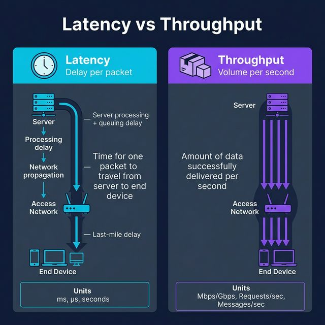
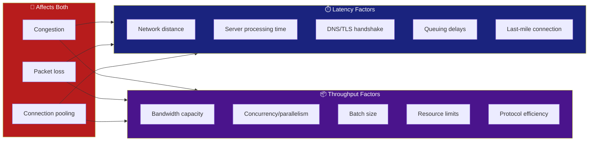

<!-- tags: system-design, performance -->
# ⚡ Latency vs Throughput

> Latency đo **delay per packet** — thời gian 1 request travel from server to user. Throughput đo **volume per second** — lượng data delivered trong 1 giây. Hai metrics khác nhau, giải quyết vấn đề khác nhau.

📅 Ngày tạo: 2026-03-22 · 🔄 Cập nhật: 2026-03-22 · ⏱️ 15 phút đọc

| Aspect         | Detail                                                    |
| -------------- | --------------------------------------------------------- |
| **Complexity** | 🌟🌟🌟                                                    |
| **Use case**   | Performance monitoring, Capacity planning, SLA definition |
| **Keywords**   | Latency, Throughput, Bandwidth, P50, P99, QPS, RPS        |

---

## 1. DEFINE

Hình dung pager báo p99 đang xấu đi, nhưng dashboard throughput vẫn đẹp khiến cuộc họp bắt đầu lạc hướng. Đây là kiểu tình huống buộc team phải phân biệt thật rõ giữa cảm giác chậm của từng request và tổng khối lượng hệ thống xử lý mỗi giây.


### Latency — Delay Per Packet

Latency là **thời gian để 1 request travel từ server đến end device** (hoặc ngược lại). Nó là **responsiveness** — cái user cảm nhận khi click button.

**Thành phần của Latency:**

| Component              | Mô tả                                              | Typical Range |
| ---------------------- | -------------------------------------------------- | ------------- |
| **Server Processing**  | Thời gian server xử lý request (DB query, compute) | 1ms – 500ms   |
| **Queuing Delay**      | Thời gian request chờ trong queue                  | 0ms – 100ms   |
| **Propagation Delay**  | Tốc độ ánh sáng qua fiber (distance/speed)         | 1ms – 150ms   |
| **Transmission Delay** | Thời gian push packet bits lên wire                | < 1ms         |
| **Routing Delay**      | Hops qua routers, switches                         | 1ms – 20ms    |
| **Last-mile Delay**    | ISP → user's device (WiFi, 4G/5G)                  | 5ms – 50ms    |

**Đơn vị:** Milliseconds (ms), Microseconds (μs), Seconds (s)

Latency fundamentals đã cover. Nhưng throughput cần batching strategy — hãy balance.

### Throughput — Volume Per Second

Throughput là **lượng data successfully delivered trong 1 timeframe**. Không phải tốc độ từng packet, mà là **bao nhiêu packets** flow qua pipe. Throughput = **capacity**.

**Đơn vị:**

| Context       | Unit               | Example            |
| ------------- | ------------------ | ------------------ |
| Network       | Mbps, Gbps         | "1 Gbps bandwidth" |
| API           | Requests/sec (RPS) | "10,000 RPS"       |
| Message Queue | Messages/sec       | "1M messages/sec"  |
| Database      | Queries/sec (QPS)  | "50,000 QPS"       |
| Data Pipeline | Records/sec        | "100K records/sec" |

### So Sánh Nhanh

| Aspect            | Latency                                     | Throughput                                                                |
| ----------------- | ------------------------------------------- | ------------------------------------------------------------------------- |
| **Đo gì?**        | Delay per packet                            | Volume per second                                                         |
| **User cảm nhận** | "App chậm/nhanh"                            | "App handle được load"                                                    |
| **Tối ưu bằng**   | Giảm hops, caching, edge                    | Horizontal scaling, batching, pipelining                                  |
| **Trade-off**     | Batching tăng throughput nhưng tăng latency | Parallel processing tăng throughput nhưng có thể tăng latency per-request |
| **Analogy**       | Tốc độ 1 xe chạy trên đường                 | Số xe đường chứa được (lane count)                                        |

---

Các failure mode trên nghe rõ. Nhưng có trap: optimize cho throughput = latency spike P99, và batching quá lớn = individual request delay. Trap đó sẽ xuất hiện ở PITFALLS.

## 2. VISUAL

Nói bằng chữ mới chỉ đủ để định nghĩa. Visual dưới đây mới trả lời phần khó hơn: `⚡ Latency vs Throughput` diễn ra theo luồng nào trong hệ thống thật.




### Analogy: Highway

```
LATENCY (tốc độ 1 xe)
━━━━━━━━━━━━━━━━━━━━━━━━━━━━━━━━━━━━━━━━
  🚗─────────────────────────────→  100km/h
  Start                           End
  Time: 1 hour for 100km

THROUGHPUT (số xe trên đường)
━━━━━━━━━━━━━━━━━━━━━━━━━━━━━━━━━━━━━━━━
  🚗🚗🚗🚗🚗🚗🚗🚗🚗🚗──────→  1000 cars/hour
  ████████████████████████████████
  Capacity: how many cars pass per hour
```

### Latency Breakdown

```
Client click ──→ DNS lookup ──→ TCP handshake ──→ TLS handshake
   0ms              5ms              15ms              30ms

──→ Server processing ──→ DB query ──→ Response back ──→ Render
         50ms                80ms          100ms          120ms

Total latency: ~120ms
```

### Mermaid: Factors Affecting Both



---

## 3. CODE

Flow ở trên cho bạn thấy cơ chế; phần code dưới đây kéo `⚡ Latency vs Throughput` xuống mức artifact mà kỹ sư phải viết, review, và chịu trách nhiệm khi lên production.


### 1. Latency Measurement — Percentiles (P50, P95, P99)

```go
package metrics

import (
    "math"
    "net/http"
    "slices"
    "sync"
    "time"
)

// ─── LATENCY TRACKER ───
// Track per-request latency với percentile computation
// P50 = median, P95 = 95th percentile, P99 = tail latency

type LatencyTracker struct {
    mu       sync.Mutex
    samples  []time.Duration
    maxSize  int
}

func NewLatencyTracker(maxSamples int) *LatencyTracker {
    return &LatencyTracker{
        samples: make([]time.Duration, 0, maxSamples),
        maxSize: maxSamples,
    }
}

func (lt *LatencyTracker) Record(d time.Duration) {
    lt.mu.Lock()
    defer lt.mu.Unlock()

    if len(lt.samples) >= lt.maxSize {
        // Circular buffer: drop oldest
        lt.samples = lt.samples[1:]
    }
    lt.samples = append(lt.samples, d)
}

// Percentile — tính percentile (0.0 - 1.0)
func (lt *LatencyTracker) Percentile(p float64) time.Duration {
    lt.mu.Lock()
    defer lt.mu.Unlock()

    if len(lt.samples) == 0 {
        return 0
    }

    // Sort copy
    sorted := make([]time.Duration, len(lt.samples))
    copy(sorted, lt.samples)
    slices.Sort(sorted)

    // ✅ Tính index cho percentile
    idx := int(math.Ceil(p*float64(len(sorted)))) - 1
    if idx < 0 {
        idx = 0
    }
    return sorted[idx]
}

func (lt *LatencyTracker) Stats() map[string]time.Duration {
    return map[string]time.Duration{
        "p50": lt.Percentile(0.50),
        "p95": lt.Percentile(0.95),
        "p99": lt.Percentile(0.99),
    }
}

// ─── HTTP MIDDLEWARE ───
// Wrap handler để auto-track latency

func LatencyMiddleware(tracker *LatencyTracker) func(http.Handler) http.Handler {
    return func(next http.Handler) http.Handler {
        return http.HandlerFunc(func(w http.ResponseWriter, r *http.Request) {
            start := time.Now()
            next.ServeHTTP(w, r)
            tracker.Record(time.Since(start))
        })
    }
}
```

```typescript
class LatencyTracker {
    constructor(private readonly maxSize: number, private readonly samples: number[] = []) {}

    record(durationMs: number): void {
        if (this.samples.length >= this.maxSize) this.samples.shift();
        this.samples.push(durationMs);
    }
}
```

```rust
struct LatencyTracker {
    samples: Vec<std::time::Duration>,
}
```

```cpp
class LatencyTracker {
public:
    void record(std::chrono::milliseconds sample) { samples_.push_back(sample); }
private:
    std::vector<std::chrono::milliseconds> samples_;
};
```

```python
class LatencyTracker:
    def __init__(self, max_size: int) -> None:
        self.max_size = max_size
        self.samples: list[float] = []

    def record(self, duration_ms: float) -> None:
        if len(self.samples) >= self.max_size:
            self.samples.pop(0)
        self.samples.append(duration_ms)
```

```java
// Java equivalent for assets/system-design/14-latency-vs-throughput.md
// Source language used for adaptation: typescript
class LatencyTracker {
    // Keep the same responsibilities and flow as the implementations above.
}

final class 14LatencyVsThroughputExample1 {
    private 14LatencyVsThroughputExample1() {}

    static Object LatencyTracker(Object... args) {
        // Preserve the same algorithm / object collaboration shown above.
        return null;
    }
}
```

Latency fundamentals đã cover. Nhưng throughput cần batching strategy — hãy balance.

### 2. Throughput Measurement — RPS Counter

```go
package metrics

import (
    "sync/atomic"
    "time"
)

// ─── THROUGHPUT COUNTER ───
// Sliding window RPS (Requests Per Second) counter

type ThroughputCounter struct {
    windowSize time.Duration
    buckets    []atomic.Int64 // per-second buckets
    bucketCount int
    startTime  time.Time
}

func NewThroughputCounter(windowSize time.Duration) *ThroughputCounter {
    bucketCount := int(windowSize.Seconds())
    if bucketCount < 1 {
        bucketCount = 1
    }
    tc := &ThroughputCounter{
        windowSize:  windowSize,
        buckets:     make([]atomic.Int64, bucketCount),
        bucketCount: bucketCount,
        startTime:   time.Now(),
    }
    return tc
}

// Increment — ghi nhận 1 request
func (tc *ThroughputCounter) Increment() {
    elapsed := time.Since(tc.startTime)
    bucketIdx := int(elapsed.Seconds()) % tc.bucketCount
    tc.buckets[bucketIdx].Add(1)
}

// RPS — requests per second trung bình trong window
func (tc *ThroughputCounter) RPS() float64 {
    var total int64
    for i := range tc.buckets {
        total += tc.buckets[i].Load()
    }
    return float64(total) / tc.windowSize.Seconds()
}

// CurrentSecondRPS — requests trong giây hiện tại
func (tc *ThroughputCounter) CurrentSecondRPS() int64 {
    elapsed := time.Since(tc.startTime)
    bucketIdx := int(elapsed.Seconds()) % tc.bucketCount
    return tc.buckets[bucketIdx].Load()
}
```

```typescript
class ThroughputCounter {
    private count = 0;

    increment(): void {
        this.count += 1;
    }
}
```

```rust
struct ThroughputCounter {
    requests: std::sync::atomic::AtomicI64,
}
```

```cpp
class ThroughputCounter {
public:
    void increment() { count_++; }
private:
    std::atomic<long long> count_{0};
};
```

```python
class ThroughputCounter:
    def __init__(self) -> None:
        self.count = 0

    def increment(self) -> None:
        self.count += 1
```

```java
// Java equivalent for assets/system-design/14-latency-vs-throughput.md
// Source language used for adaptation: typescript
class ThroughputCounter {
    // Keep the same responsibilities and flow as the implementations above.
}

final class 14LatencyVsThroughputExample2 {
    private 14LatencyVsThroughputExample2() {}

    static Object ThroughputCounter(Object... args) {
        // Preserve the same algorithm / object collaboration shown above.
        return null;
    }
}
```

### 3. Monitoring Server — Combined Dashboard

```go
package main

import (
    "encoding/json"
    "fmt"
    "log/slog"
    "math/rand"
    "net/http"
    "time"
)

// ─── COMBINED METRICS SERVER ───
// Expose latency + throughput metrics via /metrics endpoint

func main() {
    latency := NewLatencyTracker(10000)    // last 10K samples
    throughput := NewThroughputCounter(60 * time.Second) // 60s window

    // API handler
    mux := http.NewServeMux()

    mux.HandleFunc("GET /api/data", func(w http.ResponseWriter, r *http.Request) {
        start := time.Now()
        throughput.Increment()

        // Simulate variable processing time
        processingTime := time.Duration(10+rand.Intn(90)) * time.Millisecond
        time.Sleep(processingTime)

        w.Header().Set("Content-Type", "application/json")
        json.NewEncoder(w).Encode(map[string]string{
            "status": "ok",
            "data":   "Hello World",
        })

        latency.Record(time.Since(start))
    })

    // ✅ Metrics endpoint — expose latency percentiles + throughput
    mux.HandleFunc("GET /metrics", func(w http.ResponseWriter, r *http.Request) {
        stats := latency.Stats()
        w.Header().Set("Content-Type", "application/json")
        json.NewEncoder(w).Encode(map[string]interface{}{
            "latency": map[string]string{
                "p50": stats["p50"].String(),
                "p95": stats["p95"].String(),
                "p99": stats["p99"].String(),
            },
            "throughput": map[string]interface{}{
                "rps_avg":     fmt.Sprintf("%.2f", throughput.RPS()),
                "rps_current": throughput.CurrentSecondRPS(),
            },
        })
    })

    // Apply latency middleware
    handler := LatencyMiddleware(latency)(mux)

    slog.Info("server started", "addr", ":8080")
    http.ListenAndServe(":8080", handler)
}
```

```typescript
import express from "express";

const app = express();
const latency = new LatencyTracker(10_000);
const throughput = new ThroughputCounter();
```

```rust
struct MetricsResponse;
```

```cpp
int main() {
    std::cout << "Expose /metrics with latency percentiles and throughput counters.\n";
}
```

```python
from fastapi import FastAPI

app = FastAPI()
latency = LatencyTracker(10_000)
throughput = ThroughputCounter()
```

```java
// Java equivalent for assets/system-design/14-latency-vs-throughput.md
// Source language used for adaptation: typescript
final class 14LatencyVsThroughputExample3 {
    private 14LatencyVsThroughputExample3() {}

    static Object LatencyTracker(Object... args) {
        // Follow the same control flow and data-shape semantics as the reference implementation.
        return null;
    }

    static Object ThroughputCounter(Object... args) {
        // Follow the same control flow and data-shape semantics as the reference implementation.
        return 0;
    }
}
```

### 4. Load Test — Benchmark Latency & Throughput

```go
package main

import (
    "fmt"
    "net/http"
    "sync"
    "sync/atomic"
    "time"
)

// ─── SIMPLE LOAD TESTER ───
// Measure latency distribution + throughput under load

func RunLoadTest(url string, concurrency int, duration time.Duration) {
    var (
        totalRequests atomic.Int64
        totalErrors   atomic.Int64
        latencies     = NewLatencyTracker(100000)
        wg            sync.WaitGroup
        done          = make(chan struct{})
    )

    // Timer
    go func() {
        time.Sleep(duration)
        close(done)
    }()

    // Workers
    client := &http.Client{Timeout: 5 * time.Second}

    for i := 0; i < concurrency; i++ {
        wg.Add(1)
        go func() {
            defer wg.Done()
            for {
                select {
                case <-done:
                    return
                default:
                    start := time.Now()
                    resp, err := client.Get(url)
                    elapsed := time.Since(start)

                    if err != nil {
                        totalErrors.Add(1)
                        continue
                    }
                    resp.Body.Close()

                    totalRequests.Add(1)
                    latencies.Record(elapsed)
                }
            }
        }()
    }

    wg.Wait()

    // ✅ Report
    stats := latencies.Stats()
    total := totalRequests.Load()
    errors := totalErrors.Load()

    fmt.Printf("Load Test Results (%s, %d workers, %s)\n",
        url, concurrency, duration)
    fmt.Println("─────────────────────────────────")
    fmt.Printf("Total Requests : %d\n", total)
    fmt.Printf("Errors         : %d (%.1f%%)\n", errors,
        float64(errors)/float64(total+errors)*100)
    fmt.Printf("Throughput     : %.1f RPS\n",
        float64(total)/duration.Seconds())
    fmt.Println()
    fmt.Printf("Latency P50    : %s\n", stats["p50"])
    fmt.Printf("Latency P95    : %s\n", stats["p95"])
    fmt.Printf("Latency P99    : %s\n", stats["p99"])
}
```

```typescript
async function runLoadTest(url: string, concurrency: number, durationMs: number): Promise<void> {
    console.log(`Load testing ${url} with ${concurrency} workers for ${durationMs}ms`);
}
```

```rust
async fn run_load_test(url: &str, concurrency: usize) {
    println!("load test {url} with {concurrency} workers");
}
```

```cpp
void runLoadTest(const std::string& url, int concurrencySeconds) {
    std::cout << "Load test " << url << " with " << concurrencySeconds << " workers\n";
}
```

```python
def run_load_test(url: str, concurrency: int, duration_seconds: int) -> None:
    print(f"Load test {url} with {concurrency} workers for {duration_seconds}s")
```

```java
// Java equivalent for assets/system-design/14-latency-vs-throughput.md
// Source language used for adaptation: typescript
final class 14LatencyVsThroughputExample4 {
    private 14LatencyVsThroughputExample4() {}

    static Object runLoadTest(Object... args) {
        // Follow the same control flow and data-shape semantics as the reference implementation.
        return null;
    }
}
```

---

Bạn đã đi qua latency và throughput tradeoffs. Bây giờ đến phần nguy hiểm: P99 spike và over-batching — trap đã được setup từ đầu bài.

## 4. PITFALLS

Hiểu được `⚡ Latency vs Throughput` là bước đầu; giữ nó không phản chủ trong vận hành mới là phần khó. Những pitfalls sau là các chỗ team hay trả giá nhất.


| # | Severity | Lỗi (Pitfall) | Hậu quả | Fix (Giải pháp) |
| --- | --- | --- | --- | --- |
| 1 | 🔴 Fatal | **Chỉ đo average latency** | Average 50ms nhưng P99 = 2s → 1% users trải nghiệm rất tệ. | Luôn đo percentiles: P50, P95, P99. Alert trên P99. |
| 2 | 🔴 Fatal | **Nhầm bandwidth = throughput** | "Server có 10Gbps mà sao chỉ serve 100 RPS?" | Bandwidth là capacity lý thuyết. Throughput = actual delivered. Bottleneck thường ở app, không ở network. |
| 3 | 🟡 Common | **Optimize throughput bỏ quên latency** | Batching 1000 requests → throughput cao nhưng mỗi request chờ lâu. | Set max batch wait time. Monitor cả hai metrics. |
| 4 | 🟡 Common | **Không test under load** | Dev environment latency 5ms, production P99 = 500ms. | Load test với realistic concurrency. Measure latency AT target throughput. |
| 5 | 🟡 Common | **Coordinated omission** | Load test tool chờ response → miss measuring queuing time. | Dùng tools handle coordinated omission: wrk2, Vegeta. schedule requests at fixed rate. |
| 6 | 🔵 Minor | **Ignoring tail latency** | "P50 = 10ms nên hệ thống tốt" nhưng P99.9 = 5s. | Monitor P99.9 cho critical paths. Tail latency cascade across microservices. |

---

Bạn đã đi qua Latency vs Throughput và cạm bẫy. Các resources dưới đây giúp đi sâu hơn.

## 5. REF

| Resource                             | Link                                                                                       |
| ------------------------------------ | ------------------------------------------------------------------------------------------ |
| Google: Tail at Scale                | [research.google](https://research.google/pubs/the-tail-at-scale/)                         |
| Gil Tene: How NOT to Measure Latency | [youtube.com](https://www.youtube.com/watch?v=lJ8ydIuPFeU)                                 |
| Vegeta Load Testing                  | [github.com/tsenart](https://github.com/tsenart/vegeta)                                    |
| wrk2 — Coordinated Omission Fix      | [github.com/giltene](https://github.com/giltene/wrk2)                                      |
| Brendan Gregg: Systems Performance   | [brendangregg.com](https://www.brendangregg.com/systems-performance-2nd-edition-book.html) |

---

## 6. RECOMMEND

Sau bài này, điều đáng đọc tiếp không phải một danh sách thuật ngữ mới mà là những chủ đề mở rộng trực tiếp từ boundary và trade-off của `⚡ Latency vs Throughput`.


| Mở rộng                  | Khi nào cần                  | Lý do                                                                                                             |
| ------------------------ | ---------------------------- | ----------------------------------------------------------------------------------------------------------------- |
| **HDR Histogram**        | Accurate percentile tracking | High Dynamic Range histogram — accurate P99.99 với minimal memory. Go: `github.com/HdrHistogram/hdrhistogram-go`. |
| **Prometheus + Grafana** | Production monitoring        | Histogram metrics, alerting rules trên P99 latency và throughput drops.                                           |
| **Distributed Tracing**  | Microservices latency        | Trace request across services để tìm latency bottleneck. OpenTelemetry + Jaeger.                                  |
| **Little's Law**         | Capacity planning            | `L = λ × W` (concurrent requests = throughput × latency). Predict khi nào system saturate.                        |

---

---

**Callback**: Quay lại dashboard đẹp nhưng 500 users/giây bị chậm 100x. Bây giờ bạn biết: throughput ≠ health, P99 mới cho toàn cảnh. Optimize throughput khi server idle, optimize latency khi users complain. 2 metrics, 2 tools, 2 mindsets.

← Previous: [How Go Maps Work Internally](./13-go-map-internals.md) · → Next: [5 Leader Election Algorithms](./15-leader-election-algorithms.md) · ← Quay về [System Design](./README.md)
