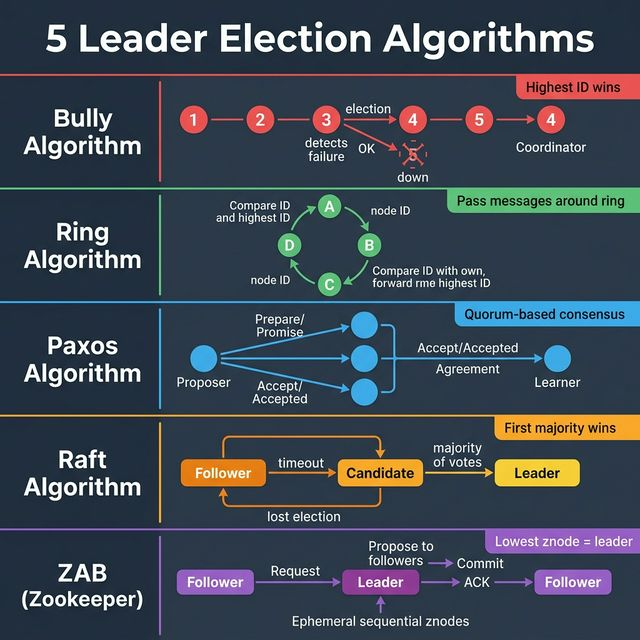
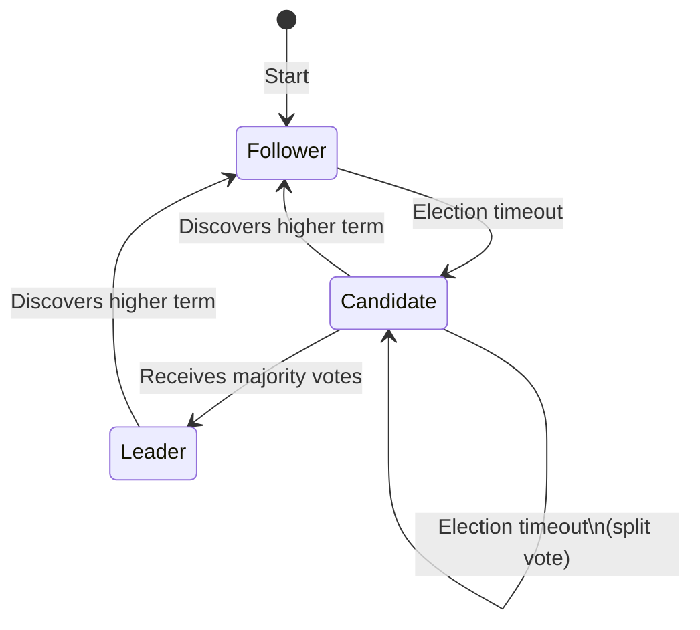

<!-- tags: system-design, distributed-systems -->
# 🗳️ 5 Leader Election Algorithms

> Trong distributed systems, **leader election** quyết định node nào điều phối — quản lý tasks, duy trì consistency, và ra quyết định. Bài viết deep-dive 5 thuật toán phổ biến nhất.

📅 Ngày tạo: 2026-03-22 · 🔄 Cập nhật: 2026-03-22 · ⏱️ 20 phút đọc

| Aspect         | Detail                                                       |
| -------------- | ------------------------------------------------------------ |
| **Complexity** | 🌟🌟🌟🌟🌟                                                   |
| **Use case**   | Distributed databases, Consensus systems, Cluster management |
| **Keywords**   | Leader election, Bully, Ring, Paxos, Raft, ZAB, Zookeeper    |

---

## 1. DEFINE

Hình dung một node leader vừa chết giữa lúc cluster vẫn phải tiếp tục nhận ghi. Trong khoảnh khắc đó, leader election không còn là chương sách distributed systems, mà là quyết định ai được quyền điều phối tiếp theo và hệ thống có rẽ vào split-brain hay không.


### Tại sao cần Leader Election?

Trong distributed system, nhiều nodes cần phối hợp. **Leader** là node được chọn để:

- **Điều phối** writes (tránh conflict)
- **Ra quyết định** (commit/abort transactions)
- **Quản lý** membership (nodes join/leave)

Không có leader → **split-brain**, data inconsistency, duplicate processing.

### 5 Algorithms Overview

| #   | Algorithm | Mechanism                 | Used By                   | Complexity          |
| --- | --------- | ------------------------- | ------------------------- | ------------------- |
| 1   | **Bully** | Highest ID wins           | Simple clusters           | O(n²) messages      |
| 2   | **Ring**  | Pass messages around ring | Token ring networks       | O(n log n) messages |
| 3   | **Paxos** | Quorum-based consensus    | Google Chubby, Spanner    | Complex             |
| 4   | **Raft**  | First majority wins       | etcd, CockroachDB, Consul | Moderate            |
| 5   | **ZAB**   | Lowest znode = leader     | Apache Zookeeper, Kafka   | Moderate            |

---

Các failure mode trên nghe dễ tránh. Nhưng có trap: split brain = hai leader cùng lúc, và heart beat timeout quá ngắn = flapping leadership. Trap đó sẽ xuất hiện ở PITFALLS.

## 2. VISUAL

Định nghĩa mới chỉ khóa được từ vựng. Hình dưới đây cho thấy `🗳️ 5 Leader Election Algorithms` vận hành ra sao khi request, node, và network bắt đầu tương tác thật.




### 1. Bully Algorithm

```
Node fails → Detect → Election → Highest ID wins

Nodes: [1] [2] [3] [4] [5←Leader]

Step 1: Node 5 crashes 💀
Step 2: Node 3 detects → sends ELECTION to 4, 5
Step 3: Node 4 responds OK (4 > 3)
        Node 5 no response (dead)
Step 4: Node 4 sends ELECTION to 5 → no response
Step 5: Node 4 declares itself COORDINATOR
Step 6: Node 4 sends COORDINATOR message to all

Result: [1] [2] [3] [4←New Leader] [5💀]
```

Bully algorithm đã cover. Nhưng Raft cần replicated log — hãy consensus.

### 2. Ring Algorithm

```
Nodes arranged in logical ring, pass election messages

     ┌──→ [A:4] ──→ [B:5] ──┐
     │       MSG:4    5>4    │
     │      forward   MSG:5  │
     │                       ▼
   [D:1] ←── [C:2] ←────────┘
     1<5      2<5
    MSG:5    MSG:5

B (ID=5) sees its own ID come back → B is LEADER
B sends "LEADER:B" around the ring
```

### 3. Paxos Algorithm

```
Phase 1: PREPARE / PROMISE
  Proposer → "Prepare(n)" → Acceptors
  Acceptors → "Promise(n)" → Proposer (if n > last seen)

Phase 2: ACCEPT / ACCEPTED
  Proposer → "Accept(n, value)" → Acceptors
  Acceptors → "Accepted(n, value)" → Learner

Quorum: majority must agree (⌊n/2⌋ + 1)

  [Proposer₁]  ──Prepare──→  [Acceptor₁] ✅
  [Proposer₂]  ──Prepare──→  [Acceptor₂] ✅  → [Learner]
                              [Acceptor₃] ✅
                              (2/3 quorum met)
```

### 4. Raft Algorithm



### 5. ZAB (Zookeeper Atomic Broadcast)

```
Election via ephemeral sequential znodes:

  /election/node_0000000001  ← Node A (LEADER — lowest znode)
  /election/node_0000000002  ← Node B (watches node_01)
  /election/node_0000000003  ← Node C (watches node_02)

Write flow:
  Client → Leader → Propose → Followers
                  ← ACK (majority) ←
           Leader → Commit → Followers

If Leader dies:
  znode_01 deleted → Node B notified → B is new lowest → B = LEADER
```

---

## 3. CODE

Sơ đồ đã lộ luồng chính. Đến code, `🗳️ 5 Leader Election Algorithms` mới hiện ra thành những ranh giới mà team phải thật sự cài đặt và vận hành.


### 1. Bully Algorithm — Go Implementation

```go
package election

import (
    "fmt"
    "sync"
    "time"
)

// ─── BULLY ALGORITHM ───
// Highest ID wins. When a node detects leader failure,
// it sends ELECTION to all higher-ID nodes.
// If no response → it becomes leader.
// If response → the higher node takes over.

type NodeState int

const (
    StateFollower NodeState = iota
    StateCandidate
    StateLeader
)

type BullyNode struct {
    ID       int
    State    NodeState
    LeaderID int
    Alive    bool
    Peers    map[int]*BullyNode // all nodes in cluster
    mu       sync.RWMutex
}

func NewBullyNode(id int) *BullyNode {
    return &BullyNode{
        ID:    id,
        State: StateFollower,
        Alive: true,
        Peers: make(map[int]*BullyNode),
    }
}

// StartElection — trigger election (Bully protocol)
func (n *BullyNode) StartElection() {
    n.mu.Lock()
    n.State = StateCandidate
    n.mu.Unlock()

    fmt.Printf("[Node %d] Starting election\n", n.ID)

    higherExists := false

    // ✅ Send ELECTION to all nodes with higher IDs
    for id, peer := range n.Peers {
        if id > n.ID {
            if peer.IsAlive() {
                fmt.Printf("[Node %d] → ELECTION → Node %d\n", n.ID, id)
                higherExists = true
                // Higher node takes over election
                go peer.StartElection()
            }
        }
    }

    if !higherExists {
        // ✅ No higher node responded → I am the leader
        n.BecomeLeader()
    }
}

func (n *BullyNode) BecomeLeader() {
    n.mu.Lock()
    n.State = StateLeader
    n.LeaderID = n.ID
    n.mu.Unlock()

    fmt.Printf("[Node %d] 👑 I am the LEADER\n", n.ID)

    // Broadcast COORDINATOR message to all
    for id, peer := range n.Peers {
        if id != n.ID && peer.IsAlive() {
            peer.mu.Lock()
            peer.LeaderID = n.ID
            peer.State = StateFollower
            peer.mu.Unlock()
            fmt.Printf("[Node %d] → COORDINATOR → Node %d\n", n.ID, id)
        }
    }
}

func (n *BullyNode) IsAlive() bool {
    n.mu.RLock()
    defer n.mu.RUnlock()
    return n.Alive
}

func (n *BullyNode) Kill() {
    n.mu.Lock()
    defer n.mu.Unlock()
    n.Alive = false
    fmt.Printf("[Node %d] 💀 Node died\n", n.ID)
}

// DetectLeaderFailure — simulate heartbeat timeout
func (n *BullyNode) DetectLeaderFailure() {
    n.mu.RLock()
    leaderID := n.LeaderID
    n.mu.RUnlock()

    if leader, ok := n.Peers[leaderID]; ok {
        if !leader.IsAlive() {
            fmt.Printf("[Node %d] Detected leader %d is DOWN\n", n.ID, leaderID)
            n.StartElection()
        }
    }
}

// Demo
func BullyDemo() {
    // Create 5 nodes
    nodes := make(map[int]*BullyNode)
    for i := 1; i <= 5; i++ {
        nodes[i] = NewBullyNode(i)
    }
    // Wire peers
    for _, node := range nodes {
        for id, peer := range nodes {
            if id != node.ID {
                node.Peers[id] = peer
            }
        }
    }

    // Initial election → Node 5 becomes leader
    nodes[1].StartElection()
    time.Sleep(100 * time.Millisecond)

    // Kill leader
    nodes[5].Kill()
    time.Sleep(100 * time.Millisecond)

    // Node 3 detects failure
    nodes[3].DetectLeaderFailure()
}
```

```typescript
enum NodeState {
    Follower,
    Candidate,
    Leader,
}

class BullyNode {
    constructor(public readonly id: number, public leaderId = 0, public alive = true) {}
}
```

```rust
enum NodeState {
    Follower,
    Candidate,
    Leader,
}

struct BullyNode {
    id: i32,
    leader_id: i32,
    alive: bool,
}
```

```cpp
enum class NodeState { Follower, Candidate, Leader };

struct BullyNode {
    int id;
    int leaderId{0};
    bool alive{true};
};
```

```python
from dataclasses import dataclass


@dataclass
class BullyNode:
    node_id: int
    leader_id: int = 0
    alive: bool = True
```

```java
// Java equivalent for assets/system-design/15-leader-election-algorithms.md
// Source language used for adaptation: typescript
class BullyNode {
    // Keep the same responsibilities and flow as the implementations above.
}

final class 15LeaderElectionAlgorithmsExample1 {
    private 15LeaderElectionAlgorithmsExample1() {}

    static Object BullyNode(Object... args) {
        // Preserve the same algorithm / object collaboration shown above.
        return null;
    }
}
```

Bully algorithm đã cover. Nhưng Raft cần replicated log — hãy consensus.

### 2. Raft Election — Simplified

```go
package raft

import (
    "fmt"
    "math/rand"
    "sync"
    "time"
)

// ─── RAFT LEADER ELECTION ───
// Followers → timeout → Candidate → request votes → Leader

type RaftState int

const (
    Follower RaftState = iota
    Candidate
    Leader
)

type RaftNode struct {
    ID          int
    State       RaftState
    CurrentTerm int
    VotedFor    int // -1 = not voted
    LeaderID    int
    Peers       []*RaftNode
    mu          sync.Mutex
    stopCh      chan struct{}
}

func NewRaftNode(id int) *RaftNode {
    return &RaftNode{
        ID:       id,
        State:    Follower,
        VotedFor: -1,
        stopCh:   make(chan struct{}),
    }
}

// RequestVote — candidate asks for vote
func (n *RaftNode) RequestVote(candidateID int, term int) (bool, int) {
    n.mu.Lock()
    defer n.mu.Unlock()

    // ✅ If candidate's term is higher, update and grant vote
    if term > n.CurrentTerm {
        n.CurrentTerm = term
        n.VotedFor = -1 // reset vote for new term
        n.State = Follower
    }

    // Grant vote if haven't voted yet in this term
    if term >= n.CurrentTerm && (n.VotedFor == -1 || n.VotedFor == candidateID) {
        n.VotedFor = candidateID
        return true, n.CurrentTerm
    }

    return false, n.CurrentTerm
}

// StartElection — transition to Candidate, request votes
func (n *RaftNode) StartElection() {
    n.mu.Lock()
    n.State = Candidate
    n.CurrentTerm++
    n.VotedFor = n.ID // vote for self
    term := n.CurrentTerm
    n.mu.Unlock()

    fmt.Printf("[Node %d] Starting election for term %d\n", n.ID, term)

    votes := 1 // self-vote
    totalNodes := len(n.Peers) + 1
    majority := totalNodes/2 + 1

    var voteMu sync.Mutex
    var wg sync.WaitGroup

    // ✅ Request votes from all peers in parallel
    for _, peer := range n.Peers {
        wg.Add(1)
        go func(p *RaftNode) {
            defer wg.Done()
            granted, _ := p.RequestVote(n.ID, term)
            if granted {
                voteMu.Lock()
                votes++
                voteMu.Unlock()
                fmt.Printf("[Node %d] Got vote from Node %d\n", n.ID, p.ID)
            }
        }(peer)
    }

    wg.Wait()

    // ✅ Check if won majority
    n.mu.Lock()
    defer n.mu.Unlock()

    if votes >= majority && n.State == Candidate && n.CurrentTerm == term {
        n.State = Leader
        n.LeaderID = n.ID
        fmt.Printf("[Node %d] 👑 Won election with %d/%d votes (term %d)\n",
            n.ID, votes, totalNodes, term)

        // Notify all peers
        for _, peer := range n.Peers {
            peer.mu.Lock()
            peer.LeaderID = n.ID
            peer.State = Follower
            peer.mu.Unlock()
        }
    } else {
        fmt.Printf("[Node %d] Lost election (%d/%d votes)\n",
            n.ID, votes, totalNodes)
        n.State = Follower
    }
}

// RunElectionTimer — simulate random timeout (150-300ms)
func (n *RaftNode) RunElectionTimer() {
    timeout := time.Duration(150+rand.Intn(150)) * time.Millisecond
    timer := time.NewTimer(timeout)

    select {
    case <-timer.C:
        n.mu.Lock()
        state := n.State
        n.mu.Unlock()
        if state == Follower {
            n.StartElection()
        }
    case <-n.stopCh:
        timer.Stop()
    }
}
```

```typescript
enum RaftState {
    Follower,
    Candidate,
    Leader,
}

class RaftNode {
    constructor(public readonly id: number, public currentTerm = 0, public state = RaftState.Follower) {}
}
```

```rust
enum RaftState {
    Follower,
    Candidate,
    Leader,
}

struct RaftNode {
    id: i32,
    current_term: i32,
}
```

```cpp
enum class RaftState { Follower, Candidate, Leader };

struct RaftNode {
    int id;
    int currentTerm{0};
};
```

```python
@dataclass
class RaftNode:
    node_id: int
    current_term: int = 0
    state: str = "follower"
```

```java
// Java equivalent for assets/system-design/15-leader-election-algorithms.md
// Source language used for adaptation: typescript
class RaftNode {
    // Keep the same responsibilities and flow as the implementations above.
}

final class 15LeaderElectionAlgorithmsExample2 {
    private 15LeaderElectionAlgorithmsExample2() {}

    static Object RaftNode(Object... args) {
        // Preserve the same algorithm / object collaboration shown above.
        return null;
    }
}
```

### 3. ZAB-style Election with Zookeeper Pattern

```go
package zab

import (
    "fmt"
    "sort"
    "sync"
)

// ─── ZAB LEADER ELECTION ───
// Ephemeral sequential znodes — lowest znode = leader
// Each node watches the znode just before it

type ZNode struct {
    Path   string
    SeqNum int
    NodeID string
    Alive  bool
}

type ZookeeperElection struct {
    mu     sync.RWMutex
    znodes []ZNode
    leader string
}

func NewZookeeperElection() *ZookeeperElection {
    return &ZookeeperElection{}
}

// Register — create ephemeral sequential znode
func (z *ZookeeperElection) Register(nodeID string) int {
    z.mu.Lock()
    defer z.mu.Unlock()

    seqNum := len(z.znodes) + 1
    znode := ZNode{
        Path:   fmt.Sprintf("/election/node_%010d", seqNum),
        SeqNum: seqNum,
        NodeID: nodeID,
        Alive:  true,
    }
    z.znodes = append(z.znodes, znode)

    fmt.Printf("[%s] Created znode: %s (seq: %d)\n", nodeID, znode.Path, seqNum)

    z.electLeader()
    return seqNum
}

// electLeader — lowest alive znode becomes leader
func (z *ZookeeperElection) electLeader() {
    // Sort by sequence number
    sort.Slice(z.znodes, func(i, j int) bool {
        return z.znodes[i].SeqNum < z.znodes[j].SeqNum
    })

    // ✅ Find lowest alive znode
    for _, znode := range z.znodes {
        if znode.Alive {
            if z.leader != znode.NodeID {
                z.leader = znode.NodeID
                fmt.Printf("👑 New leader: %s (znode: %s)\n", znode.NodeID, znode.Path)
            }
            return
        }
    }
}

// NodeDied — remove ephemeral znode (simulates session expire)
func (z *ZookeeperElection) NodeDied(nodeID string) {
    z.mu.Lock()
    defer z.mu.Unlock()

    for i := range z.znodes {
        if z.znodes[i].NodeID == nodeID {
            z.znodes[i].Alive = false
            fmt.Printf("[%s] 💀 Znode deleted: %s\n", nodeID, z.znodes[i].Path)
            break
        }
    }

    // ✅ Watch triggers → re-elect
    z.electLeader()
}

// GetLeader — current leader
func (z *ZookeeperElection) GetLeader() string {
    z.mu.RLock()
    defer z.mu.RUnlock()
    return z.leader
}

// Demo
func ZABDemo() {
    election := NewZookeeperElection()

    // Nodes register (create ephemeral sequential znodes)
    election.Register("NodeA") // seq 1 → LEADER
    election.Register("NodeB") // seq 2 → watches seq 1
    election.Register("NodeC") // seq 3 → watches seq 2

    fmt.Printf("Current leader: %s\n\n", election.GetLeader())

    // Leader dies
    election.NodeDied("NodeA")
    fmt.Printf("After NodeA dies, leader: %s\n", election.GetLeader())
}
```

```typescript
type ZNode = { path: string; seqNum: number; nodeId: string; alive: boolean };

class ZookeeperElection {
    private readonly znodes: ZNode[] = [];
}
```

```rust
struct ZNode {
    path: String,
    seq_num: i32,
    node_id: String,
    alive: bool,
}
```

```cpp
struct ZNode {
    std::string path;
    int seqNum;
    std::string nodeId;
    bool alive;
};
```

```python
@dataclass
class ZNode:
    path: str
    seq_num: int
    node_id: str
    alive: bool = True
```

```java
// Java equivalent for assets/system-design/15-leader-election-algorithms.md
// Source language used for adaptation: typescript
class ZookeeperElection {
    // Keep the same responsibilities and flow as the implementations above.
}

final class 15LeaderElectionAlgorithmsExample3 {
    private 15LeaderElectionAlgorithmsExample3() {}

    static Object ZookeeperElection(Object... args) {
        // Preserve the same algorithm / object collaboration shown above.
        return null;
    }
}
```

---

Bạn đã đi qua leader election algorithms. Bây giờ đến phần nguy hiểm: split brain và flapping — trap đã được setup từ đầu bài.

## 4. PITFALLS

Khi đưa `🗳️ 5 Leader Election Algorithms` vào production, lỗi thường không nằm ở khái niệm mà ở assumptions đội ngũ mang theo lúc triển khai. Bảng dưới đây gom đúng những cú trượt đó.


| # | Severity | Lỗi (Pitfall) | Hậu quả | Fix (Giải pháp) |
| --- | --- | --- | --- | --- |
| 1 | 🔴 Fatal | **Split-brain** | 2 nodes cùng nghĩ mình là leader → data inconsistency | Fencing tokens, epoch numbers. Mỗi leader có unique increasing term. |
| 2 | 🔴 Fatal | **Network partition** | Leader unreachable nhưng vẫn alive → old leader vẫn accept writes | Lease-based leadership. Leader phải renew lease, nếu không → step down. |
| 3 | 🟡 Common | **Thundering herd** | Tất cả nodes đồng thời start election → liên tục split vote | Randomized election timeout (Raft: 150-300ms random). |
| 4 | 🟡 Common | **Bully algorithm message storm** | O(n²) messages trong cluster lớn | Dùng Raft/Paxos cho clusters > 10 nodes. |
| 5 | 🟡 Common | **Không handle term/epoch** | Old leader quay lại sau partition → conflict | Mọi message phải kèm term number. Reject messages từ cũ term. |
| 6 | 🔵 Minor | **Unhealthy leader** | Leader alive nhưng overloaded, respond chậm | Health-aware election: check CPU, memory, latency trước khi vote. |

### So Sánh Chi Tiết

| Aspect                | Bully      | Ring       | Paxos          | Raft           | ZAB              |
| --------------------- | ---------- | ---------- | -------------- | -------------- | ---------------- |
| **Complexity**        | Simple     | Simple     | Very complex   | Moderate       | Moderate         |
| **Messages**          | O(n²)      | O(n log n) | O(n) per round | O(n) per round | O(n) per round   |
| **Fault tolerance**   | Low        | Low        | High (f < n/2) | High (f < n/2) | High (f < n/2)   |
| **Network partition** | ❌         | ❌         | ✅             | ✅             | ✅               |
| **Production use**    | Rare       | Legacy     | Google Spanner | etcd, Consul   | Kafka, Zookeeper |
| **Understandability** | ⭐⭐⭐⭐⭐ | ⭐⭐⭐⭐   | ⭐⭐           | ⭐⭐⭐⭐       | ⭐⭐⭐           |

---

Bạn đã đi qua Leader Election và cạm bẫy. Các resources dưới đây giúp đi sâu hơn.

## 5. REF

| Resource                                                        | Link                                                                                     |
| --------------------------------------------------------------- | ---------------------------------------------------------------------------------------- |
| Raft Paper — In Search of an Understandable Consensus Algorithm | [raft.github.io](https://raft.github.io/raft.pdf)                                        |
| Raft Visualization                                              | [thesecretlivesofdata.com](http://thesecretlivesofdata.com/raft/)                        |
| Paxos Made Simple — Leslie Lamport                              | [lamport.azurewebsites.net](https://lamport.azurewebsites.net/pubs/paxos-simple.pdf)     |
| Zookeeper Internals                                             | [zookeeper.apache.org](https://zookeeper.apache.org/doc/current/zookeeperInternals.html) |
| etcd — Raft in Production                                       | [etcd.io](https://etcd.io/docs/v3.5/learning/design-learner/)                            |

---

## 6. RECOMMEND

Các tài liệu sau giúp bạn nối `🗳️ 5 Leader Election Algorithms` với những quyết định kế cận trong hệ thống, để mental model không bị rời thành từng mảnh.


| Mở rộng                     | Khi nào cần            | Lý do                                                                                                         |
| --------------------------- | ---------------------- | ------------------------------------------------------------------------------------------------------------- |
| **Multi-Paxos**             | Repeated consensus     | Single Paxos cho mỗi decision quá expensive. Multi-Paxos elect leader 1 lần, sau đó leader propose trực tiếp. |
| **Viewstamped Replication** | Academic study         | Precursor của Raft — viewchange protocol tương tự nhưng phức tạp hơn.                                         |
| **CRDTs**                   | Leaderless alternative | Conflict-free Replicated Data Types — không cần leader, eventual consistency.                                 |
| **Raft Extensions**         | Production hardening   | Pre-vote, learner nodes, joint consensus cho membership changes.                                              |

---

---

**Callback**: Quay lại 15 giây split-brain. Bây giờ bạn biết: Raft dùng term + log matching, ZAB dùng epoch + atomic broadcast, Bully dùng process ID priority. Mỗi algorithm có trade-off giữa election speed, network partition tolerance, và implementation complexity.

← Previous: [Latency vs Throughput](./14-latency-vs-throughput.md) · → Next: [TCP vs UDP Protocols](./16-tcp-udp-protocols.md) · ← Quay về [System Design](./README.md)
