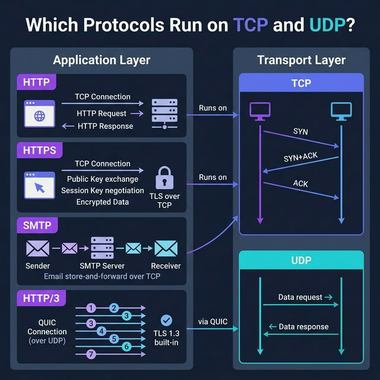
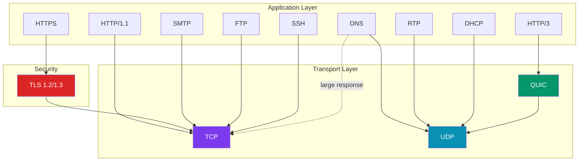

<!-- tags: system-design, networking -->
# 🌐 Which Protocols Run on TCP and UDP?

> Mọi message trên internet có 2 layers: **transport** (TCP/UDP) mang data, **application** (HTTP/SMTP/DNS...) định nghĩa data nghĩa gì. TCP đảm bảo delivery, UDP ưu tiên speed.

📅 Ngày tạo: 2026-03-22 · 🔄 Cập nhật: 2026-03-22 · ⏱️ 18 phút đọc

| Aspect         | Detail                                                          |
| -------------- | --------------------------------------------------------------- |
| **Complexity** | 🌟🌟🌟                                                          |
| **Use case**   | Networking fundamentals, Protocol selection, Performance tuning |
| **Keywords**   | TCP, UDP, HTTP, HTTPS, SMTP, QUIC, HTTP/3, TLS                  |

---

## 1. DEFINE

Bạn đang chọn transport cho hai nhu cầu rất khác nhau: cuộc gọi video thời gian thực và transaction thanh toán. Chỉ cần nhầm giữa TCP và UDP theo kiểu “một cái nhanh hơn, một cái an toàn hơn”, quyết định giao thức sẽ rất dễ trở thành khẩu hiệu thay vì kỹ thuật.


### TCP — Transmission Control Protocol

**Connection-oriented**. Đảm bảo delivery, maintain order, handle retransmission.

| Feature          | Behavior                                    |
| ---------------- | ------------------------------------------- |
| **Connection**   | 3-way handshake (SYN → SYN+ACK → ACK)       |
| **Reliability**  | Guaranteed delivery, retransmission on loss |
| **Ordering**     | Packets arrive in correct order             |
| **Flow control** | Sliding window, congestion avoidance        |
| **Overhead**     | High — header 20-60 bytes                   |

TCP internals đã cover. Nhưng UDP cần different reliability model — hãy so sánh.

### UDP — User Datagram Protocol

**Connectionless**. No handshake. No guaranteed delivery. No order preservation. Fast.

| Feature          | Behavior                   |
| ---------------- | -------------------------- |
| **Connection**   | None — fire and forget     |
| **Reliability**  | No guarantee (best effort) |
| **Ordering**     | No ordering                |
| **Flow control** | None                       |
| **Overhead**     | Low — header 8 bytes       |

### Protocol Mapping

| Protocol      | Transport                      | Port      | Why?                                      |
| ------------- | ------------------------------ | --------- | ----------------------------------------- |
| **HTTP**      | TCP                            | 80        | Reliable document transfer                |
| **HTTPS**     | TCP + TLS                      | 443       | Encrypted reliable transfer               |
| **HTTP/3**    | UDP (QUIC)                     | 443       | Multiplexed, 0-RTT, built-in TLS 1.3      |
| **SMTP**      | TCP                            | 25/587    | Email cannot lose data                    |
| **FTP**       | TCP                            | 21/20     | File transfers need reliability           |
| **SSH**       | TCP                            | 22        | Remote shell needs ordered stream         |
| **DNS**       | UDP (primary) / TCP (fallback) | 53        | Fast lookups, TCP for large responses     |
| **DHCP**      | UDP                            | 67/68     | Broadcast discovery, no connection needed |
| **RTP**       | UDP                            | Dynamic   | Real-time audio/video, loss OK            |
| **WebSocket** | TCP                            | 80/443    | Persistent bidirectional stream           |
| **gRPC**      | TCP (HTTP/2)                   | Varies    | Streaming RPC over HTTP/2 frames          |
| **MQTT**      | TCP                            | 1883/8883 | IoT messaging, needs reliable delivery    |

---

Các failure mode trên nghe cơ bản. Nhưng có trap: TCP Nagle algorithm gộp packet = latency tăng cho real-time, và UDP không ordering = message reorder. Trap đó sẽ xuất hiện ở PITFALLS.

## 2. VISUAL

Khái niệm đã có tên. Sang sơ đồ, `Which Protocols Run on TCP and UDP?` mới bộc lộ nơi dữ liệu chảy qua, nơi control đổi tay, và chỗ trade-off bắt đầu hiện hình.




### TCP — 3-Way Handshake

```
Client                          Server
  │                               │
  │──── SYN (seq=100) ──────────→│  ① Client initiates
  │                               │
  │←── SYN+ACK (seq=300,ack=101)─│  ② Server acknowledges
  │                               │
  │──── ACK (ack=301) ──────────→│  ③ Connection established
  │                               │
  │══════ DATA TRANSFER ═════════│  Reliable, ordered
  │                               │
  │──── FIN ────────────────────→│  ④ Close connection
  │←── FIN+ACK ─────────────────│
  │──── ACK ────────────────────→│
```

### HTTP over TCP

```
Browser                    Server
  │                          │
  │── TCP Connect (3-way) ──→│
  │                          │
  │── HTTP Request ─────────→│  GET /index.html HTTP/1.1
  │                          │
  │←─ HTTP Response ────────│  200 OK + HTML body
  │                          │
  │── TCP Close (4-way) ───→│  (or keep-alive)
```

### HTTPS = TLS over TCP

```
Browser                         Server
  │                               │
  │── TCP 3-way handshake ──────→│
  │                               │
  │── ClientHello ──────────────→│  ① Supported cipher suites
  │←─ ServerHello + Certificate ─│  ② Server's public key
  │── Key Exchange ─────────────→│  ③ Session key negotiation
  │←─ Finished ─────────────────│  ④ TLS tunnel established
  │                               │
  │══ Encrypted HTTP traffic ═══│  All data encrypted
```

### HTTP/3 = QUIC over UDP

```
Client                          Server
  │                               │
  │── QUIC Initial ─────────────→│  ① 0-RTT or 1-RTT setup
  │←─ QUIC Handshake ──────────│  ② TLS 1.3 built-in
  │                               │
  │── Stream 1: GET /page ──────→│
  │── Stream 2: GET /style.css ─→│  ③ Multiplexed streams
  │── Stream 3: GET /app.js ───→│     (no head-of-line blocking)
  │                               │
  │←─ Stream 1: HTML ──────────│
  │←─ Stream 3: JS  ──────────│  ④ Responses arrive independently
  │←─ Stream 2: CSS ──────────│     (stream 2 loss doesn't block 1,3)
```

### Mermaid: Protocol Stack



---

## 3. CODE

Sơ đồ đã lộ luồng chính. Đến code, `Which Protocols Run on TCP and UDP?` mới hiện ra thành những ranh giới mà team phải thật sự cài đặt và vận hành.


### 1. TCP Server & Client — Echo Server

```go
package main

import (
    "bufio"
    "fmt"
    "log/slog"
    "net"
    "os"
    "strings"
)

// ─── TCP ECHO SERVER ───
// Connection-oriented: accept → read → write → close
// Demonstrates 3-way handshake + reliable ordered stream

func startTCPServer(addr string) {
    listener, err := net.Listen("tcp", addr)
    if err != nil {
        slog.Error("TCP listen failed", "err", err)
        os.Exit(1)
    }
    defer listener.Close()
    slog.Info("TCP server listening", "addr", addr)

    for {
        // ✅ Accept = complete 3-way handshake
        conn, err := listener.Accept()
        if err != nil {
            slog.Error("accept failed", "err", err)
            continue
        }
        go handleTCPConn(conn)
    }
}

func handleTCPConn(conn net.Conn) {
    defer conn.Close()
    remote := conn.RemoteAddr().String()
    slog.Info("TCP connection established", "remote", remote)

    scanner := bufio.NewScanner(conn)
    for scanner.Scan() {
        msg := scanner.Text()
        slog.Info("TCP received", "from", remote, "msg", msg)

        // ✅ Echo back — guaranteed delivery via TCP
        response := fmt.Sprintf("ECHO: %s\n", strings.ToUpper(msg))
        conn.Write([]byte(response))
    }

    slog.Info("TCP connection closed", "remote", remote)
}

func tcpClient(addr, message string) {
    // ✅ Dial = initiate 3-way handshake
    conn, err := net.Dial("tcp", addr)
    if err != nil {
        slog.Error("TCP dial failed", "err", err)
        return
    }
    defer conn.Close()

    // Send message
    fmt.Fprintf(conn, "%s\n", message)

    // Read response
    response, _ := bufio.NewReader(conn).ReadString('\n')
    fmt.Printf("Server responded: %s", response)
}
```

```typescript
import net from "node:net";

const tcpServer = net.createServer((socket) => {
    socket.on("data", (data) => socket.write(`ECHO: ${data.toString().toUpperCase()}`));
});
```

```rust
use tokio::net::TcpListener;
```

```cpp
void startTcpServer() {
    std::cout << "TCP server accepts connection, reads stream, writes echoed response.\n";
}
```

```python
import socket


def tcp_client(addr: tuple[str, int], message: str) -> None:
    with socket.create_connection(addr) as conn:
        conn.sendall(f"{message}\n".encode())
```

```java
// Java equivalent for assets/system-design/16-tcp-udp-protocols.md
// Source language used for adaptation: typescript
final class 16TcpUdpProtocolsExample1 {
    private 16TcpUdpProtocolsExample1() {}

    static Object example1(Object... args) {
        // Preserve the same algorithm / object collaboration shown above.
        return null;
    }
}
```

TCP internals đã cover. Nhưng UDP cần different reliability model — hãy so sánh.

### 2. UDP Server & Client — Fire and Forget

```go
package main

import (
    "fmt"
    "log/slog"
    "net"
    "os"
)

// ─── UDP ECHO SERVER ───
// Connectionless: no handshake, no guaranteed delivery
// Read from → write to, per datagram

func startUDPServer(addr string) {
    udpAddr, _ := net.ResolveUDPAddr("udp", addr)
    conn, err := net.ListenUDP("udp", udpAddr)
    if err != nil {
        slog.Error("UDP listen failed", "err", err)
        os.Exit(1)
    }
    defer conn.Close()
    slog.Info("UDP server listening", "addr", addr)

    buf := make([]byte, 1024)
    for {
        // ✅ No Accept() — just ReadFrom per datagram
        n, remoteAddr, err := conn.ReadFromUDP(buf)
        if err != nil {
            slog.Error("UDP read failed", "err", err)
            continue
        }

        msg := string(buf[:n])
        slog.Info("UDP received", "from", remoteAddr, "msg", msg)

        // ✅ Fire response back — may or may not arrive
        response := fmt.Sprintf("ECHO: %s", msg)
        conn.WriteToUDP([]byte(response), remoteAddr)
    }
}

func udpClient(addr, message string) {
    udpAddr, _ := net.ResolveUDPAddr("udp", addr)

    // ✅ No handshake — just create socket and send
    conn, err := net.DialUDP("udp", nil, udpAddr)
    if err != nil {
        slog.Error("UDP dial failed", "err", err)
        return
    }
    defer conn.Close()

    // Send datagram
    conn.Write([]byte(message))

    // Read response (may never arrive — UDP has no guarantee)
    buf := make([]byte, 1024)
    n, _ := conn.Read(buf)
    fmt.Printf("Server responded: %s\n", string(buf[:n]))
}
```

```typescript
import dgram from "node:dgram";

const udpSocket = dgram.createSocket("udp4");
udpSocket.on("message", (message, remote) => {
    udpSocket.send(`ECHO: ${message}`, remote.port, remote.address);
});
```

```rust
use tokio::net::UdpSocket;
```

```cpp
void startUdpServer() {
    std::cout << "UDP server reads datagram and replies without connection state.\n";
}
```

```python
def udp_client(addr: tuple[str, int], message: str) -> None:
    with socket.socket(socket.AF_INET, socket.SOCK_DGRAM) as conn:
        conn.sendto(message.encode(), addr)
```

```java
// Java equivalent for assets/system-design/16-tcp-udp-protocols.md
// Source language used for adaptation: typescript
final class 16TcpUdpProtocolsExample2 {
    private 16TcpUdpProtocolsExample2() {}

    static Object example2(Object... args) {
        // Preserve the same algorithm / object collaboration shown above.
        return null;
    }
}
```

### 3. TCP vs UDP Benchmark

```go
package main

import (
    "fmt"
    "net"
    "sync"
    "time"
)

// ─── BENCHMARK ───
// Compare TCP vs UDP latency and throughput

type BenchmarkResult struct {
    Protocol    string
    Messages    int
    TotalTime   time.Duration
    AvgLatency  time.Duration
    Throughput  float64 // messages/sec
}

func benchmarkTCP(addr string, messages int) BenchmarkResult {
    conn, _ := net.Dial("tcp", addr)
    defer conn.Close()

    payload := []byte("benchmark-payload-tcp\n")
    buf := make([]byte, 1024)

    start := time.Now()
    for i := 0; i < messages; i++ {
        conn.Write(payload)
        conn.Read(buf)
    }
    total := time.Since(start)

    return BenchmarkResult{
        Protocol:   "TCP",
        Messages:   messages,
        TotalTime:  total,
        AvgLatency: total / time.Duration(messages),
        Throughput: float64(messages) / total.Seconds(),
    }
}

func benchmarkUDP(addr string, messages int) BenchmarkResult {
    udpAddr, _ := net.ResolveUDPAddr("udp", addr)
    conn, _ := net.DialUDP("udp", nil, udpAddr)
    defer conn.Close()

    payload := []byte("benchmark-payload-udp")
    buf := make([]byte, 1024)

    start := time.Now()
    for i := 0; i < messages; i++ {
        conn.Write(payload)
        conn.Read(buf)
    }
    total := time.Since(start)

    return BenchmarkResult{
        Protocol:   "UDP",
        Messages:   messages,
        TotalTime:  total,
        AvgLatency: total / time.Duration(messages),
        Throughput: float64(messages) / total.Seconds(),
    }
}

func printResult(r BenchmarkResult) {
    fmt.Printf("%-5s | %d msgs | Total: %v | Avg: %v | %.0f msg/s\n",
        r.Protocol, r.Messages, r.TotalTime, r.AvgLatency, r.Throughput)
}

func RunBenchmark() {
    messages := 10000

    var wg sync.WaitGroup
    var tcpResult, udpResult BenchmarkResult

    wg.Add(2)
    go func() {
        defer wg.Done()
        tcpResult = benchmarkTCP("localhost:9001", messages)
    }()
    go func() {
        defer wg.Done()
        udpResult = benchmarkUDP("localhost:9002", messages)
    }()
    wg.Wait()

    fmt.Println("═══════════════════════════════════════════")
    fmt.Println("TCP vs UDP Benchmark Results")
    fmt.Println("═══════════════════════════════════════════")
    printResult(tcpResult)
    printResult(udpResult)
    fmt.Printf("\nUDP is %.1fx faster in avg latency\n",
        float64(tcpResult.AvgLatency)/float64(udpResult.AvgLatency))
}
```

```typescript
type BenchmarkResult = {
    protocol: string;
    messages: number;
    throughput: number;
};
```

```rust
struct BenchmarkResult {
    protocol: String,
    messages: usize,
}
```

```cpp
struct BenchmarkResult {
    std::string protocol;
    int messages;
    double throughput;
};
```

```python
from dataclasses import dataclass


@dataclass
class BenchmarkResult:
    protocol: str
    messages: int
    throughput: float
```

```java
// Java equivalent for assets/system-design/16-tcp-udp-protocols.md
// Source language used for adaptation: typescript
final class 16TcpUdpProtocolsExample3 {
    private 16TcpUdpProtocolsExample3() {}

    static Object example3(Object... args) {
        // Preserve the same algorithm / object collaboration shown above.
        return null;
    }
}
```

### 4. HTTPS TLS Handshake Inspector

```go
package main

import (
    "crypto/tls"
    "fmt"
    "time"
)

// ─── TLS HANDSHAKE INSPECTOR ───
// Inspect TLS version, cipher suite, certificate chain

func InspectTLS(host string) {
    start := time.Now()

    conn, err := tls.Dial("tcp", host+":443", &tls.Config{
        // ✅ Force TLS 1.3 minimum
        MinVersion: tls.VersionTLS12,
    })
    if err != nil {
        fmt.Printf("TLS dial failed: %v\n", err)
        return
    }
    defer conn.Close()

    handshakeDuration := time.Since(start)
    state := conn.ConnectionState()

    fmt.Printf("TLS Handshake to %s\n", host)
    fmt.Println("──────────────────────────────────")
    fmt.Printf("Duration     : %v\n", handshakeDuration)
    fmt.Printf("TLS Version  : %s\n", tlsVersionName(state.Version))
    fmt.Printf("Cipher Suite : %s\n", tls.CipherSuiteName(state.CipherSuite))
    fmt.Printf("Protocol     : %s\n", state.NegotiatedProtocol)
    fmt.Printf("Server Name  : %s\n", state.ServerName)

    // Certificate chain
    fmt.Println("\nCertificate Chain:")
    for i, cert := range state.PeerCertificates {
        fmt.Printf("  [%d] %s\n", i, cert.Subject.CommonName)
        fmt.Printf("      Issuer : %s\n", cert.Issuer.CommonName)
        fmt.Printf("      Valid  : %s → %s\n",
            cert.NotBefore.Format("2006-01-02"),
            cert.NotAfter.Format("2006-01-02"))
    }
}

func tlsVersionName(v uint16) string {
    switch v {
    case tls.VersionTLS10:
        return "TLS 1.0"
    case tls.VersionTLS11:
        return "TLS 1.1"
    case tls.VersionTLS12:
        return "TLS 1.2"
    case tls.VersionTLS13:
        return "TLS 1.3"
    default:
        return fmt.Sprintf("Unknown (0x%04x)", v)
    }
}
```

```typescript
import tls from "node:tls";

function inspectTls(host: string): void {
    const socket = tls.connect({ host, port: 443, minVersion: "TLSv1.2" }, () => {
        console.log(socket.getProtocol(), socket.getCipher());
        socket.end();
    });
}
```

```rust
fn tls_version_name(version: u16) -> &'static str {
    match version {
        0x0303 => "TLS 1.2",
        0x0304 => "TLS 1.3",
        _ => "Unknown",
    }
}
```

```cpp
void inspectTls(const std::string& host) {
    std::cout << "Inspect TLS handshake to " << host << '\n';
}
```

```python
import ssl


def inspect_tls(host: str) -> None:
    context = ssl.create_default_context()
    print(f"inspect TLS handshake to {host} with minimum TLS 1.2")
```

```java
// Java equivalent for assets/system-design/16-tcp-udp-protocols.md
// Source language used for adaptation: typescript
final class 16TcpUdpProtocolsExample4 {
    private 16TcpUdpProtocolsExample4() {}

    static Object inspectTls(Object... args) {
        // Follow the same control flow and data-shape semantics as the reference implementation.
        return null;
    }
}
```

---

Bạn đã đi qua TCP và UDP. Bây giờ đến phần nguy hiểm: Nagle delay và packet reorder — trap đã được setup từ đầu bài.

## 4. PITFALLS

Khi đưa `Which Protocols Run on TCP and UDP?` vào production, lỗi thường không nằm ở khái niệm mà ở assumptions đội ngũ mang theo lúc triển khai. Bảng dưới đây gom đúng những cú trượt đó.


| # | Severity | Lỗi (Pitfall) | Hậu quả | Fix (Giải pháp) |
| --- | --- | --- | --- | --- |
| 1 | 🔴 Fatal | **Dùng UDP cho data cần reliability** | Mất packets, data corrupt, incomplete transfers | Dùng TCP cho file transfer, database, email. UDP chỉ cho real-time media, DNS lookup. |
| 2 | 🔴 Fatal | **TCP head-of-line blocking** | HTTP/2 multiplexing bị block khi 1 packet loss → tất cả streams chờ | Migrate sang HTTP/3 (QUIC over UDP) — mỗi stream independent. |
| 3 | 🟡 Common | **Không set TCP keepalive** | Connection silently drops → application hangs | Set `net.TCPConn.SetKeepAlive(true)` + `SetKeepAlivePeriod()`. |
| 4 | 🟡 Common | **UDP packet quá lớn** | Fragmentation → performance drops, reliability issues | Keep UDP datagram < 1472 bytes (MTU 1500 - headers). Nếu cần lớn hơn → dùng TCP. |
| 5 | 🟡 Common | **Bỏ qua TLS** | Data sniffed plaintext, MITM attacks | Luôn dùng TLS. HTTP/3 có TLS 1.3 built-in — không có option tắt encryption. |
| 6 | 🔵 Minor | **Nhầm TCP reliable = lossless** | TCP retransmit gây delay spike (P99 latency tăng) | Real-time apps (gaming, VoIP) chọn UDP + application-level FEC. |

### Khi nào dùng TCP vs UDP?

| Scenario                | Chọn                         | Lý do                                |
| ----------------------- | ---------------------------- | ------------------------------------ |
| Web API (REST, GraphQL) | **TCP** (HTTP/1.1, HTTP/2)   | Cần reliable, ordered responses      |
| Modern web              | **UDP** (HTTP/3 QUIC)        | Multiplexed, 0-RTT, no HOL blocking  |
| Email                   | **TCP** (SMTP)               | Không thể mất email                  |
| File transfer           | **TCP** (FTP, SFTP)          | Integrity required                   |
| DNS lookup              | **UDP**                      | Fast, small packets, stateless       |
| Video call, VoIP        | **UDP** (RTP)                | Real-time, tolerate some loss        |
| Online gaming           | **UDP** + custom reliability | Low latency critical                 |
| IoT sensors             | **UDP** (CoAP)               | Resource constrained, small payloads |

---

Bạn đã đi qua TCP/UDP Protocols và cạm bẫy. Các resources dưới đây giúp đi sâu hơn.

## 5. REF

| Resource                     | Link                                                                                               |
| ---------------------------- | -------------------------------------------------------------------------------------------------- |
| HTTP/3 Explained             | [http3-explained.haxx.se](https://http3-explained.haxx.se/)                                        |
| QUIC RFC 9000                | [rfc-editor.org](https://www.rfc-editor.org/rfc/rfc9000)                                           |
| TCP/IP Illustrated — Stevens | [book](https://www.amazon.com/TCP-Illustrated-Protocols-Addison-Wesley-Professional/dp/0321336313) |
| Go net package               | [pkg.go.dev](https://pkg.go.dev/net)                                                               |
| Cloudflare: HTTP/3           | [blog.cloudflare.com](https://blog.cloudflare.com/http3-the-past-present-and-future/)              |

---

## 6. RECOMMEND

Sau bài này, điều đáng đọc tiếp không phải một danh sách thuật ngữ mới mà là những chủ đề mở rộng trực tiếp từ boundary và trade-off của `Which Protocols Run on TCP and UDP?`.


| Mở rộng        | Khi nào cần              | Lý do                                                                                  |
| -------------- | ------------------------ | -------------------------------------------------------------------------------------- |
| **QUIC in Go** | HTTP/3 migration         | `github.com/quic-go/quic-go` — production-ready QUIC implementation cho Go.            |
| **mTLS**       | Service-to-service auth  | Mutual TLS — cả client và server verify certificates. Zero-trust architecture.         |
| **TCP BBR**    | High-throughput networks | Google's BBR congestion control — better than CUBIC cho long-distance, high-bandwidth. |
| **DTLS**       | Secure UDP               | Datagram Transport Layer Security — TLS cho UDP. Dùng trong WebRTC, IoT.               |

---

---

**Callback**: Quay lại video call lag trên TCP vs payment drop trên UDP. Bây giờ bạn biết: TCP cho reliability (payment, file transfer, HTTP), UDP cho speed (video, gaming, DNS). Application layer protocol chọn transport — không phải developer chọn theo gut feeling.

← Previous: [5 Leader Election Algorithms](./15-leader-election-algorithms.md) · → Next: [API Gateway 101](./17-api-gateway-101.md) · ← Quay về [System Design](./README.md)
