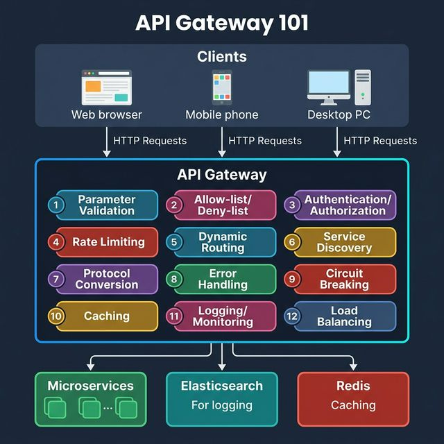
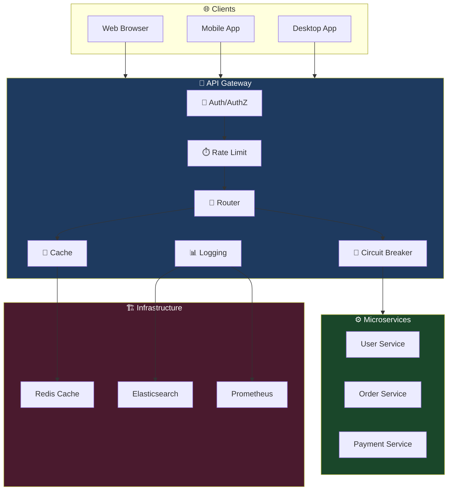

<!-- tags: system-design, api-gateway -->
# 🚪 API Gateway 101

> API Gateway là server đứng giữa client và backend services — nhận requests, enforce security, rate limiting, routing, caching, rồi trả response. Một middleman quản lý toàn bộ API traffic.

📅 Ngày tạo: 2026-03-22 · 🔄 Cập nhật: 2026-03-22 · ⏱️ 18 phút đọc

| Aspect         | Detail                                                                     |
| -------------- | -------------------------------------------------------------------------- |
| **Complexity** | 🌟🌟🌟🌟                                                                   |
| **Use case**   | Microservices architecture, API management, Security enforcement           |
| **Keywords**   | API Gateway, Reverse proxy, Rate limiting, Load balancing, Circuit breaker |

---

## 1. DEFINE

Hình dung mười mấy service phía sau một sản phẩm duy nhất, và client bên ngoài không nên biết từng route, từng auth rule, từng quota của mỗi service. Đó là lúc API Gateway xuất hiện như một ranh giới vào hệ thống, nhưng cũng mang theo nguy cơ thành điểm nghẽn nếu đặt sai trách nhiệm.


### API Gateway là gì?

API Gateway là **single entry point** cho tất cả client requests. Thay vì client gọi trực tiếp nhiều microservices, client chỉ gọi Gateway → Gateway route đến service phù hợp.

### 12 Chức Năng Chính

| #   | Function                           | Mô tả                                                      |
| --- | ---------------------------------- | ---------------------------------------------------------- |
| 1   | **Parameter Validation**           | Validate request params, body, headers trước khi forward   |
| 2   | **Allow-list / Deny-list**         | IP whitelist/blacklist, block malicious clients            |
| 3   | **Authentication / Authorization** | Verify JWT, OAuth2 tokens, check permissions               |
| 4   | **Rate Limiting**                  | Giới hạn requests per client (e.g., 100 req/min)           |
| 5   | **Dynamic Routing**                | Route requests đến service dựa trên path, headers, version |
| 6   | **Service Discovery**              | Auto-discover backend services (Consul, etcd, DNS)         |
| 7   | **Protocol Conversion**            | HTTP → gRPC, REST → WebSocket, etc.                        |
| 8   | **Error Handling**                 | Standardize error responses, retry failed requests         |
| 9   | **Circuit Breaking**               | Stop forwarding khi backend down → fail fast               |
| 10  | **Caching**                        | Cache responses (Redis) → giảm backend load                |
| 11  | **Logging / Monitoring**           | Log requests → Elasticsearch, metrics → Prometheus         |
| 12  | **Load Balancing**                 | Distribute requests across service instances               |

### So Sánh API Gateway Solutions

| Solution                 | Type        | Best For                          | Protocol              |
| ------------------------ | ----------- | --------------------------------- | --------------------- |
| **Kong**                 | Open-source | Plugin ecosystem, Lua extensible  | HTTP, gRPC, WebSocket |
| **NGINX**                | Open-source | High performance reverse proxy    | HTTP, TCP, UDP        |
| **Envoy**                | Open-source | Service mesh sidecar, xDS API     | HTTP/2, gRPC          |
| **Traefik**              | Open-source | Docker/K8s native, auto-discovery | HTTP, TCP             |
| **AWS API Gateway**      | Managed     | Serverless, Lambda integration    | REST, WebSocket, HTTP |
| **GCP API Gateway**      | Managed     | Google Cloud ecosystem            | REST, gRPC            |
| **Azure API Management** | Managed     | Enterprise, developer portal      | REST, SOAP, GraphQL   |

---

Các failure mode trên nghe quen. Nhưng có trap: gateway trở thành single point of failure = toàn hệ thống down, và rate limiting sai config = legitimate traffic bị block. Trap đó sẽ xuất hiện ở PITFALLS.

## 2. VISUAL

Định nghĩa mới chỉ khóa được từ vựng. Hình dưới đây cho thấy `API Gateway 101` vận hành ra sao khi request, node, và network bắt đầu tương tác thật.




### Request Flow

```
Client (Web/Mobile/PC)
  │
  │  HTTP Request
  ▼
┌─────────────────────────────────────────┐
│            API GATEWAY                   │
│                                          │
│  ① Validate params                      │
│  ② Check allow/deny list                │
│  ③ Authenticate (JWT/OAuth2)            │
│  ④ Check rate limit                     │
│  ⑤ Route to service                     │
│  ⑥ Transform request (protocol)        │
│  ⑦ Circuit breaker check               │
│  ⑧ Forward to backend                  │
│  ⑨ Cache response (if cacheable)       │
│  ⑩ Log request + response              │
│  ⑪ Return response to client           │
│                                          │
└──────┬──────────┬──────────┬────────────┘
       │          │          │
       ▼          ▼          ▼
   [User        [Order     [Payment
    Service]     Service]    Service]
```

### API Gateway vs Reverse Proxy vs Load Balancer

```
┌─────────────────────────────────────────────────────┐
│                 REVERSE PROXY                        │
│  • Forward requests to backend                      │
│  • SSL termination                                  │
│  • Static routing                                   │
│                                                      │
│  ┌───────────────────────────────────────────┐      │
│  │           LOAD BALANCER                    │      │
│  │  • Distribute traffic across instances     │      │
│  │  • Health checks                           │      │
│  │  • Round-robin, least-connections          │      │
│  │                                            │      │
│  │  ┌─────────────────────────────────┐      │      │
│  │  │         API GATEWAY              │      │      │
│  │  │  + Auth/AuthZ                    │      │      │
│  │  │  + Rate limiting                 │      │      │
│  │  │  + Request transformation        │      │      │
│  │  │  + API composition               │      │      │
│  │  │  + Circuit breaking              │      │      │
│  │  │  + Caching                       │      │      │
│  │  │  + Monitoring                    │      │      │
│  │  └─────────────────────────────────┘      │      │
│  └───────────────────────────────────────────┘      │
└─────────────────────────────────────────────────────┘

API Gateway ⊃ Load Balancer ⊃ Reverse Proxy
```

### Mermaid: Gateway Architecture



---

## 3. CODE

Từ sơ đồ sang implementation là chỗ nhiều hiểu lầm nhất. Đoạn code tiếp theo giúp `API Gateway 101` đứng xuống mặt đất thay vì ở lại trên whiteboard.


### 1. API Gateway — Core Router

```go
package gateway

import (
    "log/slog"
    "net/http"
    "net/http/httputil"
    "net/url"
    "strings"
    "sync"
)

// ─── API GATEWAY ───
// Central entry point: routing, middleware chain, reverse proxy

type Route struct {
    PathPrefix string
    TargetURL  string
    StripPath  bool
}

type Gateway struct {
    routes     []Route
    middleware []Middleware
    proxies    map[string]*httputil.ReverseProxy
    mu         sync.RWMutex
}

type Middleware func(http.Handler) http.Handler

func New() *Gateway {
    return &Gateway{
        proxies: make(map[string]*httputil.ReverseProxy),
    }
}

// AddRoute — register a backend service route
func (gw *Gateway) AddRoute(pathPrefix, targetURL string, stripPath bool) {
    gw.mu.Lock()
    defer gw.mu.Unlock()

    gw.routes = append(gw.routes, Route{
        PathPrefix: pathPrefix,
        TargetURL:  targetURL,
        StripPath:  stripPath,
    })

    // ✅ Create reverse proxy for this target
    target, _ := url.Parse(targetURL)
    gw.proxies[pathPrefix] = httputil.NewSingleHostReverseProxy(target)

    slog.Info("route registered", "path", pathPrefix, "target", targetURL)
}

// Use — add middleware to the chain
func (gw *Gateway) Use(mw Middleware) {
    gw.middleware = append(gw.middleware, mw)
}

// ServeHTTP — main handler
func (gw *Gateway) ServeHTTP(w http.ResponseWriter, r *http.Request) {
    gw.mu.RLock()
    defer gw.mu.RUnlock()

    // ✅ Find matching route
    for _, route := range gw.routes {
        if strings.HasPrefix(r.URL.Path, route.PathPrefix) {
            proxy := gw.proxies[route.PathPrefix]

            if route.StripPath {
                r.URL.Path = strings.TrimPrefix(r.URL.Path, route.PathPrefix)
                if r.URL.Path == "" {
                    r.URL.Path = "/"
                }
            }

            // ✅ Apply middleware chain
            var handler http.Handler = proxy
            for i := len(gw.middleware) - 1; i >= 0; i-- {
                handler = gw.middleware[i](handler)
            }

            handler.ServeHTTP(w, r)
            return
        }
    }

    http.Error(w, `{"error":"no route matched"}`, http.StatusNotFound)
}

// Start — run the gateway server
func (gw *Gateway) Start(addr string) error {
    slog.Info("API Gateway starting", "addr", addr)
    return http.ListenAndServe(addr, gw)
}
```

```typescript
type Route = { pathPrefix: string; targetUrl: string; stripPath: boolean };

class Gateway {
    private readonly routes: Route[] = [];

    addRoute(pathPrefix: string, targetUrl: string, stripPath: boolean): void {
        this.routes.push({ pathPrefix, targetUrl, stripPath });
    }
}
```

```rust
struct Route {
    path_prefix: String,
    target_url: String,
    strip_path: bool,
}
```

```cpp
struct Route {
    std::string pathPrefix;
    std::string targetUrl;
    bool stripPath;
};
```

```python
from dataclasses import dataclass


@dataclass
class Route:
    path_prefix: str
    target_url: str
    strip_path: bool
```

```java
// Java equivalent for assets/system-design/17-api-gateway-101.md
// Source language used for adaptation: typescript
class Gateway {
    // Keep the same responsibilities and flow as the implementations above.
}

final class 17ApiGateway101Example1 {
    private 17ApiGateway101Example1() {}

    static Object Gateway(Object... args) {
        // Preserve the same algorithm / object collaboration shown above.
        return null;
    }
}
```

Routing đã cover. Nhưng rate limiting cần strategy — hãy throttle.

### 2. Rate Limiter Middleware — Token Bucket

```go
package gateway

import (
    "net/http"
    "sync"
    "time"
)

// ─── RATE LIMITER ───
// Token bucket per client IP
// Refill tokens at fixed rate, reject when depleted

type tokenBucket struct {
    tokens     float64
    maxTokens  float64
    refillRate float64 // tokens per second
    lastRefill time.Time
}

type RateLimiter struct {
    mu      sync.Mutex
    buckets map[string]*tokenBucket
    max     float64
    rate    float64
}

func NewRateLimiter(maxTokens, refillRate float64) *RateLimiter {
    return &RateLimiter{
        buckets: make(map[string]*tokenBucket),
        max:     maxTokens,
        rate:    refillRate,
    }
}

func (rl *RateLimiter) allow(key string) bool {
    rl.mu.Lock()
    defer rl.mu.Unlock()

    b, ok := rl.buckets[key]
    if !ok {
        b = &tokenBucket{
            tokens:     rl.max,
            maxTokens:  rl.max,
            refillRate: rl.rate,
            lastRefill: time.Now(),
        }
        rl.buckets[key] = b
    }

    // ✅ Refill tokens based on elapsed time
    now := time.Now()
    elapsed := now.Sub(b.lastRefill).Seconds()
    b.tokens += elapsed * b.refillRate
    if b.tokens > b.maxTokens {
        b.tokens = b.maxTokens
    }
    b.lastRefill = now

    // ✅ Check if enough tokens
    if b.tokens < 1 {
        return false
    }
    b.tokens--
    return true
}

// Middleware — returns 429 when rate exceeded
func (rl *RateLimiter) Middleware() Middleware {
    return func(next http.Handler) http.Handler {
        return http.HandlerFunc(func(w http.ResponseWriter, r *http.Request) {
            clientIP := r.RemoteAddr

            if !rl.allow(clientIP) {
                w.Header().Set("Retry-After", "1")
                http.Error(w,
                    `{"error":"rate limit exceeded"}`,
                    http.StatusTooManyRequests)
                return
            }

            next.ServeHTTP(w, r)
        })
    }
}
```

```typescript
class RateLimiter {
    private readonly buckets = new Map<string, { tokens: number }>();

    allow(key: string): boolean {
        const bucket = this.buckets.get(key) ?? { tokens: 100 };
        this.buckets.set(key, bucket);
        if (bucket.tokens < 1) return false;
        bucket.tokens -= 1;
        return true;
    }
}
```

```rust
struct RateLimiter;
```

```cpp
class RateLimiter {
public:
    bool allow(const std::string&) { return true; }
};
```

```python
class RateLimiter:
    def allow(self, key: str) -> bool:
        return True
```

```java
// Java equivalent for assets/system-design/17-api-gateway-101.md
// Source language used for adaptation: typescript
class RateLimiter {
    // Keep the same responsibilities and flow as the implementations above.
}

final class 17ApiGateway101Example2 {
    private 17ApiGateway101Example2() {}

    static Object RateLimiter(Object... args) {
        // Preserve the same algorithm / object collaboration shown above.
        return null;
    }
}
```

### 3. Circuit Breaker Middleware

```go
package gateway

import (
    "net/http"
    "sync"
    "time"
)

// ─── CIRCUIT BREAKER ───
// States: CLOSED → OPEN → HALF-OPEN → CLOSED
// Prevents cascading failures by failing fast

type CircuitState int

const (
    CircuitClosed   CircuitState = iota // normal operation
    CircuitOpen                         // failing fast
    CircuitHalfOpen                     // testing recovery
)

type CircuitBreaker struct {
    mu           sync.Mutex
    state        CircuitState
    failures     int
    successes    int
    threshold    int           // failures before opening
    timeout      time.Duration // how long to stay open
    halfOpenMax  int           // successes needed to close
    lastFailTime time.Time
}

func NewCircuitBreaker(threshold int, timeout time.Duration) *CircuitBreaker {
    return &CircuitBreaker{
        state:       CircuitClosed,
        threshold:   threshold,
        timeout:     timeout,
        halfOpenMax: 3,
    }
}

func (cb *CircuitBreaker) canPass() bool {
    cb.mu.Lock()
    defer cb.mu.Unlock()

    switch cb.state {
    case CircuitClosed:
        return true
    case CircuitOpen:
        // ✅ Check if timeout elapsed → transition to half-open
        if time.Since(cb.lastFailTime) > cb.timeout {
            cb.state = CircuitHalfOpen
            cb.successes = 0
            return true
        }
        return false
    case CircuitHalfOpen:
        return true
    }
    return false
}

func (cb *CircuitBreaker) recordSuccess() {
    cb.mu.Lock()
    defer cb.mu.Unlock()

    cb.failures = 0
    if cb.state == CircuitHalfOpen {
        cb.successes++
        if cb.successes >= cb.halfOpenMax {
            cb.state = CircuitClosed // ✅ Recovery confirmed
        }
    }
}

func (cb *CircuitBreaker) recordFailure() {
    cb.mu.Lock()
    defer cb.mu.Unlock()

    cb.failures++
    cb.lastFailTime = time.Now()
    if cb.failures >= cb.threshold {
        cb.state = CircuitOpen // ✅ Trip the breaker
    }
}

// Middleware
func (cb *CircuitBreaker) Middleware() Middleware {
    return func(next http.Handler) http.Handler {
        return http.HandlerFunc(func(w http.ResponseWriter, r *http.Request) {
            if !cb.canPass() {
                http.Error(w,
                    `{"error":"service unavailable","circuit":"open"}`,
                    http.StatusServiceUnavailable)
                return
            }

            // ✅ Wrap response to detect failures
            rec := &statusRecorder{ResponseWriter: w, status: 200}
            next.ServeHTTP(rec, r)

            if rec.status >= 500 {
                cb.recordFailure()
            } else {
                cb.recordSuccess()
            }
        })
    }
}

type statusRecorder struct {
    http.ResponseWriter
    status int
}

func (r *statusRecorder) WriteHeader(code int) {
    r.status = code
    r.ResponseWriter.WriteHeader(code)
}
```

```typescript
class CircuitBreaker {
    private state: "closed" | "open" | "half-open" = "closed";
    private failures = 0;
}
```

```rust
enum CircuitState {
    Closed,
    Open,
    HalfOpen,
}
```

```cpp
enum class CircuitState { Closed, Open, HalfOpen };
```

```python
class CircuitBreaker:
    def __init__(self) -> None:
        self.state = "closed"
        self.failures = 0
```

```java
// Java equivalent for assets/system-design/17-api-gateway-101.md
// Source language used for adaptation: typescript
class CircuitBreaker {
    // Keep the same responsibilities and flow as the implementations above.
}

final class 17ApiGateway101Example3 {
    private 17ApiGateway101Example3() {}

    static Object CircuitBreaker(Object... args) {
        // Preserve the same algorithm / object collaboration shown above.
        return null;
    }
}
```

### 4. Complete Gateway Setup

```go
package main

import (
    "log/slog"
    "net/http"
    "time"
)

func main() {
    gw := New()

    // ✅ 1. Middlewares (executed in order)
    // Logging
    gw.Use(func(next http.Handler) http.Handler {
        return http.HandlerFunc(func(w http.ResponseWriter, r *http.Request) {
            start := time.Now()
            slog.Info("request",
                "method", r.Method,
                "path", r.URL.Path,
                "ip", r.RemoteAddr)
            next.ServeHTTP(w, r)
            slog.Info("response",
                "path", r.URL.Path,
                "duration", time.Since(start))
        })
    })

    // Auth — check Authorization header
    gw.Use(func(next http.Handler) http.Handler {
        return http.HandlerFunc(func(w http.ResponseWriter, r *http.Request) {
            // Skip auth for health checks
            if r.URL.Path == "/health" {
                next.ServeHTTP(w, r)
                return
            }
            token := r.Header.Get("Authorization")
            if token == "" {
                http.Error(w, `{"error":"unauthorized"}`, http.StatusUnauthorized)
                return
            }
            // TODO: validate JWT token
            next.ServeHTTP(w, r)
        })
    })

    // Rate limiter — 100 requests/sec per IP
    rateLimiter := NewRateLimiter(100, 100)
    gw.Use(rateLimiter.Middleware())

    // Circuit breaker — open after 5 failures, 30s timeout
    circuitBreaker := NewCircuitBreaker(5, 30*time.Second)
    gw.Use(circuitBreaker.Middleware())

    // ✅ 2. Routes
    gw.AddRoute("/api/users", "http://localhost:8001", true)
    gw.AddRoute("/api/orders", "http://localhost:8002", true)
    gw.AddRoute("/api/payments", "http://localhost:8003", true)

    // ✅ 3. Start
    slog.Info("Gateway ready", "addr", ":8080")
    gw.Start(":8080")
}
```

```typescript
const gateway = new Gateway();
gateway.addRoute("/api/users", "http://localhost:8001", true);
gateway.addRoute("/api/orders", "http://localhost:8002", true);
gateway.addRoute("/api/payments", "http://localhost:8003", true);
```

```rust
fn main() {
    println!("gateway boot with users, orders, payments routes");
}
```

```cpp
int main() {
    std::cout << "Gateway bootstraps middleware chain and backend routes.\n";
}
```

```python
gateway_routes = [
    Route("/api/users", "http://localhost:8001", True),
    Route("/api/orders", "http://localhost:8002", True),
    Route("/api/payments", "http://localhost:8003", True),
]
```

```java
// Java equivalent for assets/system-design/17-api-gateway-101.md
// Source language used for adaptation: typescript
final class 17ApiGateway101Example4 {
    private 17ApiGateway101Example4() {}

    static Object Gateway(Object... args) {
        // Follow the same control flow and data-shape semantics as the reference implementation.
        return null;
    }
}
```

---

Bạn đã đi qua API gateway patterns. Bây giờ đến phần nguy hiểm: SPOF và wrong rate limits — trap đã được setup từ đầu bài.

## 4. PITFALLS

Đến production, `API Gateway 101` thường gãy không phải vì lý thuyết sai mà vì implementation bỏ sót constraint ngầm. Các lỗi dưới đây cho thấy điều đó.


| # | Severity | Lỗi (Pitfall) | Hậu quả | Fix (Giải pháp) |
| --- | --- | --- | --- | --- |
| 1 | 🔴 Fatal | **Single point of failure** | Gateway down → tất cả services unreachable | Deploy multiple gateway instances + load balancer. Health checks + auto-scaling. |
| 2 | 🔴 Fatal | **Gateway quá "fat"** | Gateway chứa business logic → coupled, hard to maintain | Gateway chỉ làm cross-cutting concerns (auth, rate limit, routing). Business logic thuộc services. |
| 3 | 🟡 Common | **Latency overhead** | Thêm 1 hop → tăng latency per-request | Keep gateway lightweight. Minimize middleware chain. Use in-memory caching. |
| 4 | 🟡 Common | **Rate limit per-instance** | 3 gateway instances → mỗi instance 100 req/s → thực tế 300 req/s | Distributed rate limiting (Redis-based). Shared counter across instances. |
| 5 | 🟡 Common | **Không circuit break** | Backend down → gateway vẫn forward → connection pile-up → cascade failure | Circuit breaker pattern. Fail fast khi backend unhealthy. |
| 6 | 🔵 Minor | **Cache stale data** | Gateway cache response → backend update → client nhận data cũ | Cache TTL hợp lý. Cache invalidation via events. Cache-Control headers. |

---

Bạn đã đi qua API Gateway và cạm bẫy. Các resources dưới đây giúp đi sâu hơn.

## 5. REF

| Resource                        | Link                                                                                                     |
| ------------------------------- | -------------------------------------------------------------------------------------------------------- |
| Kong Gateway                    | [konghq.com](https://konghq.com/)                                                                        |
| Envoy Proxy                     | [envoyproxy.io](https://www.envoyproxy.io/)                                                              |
| Traefik                         | [traefik.io](https://traefik.io/)                                                                        |
| NGINX as API Gateway            | [nginx.com](https://www.nginx.com/blog/deploying-nginx-plus-as-an-api-gateway-part-1/)                   |
| API Gateway Pattern — Microsoft | [learn.microsoft.com](https://learn.microsoft.com/en-us/azure/architecture/microservices/design/gateway) |

---

## 6. RECOMMEND

Khi đã thấy `API Gateway 101` giải quyết bài toán gì và hay đổ vỡ ở đâu, các tài liệu dưới đây sẽ mở rộng đúng hướng thay vì kéo bạn sang buzzword khác.


| Mở rộng                        | Khi nào cần                    | Lý do                                                                                   |
| ------------------------------ | ------------------------------ | --------------------------------------------------------------------------------------- |
| **BFF (Backend for Frontend)** | Multi-client (web, mobile, TV) | Mỗi client type có gateway riêng — tối ưu response format per client.                   |
| **Service Mesh**               | Internal service-to-service    | Sidecar proxy (Istio/Linkerd) handle internal traffic. Gateway handle external traffic. |
| **GraphQL Gateway**            | API composition                | Apollo Federation — query multiple services trong 1 request. Giảm over-fetching.        |
| **gRPC Gateway**               | High-performance internal      | gRPC-gateway — auto-generate REST proxy từ protobuf definitions.                        |

---

---

**Callback**: Quay lại 50 endpoints mà mobile team không track được. Bây giờ bạn biết: API Gateway abstract backend complexity, enforce cross-cutting concerns ở 1 chỗ, và expose stable contract cho clients. Nhưng gateway là SPOF — cần redundancy, health checks, và circuit breaker ở gateway layer.

← Previous: [TCP vs UDP Protocols](./16-tcp-udp-protocols.md) · → Next: [System Design Blueprint](./18-system-design-blueprint.md) · ← Quay về [System Design](./README.md)
