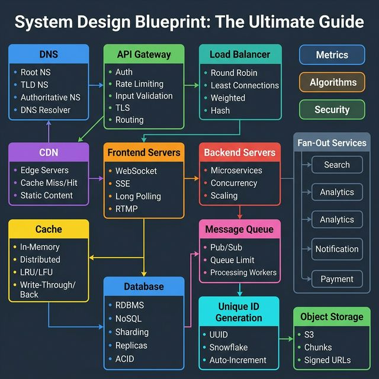
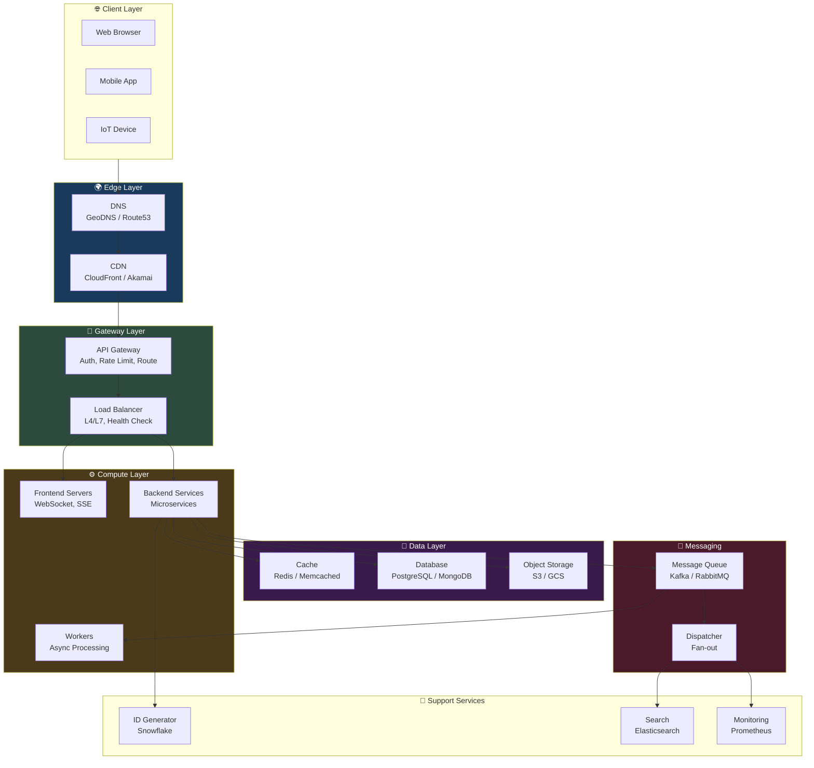

<!-- tags: system-design, reference -->
# 🏗️ System Design Blueprint: The Ultimate Guide

> Template toàn diện để tackle mọi system design problem — từ DNS resolution đến database sharding, từ caching strategies đến message queues.

📅 Ngày tạo: 2026-03-22 · 🔄 Cập nhật: 2026-03-22 · ⏱️ 25 phút đọc

| Aspect         | Detail                                                                              |
| -------------- | ----------------------------------------------------------------------------------- |
| **Complexity** | 🌟🌟🌟🌟🌟                                                                          |
| **Use case**   | System design interviews, Architecture planning, Technical documentation            |
| **Keywords**   | System design, DNS, Load balancer, CDN, Cache, Database, Message queue, Scalability |

---

## 1. DEFINE

Hình dung bạn đứng trước một bài system design trắng tinh và phải đi từ user request đến storage, queue, cache, monitoring trong một mạch kể mạch lạc. Nếu không có blueprint, rất dễ hoặc quên những lớp sống còn, hoặc vẽ đủ thứ nhưng không biết chúng gắn với nhau để giải quyết áp lực nào.


### Checklist Overview

System design không có "đáp án đúng" — nhưng có **framework** để tiếp cận mọi bài toán. Blueprint này cover 14 building blocks chính:

| #   | Component                | Vai trò                              | Key Metrics                |
| --- | ------------------------ | ------------------------------------ | -------------------------- |
| 1   | **DNS**                  | Phân giải domain → IP                | Latency, TTL, Failover     |
| 2   | **API Gateway**          | Single entry point, auth, rate limit | Throughput, Error rate     |
| 3   | **Load Balancer**        | Distribute traffic across servers    | RPS, Active connections    |
| 4   | **CDN**                  | Cache static content gần user        | Cache hit ratio, Latency   |
| 5   | **Frontend Servers**     | Serve real-time connections          | Concurrent connections     |
| 6   | **Backend Servers**      | Business logic, microservices        | CPU, Memory, Response time |
| 7   | **Database**             | Persistent storage, ACID             | QPS, Replication lag       |
| 8   | **Cache**                | In-memory fast access                | Hit ratio, Eviction rate   |
| 9   | **Message Queue**        | Async communication                  | Queue depth, Consumer lag  |
| 10  | **Unique ID Generation** | Distributed unique IDs               | Throughput, Ordering       |
| 11  | **Object Storage**       | Files, images, videos (S3)           | Upload/download speed      |
| 12  | **Scalability**          | Horizontal/Vertical scaling          | Capacity, Auto-scaling     |
| 13  | **Security**             | Auth, encryption, RBAC               | Vulnerability score        |
| 14  | **Fault Tolerance**      | Handle failures gracefully           | Uptime, MTTR               |

---

Các failure mode trên nghe rõ. Nhưng có trap: blueprint thiếu capacity estimation = design fail at scale, và không define SLA trước = ambiguous requirements. Trap đó sẽ xuất hiện ở PITFALLS.

## 2. VISUAL

Khái niệm đã có tên. Sang sơ đồ, `System Design Blueprint: The Ultimate Guide` mới bộc lộ nơi dữ liệu chảy qua, nơi control đổi tay, và chỗ trade-off bắt đầu hiện hình.




### Request Flow — End to End

```
User types "app.example.com"
  │
  ▼
┌───────────────────────────────────────────────────┐
│  DNS RESOLUTION                                    │
│  Root NS → TLD NS (.com) → Authoritative NS       │
│  → GeoDNS returns closest IP                       │
└──────────────────────┬────────────────────────────┘
                       │
                       ▼
┌───────────────────────────────────────────────────┐
│  CDN / EDGE                                        │
│  • Cache hit → serve static content directly       │
│  • Cache miss → forward to origin                  │
└──────────────────────┬────────────────────────────┘
                       │
                       ▼
┌───────────────────────────────────────────────────┐
│  API GATEWAY                                       │
│  Auth → Rate Limit → Validate → Route → Log       │
└──────────────────────┬────────────────────────────┘
                       │
                       ▼
┌───────────────────────────────────────────────────┐
│  LOAD BALANCER                                     │
│  Round Robin / Least Connections / Consistent Hash │
└───────┬──────────┬──────────┬─────────────────────┘
        │          │          │
        ▼          ▼          ▼
    [Server 1] [Server 2] [Server 3]
        │          │          │
        └──────────┼──────────┘
                   │
        ┌──────────┼──────────┐
        ▼          ▼          ▼
    [Cache]   [Database]  [Message Queue]
    (Redis)   (PostgreSQL) (Kafka/RabbitMQ)
                   │
            ┌──────┼──────┐
            ▼      ▼      ▼
        [Shard1] [Shard2] [Replicas]
```

### Mermaid: Complete Architecture



---

## 3. CODE

Sơ đồ đã lộ luồng chính. Đến code, `System Design Blueprint: The Ultimate Guide` mới hiện ra thành những ranh giới mà team phải thật sự cài đặt và vận hành.


### 1. DNS — Resolution Simulation

```go
package main

import (
    "fmt"
    "log/slog"
    "net"
    "time"
)

// ─── DNS RESOLUTION ───
// Demonstrates how DNS resolves a domain to IPs
// 3-level hierarchy: Root → TLD → Authoritative

func resolveDNS(domain string) {
    start := time.Now()

    // ✅ Lookup all IPs (A records + AAAA records)
    ips, err := net.LookupHost(domain)
    if err != nil {
        slog.Error("DNS lookup failed", "domain", domain, "err", err)
        return
    }

    slog.Info("DNS resolved",
        "domain", domain,
        "ips", ips,
        "duration", time.Since(start))

    // ✅ Lookup CNAME
    cname, err := net.LookupCNAME(domain)
    if err == nil {
        slog.Info("CNAME", "domain", domain, "cname", cname)
    }

    // ✅ Lookup MX records
    mxRecords, err := net.LookupMX(domain)
    if err == nil {
        for _, mx := range mxRecords {
            slog.Info("MX record", "host", mx.Host, "pref", mx.Pref)
        }
    }

    // ✅ Lookup NS records
    nsRecords, err := net.LookupNS(domain)
    if err == nil {
        for _, ns := range nsRecords {
            slog.Info("NS record", "host", ns.Host)
        }
    }
}

func main() {
    domains := []string{"google.com", "github.com", "example.com"}
    for _, d := range domains {
        resolveDNS(d)
        fmt.Println("---")
    }
}
```

```typescript
import dns from "node:dns/promises";

async function resolveDns(domain: string): Promise<void> {
    console.log(await dns.lookup(domain));
}
```

```rust
async fn resolve_dns(domain: &str) -> anyhow::Result<()> {
    println!("resolve {domain}");
    Ok(())
}
```

```cpp
void resolveDns(const std::string& domain) {
    std::cout << "resolve DNS for " << domain << '\n';
}
```

```python
import socket


def resolve_dns(domain: str) -> None:
    print(socket.gethostbyname_ex(domain))
```

```java
// Java equivalent for assets/system-design/18-system-design-blueprint.md
// Source language used for adaptation: typescript
final class 18SystemDesignBlueprintExample1 {
    private 18SystemDesignBlueprintExample1() {}

    static Object resolveDns(Object... args) {
        // Follow the same control flow and data-shape semantics as the reference implementation.
        return null;
    }
}
```

Requirements đã cover. Nhưng capacity estimation cần math — hãy tính.

### 2. Load Balancer — Multiple Strategies

```go
package main

import (
    "hash/fnv"
    "math/rand"
    "sync"
    "sync/atomic"
)

// ─── LOAD BALANCER STRATEGIES ───
// Implement 4 common algorithms

type Server struct {
    Address     string
    Weight      int
    Connections int64
    Healthy     bool
}

type LoadBalancer interface {
    Next(clientIP string) *Server
}

// ── 1. Round Robin ──
type RoundRobin struct {
    servers []*Server
    current uint64
}

func (rr *RoundRobin) Next(_ string) *Server {
    n := atomic.AddUint64(&rr.current, 1)
    return rr.servers[n%uint64(len(rr.servers))]
}

// ── 2. Weighted Round Robin ──
type WeightedRoundRobin struct {
    servers []*Server
    mu      sync.Mutex
    pool    []*Server // expanded by weight
}

func NewWeightedRR(servers []*Server) *WeightedRoundRobin {
    var pool []*Server
    for _, s := range servers {
        for range s.Weight {
            pool = append(pool, s)
        }
    }
    return &WeightedRoundRobin{servers: servers, pool: pool}
}

func (wrr *WeightedRoundRobin) Next(_ string) *Server {
    wrr.mu.Lock()
    defer wrr.mu.Unlock()
    return wrr.pool[rand.Intn(len(wrr.pool))]
}

// ── 3. Least Connections ──
type LeastConnections struct {
    servers []*Server
    mu      sync.Mutex
}

func (lc *LeastConnections) Next(_ string) *Server {
    lc.mu.Lock()
    defer lc.mu.Unlock()

    var best *Server
    for _, s := range lc.servers {
        if !s.Healthy {
            continue
        }
        if best == nil || atomic.LoadInt64(&s.Connections) < atomic.LoadInt64(&best.Connections) {
            best = s
        }
    }
    if best != nil {
        atomic.AddInt64(&best.Connections, 1)
    }
    return best
}

// ── 4. Consistent Hashing ──
// (IP-based sticky sessions)
type ConsistentHash struct {
    servers []*Server
}

func (ch *ConsistentHash) Next(clientIP string) *Server {
    h := fnv.New32a()
    h.Write([]byte(clientIP))
    idx := h.Sum32() % uint32(len(ch.servers))
    return ch.servers[idx]
}
```

```typescript
type Server = { address: string; weight: number; healthy: boolean };

class RoundRobin {
    constructor(private readonly servers: Server[], private current = 0) {}

    next(): Server {
        return this.servers[this.current++ % this.servers.length];
    }
}
```

```rust
struct Server {
    address: String,
    weight: i32,
    healthy: bool,
}
```

```cpp
struct Server {
    std::string address;
    int weight;
    bool healthy;
};
```

```python
from dataclasses import dataclass


@dataclass
class Server:
    address: str
    weight: int
    healthy: bool = True
```

```java
// Java equivalent for assets/system-design/18-system-design-blueprint.md
// Source language used for adaptation: typescript
class RoundRobin {
    // Keep the same responsibilities and flow as the implementations above.
}

final class 18SystemDesignBlueprintExample2 {
    private 18SystemDesignBlueprintExample2() {}

    static Object RoundRobin(Object... args) {
        // Preserve the same algorithm / object collaboration shown above.
        return null;
    }
}
```

### 3. Cache — Multi-Strategy with TTL

```go
package main

import (
    "sync"
    "time"
)

// ─── CACHE WITH TTL & EVICTION ───
// Supports: Write-Through, Write-Back, Write-Around

type CacheEntry struct {
    Value     any
    ExpiresAt time.Time
    Dirty     bool // for Write-Back
}

type Cache struct {
    mu       sync.RWMutex
    store    map[string]*CacheEntry
    maxSize  int
    strategy string // "write-through", "write-back", "write-around"
}

func NewCache(maxSize int, strategy string) *Cache {
    c := &Cache{
        store:    make(map[string]*CacheEntry),
        maxSize:  maxSize,
        strategy: strategy,
    }
    go c.cleanupLoop()
    return c
}

// Get — check cache first
func (c *Cache) Get(key string) (any, bool) {
    c.mu.RLock()
    defer c.mu.RUnlock()

    entry, ok := c.store[key]
    if !ok {
        return nil, false // ❌ Cache MISS
    }

    if time.Now().After(entry.ExpiresAt) {
        return nil, false // ❌ Expired
    }

    return entry.Value, true // ✅ Cache HIT
}

// Set — write to cache with TTL
func (c *Cache) Set(key string, value any, ttl time.Duration) {
    c.mu.Lock()
    defer c.mu.Unlock()

    // ✅ Evict if at capacity (LRU simplified)
    if len(c.store) >= c.maxSize {
        c.evictOldest()
    }

    c.store[key] = &CacheEntry{
        Value:     value,
        ExpiresAt: time.Now().Add(ttl),
    }
}

func (c *Cache) evictOldest() {
    var oldestKey string
    var oldestTime time.Time

    for k, v := range c.store {
        if oldestKey == "" || v.ExpiresAt.Before(oldestTime) {
            oldestKey = k
            oldestTime = v.ExpiresAt
        }
    }

    if oldestKey != "" {
        delete(c.store, oldestKey)
    }
}

func (c *Cache) cleanupLoop() {
    ticker := time.NewTicker(1 * time.Minute)
    defer ticker.Stop()

    for range ticker.C {
        c.mu.Lock()
        now := time.Now()
        for k, v := range c.store {
            if now.After(v.ExpiresAt) {
                delete(c.store, k)
            }
        }
        c.mu.Unlock()
    }
}
```

```typescript
type CacheEntry = { value: unknown; expiresAt: number };

class Cache {
    private readonly store = new Map<string, CacheEntry>();
}
```

```rust
struct CacheEntry {
    expires_at: std::time::Instant,
}
```

```cpp
struct CacheEntry {
    std::string value;
};
```

```python
class Cache:
    def __init__(self) -> None:
        self.store: dict[str, object] = {}
```

```java
// Java equivalent for assets/system-design/18-system-design-blueprint.md
// Source language used for adaptation: typescript
class Cache {
    // Keep the same responsibilities and flow as the implementations above.
}

final class 18SystemDesignBlueprintExample3 {
    private 18SystemDesignBlueprintExample3() {}

    static Object Cache(Object... args) {
        // Preserve the same algorithm / object collaboration shown above.
        return null;
    }
}
```

### 4. Unique ID Generator — Snowflake

```go
package main

import (
    "fmt"
    "sync"
    "time"
)

// ─── SNOWFLAKE ID GENERATOR ───
// 64-bit ID: timestamp(41) + machineID(10) + sequence(12)
// Generates ~4096 unique IDs per millisecond per machine

const (
    epoch         = 1700000000000 // custom epoch (ms)
    machineBits   = 10
    sequenceBits  = 12
    maxMachineID  = (1 << machineBits) - 1  // 1023
    maxSequence   = (1 << sequenceBits) - 1  // 4095
    machineShift  = sequenceBits
    timestampShift = machineBits + sequenceBits
)

type Snowflake struct {
    mu        sync.Mutex
    machineID int64
    sequence  int64
    lastTime  int64
}

func NewSnowflake(machineID int64) *Snowflake {
    if machineID < 0 || machineID > maxMachineID {
        panic(fmt.Sprintf("machineID must be 0-%d", maxMachineID))
    }
    return &Snowflake{machineID: machineID}
}

func (s *Snowflake) Generate() int64 {
    s.mu.Lock()
    defer s.mu.Unlock()

    now := time.Now().UnixMilli() - epoch

    if now == s.lastTime {
        s.sequence = (s.sequence + 1) & maxSequence
        if s.sequence == 0 {
            // ✅ Sequence exhausted — wait for next millisecond
            for now <= s.lastTime {
                now = time.Now().UnixMilli() - epoch
            }
        }
    } else {
        s.sequence = 0
    }

    s.lastTime = now

    // ✅ Compose 64-bit ID
    id := (now << timestampShift) |
        (s.machineID << machineShift) |
        s.sequence

    return id
}

// Extract components from ID
func (s *Snowflake) Parse(id int64) (timestamp, machineID, sequence int64) {
    timestamp = (id >> timestampShift) + epoch
    machineID = (id >> machineShift) & maxMachineID
    sequence = id & maxSequence
    return
}
```

```typescript
class Snowflake {
    constructor(private readonly machineId: bigint) {}
}
```

```rust
struct Snowflake {
    machine_id: i64,
}
```

```cpp
class Snowflake {
public:
    explicit Snowflake(long long machineId) : machineId_(machineId) {}
private:
    long long machineId_;
};
```

```python
class Snowflake:
    def __init__(self, machine_id: int) -> None:
        self.machine_id = machine_id
```

```java
// Java equivalent for assets/system-design/18-system-design-blueprint.md
// Source language used for adaptation: typescript
class Snowflake {
    // Keep the same responsibilities and flow as the implementations above.
}

final class 18SystemDesignBlueprintExample4 {
    private 18SystemDesignBlueprintExample4() {}

    static Object Snowflake(Object... args) {
        // Preserve the same algorithm / object collaboration shown above.
        return null;
    }
}
```

### 5. Message Queue — Simple In-Memory

```go
package main

import (
    "context"
    "log/slog"
    "sync"
)

// ─── MESSAGE QUEUE ───
// Simple pub/sub with topic-based routing

type Message struct {
    Topic   string
    Payload any
    ID      string
}

type Handler func(msg Message)

type MessageQueue struct {
    mu          sync.RWMutex
    subscribers map[string][]Handler
    queue       chan Message
    bufferSize  int
}

func NewMessageQueue(bufferSize int) *MessageQueue {
    return &MessageQueue{
        subscribers: make(map[string][]Handler),
        queue:       make(chan Message, bufferSize),
        bufferSize:  bufferSize,
    }
}

// Subscribe — register handler for topic
func (mq *MessageQueue) Subscribe(topic string, handler Handler) {
    mq.mu.Lock()
    defer mq.mu.Unlock()
    mq.subscribers[topic] = append(mq.subscribers[topic], handler)
    slog.Info("subscribed", "topic", topic)
}

// Publish — send message to topic
func (mq *MessageQueue) Publish(msg Message) {
    mq.queue <- msg
}

// Start — process messages (fan-out to subscribers)
func (mq *MessageQueue) Start(ctx context.Context) {
    go func() {
        for {
            select {
            case <-ctx.Done():
                slog.Info("message queue stopped")
                return
            case msg := <-mq.queue:
                mq.mu.RLock()
                handlers := mq.subscribers[msg.Topic]
                mq.mu.RUnlock()

                // ✅ Fan-out: dispatch to all subscribers
                var wg sync.WaitGroup
                for _, h := range handlers {
                    wg.Add(1)
                    go func(handler Handler) {
                        defer wg.Done()
                        handler(msg)
                    }(h)
                }
                wg.Wait()
            }
        }
    }()
}
```

```typescript
type Message = { topic: string; payload: unknown; id: string };

class MessageQueue {
    private readonly subscribers = new Map<string, Array<(message: Message) => void>>();
}
```

```rust
struct Message {
    topic: String,
    id: String,
}
```

```cpp
struct Message {
    std::string topic;
    std::string id;
};
```

```python
class MessageQueue:
    def __init__(self) -> None:
        self.subscribers: dict[str, list] = {}
```

```java
// Java equivalent for assets/system-design/18-system-design-blueprint.md
// Source language used for adaptation: typescript
class MessageQueue {
    // Keep the same responsibilities and flow as the implementations above.
}

final class 18SystemDesignBlueprintExample5 {
    private 18SystemDesignBlueprintExample5() {}

    static Object MessageQueue(Object... args) {
        // Preserve the same algorithm / object collaboration shown above.
        return null;
    }
}
```

---

Bạn đã đi qua system design blueprint. Bây giờ đến phần nguy hiểm: no capacity math và undefined SLA — trap đã được setup từ đầu bài.

## 4. PITFALLS

Hiểu được `System Design Blueprint: The Ultimate Guide` là bước đầu; giữ nó không phản chủ trong vận hành mới là phần khó. Những pitfalls sau là các chỗ team hay trả giá nhất.


| # | Severity | Component | Lỗi (Pitfall) | Fix (Giải pháp) |
| --- | --- | --- | --- | --- |
| 1 | 🔴 Fatal | **DNS** | Không set TTL phù hợp → cache quá lâu hoặc quá ngắn | TTL 300s cho production. Low TTL (60s) khi đang migration. |
| 2 | 🔴 Fatal | **Load Balancer** | Health check interval quá dài → route traffic đến dead servers | Health check mỗi 5-10s. Remove unhealthy server sau 3 failed checks. |
| 3 | 🟡 Common | **CDN** | Cache dynamic content → users nhận stale data | Cache-Control headers chính xác. Purge API khi deploy. |
| 4 | 🟡 Common | **Cache** | Thundering herd — cache expire → tất cả requests hit DB cùng lúc | Staggered TTL + singleflight pattern + cache warming. |
| 5 | 🟡 Common | **Database** | Single write master bottleneck | Read replicas + write sharding. CQRS pattern. |
| 6 | 🔵 Minor | **Message Queue** | Consumer lag tăng → messages backlog | Auto-scale consumers. Dead letter queue. Monitor queue depth. |
| 7 | 🔵 Minor | **ID Generation** | Clock skew giữa machines → duplicate IDs | NTP sync + sequence overflow handling. Fallback to UUID. |

### Interview Checklist

Khi gặp bài system design, **luôn discuss theo thứ tự**:

| Step | Câu hỏi               | Discussion Points                                     |
| ---- | --------------------- | ----------------------------------------------------- |
| 1    | **Requirements**      | Functional vs Non-functional. Users? QPS? Data size?  |
| 2    | **API Design**        | REST/gRPC endpoints. Request/Response format.         |
| 3    | **Data Model**        | Tables, relationships, access patterns. SQL vs NoSQL? |
| 4    | **High-Level Design** | Draw boxes: Client → LB → Service → DB.               |
| 5    | **Deep Dive**         | Pick 2-3 components. Discuss trade-offs.              |
| 6    | **Scale**             | Bottlenecks? Caching? Sharding? Replication?          |
| 7    | **Reliability**       | Single points of failure? Failover? Circuit breaker?  |
| 8    | **Monitoring**        | Metrics, alerting, dashboards, SLO/SLA.               |

---

Bạn đã đi qua System Design Blueprint và cạm bẫy. Các resources dưới đây giúp đi sâu hơn.

## 5. REF

| Resource                              | Link                                                                          |
| ------------------------------------- | ----------------------------------------------------------------------------- |
| System Design Primer                  | [github.com/donnemartin](https://github.com/donnemartin/system-design-primer) |
| Designing Data-Intensive Applications | [dataintensive.net](https://dataintensive.net/)                               |
| ByteByteGo System Design              | [bytebytego.com](https://bytebytego.com/)                                     |
| Google SRE Book                       | [sre.google/books](https://sre.google/books/)                                 |
| AWS Architecture Center               | [aws.amazon.com/architecture](https://aws.amazon.com/architecture/)           |

---

## 6. RECOMMEND

Khi đã thấy `System Design Blueprint: The Ultimate Guide` giải quyết bài toán gì và hay đổ vỡ ở đâu, các tài liệu dưới đây sẽ mở rộng đúng hướng thay vì kéo bạn sang buzzword khác.


| Mở rộng            | Khi nào cần                 | Lý do                                                                       |
| ------------------ | --------------------------- | --------------------------------------------------------------------------- |
| **Service Mesh**   | Internal service-to-service | Istio/Linkerd — mTLS, traffic management, observability giữa microservices. |
| **Event Sourcing** | Audit trail, CQRS           | Store tất cả events, replay state. Phù hợp financial/banking systems.       |
| **Data Pipeline**  | ETL / Real-time analytics   | Kafka → Flink/Spark → Data warehouse. Process streaming data at scale.      |
| **Multi-Region**   | Global availability         | Active-active hoặc active-passive. Data replication cross-region.           |

---

---

**Callback**: Quay lại "Design Instagram" 45 phút. Bây giờ bạn biết: bắt đầu từ requirements → high-level design → deep dive components → trade-offs → scaling. Blueprint cho framework, không cho answer. Mỗi building block là 1 câu hỏi cần trả lời, không phải 1 box cần vẽ.

← Previous: [API Gateway 101](./17-api-gateway-101.md) · → Next: [DDD & Clean Architecture](./19-ddd-clean-architecture.md) · ← Quay về [System Design](./README.md)
