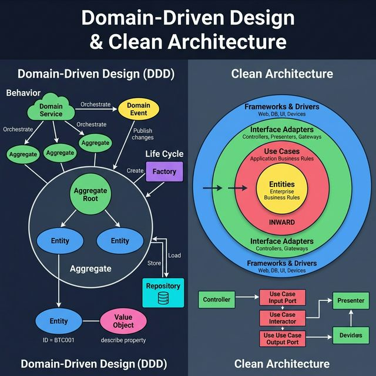
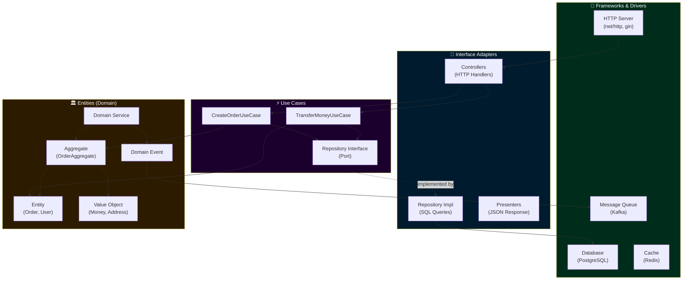

<!-- tags: system-design, ai, architecture, ddd -->
# 🏛️ Domain-Driven Design & Clean Architecture

> DDD model hóa business complexity bằng Ubiquitous Language. Clean Architecture tổ chức code thành layers với dependency rule hướng vào trong. Kết hợp cả hai → maintainable, testable, scalable software.

📅 Ngày tạo: 2026-03-22 · 🔄 Cập nhật: 2026-03-22 · ⏱️ 25 phút đọc

| Aspect         | Detail                                                                         |
| -------------- | ------------------------------------------------------------------------------ |
| **Complexity** | 🌟🌟🌟🌟🌟                                                                     |
| **Use case**   | Large-scale apps, Microservices, Enterprise software                           |
| **Keywords**   | DDD, Clean Architecture, Entity, Value Object, Aggregate, Repository, Use Case |

---

## 1. DEFINE

Bạn đang nhìn một codebase nơi business rule, ORM, HTTP, và infrastructure lẫn vào nhau đến mức mỗi thay đổi nhỏ đều lan qua nhiều tầng. Khi đó, DDD và Clean Architecture không còn là đồ trang trí kiến trúc, mà là nỗ lực tách lại ranh giới để domain thôi bị nhấn chìm.


### Part 1: Domain-Driven Design (DDD)

DDD — introduced by Eric Evans — là methodology model hóa business domain phức tạp. Core idea: **code phải phản ánh chính xác nghiệp vụ**.

#### Composition of Domain Objects

| Concept            | Mô tả                                                             | Equality Check         | Ví dụ                            |
| ------------------ | ----------------------------------------------------------------- | ---------------------- | -------------------------------- |
| **Entity**         | Có ID + lifecycle. Hai entities bằng nhau khi **cùng ID**         | `a.ID == b.ID`         | User, Order, Product             |
| **Value Object**   | Không có ID. Immutable. Bằng nhau khi **tất cả fields bằng nhau** | `a.Fields == b.Fields` | Money, Address, Email            |
| **Aggregate**      | Collection of Entities, bounded bởi Aggregate Root                | N/A                    | Order (root) + OrderItems        |
| **Aggregate Root** | Entity đại diện cho cả Aggregate. External access chỉ qua root    | `a.ID == b.ID`         | Order là root của OrderAggregate |

#### Life Cycle of Domain Objects

| Concept        | Vai trò                  | Interaction                       |
| -------------- | ------------------------ | --------------------------------- |
| **Repository** | Store và Load Aggregates | `Save(aggregate)`, `FindByID(id)` |
| **Factory**    | Tạo Aggregates phức tạp  | `CreateOrder(items, customer)`    |

#### Behavior of Domain Objects

| Concept            | Vai trò                            | Pattern                        |
| ------------------ | ---------------------------------- | ------------------------------ |
| **Domain Service** | Orchestrate logic cross-aggregate  | Stateless, inject repositories |
| **Domain Event**   | Mô tả điều đã xảy ra với Aggregate | Pub/Sub, Event sourcing        |

### Part 2: Clean Architecture

Clean Architecture (Uncle Bob) — 4 layers, dependencies **luôn hướng vào trong**:

| Layer                                | Vai trò                    | Ví dụ                             | Dependency                |
| ------------------------------------ | -------------------------- | --------------------------------- | ------------------------- |
| **Entities** (innermost)             | Enterprise business rules  | Domain models, Value Objects      | Không depend gì           |
| **Use Cases**                        | Application business rules | CreateOrder, TransferMoney        | Depend Entities           |
| **Interface Adapters**               | Convert data giữa layers   | Controllers, Presenters, Gateways | Depend Use Cases          |
| **Frameworks & Drivers** (outermost) | External tools             | DB, Web, UI, Devices              | Depend Interface Adapters |

#### Dependency Rule

> **Inner layers KHÔNG BIẾT outer layers tồn tại.** Entities không biết Database. Use Cases không biết HTTP framework. Communication qua interfaces (ports).

### DDD + Clean Architecture Mapping

| DDD Concept                     | Nằm ở Layer nào                 | Lý do                                  |
| ------------------------------- | ------------------------------- | -------------------------------------- |
| Entity, Value Object, Aggregate | **Entities** (core)             | Pure business rules, no framework deps |
| Domain Service, Domain Event    | **Entities** (core)             | Business logic orchestration           |
| Repository Interface            | **Use Cases**                   | Port definition (interface)            |
| Repository Implementation       | **Frameworks & Drivers**        | Infrastructure concern (DB)            |
| Factory                         | **Use Cases** hoặc **Entities** | Creation logic                         |
| Controller, Presenter           | **Interface Adapters**          | Convert HTTP ↔ Use Case                |
| Database, HTTP Server           | **Frameworks & Drivers**        | External dependencies                  |

---

Các failure mode trên nghe dễ tránh. Nhưng có trap: domain layer import infrastructure = dependency rule vỡ, và anemic domain model = logic nằm hết ở service. Trap đó sẽ xuất hiện ở PITFALLS.

## 2. VISUAL

Nói bằng chữ mới chỉ đủ để định nghĩa. Visual dưới đây mới trả lời phần khó hơn: `Domain-Driven Design & Clean Architecture` diễn ra theo luồng nào trong hệ thống thật.




### DDD Object Graph

```
┌────────────────────────────────────┐
│         AGGREGATE (Order)          │
│                                    │
│  ┌───────────────────────┐         │
│  │   Aggregate Root      │         │
│  │   Order (ID: ORD-001) │         │
│  │   • status: "pending" │         │
│  │   • createdAt: ...    │         │
│  └───────────┬───────────┘         │
│              │ contains             │
│  ┌───────────┴───────────┐         │
│  │      Entity           │         │
│  │  OrderItem (ID: ITM1) │         │
│  │  • productID: "P001"  │         │
│  │  • quantity: 2        │         │
│  │  • price: Money{...}  │◄─── Value Object (no ID)
│  └───────────────────────┘         │
└────────────────────────────────────┘
        │                    │
    Repository            Factory
    Save / Load          Create new
        │                    │
        ▼                    ▼
   [PostgreSQL]        [Complex init logic]
```

### Clean Architecture Layers

```
┌─────────────────────────────────────────────┐
│  FRAMEWORKS & DRIVERS (outermost)           │
│  • PostgreSQL, Redis, HTTP, gRPC            │
│                                             │
│  ┌───────────────────────────────────────┐  │
│  │  INTERFACE ADAPTERS                    │  │
│  │  • Controllers (HTTP handlers)        │  │
│  │  • Presenters (response formatters)   │  │
│  │  • Repository Impls (DB queries)      │  │
│  │                                       │  │
│  │  ┌─────────────────────────────────┐  │  │
│  │  │  USE CASES                       │  │  │
│  │  │  • CreateOrderUseCase            │  │  │
│  │  │  • TransferMoneyUseCase          │  │  │
│  │  │  • Repository Interfaces (ports) │  │  │
│  │  │                                  │  │  │
│  │  │  ┌───────────────────────────┐   │  │  │
│  │  │  │  ENTITIES (innermost)     │   │  │  │
│  │  │  │  • Order, User, Product   │   │  │  │
│  │  │  │  • Money, Address, Email  │   │  │  │
│  │  │  │  • Domain Services        │   │  │  │
│  │  │  │  • Domain Events          │   │  │  │
│  │  │  └───────────────────────────┘   │  │  │
│  │  └─────────────────────────────────┘  │  │
│  └───────────────────────────────────────┘  │
└─────────────────────────────────────────────┘
         Dependencies → point INWARD →
```

### Mermaid: Full Architecture



---

## 3. CODE

Sơ đồ đã lộ luồng chính. Đến code, `Domain-Driven Design & Clean Architecture` mới hiện ra thành những ranh giới mà team phải thật sự cài đặt và vận hành.


### 1. Domain Layer — Entity, Value Object, Aggregate

```go
package domain

import (
    "errors"
    "fmt"
    "time"

    "github.com/google/uuid"
)

// ─── VALUE OBJECT ───
// Immutable, no ID, equality by all fields

type Money struct {
    Amount   int64  // cents to avoid float
    Currency string
}

func NewMoney(amount int64, currency string) Money {
    return Money{Amount: amount, Currency: currency}
}

// ✅ Value Object equality: compare ALL fields
func (m Money) Equals(other Money) bool {
    return m.Amount == other.Amount && m.Currency == other.Currency
}

func (m Money) Add(other Money) (Money, error) {
    if m.Currency != other.Currency {
        return Money{}, errors.New("currency mismatch")
    }
    return Money{Amount: m.Amount + other.Amount, Currency: m.Currency}, nil
}

func (m Money) String() string {
    return fmt.Sprintf("%.2f %s", float64(m.Amount)/100, m.Currency)
}

// ─── ENTITY ───
// Has ID + lifecycle, equality by ID only

type OrderItem struct {
    ID        string
    ProductID string
    Quantity  int
    Price     Money
}

// ✅ Entity equality: compare ID only
func (oi OrderItem) Equals(other OrderItem) bool {
    return oi.ID == other.ID
}

func (oi OrderItem) Total() Money {
    return Money{
        Amount:   oi.Price.Amount * int64(oi.Quantity),
        Currency: oi.Price.Currency,
    }
}

// ─── AGGREGATE ───
// Collection of entities, accessed via Aggregate Root

type OrderStatus string

const (
    OrderPending   OrderStatus = "pending"
    OrderConfirmed OrderStatus = "confirmed"
    OrderCancelled OrderStatus = "cancelled"
    OrderCompleted OrderStatus = "completed"
)

type Order struct {
    // Aggregate Root fields
    ID         string
    CustomerID string
    Items      []OrderItem
    Status     OrderStatus
    TotalPrice Money
    CreatedAt  time.Time
    UpdatedAt  time.Time

    // ✅ Domain Events collected during lifecycle
    events []DomainEvent
}

// ─── DOMAIN EVENT ───
type DomainEvent interface {
    EventName() string
    OccurredAt() time.Time
}

type OrderCreatedEvent struct {
    OrderID    string
    CustomerID string
    Total      Money
    Timestamp  time.Time
}

func (e OrderCreatedEvent) EventName() string    { return "order.created" }
func (e OrderCreatedEvent) OccurredAt() time.Time { return e.Timestamp }

type OrderConfirmedEvent struct {
    OrderID   string
    Timestamp time.Time
}

func (e OrderConfirmedEvent) EventName() string    { return "order.confirmed" }
func (e OrderConfirmedEvent) OccurredAt() time.Time { return e.Timestamp }
```

```typescript
type Money = { amount: number; currency: string };
type OrderItem = { id: string; productId: string; quantity: number; price: Money };
type Order = { id: string; customerId: string; items: OrderItem[]; status: string; totalPrice: Money };
```

```rust
struct Money {
    amount: i64,
    currency: String,
}
```

```cpp
struct Money {
    long long amount;
    std::string currency;
};
```

```python
from dataclasses import dataclass


@dataclass
class Money:
    amount: int
    currency: str
```

```java
// Java equivalent for assets/system-design/19-ddd-clean-architecture.md
// Source language used for adaptation: typescript
final class 19DddCleanArchitectureExample1 {
    private 19DddCleanArchitectureExample1() {}

    static Object example1(Object... args) {
        // Preserve the same algorithm / object collaboration shown above.
        return null;
    }
}
```

Domain layer đã cover. Nhưng application layer cần use cases — hãy orchestrate.

### 2. Factory & Aggregate Methods

```go
package domain

import (
    "errors"
    "time"

    "github.com/google/uuid"
)

// ─── FACTORY ───
// Encapsulate complex creation logic

func NewOrder(customerID string, items []OrderItem) (*Order, error) {
    if customerID == "" {
        return nil, errors.New("customerID is required")
    }
    if len(items) == 0 {
        return nil, errors.New("order must have at least one item")
    }

    order := &Order{
        ID:         uuid.New().String(),
        CustomerID: customerID,
        Items:      items,
        Status:     OrderPending,
        CreatedAt:  time.Now(),
        UpdatedAt:  time.Now(),
    }

    // ✅ Calculate total
    order.recalculateTotal()

    // ✅ Raise domain event
    order.raise(OrderCreatedEvent{
        OrderID:    order.ID,
        CustomerID: customerID,
        Total:      order.TotalPrice,
        Timestamp:  time.Now(),
    })

    return order, nil
}

// ─── AGGREGATE ROOT METHODS ───
// All modifications go through the root

func (o *Order) AddItem(item OrderItem) error {
    if o.Status != OrderPending {
        return errors.New("can only add items to pending orders")
    }

    item.ID = uuid.New().String()
    o.Items = append(o.Items, item)
    o.recalculateTotal()
    o.UpdatedAt = time.Now()
    return nil
}

func (o *Order) RemoveItem(itemID string) error {
    if o.Status != OrderPending {
        return errors.New("can only remove items from pending orders")
    }

    for i, item := range o.Items {
        if item.ID == itemID {
            o.Items = append(o.Items[:i], o.Items[i+1:]...)
            o.recalculateTotal()
            o.UpdatedAt = time.Now()
            return nil
        }
    }
    return errors.New("item not found")
}

func (o *Order) Confirm() error {
    if o.Status != OrderPending {
        return fmt.Errorf("cannot confirm order in status: %s", o.Status)
    }

    o.Status = OrderConfirmed
    o.UpdatedAt = time.Now()

    o.raise(OrderConfirmedEvent{
        OrderID:   o.ID,
        Timestamp: time.Now(),
    })

    return nil
}

func (o *Order) Cancel() error {
    if o.Status == OrderCompleted {
        return errors.New("cannot cancel completed order")
    }
    o.Status = OrderCancelled
    o.UpdatedAt = time.Now()
    return nil
}

func (o *Order) recalculateTotal() {
    var total int64
    currency := "USD"
    for _, item := range o.Items {
        total += item.Total().Amount
        currency = item.Price.Currency
    }
    o.TotalPrice = Money{Amount: total, Currency: currency}
}

// ─── EVENT MANAGEMENT ───
func (o *Order) raise(event DomainEvent) {
    o.events = append(o.events, event)
}

func (o *Order) PullEvents() []DomainEvent {
    events := o.events
    o.events = nil // ✅ Clear after pulling
    return events
}
```

```typescript
function newOrder(customerId: string, items: OrderItem[]): Order {
    return {
        id: crypto.randomUUID(),
        customerId,
        items,
        status: "pending",
        totalPrice: { amount: items.reduce((sum, item) => sum + item.price.amount * item.quantity, 0), currency: "USD" },
    };
}
```

```rust
fn new_order(customer_id: &str) {
    println!("create order for {customer_id}");
}
```

```cpp
void confirmOrder() {
    std::cout << "confirm order aggregate\n";
}
```

```python
def new_order(customer_id: str, items: list) -> dict:
    return {"customer_id": customer_id, "items": items, "status": "pending"}
```

```java
// Java equivalent for assets/system-design/19-ddd-clean-architecture.md
// Source language used for adaptation: typescript
final class 19DddCleanArchitectureExample2 {
    private 19DddCleanArchitectureExample2() {}

    static Object newOrder(Object... args) {
        // Follow the same control flow and data-shape semantics as the reference implementation.
        return List.of();
    }
}
```

### 3. Use Case Layer — Repository Interface & Application Service

```go
package usecase

import (
    "context"
    "fmt"

    "myapp/domain"
)

// ─── REPOSITORY INTERFACE (PORT) ───
// Defined in Use Case layer, implemented in Infrastructure layer

type OrderRepository interface {
    Save(ctx context.Context, order *domain.Order) error
    FindByID(ctx context.Context, id string) (*domain.Order, error)
    FindByCustomerID(ctx context.Context, customerID string) ([]*domain.Order, error)
}

type EventPublisher interface {
    Publish(ctx context.Context, events []domain.DomainEvent) error
}

// ─── USE CASE ───
// Application business rules — orchestrate domain + infra

type CreateOrderInput struct {
    CustomerID string
    Items      []domain.OrderItem
}

type CreateOrderOutput struct {
    OrderID    string
    TotalPrice domain.Money
}

type CreateOrderUseCase struct {
    orderRepo OrderRepository
    publisher EventPublisher
}

func NewCreateOrderUseCase(
    repo OrderRepository,
    pub EventPublisher,
) *CreateOrderUseCase {
    return &CreateOrderUseCase{
        orderRepo: repo,
        publisher: pub,
    }
}

func (uc *CreateOrderUseCase) Execute(
    ctx context.Context,
    input CreateOrderInput,
) (*CreateOrderOutput, error) {
    // ✅ Step 1: Create aggregate via Factory
    order, err := domain.NewOrder(input.CustomerID, input.Items)
    if err != nil {
        return nil, fmt.Errorf("create order: %w", err)
    }

    // ✅ Step 2: Persist via Repository
    if err := uc.orderRepo.Save(ctx, order); err != nil {
        return nil, fmt.Errorf("save order: %w", err)
    }

    // ✅ Step 3: Publish domain events
    events := order.PullEvents()
    if err := uc.publisher.Publish(ctx, events); err != nil {
        return nil, fmt.Errorf("publish events: %w", err)
    }

    return &CreateOrderOutput{
        OrderID:    order.ID,
        TotalPrice: order.TotalPrice,
    }, nil
}

// ─── CONFIRM ORDER USE CASE ───
type ConfirmOrderUseCase struct {
    orderRepo OrderRepository
    publisher EventPublisher
}

func NewConfirmOrderUseCase(
    repo OrderRepository,
    pub EventPublisher,
) *ConfirmOrderUseCase {
    return &ConfirmOrderUseCase{
        orderRepo: repo,
        publisher: pub,
    }
}

func (uc *ConfirmOrderUseCase) Execute(
    ctx context.Context,
    orderID string,
) error {
    // ✅ Load aggregate from repository
    order, err := uc.orderRepo.FindByID(ctx, orderID)
    if err != nil {
        return fmt.Errorf("find order: %w", err)
    }

    // ✅ Execute domain logic
    if err := order.Confirm(); err != nil {
        return fmt.Errorf("confirm order: %w", err)
    }

    // ✅ Save updated aggregate
    if err := uc.orderRepo.Save(ctx, order); err != nil {
        return fmt.Errorf("save order: %w", err)
    }

    // ✅ Publish events
    events := order.PullEvents()
    return uc.publisher.Publish(ctx, events)
}
```

```typescript
interface OrderRepository {
    save(order: Order): Promise<void>;
}

class CreateOrderUseCase {
    constructor(private readonly repo: OrderRepository) {}
}
```

```rust
trait OrderRepository {
    fn save(&self);
}
```

```cpp
class CreateOrderUseCase {
public:
    void execute() {}
};
```

```python
class CreateOrderUseCase:
    def __init__(self, repo) -> None:
        self.repo = repo
```

```java
// Java equivalent for assets/system-design/19-ddd-clean-architecture.md
// Source language used for adaptation: typescript
class OrderRepository {
    // Keep the same responsibilities and flow as the implementations above.
}

class CreateOrderUseCase {
    // Keep the same responsibilities and flow as the implementations above.
}

final class 19DddCleanArchitectureExample3 {
    private 19DddCleanArchitectureExample3() {}

    static Object CreateOrderUseCase(Object... args) {
        // Preserve the same algorithm / object collaboration shown above.
        return null;
    }
}
```

### 4. Interface Adapters — Controller & Repository Implementation

```go
package adapter

import (
    "context"
    "database/sql"
    "encoding/json"
    "net/http"

    "myapp/domain"
    "myapp/usecase"
)

// ─── CONTROLLER (Interface Adapter) ───
// Convert HTTP request → Use Case input
// Convert Use Case output → HTTP response

type OrderController struct {
    createOrder  *usecase.CreateOrderUseCase
    confirmOrder *usecase.ConfirmOrderUseCase
}

func NewOrderController(
    create *usecase.CreateOrderUseCase,
    confirm *usecase.ConfirmOrderUseCase,
) *OrderController {
    return &OrderController{
        createOrder:  create,
        confirmOrder: confirm,
    }
}

type CreateOrderRequest struct {
    CustomerID string `json:"customer_id"`
    Items      []struct {
        ProductID string `json:"product_id"`
        Quantity  int    `json:"quantity"`
        Price     int64  `json:"price_cents"`
        Currency  string `json:"currency"`
    } `json:"items"`
}

func (c *OrderController) HandleCreateOrder(w http.ResponseWriter, r *http.Request) {
    var req CreateOrderRequest
    if err := json.NewDecoder(r.Body).Decode(&req); err != nil {
        http.Error(w, `{"error":"invalid request"}`, http.StatusBadRequest)
        return
    }

    // ✅ Convert HTTP request → domain objects
    items := make([]domain.OrderItem, len(req.Items))
    for i, item := range req.Items {
        items[i] = domain.OrderItem{
            ProductID: item.ProductID,
            Quantity:  item.Quantity,
            Price:     domain.NewMoney(item.Price, item.Currency),
        }
    }

    // ✅ Execute use case
    output, err := c.createOrder.Execute(r.Context(), usecase.CreateOrderInput{
        CustomerID: req.CustomerID,
        Items:      items,
    })
    if err != nil {
        http.Error(w, `{"error":"`+err.Error()+`"}`, http.StatusInternalServerError)
        return
    }

    // ✅ Convert use case output → HTTP response
    w.Header().Set("Content-Type", "application/json")
    w.WriteHeader(http.StatusCreated)
    json.NewEncoder(w).Encode(map[string]any{
        "order_id": output.OrderID,
        "total":    output.TotalPrice.String(),
    })
}

// ─── REPOSITORY IMPLEMENTATION (Infrastructure) ───
// Implements the Port defined in Use Case layer

type PostgresOrderRepository struct {
    db *sql.DB
}

func NewPostgresOrderRepository(db *sql.DB) *PostgresOrderRepository {
    return &PostgresOrderRepository{db: db}
}

func (r *PostgresOrderRepository) Save(ctx context.Context, order *domain.Order) error {
    tx, err := r.db.BeginTx(ctx, nil)
    if err != nil {
        return err
    }
    defer tx.Rollback()

    // ✅ Upsert order (aggregate root)
    _, err = tx.ExecContext(ctx, `
        INSERT INTO orders (id, customer_id, status, total_amount, total_currency, created_at, updated_at)
        VALUES ($1, $2, $3, $4, $5, $6, $7)
        ON CONFLICT (id) DO UPDATE SET
            status = $3, total_amount = $4, updated_at = $7`,
        order.ID, order.CustomerID, order.Status,
        order.TotalPrice.Amount, order.TotalPrice.Currency,
        order.CreatedAt, order.UpdatedAt)
    if err != nil {
        return err
    }

    // ✅ Replace order items (entities within aggregate)
    _, err = tx.ExecContext(ctx, `DELETE FROM order_items WHERE order_id = $1`, order.ID)
    if err != nil {
        return err
    }

    for _, item := range order.Items {
        _, err = tx.ExecContext(ctx, `
            INSERT INTO order_items (id, order_id, product_id, quantity, price_amount, price_currency)
            VALUES ($1, $2, $3, $4, $5, $6)`,
            item.ID, order.ID, item.ProductID, item.Quantity,
            item.Price.Amount, item.Price.Currency)
        if err != nil {
            return err
        }
    }

    return tx.Commit()
}

func (r *PostgresOrderRepository) FindByID(ctx context.Context, id string) (*domain.Order, error) {
    order := &domain.Order{}

    err := r.db.QueryRowContext(ctx, `
        SELECT id, customer_id, status, total_amount, total_currency, created_at, updated_at
        FROM orders WHERE id = $1`, id).
        Scan(&order.ID, &order.CustomerID, &order.Status,
            &order.TotalPrice.Amount, &order.TotalPrice.Currency,
            &order.CreatedAt, &order.UpdatedAt)
    if err != nil {
        return nil, err
    }

    rows, err := r.db.QueryContext(ctx, `
        SELECT id, product_id, quantity, price_amount, price_currency
        FROM order_items WHERE order_id = $1`, id)
    if err != nil {
        return nil, err
    }
    defer rows.Close()

    for rows.Next() {
        var item domain.OrderItem
        if err := rows.Scan(&item.ID, &item.ProductID, &item.Quantity,
            &item.Price.Amount, &item.Price.Currency); err != nil {
            return nil, err
        }
        order.Items = append(order.Items, item)
    }

    return order, nil
}

func (r *PostgresOrderRepository) FindByCustomerID(
    ctx context.Context,
    customerID string,
) ([]*domain.Order, error) {
    // Similar implementation...
    return nil, nil
}
```

```typescript
class OrderController {
    constructor(private readonly createOrder: CreateOrderUseCase) {}
}

class PostgresOrderRepository {
    async save(order: Order): Promise<void> {
        console.log("save order", order.id);
    }
}
```

```rust
struct OrderController;

struct PostgresOrderRepository;
```

```cpp
class OrderController {};
class PostgresOrderRepository {};
```

```python
class OrderController:
    def __init__(self, create_order) -> None:
        self.create_order = create_order


class PostgresOrderRepository:
    def save(self, order: dict) -> None:
        print("save order", order["id"])
```

```java
// Java equivalent for assets/system-design/19-ddd-clean-architecture.md
// Source language used for adaptation: typescript
class OrderController {
    // Keep the same responsibilities and flow as the implementations above.
}

class PostgresOrderRepository {
    // Keep the same responsibilities and flow as the implementations above.
}

final class 19DddCleanArchitectureExample4 {
    private 19DddCleanArchitectureExample4() {}

    static Object save(Object... args) {
        // Follow the same control flow and data-shape semantics as the reference implementation.
        return null;
    }
}
```

### 5. Project Structure

```bash
myapp/
├── cmd/
│   └── server/
│       └── main.go              # Wiring, DI, start server
│
├── domain/                      # ← ENTITIES LAYER (innermost)
│   ├── order.go                 # Aggregate Root + Entities
│   ├── money.go                 # Value Object
│   ├── events.go                # Domain Events
│   └── order_service.go         # Domain Service
│
├── usecase/                     # ← USE CASES LAYER
│   ├── create_order.go          # Use Case + Input/Output
│   ├── confirm_order.go
│   └── ports.go                 # Repository interfaces (Ports)
│
├── adapter/                     # ← INTERFACE ADAPTERS
│   ├── http/
│   │   ├── controller.go        # HTTP handlers
│   │   └── presenter.go         # Response formatting
│   └── repository/
│       └── postgres_order.go    # Repository implementation
│
├── infrastructure/              # ← FRAMEWORKS & DRIVERS
│   ├── database/
│   │   └── postgres.go          # DB connection
│   ├── messaging/
│   │   └── kafka.go             # Event publisher
│   └── config/
│       └── config.go            # Environment config
│
└── go.mod
```

---

Bạn đã đi qua DDD và Clean Architecture. Bây giờ đến phần nguy hiểm: dependency rule violation và anemic models — trap đã được setup từ đầu bài.

## 4. PITFALLS

Hiểu được `Domain-Driven Design & Clean Architecture` là bước đầu; giữ nó không phản chủ trong vận hành mới là phần khó. Những pitfalls sau là các chỗ team hay trả giá nhất.


| # | Severity | Lỗi (Pitfall) | Hậu quả | Fix (Giải pháp) |
| --- | --- | --- | --- | --- |
| 1 | 🔴 Fatal | **Anemic Domain Model** | Entities chỉ có getters/setters, logic nằm ở services → không phải DDD | Move business logic vào Entity/Aggregate methods. Domain objects phải có behavior. |
| 2 | 🔴 Fatal | **Aggregate quá lớn** | Load toàn bộ aggregate từ DB → performance chậm, lock contention | Giữ aggregate nhỏ. Split khi cần. Chỉ include entities thực sự cần consistency boundary. |
| 3 | 🟡 Common | **Cross-aggregate reference** | Aggregate A reference trực tiếp Aggregate B → coupling | Reference bằng ID thay vì object reference. Dùng Domain Events cho cross-aggregate communication. |
| 4 | 🟡 Common | **Domain depends Infrastructure** | Entity import `database/sql` → violate dependency rule | Domain layer ZERO external imports. Dùng interfaces (ports) defined ở Use Case layer. |
| 5 | 🟡 Common | **Skip Use Case layer** | Controller gọi thẳng Repository → mất business validation | Mọi operation phải qua Use Case. Use Case orchestrate domain logic + persistence. |
| 6 | 🔵 Minor | **Không publish Domain Events** | Mất audit trail, các service khác không biết state change | Collect events trong Aggregate, publish sau khi persist. Outbox pattern cho reliability. |

---

Bạn đã đi qua DDD & Clean Architecture và cạm bẫy. Các resources dưới đây giúp đi sâu hơn.

## 5. REF

| Resource                          | Link                                                                                                |
| --------------------------------- | --------------------------------------------------------------------------------------------------- |
| Domain-Driven Design — Eric Evans | [domainlanguage.com](https://www.domainlanguage.com/ddd/)                                           |
| Clean Architecture — Uncle Bob    | [blog.cleancoder.com](https://blog.cleancoder.com/uncle-bob/2012/08/13/the-clean-architecture.html) |
| Implementing DDD — Vaughn Vernon  | [vaughnvernon.com](https://vaughnvernon.com/)                                                       |
| Go DDD Example                    | [github.com/marcusolsson/goddd](https://github.com/marcusolsson/goddd)                              |
| Go Clean Architecture             | [github.com/bxcodec/go-clean-arch](https://github.com/bxcodec/go-clean-arch)                        |

---

## 6. RECOMMEND

Các tài liệu sau giúp bạn nối `Domain-Driven Design & Clean Architecture` với những quyết định kế cận trong hệ thống, để mental model không bị rời thành từng mảnh.


| Mở rộng                    | Khi nào cần                       | Lý do                                                                             |
| -------------------------- | --------------------------------- | --------------------------------------------------------------------------------- |
| **Event Sourcing**         | Audit trail, temporal queries     | Store tất cả domain events thay vì current state. Replay để rebuild.              |
| **CQRS**                   | Read/Write khác biệt lớn          | Separate read models (optimized queries) từ write models (aggregates).            |
| **Hexagonal Architecture** | Alternative to Clean Architecture | Ports & Adapters — similar concept, khác terminology. Focus on testability.       |
| **Bounded Context**        | Multiple teams, large domain      | Mỗi context có model riêng. Communication qua Context Map, Anti-Corruption Layer. |

---

---

**Callback**: Quay lại 14 files sửa cho 1 business rule. Bây giờ bạn biết: domain logic thuộc domain layer, infrastructure ở ngoài cùng, dependency rule hướng vào trong. Ubiquitous Language làm code đọc như business spec. Clean Architecture làm thay đổi business rule chỉ touch domain — không phải controller, không phải ORM.

← Previous: [System Design Blueprint](./18-system-design-blueprint.md) · ← Quay về [System Design](./README.md)
