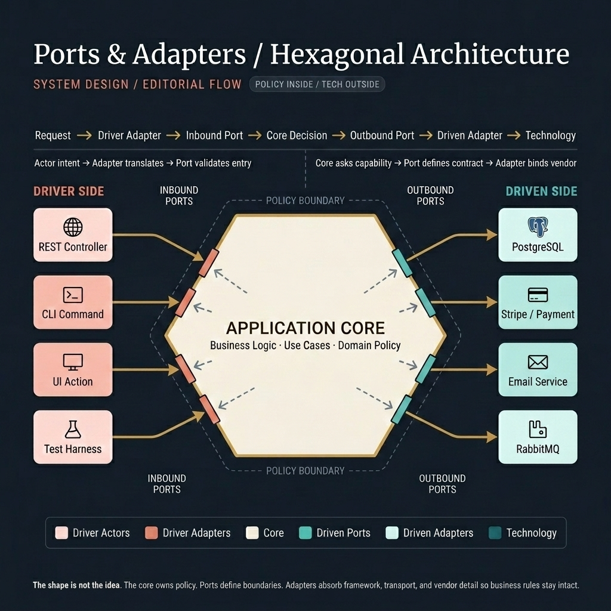

<!-- tags: system-design, architecture, ports-and-adapters, hexagonal-architecture -->
# ⬡ Ports & Adapters / Hexagonal Architecture

> Ports & Adapters tách business logic ra khỏi framework, database, và vendor integration bằng cách khóa chặt boundary: driver side chỉ được gọi vào qua inbound ports, còn công nghệ ở phía ngoài chỉ được chạm vào core qua outbound ports.

📅 Ngày tạo: 2026-04-11 · 🔄 Cập nhật: 2026-04-11 · ⏱️ 18 phút đọc

| Aspect | Detail |
| --- | --- |
| **Complexity** | 🌟🌟🌟🌟 |
| **Use case** | Business systems có logic thật, cần test tốt, đổi công nghệ mà không kéo vỡ core |
| **Keywords** | Hexagonal Architecture, Ports & Adapters, inbound port, outbound port, driver, driven, testability |

---

## 1. DEFINE

Đây là tình huống rất quen: team muốn đổi database từ PostgreSQL sang MongoDB, hoặc thay payment gateway, hoặc thêm một CLI batch job chạy cùng use case với REST API. Nhưng chỉ cần thay một integration ở rìa hệ thống là business logic bắt đầu vỡ dây chuyền. Service đang nói chuyện bằng ngôn ngữ của SQL, controller đang quyết định rule nghiệp vụ, còn unit test phải boot nửa framework mới chạy nổi.

Ports & Adapters xuất hiện để cắt đúng chỗ đau đó.

Nó không phải một “style vẽ lục giác cho đẹp”. Nó là một cách tổ chức code sao cho **application core chỉ nói bằng ngôn ngữ nghiệp vụ**, còn mọi thứ bên ngoài như HTTP, ORM, queue, email, payment, database đều bị đẩy ra mép hệ thống. Core không biết vendor nào đang ở ngoài. Nó chỉ biết rằng có một capability nào đó cần được thực hiện thông qua một port.

Alistair Cockburn mô tả tinh thần này rất rõ: ứng dụng phải có thể được điều khiển bởi nhiều đầu vào khác nhau, đồng thời có thể phát triển và test độc lập với runtime device hay database. Nói ngắn gọn hơn cho team ngày nay: **logic nghiệp vụ phải sống lâu hơn công nghệ đang bọc quanh nó**.

### 1.1 Core Pieces

| Thành phần | Vai trò thật sự | Không nên làm gì |
| --- | --- | --- |
| **Application Core / Hexagon** | Giữ use case, policy, orchestration, business decision | Import framework, ORM, HTTP type, SDK vendor |
| **Inbound Ports** | Định nghĩa cách bên ngoài được phép gọi vào use case | Mang theo semantics của transport như `Request`, `Response`, `Context` đặc thù framework |
| **Outbound Ports** | Định nghĩa capability core cần ở bên ngoài | Lộ ra tên vendor hoặc cấu trúc SQL cụ thể |
| **Driver Adapters** | Chuyển input từ REST, CLI, UI, test vào ngôn ngữ use case | Nhét business rule vào controller hoặc resolver |
| **Driven Adapters** | Cắm core vào database, broker, email, payment thật | Kéo dependency ngược vào trong core |

### 1.2 Driver và Driven khác nhau ở đâu?

Phần dễ lẫn nhất của Ports & Adapters là tưởng mọi adapter đều giống nhau. Không phải.

| Side | Câu hỏi đúng | Ví dụ |
| --- | --- | --- |
| **Driver side** | Ai đang khởi tạo use case? | REST controller, GraphQL resolver, CLI command, test harness |
| **Driven side** | Core đang cần ai thực hiện capability ở ngoài? | Repository, payment gateway, notifier, message publisher |

Driver side là bên **đẩy hệ thống chạy**. Driven side là bên **bị core gọi đến**.

Vì vậy, nếu team đang hỏi “phần nào được quyền quyết định business flow?”, câu trả lời phải luôn là: **core**. Driver chỉ đẩy request vào. Driven chỉ thực hiện capability core yêu cầu.

### 1.3 Vì sao pattern này đáng giá?

Nó giải quyết bốn loại pressure rất thực dụng:

- **Testability**: use case có thể test bằng fake adapter thay vì boot DB thật hay mock framework sâu bên ngoài.
- **Technology independence**: đổi vendor, đổi transport, đổi persistence mà không rewrite rule nghiệp vụ.
- **Multi-interface support**: cùng một use case có thể được gọi từ REST, batch job, admin UI, hoặc test adapter.
- **Maintainability**: team nhìn codebase theo boundary và dependency direction, không nhìn theo “đống service gọi nhau”.

Điểm quan trọng là bài toán này chỉ đáng giá khi system có logic thật. Nếu ứng dụng của bạn gần như CRUD thẳng từ controller xuống ORM, Ports & Adapters có thể biến thành ceremony đắt đỏ.

### 1.4 Khi nào nên và không nên dùng

| Nên dùng khi | Không nên dùng khi |
| --- | --- |
| Business rule có tuổi thọ dài hơn tech stack | Prototype hoặc MVP cần ship cực nhanh |
| Cần test use case độc lập với infra | CRUD app nhỏ, logic mỏng |
| Có nhiều interface vào cùng một core | Team chưa đủ kỷ luật boundary và naming |
| Có khả năng đổi DB, queue, payment, notification | Chưa có pressure thật, chỉ “kiến trúc cho oai” |

Định nghĩa đã rõ trên giấy. Phần còn dễ hiểu sai nhất nằm ở chỗ driver, core, port và adapter thực sự đứng ở đâu trong luồng điều khiển.

---

## 2. VISUAL

Ảnh dưới đây không cố bắt bạn nhớ hình lục giác. Nó cho bạn nhìn một request chạy qua boundary theo đúng thứ tự: **driver adapter dịch intent vào core, core ra quyết định, rồi outbound port mới chạm tới công nghệ ở rìa**.



### Level 1

```text
Driver side                 Application Core                  Driven side
-----------                 ----------------                  -----------
REST Controller  ----->     Inbound Port      ----->          Outbound Port
CLI Command       ----->     Use Case / Policy ----->          Repository Adapter
UI Action         ----->     Business Rule     ----->          Payment Adapter
Test Harness      ----->     Decision Point    ----->          Email / Queue Adapter

Rule:
  Driver side starts the flow
  Core owns the decisions
  Driven side fulfills capabilities
```

*Hình: Flow explainer này làm rõ từng handoff qua boundary. Giá trị của Hexagonal Architecture nằm ở chỗ adapter chỉ dịch và nối, còn policy thật nằm trong core.*

### Level 2

```text
Nếu bạn muốn...                                 Thì thay đổi nên nằm ở...
---------------------------------------------   -----------------------------------------
Thêm GraphQL ngoài REST                         Driver adapter mới
Thêm CLI batch chạy cùng use case              Driver adapter mới
Đổi Postgres sang MongoDB                       Driven adapter mới
Đổi Stripe sang Adyen                           Driven adapter mới
Đổi validation rule, discount rule              Application core
Test SubmitOrder không cần DB thật              Fake driven adapters ở unit test
```

*Hình: Bài test tốt nhất của boundary là xem thay đổi nào dừng ở adapter, thay đổi nào phải chạm core. Nếu một đổi vendor kéo luôn business rule đi theo, boundary của bạn đang giả.*

Flow đã hiện ra. Giờ ta hạ nó xuống artifact mà team có thể review, debug hoặc áp dụng ngay.

---

## 3. CODE

Ví dụ dưới đây dùng một order flow đơn giản, không phải để demo framework, mà để lộ rõ ba thứ quan trọng nhất của Ports & Adapters:

1. core chỉ biết contract  
2. adapters chỉ làm translation  
3. test có thể chạy mà không cần công nghệ thật

### Problem 1: Basic — Core định nghĩa ports, không nói chuyện với vendor

> **Mục tiêu**: Cho `SubmitOrder` chạy mà không biết gì về HTTP, SQL, Stripe, hay email provider.  
> **Approach**: Đặt use case ở core và buộc mọi dependency đi qua outbound ports.  
> **Ví dụ**: Submit order, charge payment, save order, send confirmation.  
> **Độ phức tạp**: Basic

```ts
type SubmitOrderCommand = {
  customerId: string;
  items: Array<{ sku: string; qty: number; price: number }>;
  paymentToken: string;
};

type Order = {
  id: string;
  customerId: string;
  total: number;
  status: "pending" | "paid" | "rejected";
};

export interface OrderRepositoryPort {
  save(order: Order): Promise<void>;
}

export interface PaymentProcessorPort {
  charge(input: { orderId: string; amount: number; token: string }): Promise<void>;
}

export interface NotificationPort {
  sendOrderConfirmation(input: { customerId: string; orderId: string }): Promise<void>;
}

export class SubmitOrderUseCase {
  constructor(
    private readonly orderRepo: OrderRepositoryPort,
    private readonly payment: PaymentProcessorPort,
    private readonly notification: NotificationPort
  ) {}

  async execute(command: SubmitOrderCommand): Promise<Order> {
    if (command.items.length === 0) {
      throw new Error("order must contain at least one item");
    }

    const total = command.items.reduce((sum, item) => sum + item.qty * item.price, 0);
    if (total <= 0) {
      throw new Error("order total must be positive");
    }

    const order: Order = {
      id: crypto.randomUUID(),
      customerId: command.customerId,
      total,
      status: "pending",
    };

    await this.payment.charge({
      orderId: order.id,
      amount: order.total,
      token: command.paymentToken,
    });

    order.status = "paid";
    await this.orderRepo.save(order);
    await this.notification.sendOrderConfirmation({
      customerId: order.customerId,
      orderId: order.id,
    });

    return order;
  }
}
```

Ở đây, core không biết:

- dữ liệu được lưu bằng PostgreSQL, MongoDB, hay event store
- `charge()` gọi Stripe, Adyen, hay mock provider
- confirmation được gửi qua email, queue, hay push notification

Nó chỉ biết ba capability: **save order**, **charge payment**, **send confirmation**.

### Problem 2: Intermediate — Driver adapter và driven adapter chỉ làm translation

> **Mục tiêu**: Cho HTTP gọi được use case và cho core lưu dữ liệu vào Postgres mà không kéo framework hoặc SQL vào core.  
> **Approach**: Driver adapter chuyển request thành command; driven adapter implement port bằng công nghệ thật.  
> **Ví dụ**: Express/Nest-style controller và Postgres repository.  
> **Độ phức tạp**: Intermediate

```ts
// Driver adapter
export class SubmitOrderController {
  constructor(private readonly submitOrder: SubmitOrderUseCase) {}

  async handle(req: any, res: any) {
    const command: SubmitOrderCommand = {
      customerId: req.auth.userId,
      items: req.body.items,
      paymentToken: req.body.paymentToken,
    };

    const order = await this.submitOrder.execute(command);
    res.status(201).json({
      id: order.id,
      total: order.total,
      status: order.status,
    });
  }
}

// Driven adapter
export class PostgresOrderRepository implements OrderRepositoryPort {
  constructor(private readonly db: { query: (sql: string, params: unknown[]) => Promise<void> }) {}

  async save(order: Order): Promise<void> {
    await this.db.query(
      `
      insert into orders (id, customer_id, total, status)
      values ($1, $2, $3, $4)
      `,
      [order.id, order.customerId, order.total, order.status]
    );
  }
}
```

### Tại sao?

Đây là chỗ nhiều codebase “trông giống hexagonal” nhưng thực tế chưa phải:

- controller bắt đầu validate rule nghiệp vụ sâu hơn transport concern
- repository bắt đầu tính business value hoặc mutate domain state
- use case bắt đầu import `Request`, `Response`, ORM decorator, hoặc SQL schema assumptions

Nếu điều đó xảy ra, adapter không còn là adapter nữa. Nó đã chiếm một phần core.

Basic case đã chạy được. Production bắt đầu khó từ đúng chỗ ví dụ vừa bỏ qua: làm sao test use case nhanh, deterministic, và không phụ thuộc infra thật.

### Problem 3: Advanced — Unit test bằng fake adapters thay vì mock framework

> **Mục tiêu**: Test rule nghiệp vụ mà không cần DB thật, HTTP server thật, hay payment sandbox.  
> **Approach**: Dùng fake implementations cho outbound ports.  
> **Ví dụ**: Unit test `SubmitOrderUseCase`.  
> **Độ phức tạp**: Advanced

```ts
class InMemoryOrderRepository implements OrderRepositoryPort {
  public saved: Order[] = [];

  async save(order: Order): Promise<void> {
    this.saved.push(order);
  }
}

class FakePaymentProcessor implements PaymentProcessorPort {
  public charges: Array<{ orderId: string; amount: number; token: string }> = [];

  async charge(input: { orderId: string; amount: number; token: string }): Promise<void> {
    this.charges.push(input);
  }
}

class FakeNotificationSender implements NotificationPort {
  public sent: Array<{ customerId: string; orderId: string }> = [];

  async sendOrderConfirmation(input: { customerId: string; orderId: string }): Promise<void> {
    this.sent.push(input);
  }
}

it("marks a valid order as paid and persists it", async () => {
  const repo = new InMemoryOrderRepository();
  const payment = new FakePaymentProcessor();
  const notification = new FakeNotificationSender();

  const useCase = new SubmitOrderUseCase(repo, payment, notification);

  const result = await useCase.execute({
    customerId: "cus_01",
    paymentToken: "tok_test",
    items: [{ sku: "book", qty: 2, price: 25 }],
  });

  expect(result.status).toBe("paid");
  expect(repo.saved).toHaveLength(1);
  expect(payment.charges[0].amount).toBe(50);
  expect(notification.sent[0].customerId).toBe("cus_01");
});
```

### Tại sao?

Đây là payoff thật sự của Ports & Adapters.

Bạn không phải mock nửa framework để test rule nghiệp vụ. Bạn chỉ cần fake đúng capability ở boundary. Điều đó làm cho test:

- nhanh hơn
- ít brittle hơn
- nói đúng ngôn ngữ của use case hơn

Và quan trọng hơn: khi test khó viết, đó thường là tín hiệu boundary đang hỏng. Ports & Adapters tốt không chỉ làm production code sạch hơn; nó làm test xấu xí khó có đất sống hơn.

Biết cách làm đúng mới chỉ là một nửa câu chuyện; phần còn lại là những chỗ rất dễ làm gần đúng rồi vẫn hỏng.

---

## 4. PITFALLS

| # | Severity | Lỗi | Hậu quả | Fix |
| --- | --- | --- | --- | --- |
| 1 | 🔴 Fatal | Đặt port quá generic như `ServicePort`, `RepositoryPort` | Contract mơ hồ, khó biết boundary đang bảo vệ cái gì | Đặt tên theo capability thật: `OrderRepositoryPort`, `PaymentProcessorPort`, `NotificationPort` |
| 2 | 🔴 Fatal | Nhét business rule vào controller, resolver, repository adapter | Core bị rỗng, behavior rải khắp rìa hệ thống | Giữ mọi decision nghiệp vụ ở use case hoặc domain policy |
| 3 | 🔴 Fatal | Để core import framework/ORM/vendor SDK | Dependency direction gãy, đổi công nghệ kéo theo core | Chặn mọi dependency công nghệ ở adapter layer |
| 4 | 🟡 Common | Tạo interface cho mọi thứ dù không có pressure đổi thay | Code ceremony nhiều hơn giá trị | Chỉ tạo port ở boundary có business pressure, test pressure, hoặc tech swap pressure |
| 5 | 🟡 Common | Nghĩ rằng “hexagonal” = phải vẽ lục giác và chia package rất đẹp | Team tập trung vào hình thức hơn luồng control | Đánh giá bằng một câu hỏi: dependency có đang hướng vào core không? |
| 6 | 🟡 Common | Dùng adapter như nơi mapping lẫn orchestration phức tạp | Boundary mờ dần, test khó trở lại | Adapter chỉ nên translate transport/protocol/data shape |
| 7 | 🔵 Minor | Dùng Ports & Adapters cho CRUD quá mỏng | Over-engineering, tốc độ team chậm đi | Với CRUD đơn giản, layered architecture gọn có thể đủ |

Khi đã thấy pattern này thường gãy ở đâu, bước kế là mở đúng concept lân cận để tránh sửa sai lớp vấn đề.

---

## 5. REF

| Resource | Loại | Link | Ghi chú |
| --- | --- | --- | --- |
| Top Software Architectural Styles | Internal | ./07-software-architecture-styles.md | So sánh Hexagonal với các style kiến trúc khác |
| 12 Architectural Concepts Developers Should Know | Internal | ./08-architectural-concepts.md | Bản đồ nền cho architectural decision ở mức hệ thống |
| System Design Blueprint | Internal | ./18-system-design-blueprint.md | Whiteboard flow khi cần route lại bài toán kiến trúc |
| Domain-Driven Design & Clean Architecture | Internal | ./19-ddd-clean-architecture.md | Đọc tiếp khi muốn nối Ports & Adapters với dependency rule và domain modeling |

---

## 6. RECOMMEND

Nếu bài này giúp bạn khóa được boundary giữa core và công nghệ, bước kế tiếp không phải là “vẽ thêm hexagon”. Bước kế tiếp là mở đúng concept lân cận để giải bài toán kiến trúc ở layer kế tiếp.

| Mở rộng | Khi nào | Lý do | File/Link |
| --- | --- | --- | --- |
| Architectural styles comparison | Khi team còn chưa rõ vì sao chọn Hexagonal thay vì layered, microservices, hay plugin model | Giúp đặt Ports & Adapters vào đúng bản đồ architectural styles | [Top Software Architectural Styles](./07-software-architecture-styles.md) |
| Clean Architecture & DDD | Khi boundary của bạn bắt đầu chạm vào entity, aggregate, use case, dependency rule | Nối Ports & Adapters với mô hình layer và domain sâu hơn | [Domain-Driven Design & Clean Architecture](./19-ddd-clean-architecture.md) |
| API edge design | Khi driver side của bạn là HTTP edge, auth, routing, throttling | Giúp tách “adapter ở edge” khỏi “core business decision” | [API Gateway 101](./17-api-gateway-101.md) |
| System design framing | Khi bạn cần route pressure trước khi quyết định architecture style | Tránh biến design review thành danh sách buzzword | [System Design Blueprint](./18-system-design-blueprint.md) |
