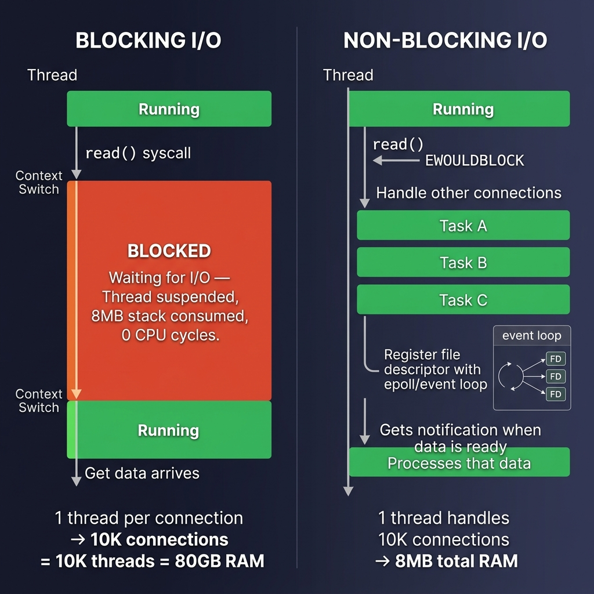
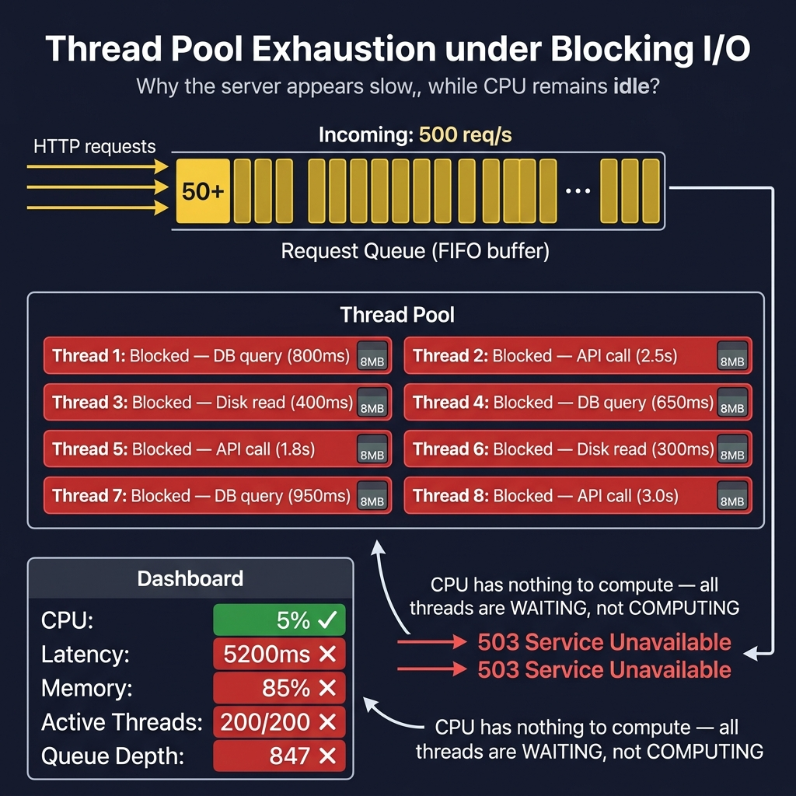
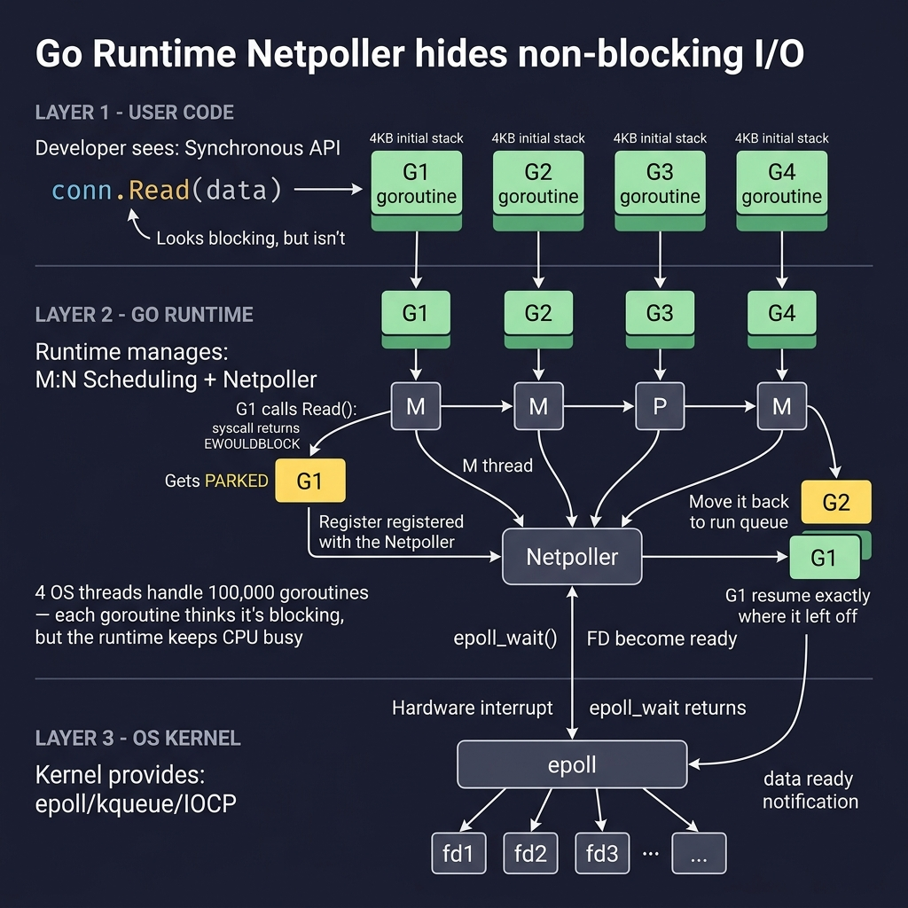

<!-- tags: system-design, io, blocking, non-blocking, concurrency, threads -->

# ⚡ Blocking vs Non-Blocking I/O — What Your Thread Actually Does While Waiting

📅 Created: 2026-04-23 · 🔄 Updated: 2026-04-23 · ⏱️ 14 min read

> Your server latency spikes to 5 seconds. CPU sits at 5%. Every thread is "busy" doing nothing.
> This article dissects the I/O bottleneck that separates systems handling 1K requests from those handling 100K.

| Aspect         | Detail                                          |
| -------------- | ----------------------------------------------- |
| **Domain**     | Backend Internals / Operating Systems           |
| **Use case**   | High-concurrency server design, I/O optimization |
| **Go stdlib**  | `net`, `net/http`, `context`, `runtime`         |

---

## 1. DEFINE

*(Prerequisite: [Goroutines & Channels](../go/concurrency/01-goroutines-and-channels.md) · [Context](../go/concurrency/03-context.md))*

You are on-call at 2 AM. The production dashboard screams red: p99 latency has climbed from 200ms to 5.2 seconds in the last ten minutes. Users report blank pages, timeouts, and spinning loaders.

Your instinct says "the server is overloaded." You open the CPU graph. It reads **5%**. Memory? **87% consumed**. Active threads? **200 out of 200** — every slot occupied.

The paradox stares back at you: the machine has abundant compute power, yet it cannot serve a single new request. The CPU is idle because no thread is *computing*. Every thread is *waiting* — blocked on a database query, an external API call, or a disk read.

This is the classic I/O bottleneck. The problem is not how fast your code runs. The problem is what your thread does — and wastes — while it waits for data that lives outside the CPU.

### 1.1 Formal Definition

**Blocking I/O** is a model where the calling thread surrenders control to the OS kernel and enters a suspended state until the I/O operation completes. The thread consumes zero CPU cycles during the wait, but its entire stack memory (typically 1–8 MB per thread) remains allocated and unusable by other work.

**Non-Blocking I/O** is a model where the I/O call returns immediately — either with data or with a status code (`EAGAIN` / `EWOULDBLOCK`) indicating the operation is not yet complete. The thread remains runnable and can perform other tasks while the kernel processes the I/O request in the background.

### 1.2 The Real Cost: Not Time, But Resources

The distinction matters not because blocking is "slow" — the I/O operation takes the same wall-clock time regardless. It matters because of what you pay while waiting:

| Resource          | Blocking I/O (per connection)         | Non-Blocking I/O (per connection)    |
| ----------------- | ------------------------------------- | ------------------------------------ |
| **Thread**        | 1 dedicated thread, fully occupied    | Shared — 1 thread serves thousands   |
| **Stack memory**  | 1–8 MB pinned in RAM                 | ~4 KB (goroutine) or zero (event)    |
| **Context switch**| OS-level, ~1–10 μs each              | User-space, ~200 ns (goroutine)      |
| **Max connections**| Limited by thread count (~10K)       | Limited by file descriptors (~1M)    |

### 1.3 Kernel Mechanics: What Happens at the Syscall Boundary

When your Go program calls `conn.Read(buf)`, the runtime eventually executes a `read()` system call. At this boundary, two fundamentally different paths diverge:

**Blocking path:** The kernel checks the socket buffer. If no data is available, it moves the thread from the *run queue* to a *wait queue* associated with that socket's file descriptor. The scheduler stops scheduling this thread entirely. When data arrives (via hardware interrupt from the NIC), the kernel moves the thread back to the run queue. The thread resumes as if nothing happened — but milliseconds or seconds have passed.

**Non-blocking path:** The kernel checks the socket buffer. If no data is available, it immediately returns `-1` with `errno = EAGAIN`. The calling code can then register interest in this file descriptor with an event notification mechanism (`epoll` on Linux, `kqueue` on BSD, `IOCP` on Windows) and move on to handle other connections. When data arrives, the event system notifies the application, which then retries the read — this time successfully.

### 1.4 Invariants & Failure Modes

Three invariants govern I/O model selection:

1. **Thread count × stack size = memory ceiling.** At 8 MB per thread, 1,000 threads consume 8 GB. At 10,000 threads, the process hits the OS limit before the CPU reaches 10% utilization.

2. **Throughput ≠ latency.** Non-blocking I/O does not make individual requests faster. It makes the *system* handle more concurrent requests by recycling threads instead of parking them.

3. **Blocking is not inherently wrong.** CPU-bound tasks (compression, encryption, hashing) benefit from blocking because the thread is actively computing, not waiting. The pathology arises only when threads block on *external* resources.

---

The theory is clear on paper. The part most likely to be misunderstood is how this plays out in real time — which thread runs, which thread parks, and where the memory goes.

## 2. VISUAL

### Level 1: Thread Timeline — Blocking vs Non-Blocking

The fundamental question: *what does a single thread do during an I/O wait?*



*Figure: Left — a blocking thread surrenders to the kernel and idles with 8 MB pinned. Right — a non-blocking thread returns immediately, handles three other tasks, and picks up the I/O result when the event loop signals readiness. Same wall-clock wait, radically different resource utilization.*

The left timeline reveals the core waste: the thread exists, consumes memory, and occupies a pool slot — but produces zero useful work. Multiply by a thousand connections. 8 GB of RAM holds nothing but sleeping threads.

---

### Level 2: Thread Pool Exhaustion — The CPU-Idle Paradox

The vivid scenario from the opening maps directly to this architecture diagram. Here is exactly how a healthy-looking CPU coexists with a dying server:



*Figure: All 8 threads blocked on downstream I/O. Request queue grows to 847. CPU at 5% because threads are waiting, not computing. New requests receive 503 errors despite abundant compute capacity.*

The dashboard contradiction — CPU green, everything else red — is the signature of I/O-bound thread exhaustion. If you see this pattern, the fix is never "add more CPU." Either add more threads (trading memory for concurrency) or stop blocking threads on I/O (solving the problem structurally).

---

### Level 3: Go's Netpoller — The Best of Both Worlds

Go solves this with an elegant abstraction: the developer writes synchronous-looking code, but the runtime manages non-blocking I/O under the hood through the **netpoller**.



*Figure: Three-layer architecture. User code calls `conn.Read()` as if it blocks. The Go runtime parks the goroutine (4 KB), frees the OS thread to run another goroutine, and registers the FD with epoll. When data arrives, the netpoller wakes the goroutine and resumes execution exactly where it left off. Four OS threads handle 100,000 goroutines.*

This is why Go achieves C10K+ concurrency with straightforward sequential code. The programmer never touches `epoll`, callbacks, or state machines. The runtime does it all.

---

The flow is now visible. The next step is to translate these mechanics into code that you can run, profile, and deploy.

## 3. CODE

### Example 1: Basic — A Blocking TCP Echo Server

Every Go network program starts here. The standard library's `net.Listen` + `Accept` loop is the simplest possible server — and it reveals exactly where blocking I/O becomes a bottleneck when you forget to add concurrency.

> **Goal**: Build a TCP echo server that accepts connections and echoes data back.
> **Input**: Client sends `"hello\n"` → Server echoes `"hello\n"`.
> **Constraint**: Single-threaded — one connection at a time.

```go
package main

import (
	"bufio"
	"fmt"
	"log"
	"net"
)

func main() {
	ln, err := net.Listen("tcp", ":8080")
	if err != nil {
		log.Fatal(err)
	}
	defer ln.Close()
	fmt.Println("listening on :8080")

	for {
		// ⚠️ Accept() blocks the ONLY goroutine until a client connects.
		// No other connection can be accepted while this waits.
		conn, err := ln.Accept()
		if err != nil {
			log.Println("accept error:", err)
			continue
		}

		// ⚠️ handleConn runs synchronously — if the client sends data slowly,
		// the entire server stalls. No new connections accepted until this returns.
		handleConn(conn)
	}
}

func handleConn(conn net.Conn) {
	defer conn.Close()
	scanner := bufio.NewScanner(conn)

	for scanner.Scan() {
		line := scanner.Text()
		// ✅ Echo the line back to the client
		fmt.Fprintf(conn, "%s\n", line)
	}
}
```

> **Conclusion**: This server works for one client. The moment a second client connects while the first is still active, the second client waits in the kernel's TCP backlog. The `Accept()` call never fires because `handleConn()` has not returned. This is not a bug — it is the natural consequence of blocking I/O without concurrency. The fix seems obvious: spawn a goroutine. But that fix introduces its own failure mode.

---

### Example 2: Intermediate — Goroutine-Per-Connection (The Go Way)

The single-threaded bottleneck from Example 1 disappears with one keyword: `go`. But this pattern has a ceiling that most developers hit only in production.

> **Goal**: Handle unlimited concurrent connections using goroutines.
> **Approach**: Spawn one goroutine per accepted connection.
> **Trade-off**: Memory scales linearly with connection count.

```go
package main

import (
	"bufio"
	"context"
	"fmt"
	"log"
	"net"
	"os/signal"
	"sync/atomic"
	"time"
)

var activeConns atomic.Int64

func main() {
	ctx, stop := signal.NotifyContext(context.Background(), os.Interrupt)
	defer stop()

	ln, err := net.Listen("tcp", ":8080")
	if err != nil {
		log.Fatal(err)
	}
	defer ln.Close()

	// ✅ Print active connection count every 5 seconds for observability
	go func() {
		ticker := time.NewTicker(5 * time.Second)
		defer ticker.Stop()
		for {
			select {
			case <-ticker.C:
				fmt.Printf("[monitor] active connections: %d\n", activeConns.Load())
			case <-ctx.Done():
				return
			}
		}
	}()

	fmt.Println("listening on :8080")
	for {
		conn, err := ln.Accept()
		if err != nil {
			select {
			case <-ctx.Done():
				return
			default:
				log.Println("accept error:", err)
				continue
			}
		}

		// ✅ Each connection gets its own goroutine — Accept() returns immediately.
		// ⚠️ No limit on goroutine count. 100K connections = 100K goroutines.
		// At ~4 KB initial stack each, 100K goroutines ≈ 400 MB.
		// At 1M connections, that's 4 GB just for stacks — before any buffers.
		go handleConn(conn)
	}
}

func handleConn(conn net.Conn) {
	activeConns.Add(1)
	defer func() {
		activeConns.Add(-1)
		conn.Close()
	}()

	// ⚠️ No read deadline. A slow or malicious client can hold this goroutine
	// open indefinitely — the Slowloris attack exploits exactly this gap.
	scanner := bufio.NewScanner(conn)
	for scanner.Scan() {
		line := scanner.Text()
		fmt.Fprintf(conn, "echo: %s\n", line)
	}
}
```

> **Why does goroutine-per-connection work where thread-per-connection fails?**
>
> Three structural differences make Go's model viable at scale:
>
> 1. **Stack size**: A goroutine starts with ~4 KB of stack (vs. 1–8 MB for an OS thread). The runtime grows the stack on demand, so idle goroutines consume almost nothing.
> 2. **Scheduling cost**: Goroutine switches happen in user space (~200 ns) without involving the OS scheduler. Thread context switches require a kernel trap (~1–10 μs) plus TLB flushes.
> 3. **The netpoller**: When a goroutine calls `conn.Read()` and the socket has no data, the Go runtime *parks* the goroutine and registers the FD with `epoll`. The OS thread is freed immediately to run another goroutine. No thread is wasted on waiting.
>
> The ceiling is not goroutine count — it is missing timeouts and unbounded memory growth from buffers.

> **Conclusion**: Goroutine-per-connection solves the concurrency problem from Example 1. But production systems face slow clients, upstream timeouts, and connection storms. Without explicit resource limits, this server will accept connections until the process runs out of memory. The next example addresses every gap.

---

### Example 3: Advanced — Production-Grade Server with Bounded Concurrency

Real production servers need three defenses that Example 2 lacks: connection limits, read/write deadlines, and graceful shutdown. This example builds a server that survives connection storms, Slowloris attacks, and coordinated shutdown.

> **Goal**: TCP echo server with bounded concurrency, per-connection timeouts, and graceful shutdown.
> **Approach**: Semaphore-based connection limit + context propagation + deadline management.
> **Constraint**: Max 10,000 concurrent connections, 30s idle timeout, clean drain on SIGINT.

```go
package main

import (
	"bufio"
	"context"
	"errors"
	"fmt"
	"log"
	"net"
	"os"
	"os/signal"
	"sync"
	"sync/atomic"
	"time"
)

const (
	maxConns    = 10_000
	idleTimeout = 30 * time.Second
	readTimeout = 10 * time.Second
)

type Server struct {
	listener net.Listener
	sem      chan struct{} // ✅ Buffered channel as semaphore — bounds concurrency
	wg       sync.WaitGroup
	active   atomic.Int64
	ctx      context.Context
	cancel   context.CancelFunc
}

func NewServer(addr string) (*Server, error) {
	ln, err := net.Listen("tcp", addr)
	if err != nil {
		return nil, fmt.Errorf("listen %s: %w", addr, err)
	}
	ctx, cancel := context.WithCancel(context.Background())
	return &Server{
		listener: ln,
		sem:      make(chan struct{}, maxConns),
		ctx:      ctx,
		cancel:   cancel,
	}, nil
}

func (s *Server) Serve() error {
	for {
		conn, err := s.listener.Accept()
		if err != nil {
			// ✅ Distinguish shutdown from real errors
			if s.ctx.Err() != nil {
				return nil // clean shutdown
			}
			if errors.Is(err, net.ErrClosed) {
				return nil
			}
			log.Printf("accept error: %v", err)
			continue
		}

		// ✅ Acquire semaphore slot before spawning goroutine.
		// If pool is full, Accept() still runs but we block here —
		// TCP backlog absorbs the pressure instead of unbounded goroutines.
		select {
		case s.sem <- struct{}{}:
			// slot acquired
		case <-s.ctx.Done():
			conn.Close()
			return nil
		}

		s.wg.Add(1)
		go func() {
			defer func() {
				<-s.sem // ✅ Release semaphore slot
				s.wg.Done()
			}()
			s.handleConn(conn)
		}()
	}
}

func (s *Server) handleConn(conn net.Conn) {
	s.active.Add(1)
	defer func() {
		s.active.Add(-1)
		conn.Close()
	}()

	scanner := bufio.NewScanner(conn)

	for {
		// ✅ Set deadline BEFORE each read — resets the idle timer per message.
		// A client that connects but sends nothing gets disconnected after idleTimeout.
		// This is the Slowloris defense.
		conn.SetReadDeadline(time.Now().Add(idleTimeout))

		if !scanner.Scan() {
			if err := scanner.Err(); err != nil {
				// ⚠️ Deadline exceeded is NOT an error — it's expected behavior
				// for idle connections. Log only unexpected failures.
				if !errors.Is(err, os.ErrDeadlineExceeded) {
					log.Printf("read error: %v", err)
				}
			}
			return
		}

		line := scanner.Text()

		// ✅ Set write deadline to prevent blocking on slow consumers.
		conn.SetWriteDeadline(time.Now().Add(readTimeout))
		if _, err := fmt.Fprintf(conn, "echo: %s\n", line); err != nil {
			log.Printf("write error: %v", err)
			return
		}
	}
}

// Shutdown drains active connections gracefully.
func (s *Server) Shutdown() {
	s.cancel()
	s.listener.Close()
	s.wg.Wait() // ✅ Wait for all in-flight connections to finish
	log.Printf("server shut down cleanly, %d connections drained", s.active.Load())
}

func main() {
	srv, err := NewServer(":8080")
	if err != nil {
		log.Fatal(err)
	}

	// ✅ Trap SIGINT for graceful shutdown
	sigCh := make(chan os.Signal, 1)
	signal.Notify(sigCh, os.Interrupt)

	go func() {
		<-sigCh
		log.Println("shutting down...")
		srv.Shutdown()
	}()

	log.Println("listening on :8080")
	if err := srv.Serve(); err != nil {
		log.Fatal(err)
	}
}
```

> **Why does this server survive where Example 2 fails?**
>
> Four mechanisms work in concert:
>
> 1. **Semaphore (buffered channel)**: `maxConns` caps goroutine count. When all slots are taken, the `select` blocks — TCP backlog absorbs new connections at the kernel level instead of spawning unbounded goroutines.
>
> 2. **Idle timeout via `SetReadDeadline`**: Each read resets a 30-second timer. A client that connects but sends nothing — the Slowloris pattern — gets disconnected automatically. The goroutine is freed without manual intervention.
>
> 3. **Write deadline via `SetWriteDeadline`**: If a client reads slowly (small TCP receive window), the write blocks. Without a deadline, the goroutine holds the semaphore slot indefinitely. The 10-second write deadline ensures slow consumers cannot starve the pool.
>
> 4. **Graceful shutdown via context + WaitGroup**: `Shutdown()` cancels the context (stopping `Accept()`), closes the listener, and waits for all in-flight handlers to complete. No connection is dropped mid-response.
>
> Under the hood, every `SetReadDeadline` and `SetWriteDeadline` call interacts with Go's netpoller. The runtime does not create a per-connection timer thread. Instead, it registers deadline events in a runtime-managed timer heap that integrates with `epoll_wait`'s timeout parameter. Zero OS threads are wasted on deadline management.

> **Conclusion**: This server handles 10,000 concurrent connections with predictable memory (~40 MB for goroutine stacks), survives idle and slow clients, and shuts down without dropping in-flight requests. The pattern — semaphore + deadline + graceful drain — is the foundation of production Go servers like `net/http.Server`, gRPC, and Fiber.

---

The code examples escalated from "works for one client" to "survives production." But every pattern has traps — and the most dangerous ones look like correct code until load testing reveals otherwise.

## 4. PITFALLS

| # | Severity | Pitfall | Consequence | Fix |
|---|----------|---------|-------------|-----|
| 1 | 🔴 Fatal | **Goroutine leak from missing deadline** — `conn.Read()` without `SetReadDeadline` blocks the goroutine forever if the client disconnects uncleanly (no FIN, no RST). | Goroutine count grows monotonically. Memory exhaustion crashes the process after hours or days. Silent — no error logged. | Always set `SetReadDeadline` before every read. Use `net/http.Server.ReadTimeout` and `WriteTimeout` for HTTP servers. Monitor `runtime.NumGoroutine()` as a health metric. |
| 2 | 🔴 Fatal | **Unbounded goroutine spawn** — `go handleConn(conn)` inside an `Accept()` loop without a semaphore or worker pool. | A SYN flood or legitimate traffic spike creates millions of goroutines. Each allocates stack + buffers. OOM kill within seconds. | Use a buffered channel semaphore (Example 3) or `golang.org/x/sync/semaphore`. Set `GOMAXPROCS` and monitor goroutine count. |
| 3 | 🔴 Fatal | **Blocking inside the event loop** — calling a synchronous C library via CGo or performing CPU-heavy computation inside a network handler without offloading to a worker pool. | The OS thread running the goroutine is pinned. The Go scheduler cannot reuse it. If enough threads are pinned, the scheduler starves and all goroutines halt. | Offload blocking work to a dedicated goroutine pool. Use `runtime.LockOSThread()` only when necessary. Profile with `runtime/pprof` to detect thread contention. |
| 4 | 🟡 Common | **Ignoring write deadlines** — setting `ReadDeadline` but not `WriteDeadline`, assuming writes always complete instantly. | A client with a full TCP receive buffer causes `Write()` to block. The goroutine holds its semaphore slot, reducing effective concurrency. Under sustained slow-client pressure, the server becomes unresponsive. | Set `SetWriteDeadline` before every write. For HTTP, configure `http.Server.WriteTimeout`. |
| 5 | 🟡 Common | **Confusion between non-blocking and asynchronous** — assuming non-blocking I/O means "fire and forget" or that results arrive via callbacks automatically. | Leads to polling loops that burn CPU (`for { read(); }` without `epoll`), or dropped data because the developer assumes a callback will arrive without registering interest with the event system. | Non-blocking means "return immediately with status." Asynchronous means "notify me when complete." In Go, the runtime combines both: non-blocking FDs + epoll notifications. The developer writes synchronous code; the runtime handles the rest. |

---

The traps point to the same root cause: treating I/O resources as infinite when they are bounded by memory, threads, and file descriptors. Understanding the boundary prepares you for the next evolution in I/O architecture.

## 5. REF

| Source | Topic | Link |
|--------|-------|------|
| Go Blog | "Go's Declaration Syntax" + Netpoller internals | [blog.golang.org](https://go.dev/blog/) |
| Morsmachine | "The Go netpoller" — deep dive into runtime FD management | [morsmachine.dk/netpoller](https://morsmachine.dk/netpoller) |
| Linux man pages | `epoll(7)`, `read(2)`, `socket(7)` — kernel I/O mechanics | [man7.org](https://man7.org/linux/man-pages/) |
| Goperf | "Go Runtime: Netpoller and Network I/O" | [goperf.dev](https://goperf.dev/) |
| Go `net` package docs | `Conn.SetReadDeadline`, `Conn.SetWriteDeadline` | [pkg.go.dev/net](https://pkg.go.dev/net) |
| Go `runtime` package docs | `NumGoroutine`, `GOMAXPROCS`, GMP scheduler | [pkg.go.dev/runtime](https://pkg.go.dev/runtime) |

## 6. RECOMMEND

| Direction | Why | Resource |
|-----------|-----|----------|
| **Worker Pool pattern** | Bounded concurrency for CPU-heavy tasks inside I/O handlers | [Worker Pool — Tunny](../go/concurrency/08-worker-pool-tunny.md) |
| **Context propagation** | Deadline and cancellation flow across goroutines and downstream calls | [Context](../go/concurrency/03-context.md) |
| **Semaphore pattern** | Fine-grained concurrency control beyond simple channel semaphores | [Semaphore](../go/concurrency/10-semaphore.md) |
| **Latency vs Throughput** | Understand the metrics that I/O model selection directly affects | [Latency vs Throughput](./14-latency-vs-throughput.md) |
| **Event-driven architecture** | The next abstraction layer — reactor pattern, io_uring, QUIC | Research: io_uring (Linux 5.1+), QUIC (HTTP/3) |
| **Kafka vs RabbitMQ** | Message queue architecture where I/O model choice determines throughput ceiling | [Kafka vs RabbitMQ](./09-kafka-vs-rabbitmq.md) |

---

**Links**: [← Ports & Adapters — Hexagonal Architecture](./20-ports-adapters-hexagonal-architecture.md)
