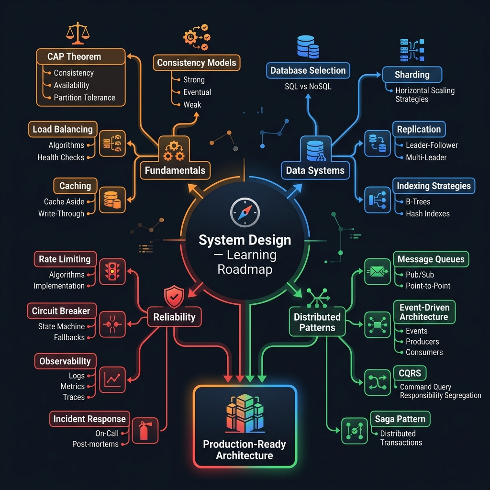

<!-- tags: system-design, overview -->
# System Design

> Hub điều hướng cho các bài system design trong repo: route theo áp lực hệ thống thật như identity, messaging, realtime, protocol, scalability và architectural trade-off, thay vì đọc từng buzzword như các mảnh rời.

| Aspect | Detail |
| --- | --- |
| **Concept** | Router cho các chủ đề protocol, architecture, messaging, performance và reliability |
| **Audience** | Backend engineer, reviewer, tech lead, người đang chuẩn bị interview hoặc design review |
| **Primary style** | Concept-First router |
| **Entry point** | Mở khi bạn biết vấn đề nằm ở tầng hệ thống nhưng chưa rõ nên bắt đầu từ protocol, identity, messaging, performance hay architectural concepts |

📅 Ngày tạo: 2026-03-22 · 🔄 Cập nhật: 2026-04-23 · ⏱️ 8 phút đọc

---

## 1. DEFINE

Hình dung một buổi system design review mà whiteboard nhanh chóng đầy lên bởi Kafka, CAP, CDN, SSO, API Gateway, rate limiting, load balancing, và ai cũng có vẻ đang nói điều đúng. Vấn đề là nếu không route các khái niệm này theo **loại áp lực hệ thống** mà chúng thực sự giải quyết, cuộc thảo luận sẽ biến thành cuộc thi kể tên công nghệ thay vì một bản thiết kế có logic.

Hub này không thay thế từng bài chi tiết. Nó tồn tại để giúp bạn mở đúng file theo câu hỏi trung tâm của phiên thiết kế: đang giải quyết identity, protocol, cache failure, realtime update, messaging, throughput hay architectural boundary?

### 1.1 Signals & Boundaries

- Nếu bài toán nằm ở **đăng nhập, danh tính, trust boundary**, bắt đầu từ `How Hackers Steal Passwords` hoặc `How Single Sign-On (SSO) Works`.
- Nếu bài toán nằm ở **protocol và transport**, bắt đầu từ `Network Protocols Explained`, `The Modern HTTP Ecosystem`, `TCP vs UDP Protocols`.
- Nếu bài toán nằm ở **cache, latency, throughput, observability trade-off**, mở `How Can Cache Systems Go Wrong?` và `Latency vs Throughput`.
- Nếu bài toán nằm ở **messaging, realtime, coordination**, mở `Apache Kafka vs. RabbitMQ`, `Real-time Web Updates`, `5 Leader Election Algorithms`.
- Nếu bài toán là **whiteboard fundamentals hoặc boundary giữa core và technology**, mở `Top 20 System Design Concepts`, `12 Architectural Concepts`, `System Design Blueprint`, hoặc `Ports & Adapters / Hexagonal Architecture`.

### Coverage Map

| Lane | Trả lời câu hỏi gì? | Representative files |
| --- | --- | --- |
| Identity & Security | Ai được vào hệ thống và trust boundary nằm ở đâu? | [02](./02-how-hackers-steal-passwords.md), [03](./03-how-sso-works.md) |
| Protocols & Transport | Request, connection và data di chuyển qua các lớp nào? | [05](./05-network-protocols-explained.md), [10](./10-http-ecosystem.md), [16](./16-tcp-udp-protocols.md) |
| Performance & Reliability | Hệ thống nhanh/chậm, gãy ở đâu, scale ra sao? | [04](./04-how-cache-systems-go-wrong.md), [14](./14-latency-vs-throughput.md), [15](./15-leader-election-algorithms.md), [21](./21-blocking-vs-non-blocking-io.md) |
| Messaging & Realtime | Event, queue và live update nên đi theo model nào? | [09](./09-kafka-vs-rabbitmq.md), [11](./11-realtime-web-updates.md), [17](./17-api-gateway-101.md) |
| Architectural Fundamentals | Các building blocks, boundary và blueprint nên ghép với nhau thế nào? | [07](./07-software-architecture-styles.md), [08](./08-architectural-concepts.md), [12](./12-top-20-system-design-concepts.md), [18](./18-system-design-blueprint.md), [20](./20-ports-adapters-hexagonal-architecture.md) |

---

## 2. VISUAL

Định nghĩa đã khóa được các lane lớn. Visual dưới đây giúp bạn route theo áp lực vận hành thật thay vì bắt đầu từ thuật ngữ nghe hấp dẫn nhất.



### Level 1

```text
Bạn đang thiết kế hay debug điều gì?
  Login / identity / trust boundary     -> 02, 03
  Protocol, transport, network path     -> 05, 10, 16
  Cache, latency, throughput, failover  -> 04, 14, 15
  I/O model, thread behavior, netpoller -> 21
  Queue, stream, realtime updates       -> 09, 11, 17
  Whiteboard fundamentals / blueprint   -> 07, 08, 12, 18
  Core logic vs technology boundary     -> 20
```

*Hình: Level 1 biến hub này thành router theo loại pressure đang ép lên hệ thống.*

### Level 2

```text
Symptom thật trong design review                    Mở file nào trước
------------------------------------------------   ------------------------------------------
User phải login lại nhiều app                      03-how-sso-works.md
Không rõ HTTPS, DNS, TCP liên hệ ra sao            05-network-protocols-explained.md
Flash sale làm cache phản chủ                      04-how-cache-systems-go-wrong.md
Team cãi Kafka hay RabbitMQ                        09-kafka-vs-rabbitmq.md
Dashboard cần cập nhật gần realtime                11-realtime-web-updates.md
P99 xấu nhưng throughput vẫn đẹp                   14-latency-vs-throughput.md
Không biết nên bắt đầu whiteboard từ đâu           18-system-design-blueprint.md
Muốn có mental model nền cho 20 concept cốt lõi    12-top-20-system-design-concepts.md
Business logic bị framework kéo đi cùng          20-ports-adapters-hexagonal-architecture.md
```

*Hình: Level 2 route theo symptom và câu hỏi thiết kế, không route theo thứ tự file.*

---

## 3. CODE

Sơ đồ đã phân lane. Artifact dưới đây biến hub thành một decision worksheet có thể dùng ngay trong review, interview prep hoặc postmortem learning.

### Problem 1: Basic — Route theo pressure trước khi chọn bài

> **Mục tiêu**: Không để cuộc nói chuyện system design trượt thành danh sách buzzword.
> **Approach**: Map symptom sang đúng lane kiến thức.
> **Ví dụ**: Identity issue, protocol confusion, realtime design, messaging choice, cache failure.
> **Độ phức tạp**: Basic

```yaml
system_design_router:
  ask_first:
    - "Pressure chính là identity, protocol, performance, messaging hay architecture?"
    - "Đội đang cần khái niệm nền hay đang debug một failure mode cụ thể?"
    - "Bài toán là chọn transport, chọn data flow, hay chọn system boundary?"
  choose:
    identity: ./03-how-sso-works.md
    protocol: ./05-network-protocols-explained.md
    cache_failure: ./04-how-cache-systems-go-wrong.md
    messaging: ./09-kafka-vs-rabbitmq.md
    realtime: ./11-realtime-web-updates.md
    fundamentals: ./12-top-20-system-design-concepts.md
    blueprint: ./18-system-design-blueprint.md
```

Pseudo-router này không sinh ra kiến trúc thay bạn. Nó chỉ ngăn bạn mở sai lane ngay từ đầu, vốn là lỗi làm nhiều phiên design review mất nhịp nhất.

### Problem 2: Intermediate — Tạo learning path có logic

> **Mục tiêu**: Đọc module này như một hệ thống khái niệm liên thông, không phải 19 bài rời.
> **Approach**: Gom bài theo pressure liên tiếp.
> **Ví dụ**: Một kỹ sư muốn dựng lại mental model system design để review tốt hơn.
> **Độ phức tạp**: Intermediate

```yaml
learning_path:
  identity_and_access:
    - ./02-how-hackers-steal-passwords.md
    - ./03-how-sso-works.md
  request_and_transport:
    - ./05-network-protocols-explained.md
    - ./10-http-ecosystem.md
    - ./16-tcp-udp-protocols.md
  scale_and_reliability:
    - ./04-how-cache-systems-go-wrong.md
    - ./14-latency-vs-throughput.md
    - ./15-leader-election-algorithms.md
  foundations:
    - ./12-top-20-system-design-concepts.md
    - ./18-system-design-blueprint.md
```

> **Tại sao?** Học `Kafka`, `CAP`, `CDN`, `SSO` và `API Gateway` theo thứ tự ngẫu nhiên thường tạo cảm giác biết nhiều thuật ngữ nhưng không route được bài toán thật.

---

## 4. PITFALLS

Phần dễ trượt nhất của hub này là dùng nó như một catalog các khái niệm “nên biết”, thay vì như một router của design pressure.

| # | Severity | Lỗi | Hậu quả | Fix |
| --- | --- | --- | --- | --- |
| 1 | 🔴 Fatal | Chọn bài theo buzzword thay vì theo pressure | Mental model rời rạc và khó áp vào thiết kế thật | Route bằng signals & coverage map |
| 2 | 🟡 Common | Trộn protocol với architecture hoặc messaging với realtime | So sánh sai đối tượng và chọn sai tool | Dùng Level 1/2 để xác định lane trước |
| 3 | 🟡 Common | Chỉ đọc blueprint mà bỏ qua failure mode | Thiết kế đẹp trên giấy nhưng yếu khi production rung | Kết hợp bài fundamentals với các bài failure/perf |
| 4 | 🔵 Minor | Xem hub như list để lướt | Nhớ tên file nhưng không nhớ khi nào mở file nào | Quay lại hub sau mỗi bài để route tiếp bước sau |

---

## 5. REF

| Resource | Loại | Link | Ghi chú |
| --- | --- | --- | --- |
| System Design Blueprint | Internal | ./18-system-design-blueprint.md | Entry point tốt cho whiteboard flow |
| Top 20 System Design Concepts | Internal | ./12-top-20-system-design-concepts.md | Bản đồ nền khái niệm |
| Kafka vs RabbitMQ | Internal | ./09-kafka-vs-rabbitmq.md | Entry point cho messaging model |
| Network Protocols Explained | Internal | ./05-network-protocols-explained.md | Entry point cho protocol stack |
| Latency vs Throughput | Internal | ./14-latency-vs-throughput.md | Entry point cho performance trade-off |

---

## 6. RECOMMEND

Khi đã xác định áp lực thiết kế nằm ở đâu, mở đúng bài đại diện của lane đó sẽ giúp phần còn lại của module trở nên dễ đọc hơn rất nhiều.

| Mở rộng | Khi nào | Lý do | File/Link |
| --- | --- | --- | --- |
| Identity & Trust | Khi login, token, SSO hoặc password boundary là tâm điểm | Route nhanh sang lane identity trước khi bàn auth framework | [How Single Sign-On (SSO) Works](./03-how-sso-works.md) |
| Protocol & Transport | Khi request path và connection semantics còn mơ hồ | Khóa network/protocol mental model trước khi nói đến scale | [Network Protocols Explained](./05-network-protocols-explained.md) |
| Messaging & Realtime | Khi system cần event, queue, stream hoặc live update | Tách sớm model dữ liệu và model delivery | [Apache Kafka vs. RabbitMQ](./09-kafka-vs-rabbitmq.md) |
| Fundamentals & Blueprint | Khi bạn cần bản đồ nền trước khi đào sâu bài cụ thể | Tạo backbone cho những bài khái niệm còn lại | [System Design Blueprint](./18-system-design-blueprint.md) |
| Core Boundary Design | Khi logic nghiệp vụ đang bị kéo theo framework, ORM, hoặc vendor integration | Route sang lane Ports & Adapters trước khi bàn chi tiết implementation | [Ports & Adapters / Hexagonal Architecture](./20-ports-adapters-hexagonal-architecture.md) |
